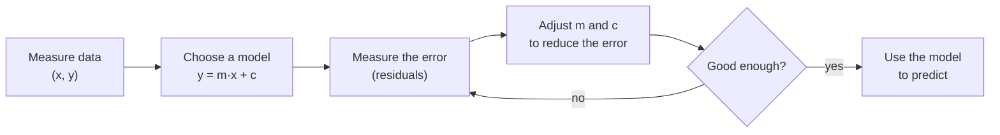
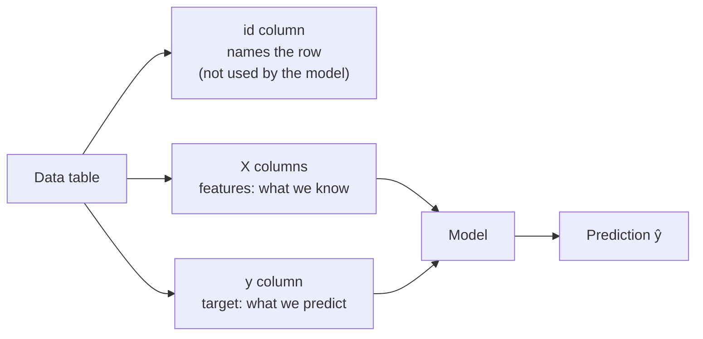
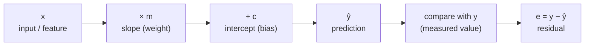
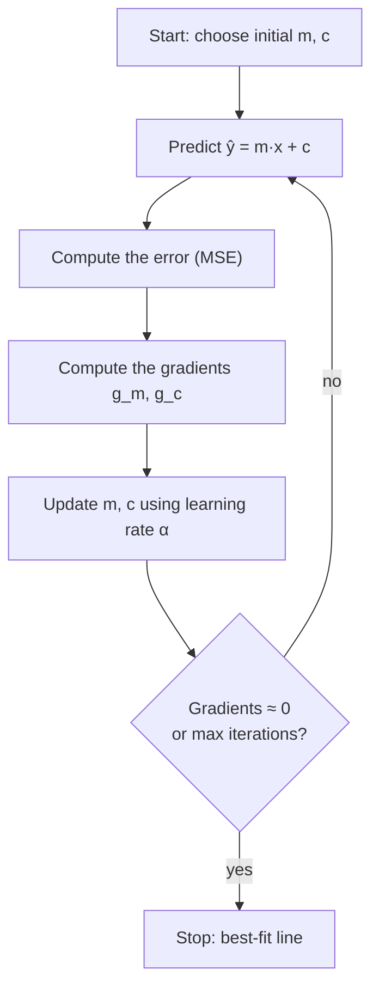

# Chapter 1 · Introduction to Linear Models

> **Prerequisites:** high-school algebra, the idea of an average
> **Interactive lab:** [LM101](https://rathachai.github.io/DA-LAB/learnings/linear/lm101.html)

---

## Learning Objectives

After completing this chapter, you will be able to:

1. Read a **data table** and identify its three kinds of columns: `id`, `X` (features, the input measurements) and `y` (target, the quantity to predict).
2. Name every component of the linear equation $\hat y = m x + c$ and interpret it with units.
3. Explain what a **residual** (the leftover error at one data point) is and why we minimise squared residuals.
4. Distinguish **parameters** (numbers the computer learns) from **hyperparameters** (settings the engineer chooses), and explain the role of the learning rate (the step size).
5. Fit a line with a closed-form formula and with **gradient descent** (a step-by-step downhill search; no calculus is needed to use it).
6. Compute and interpret **MAE, RMSE, MAPE, MSE** and **R²**, which are different ways to score the error.
7. State the **assumptions** behind linear regression.

---

## 1.1 Why Linear Models?

Engineers constantly ask questions of the form *"if I change this, what happens to that?"* How much does a motor's temperature rise with load? How does stopping distance change with speed? How does a sensor reading drift with age?

A **linear model** is the simplest useful answer. It assumes the output changes by a constant amount for every one-unit change of the input. You already know many linear relationships:

- **Hooke's law:** force = stiffness × extension.
- **A strain-gauge or sensor calibration line:** voltage versus load.
- **Resistance of a metal over a small temperature range:** $R = R_0 (1 + \alpha \Delta T)$.

Machine learning (ML) adds one new idea: instead of being told the constants, the computer **finds them from measured data**. This is the same task as drawing the best calibration line through your lab readings.

Linear models are popular because they are

- **interpretable**: every coefficient has a physical meaning and a unit;
- **fast**: they can be fitted with a few arithmetic operations;
- **a foundation**: neural networks, logistic regression and time-series models build on the same ideas.

> **Key idea.** *Fitting a model* means choosing the numbers inside an equation so that the equation matches measured data as closely as possible. Everything in this chapter is a way to do that and to check how close the match is.

Read the loop above as a tuning procedure. It looks like tuning a controller: try a setting, measure the error, adjust, repeat until the error is acceptable.

---

## 1.2 The Data Table: `id`, `X` and `y`

Every machine-learning problem starts from a **table** of measurements. Each **row** is one **sample** (also called an observation or record): one measurement event, one machine, one moment in time. Each **column** is one measured quantity. The columns play three different roles.

| Role | Symbol | Meaning | Used to fit the model? |
|------|--------|---------|------------------------|
| **`id`** | – | a label that identifies the row (row number, machine tag, timestamp) | **No**: it only names the row |
| **`X`** (features) | $x_1, x_2,\dots,x_p$ | the inputs we **know** and use to make a prediction. A *feature* is simply an input measurement. | **Yes**: the model reads them |
| **`y`** (target) | $y$ | the output we want to **predict**; in the historical data it is the correct answer | **Yes**: the model learns to reproduce it |

A small example: predicting a motor's winding temperature from its load.

| `id` | `x` = load (kW) | `y` = temperature (°C) |
|------|-----------------|------------------------|
| 1 | 10 | 52 |
| 2 | 20 | 61 |
| 3 | 30 | 68 |
| 4 | 40 | 80 |
| 5 | 50 | 88 |

We will use this table as our running example for the whole chapter. Plot it and you get five points that rise roughly along a straight line, like a calibration curve with a little scatter.

With several features the table simply gains columns. The features together are written as a **matrix** $X$ (a rectangular grid of numbers) with $n$ rows (samples) and $p$ columns (features). The target $y$ is a **column vector** (one column of numbers) holding the $n$ answers.

| `id` | $x_1$ | $x_2$ | $\dots$ | $x_p$ | $y$ |
|------|-------|-------|---------|-------|-----|
| 1 | $x_{11}$ | $x_{12}$ | $\dots$ | $x_{1p}$ | $y_1$ |
| 2 | $x_{21}$ | $x_{22}$ | $\dots$ | $x_{2p}$ | $y_2$ |
| $\vdots$ | | | | | |
| $n$ | $x_{n1}$ | $x_{n2}$ | $\dots$ | $x_{np}$ | $y_n$ |

In plain words: $x_{ij}$ means "the value of feature $j$ in sample (row) $i$".

Three practical warnings:

1. **An `id` is not a feature.** A row number carries no physical information. If a model gives it a large weight, that is an accident.
2. **`y` must never be an input.** Using the target as a feature makes the model "predict" an answer it was handed. This is called *data leakage*.
3. **One row = one sample.** In this chapter we use a single feature, so each row is a point $(x_i, y_i)$ on a scatter plot, exactly what the lab draws.

> **Engineering analogy.** The `id` is like the tag number on a test specimen. It tells you which specimen it is, but it is not a measurement of the specimen's strength.

---

## 1.3 The Simple Linear Model and Its Components

With one feature $x$ and one target $y$, the model is

$$
\hat{y} = m\,x + c
$$

**In plain words:** the predicted output equals a slope times the input, plus an offset. This is the equation of a straight line, $y = mx + c$, that you know from school. The little hat on $\hat y$ ("y-hat") means *predicted by the model*, to separate it from $y$, the *measured* value.

### The components

| Symbol | Name | Role | Unit | Example (load → temperature) |
|--------|------|------|------|------------------------------|
| $x$ | feature, input, predictor | what we **know** (a column of $X$) | unit of the input | load in kW |
| $y$ | target, output, response | the **measured** value we want to predict (the `y` column) | unit of the output | temperature in °C |
| $\hat{y}$ ("y-hat") | prediction, fitted value | the model's **estimate** of $y$ | same as $y$ | predicted temperature |
| $m$ | slope, coefficient, weight | change in $\hat y$ per **one unit** increase of $x$ | unit of $y$ per unit of $x$ | °C per kW (e.g. 0.9) |
| $c$ | intercept, bias, offset | the prediction when $x=0$ | unit of $y$ | °C at zero load (e.g. 43) |
| $e = y-\hat y$ | residual | the **part of $y$ the line fails to explain** | unit of $y$ | measured minus predicted |
| $\varepsilon$ | noise (error term) | random variation no straight line can explain; the *true* counterpart of the residual | unit of $y$ | sensor jitter, unmodelled effects |

In the statistics literature the same model is written $y=\beta_0+\beta_1x+\varepsilon$, with $\beta_0=c$ and $\beta_1=m$. You may meet this notation in other books.

> **Engineering analogy.** The slope $m$ is a *sensitivity* or *gain*, like volts per newton on a load cell. The intercept $c$ is a *zero offset* or bias, the reading when the input is zero.

> **Reading a fitted model.** Suppose training gives $\hat y = 0.9x + 43$. This says: *"with no load the winding sits near 43 °C, and each extra kilowatt adds about 0.9 °C."* Always state the unit. An equation without units is incomplete.

### Residuals

For each sample $i$, the **residual** is the vertical gap between the measured value and the prediction:

$$
e_i = y_i - \hat{y}_i = y_i - (m x_i + c)
$$

**In plain words:** residual = measured value minus predicted value. Here $e_i$ is in the unit of $y$ (°C in our example), and $i$ is just the row number.

**Numerical example.** For the motor data, the best line turns out to be $\hat y = 0.91x + 42.5$ (we derive it in Section 1.5.1). For sample 3, $x=30$ kW, so $\hat y = 0.91\times 30 + 42.5 = 69.8$ °C. The measured value is 68 °C, so $e_3 = 68 - 69.8 = -1.8$ °C. The line over-predicts by 1.8 °C at this point.

A good line makes the residuals small *overall*. Positive and negative residuals cancel if we simply add them up. So we **square** them. Squaring also punishes large misses more than small ones.

> **Engineering analogy.** A residual is the same thing as a *tracking error* in a control system or a *deviation from the calibration curve* in a lab report.

### Parameters and hyperparameters

Two kinds of numbers control a machine-learning model, and it is important not to confuse them.

| | **Parameters** | **Hyperparameters** |
|---|---------------|---------------------|
| Plain meaning | the numbers *inside* the model that are fitted to data | the *settings of the fitting procedure*, chosen by the engineer |
| In this chapter | $m$ and $c$ | learning rate $\alpha$, number of iterations, starting values of $m$ and $c$ |
| Who sets them? | the **training algorithm**, by learning from data | the **engineer**, before training starts |
| Where are they stored? | inside the finished model | not part of the model; they only steer the training |
| How are they chosen? | by minimising the error | by experiments, experience and held-out data |
| Engineering comparison | calibration constants | solver settings: step size, tolerance, maximum iterations |

**Training** means adjusting the parameters until the model fits the data. Hyperparameters are explained in detail in Section 1.5.3.

---

## 1.4 Measuring Error

Let $n$ be the number of samples (rows). The standard error measures, also called *metrics*, are:

| Metric | Formula | Unit | Notes |
|--------|---------|------|-------|
| **MSE**: mean squared error | $\dfrac{1}{n}\sum e_i^2$ | unit² | the quantity we minimise; punishes large errors heavily |
| **RMSE**: root mean squared error | $\sqrt{\text{MSE}}$ | same as $y$ | typical error size |
| **MAE**: mean absolute error | $\dfrac{1}{n}\sum \lvert e_i\rvert$ | same as $y$ | robust to outliers |
| **MAPE**: mean absolute % error | $\dfrac{100}{n}\sum \left\lvert \dfrac{e_i}{y_i}\right\rvert$ | % | scale-free, but unstable when $y_i \approx 0$ |
| **R²**: coefficient of determination | $1-\dfrac{\sum e_i^2}{\sum (y_i-\bar y)^2}$ | none | share of the variation in $y$ explained |

Here $\sum$ ("sigma") means *add up over all samples*. The symbol $\lvert e\rvert$ means the size of $e$ ignoring its sign. The symbol $\bar y$ ("y-bar") is the average of all measured $y$ values. An **outlier** is a point far from the others, often a measurement glitch.

**In plain words:**

- **MSE** is the average of the squared misses.
- **RMSE** takes the square root to return to the unit of $y$. It is like the RMS value of an error signal.
- **MAE** is the average miss, ignoring sign.
- **MAPE** is the average miss as a percentage of the true value.
- **R²** compares your line with the laziest model possible, one that always predicts the average $\bar y$. $R^2 = 1$ means a perfect fit. $R^2 = 0$ means no better than guessing the average.

**Numerical example.** For the motor data and the line $\hat y = 0.91x + 42.5$:

| `id` | $y$ (°C) | $\hat y$ (°C) | $e$ (°C) | $e^2$ (°C²) |
|------|----------|---------------|----------|-------------|
| 1 | 52 | 51.6 | +0.4 | 0.16 |
| 2 | 61 | 60.7 | +0.3 | 0.09 |
| 3 | 68 | 69.8 | −1.8 | 3.24 |
| 4 | 80 | 78.9 | +1.1 | 1.21 |
| 5 | 88 | 88.0 | 0.0 | 0.00 |

- MSE $= 4.70/5 = 0.94$ °C²
- RMSE $=\sqrt{0.94}\approx 0.97$ °C
- MAE $= (0.4+0.3+1.8+1.1+0)/5 = 0.72$ °C
- MAPE $\approx 1.06\ \%$
- R² $= 1 - 4.70/832.8 \approx 0.994$, because the total variation $\sum(y_i-\bar y)^2$ of the temperatures is 832.8 °C².

So the model predicts temperature to within about 1 °C, and it explains about 99 % of the variation of temperature across the five tests.

Choosing a metric is an engineering decision. If large errors are disproportionately costly, prefer RMSE. If outliers are measurement glitches, prefer MAE. If stakeholders think in percentages, report MAPE (and watch for near-zero targets).

> **Common mistake.** A high R² does not prove the model is correct or useful. It only says the line follows the data you have. Always look at the residuals and at the units of RMSE or MAE as well.

---

## 1.5 Finding the Best Line

### 1.5.1 Closed form (ordinary least squares)

A **closed-form** solution is a formula you evaluate once to get the answer, with no iteration, like solving a quadratic equation. Minimising the MSE has such an exact answer, called **ordinary least squares** (OLS):

$$
m = \frac{S_{xy}}{S_{xx}}, \qquad c = \bar{y} - m\,\bar{x}
$$

where $\bar x$ and $\bar y$ are the averages, $S_{xy}=\sum (x_i-\bar x)(y_i-\bar y)$ and $S_{xx}=\sum (x_i-\bar x)^2$.

**In plain words:** the slope is "how $x$ and $y$ move together" divided by "how much $x$ moves by itself". The line always passes through the point of means $(\bar x,\bar y)$. The units work out: $S_{xy}$ has (unit of $x$)(unit of $y$), $S_{xx}$ has (unit of $x$)², so $m$ has unit of $y$ per unit of $x$.

**Numerical example (motor data).**

| Quantity | Value |
|----------|-------|
| $\bar x$ | $(10+20+30+40+50)/5 = 30$ kW |
| $\bar y$ | $(52+61+68+80+88)/5 = 69.8$ °C |
| $S_{xy}$ | $(-20)(-17.8)+(-10)(-8.8)+0+(10)(10.2)+(20)(18.2)=910$ |
| $S_{xx}$ | $400+100+0+100+400=1000$ |
| slope $m = S_{xy}/S_{xx}$ | $0.91$ °C/kW |
| intercept $c=\bar y-m\bar x$ | $69.8-0.91\times 30 = 42.5$ °C |

So $\hat y = 0.91x + 42.5$. This is the line used in the residual table of Section 1.4. At 25 kW the model predicts $0.91\times 25 + 42.5 = 65.25$ °C.

> **Engineering analogy.** This is exactly what a spreadsheet trendline or a calibration-curve fit does.

### 1.5.2 Gradient descent

For many models there is no tidy formula, so we **iterate**, which means we improve a guess again and again. The error you want to minimise is called the **loss** (here, the MSE). Picture the loss as a bowl-shaped surface over the $(m,c)$ plane. Each choice of $(m,c)$ is a point on the bowl, and its height is the error. The best line sits at the bottom of the bowl.

Starting from a guess, we repeatedly take a step **downhill**:

1. predict $\hat y = m x + c$ for every sample;
2. measure the error (MSE);
3. compute the **gradient**: for each of $m$ and $c$, the slope of the bowl, i.e. the direction in which the error increases fastest;
4. move $m$ and $c$ a small step the *opposite* way.

The step rule is

$$
m \leftarrow m - \alpha\,g_m,
\qquad
c \leftarrow c - \alpha\,g_c,
\qquad\text{with}\quad
g_m=-\frac{2}{n}\sum x_i\,e_i,\;\;
g_c=-\frac{2}{n}\sum e_i .
$$

**In plain words:** the arrow $\leftarrow$ means "replace the old value by the new one". Here $\alpha$ ("alpha") is the **learning rate**, the step size, a small positive number you choose. The quantities $g_m$ and $g_c$ are the gradients, the local steepness of the error bowl in the $m$ and $c$ directions.

You do **not** need to derive the gradient formulas to use them:

- $g_c$ is *minus twice the average residual*;
- $g_m$ is *minus twice the average of $x\cdot$residual*.

If the line sits too low, the residuals are positive, so $c$ is pushed up. If it sits too high, $c$ is pushed down. At the minimum both gradients are zero: the residuals average to zero and are uncorrelated with $x$. This is called **convergence**: the updates have stopped changing the answer.

> **Engineering analogy.** Gradient descent is an iterative solver, like Newton's method or bisection for finding a root. You start with a guess and correct it repeatedly. The learning rate plays the role of the step size or the relaxation factor of the solver. It also resembles tuning a PID controller by hand: measure the error, nudge the settings against it, repeat.

**One step by hand.** Take three samples $(1,2),(2,3),(3,5)$. Start with the poor guess $m=0$, $c=0$ and choose $\alpha=0.1$.

1. Predictions are all 0, so the residuals are $e = 2,\,3,\,5$.
2. $g_c = -\tfrac{2}{3}(2+3+5) = -6.67$.
3. $g_m = -\tfrac{2}{3}(1\cdot2 + 2\cdot3 + 3\cdot5) = -\tfrac{2}{3}(23) = -15.33$.
4. New values: $m = 0 - 0.1(-15.33) = 1.53$ and $c = 0 - 0.1(-6.67) = 0.67$.

After one step the line is already close to the best-fit values ($m=1.5$, $c=0.33$; see Section 1.6.1). A computer repeats this step hundreds of times in a blink.

### 1.5.3 Hyperparameters of gradient descent

The training algorithm needs a few choices that **are not learned from the data**. These are the hyperparameters.

| Hyperparameter | What it controls | Too small / too few | Too large / too many |
|----------------|------------------|---------------------|----------------------|
| **Learning rate $\alpha$** | the **size of each step** downhill | converges, but very slowly | overshoots the minimum; the error grows and training **diverges** |
| **Number of iterations** (steps / epochs) | how long training may run | stops before reaching the minimum (*under-trained*) | wastes time once converged |
| **Initial values of $m$, $c$** | where the walk starts | – | a far-away start needs more steps |
| **Stopping tolerance** | when the gradient is "close enough" to zero | stops early | trains needlessly long |

Here **diverge** means the numbers blow up instead of settling, just like an unstable iterative solver. An **epoch** is one full pass through all the data rows.

The **learning rate** is the most important. Think of walking downhill in fog: tiny steps are safe but slow. Giant leaps can carry you over the valley and up the other side.

| Learning rate | Typical behaviour of the loss curve |
|---------------|-------------------------------------|
| too small | decreases, but extremely slowly |
| about right | smooth, fast decrease that flattens out |
| too large | oscillates or **grows** (divergence) |

For the three-point example above, $\alpha = 0.1$ is stable, but $\alpha = 0.3$ would overshoot more at each step and the error would grow without limit.

**Rule of thumb:** if the loss ever increases from one step to the next, lower $\alpha$. The right value also depends on the **scale** of the data: if $x$ ranges from 0 to 1000, the gradient is large and $\alpha$ must be tiny.

**Standardising** features means subtracting the mean and dividing by the standard deviation (a measure of the typical spread). This puts every feature on a common scale of roughly −2 to +2, so one learning rate works for all of them. It is like using non-dimensional variables in fluid mechanics or per-unit values in power systems.

> **Common mistake.** Seeing the loss grow and training for more iterations. A growing loss means the step is too large. Reduce $\alpha$ instead.

> **Choosing hyperparameters honestly.** Because hyperparameters are chosen by the engineer, they must be judged on data the model did not train on (a separate *test set* kept aside for that purpose).

---

## 1.6 A Little Mathematics Behind Least Squares

This section collects the key facts about least squares. The derivations use calculus, but the **results are all you need**. The lab lets you verify them numerically.

### 1.6.1 Worked example

Fit a line to the three samples $(1,2),\,(2,3),\,(3,5)$.

| Quantity | Value |
|----------|-------|
| $\bar x,\ \bar y$ | $2,\ 10/3\approx 3.333$ |
| $S_{xy}$ | $(-1)(-1.333)+0+(1)(1.667)=3$ |
| $S_{xx}$ | $1+0+1=2$ |
| slope $m=S_{xy}/S_{xx}$ | $1.5$ |
| intercept $c=\bar y-m\bar x$ | $3.333-3=0.333$ |

The predictions are $1.833,\ 3.333,\ 4.833$, so the residuals are $+0.167,\,-0.333,\,+0.167$. Note that

- the residuals add up to zero, and $\sum x_i e_i = 0$ as well (the two conditions that define the best line; they are exactly "both gradients equal zero" from Section 1.5.2);
- $\text{SSE}=\sum e_i^2=0.1667$, so $\text{MSE}=0.0556$. SSE means *sum of squared errors*;
- $\text{SST}=\sum(y_i-\bar y)^2=4.667$, hence $R^2=1-0.1667/4.667\approx 0.964$. SST means *total sum of squares*, the total variation of $y$ around its average.

### 1.6.2 Many features: matrix form

With $p$ features, write the data table as the matrix $X$ (with a first column of ones for the intercept) and the targets as the vector $\mathbf y$. The model becomes $\hat{\mathbf y}=X\boldsymbol\beta$, where $\boldsymbol\beta$ ("beta") is the list of all parameters (intercept and slopes). The best parameters satisfy the **normal equations**

$$
X^\top X\,\boldsymbol\beta = X^\top\mathbf y
\quad\Longrightarrow\quad
\hat{\boldsymbol\beta}=(X^\top X)^{-1}X^\top\mathbf y .
$$

**In plain words:** this is a set of linear equations, $A\boldsymbol\beta = \mathbf b$ with $A = X^\top X$ and $\mathbf b = X^\top \mathbf y$, that you solve for the unknown parameters, just like a circuit or a truss with several unknowns. The symbol $X^\top$ is the transpose of $X$ (rows and columns swapped). The symbol $^{-1}$ means the matrix inverse. The hat on $\hat{\boldsymbol\beta}$ means *estimated from data*.

This is the result of Section 1.5.1 written for any number of features. It fails when two features are (almost) copies of each other. This is the *multicollinearity* problem, and it is like a system of equations whose rows are not independent. The error surface is a single bowl, so the minimum is unique and gradient descent cannot be trapped in a false valley.

### 1.6.3 Geometry and variance

- The residuals are **perpendicular** to every feature column: $X^\top\mathbf e=\mathbf 0$. This is why they sum to zero and are uncorrelated with the features. It is the same idea as the shortest distance from a point to a line being perpendicular to it.
- The total variation in $y$ splits into an explained and an unexplained part:

$$
\underbrace{\sum (y_i-\bar y)^2}_{\text{SST}}
=\underbrace{\sum (\hat y_i-\bar y)^2}_{\text{SSR (explained)}}
+\underbrace{\sum (y_i-\hat y_i)^2}_{\text{SSE (unexplained)}},
\qquad R^2=\frac{\text{SSR}}{\text{SST}} .
$$

**In plain words:** the total spread of the data = the spread the line captures + the spread left over. $R^2$ is the captured fraction. All terms have the unit of $y$ squared.

### 1.6.4 Assumptions

The formulas above always produce a line. Statements about how **reliable** the coefficients are rely on assumptions about the noise $\varepsilon$ in $y = X\boldsymbol\beta+\varepsilon$:

| Assumption | Meaning | If violated |
|------------|---------|-------------|
| **Linearity** | $y$ is linear in the coefficients | curved residual patterns; add transforms such as $\ln x$ |
| **Independence** | errors do not depend on one another | common in time series; uncertainty is understated |
| **Constant variance** | noise has the same spread everywhere | some regions are fitted too trustingly |
| **No perfect collinearity** | no feature is an exact copy or combination of others | the normal equations have no unique solution |

The noise level is estimated by $\hat\sigma^2=\text{SSE}/(n-p-1)$, the average squared residual with a small correction for the $p+1$ parameters we fitted. For a single feature the **standard error** of the slope (its likely uncertainty, like the error bar on a measured constant) is $\hat\sigma/\sqrt{S_{xx}}$.

**In plain words:** the slope is estimated more precisely with **less noise, more data, and a wider spread of $x$-values**. This matches experimental practice: to measure a slope well, test over a wide range of loads, not just near one value.

Predictions far from $\bar x$ (*extrapolation*, predicting outside the range of your data) are the least certain.

> **Common mistake.** Extrapolating. A line fitted from 10 to 50 kW says nothing reliable about 200 kW, where the motor may overheat non-linearly. Hooke's law also fails beyond the elastic limit.

---

## 1.7 Hands-on Lab

**[LM101 · Linear Regression Simulator](https://rathachai.github.io/DA-LAB/learnings/linear/lm101.html)** — spray points onto the chart, drag the line, watch the residuals, then run gradient descent step by step.

How the lab maps to this chapter:

| In the lab | In the chapter |
|------------|----------------|
| each dot on the chart | one row $(x_i, y_i)$ of the data table |
| slope and intercept sliders / drag handles | the parameters $m$, $c$ |
| thin red vertical lines | residuals $e_i$ |
| learning rate and speed controls | hyperparameters $\alpha$ and the number of steps per frame |
| loss curve | MSE versus iteration |
| *best fit* tick box | the closed-form line of Section 1.5.1 |

### Suggested experiments

1. Add 25 random points with low noise. Drag the line until the MSE is as small as you can, then tick **best fit** to overlay the closed-form line and compare it with your manual result.
2. Set the learning rate to its maximum. What happens to the loss curve? Reduce it until training is stable. How does the best learning rate change if you spray points with a very large $x$ range?
3. Press **Random model** several times and run training from each start. Do all runs reach the same line? Why?
4. Increase the noise slider. What happens to the MAE, RMSE and R², and does the best-fit line move?

---

## Summary

- A data table has three kinds of columns: **`id`** (names the row), **`X`** (features: what we know) and **`y`** (target: what we predict).
- The model $\hat y = mx + c$ has a **slope** $m$ (change in $\hat y$ per unit of $x$, like a sensitivity) and an **intercept** $c$ (value at $x=0$, like a zero offset). The **residual** is $y-\hat y$, and the **noise** $\varepsilon$ is what no line can explain.
- **Parameters** ($m$, $c$) are learned from data. **Hyperparameters** (learning rate, iterations, starting values) are set by the engineer, like solver settings.
- The best line comes from a closed-form formula or from **gradient descent**. The **learning rate** must be neither too small (slow) nor too large (divergence), and standardising features helps.
- Error is reported with MAE, RMSE, MAPE, MSE and R²; the choice depends on the cost of mistakes.
- The least-squares solution satisfies the **normal equations**. Residuals are orthogonal (perpendicular) to the features, and $R^2=\text{SSR}/\text{SST}$.

### Key terms

| Term | Plain-language meaning | Engineering comparison |
|------|------------------------|------------------------|
| Sample (row) | one measurement event | one test run or specimen |
| Feature ($x$) | an input measurement | the independent variable on a calibration plot |
| Target ($y$) | the quantity we want to predict | the measured response |
| Prediction ($\hat y$) | the model's estimate of $y$ | value read off the fitted curve |
| Slope ($m$) | change in output per unit input | sensitivity, gain, stiffness |
| Intercept ($c$) | output when input is zero | zero offset, bias |
| Residual ($e$) | measured minus predicted | deviation from the calibration curve, tracking error |
| Noise ($\varepsilon$) | random variation no line explains | sensor jitter, scatter |
| Parameter | number learned from data | calibration constant |
| Hyperparameter | setting chosen by the engineer | solver tolerance, step size |
| Training | adjusting parameters until the model fits | tuning a controller or curve fit |
| Loss (MSE) | the error value being minimised | cost function, objective |
| Gradient | direction in which the loss rises fastest | slope of the loss surface |
| Learning rate ($\alpha$) | size of each update step | step size in an iterative solver |
| Convergence | updates stop changing the answer | iteration reaching tolerance |
| Divergence | updates make the error grow | unstable iteration |
| Standardising | rescaling to zero mean and unit spread | non-dimensionalising, per-unit values |
| Outlier | a point far from the rest | a glitch or a bad reading |
| R² | share of the variation the model explains | goodness of fit of a trendline |
| Extrapolation | predicting outside the data range | using a law beyond its validity range |

---

Powered by: Sonnet &nbsp;|&nbsp; AI Whisperer: [rathachai.github.io](https://rathachai.github.io)
