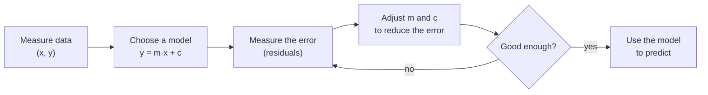
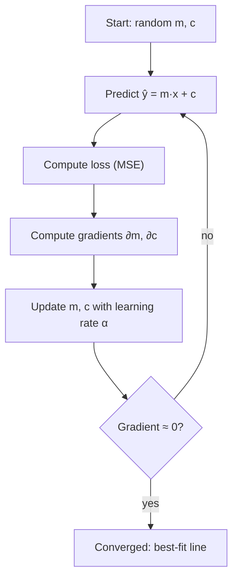
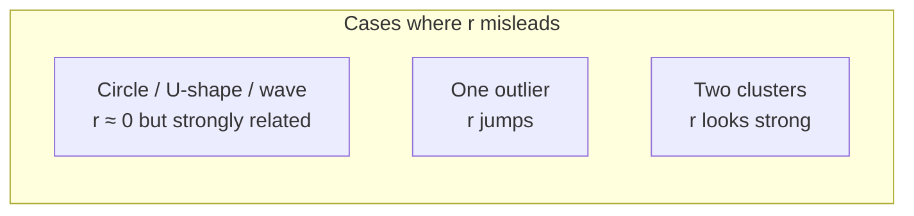

# Chapter 1 · Introduction to Linear Models

> **Series:** Linear Models for Engineers · Chapter 1 of 5
> **Prerequisites:** high-school algebra, the idea of an average
> **Interactive labs:** [LM101](https://rathachai.github.io/DA-LAB/learnings/linear/lm101.html) · [CORR101](https://rathachai.github.io/DA-LAB/learnings/linear/corr101.html)

---

## Learning Objectives

After completing this chapter, you will be able to:

1. Describe a linear model $y = mx + c$ and interpret its slope and intercept.
2. Explain what a **residual** is and why we minimise squared residuals.
3. Fit a line by **gradient descent** and by a closed-form formula, and explain the role of the learning rate.
4. Compute and interpret **MAE, RMSE, MAPE, MSE** and **R²**.
5. Interpret the **Pearson correlation coefficient** $r$, and recognise where it fails.

---

## 1.1 Why Linear Models?

Engineers constantly ask questions of the form *"if I change this, what happens to that?"* — how much does a motor's temperature rise with load, how does stopping distance change with speed, how does a sensor reading drift with age?

A **linear model** is the simplest useful answer: it assumes the output changes by a constant amount for every unit change of the input. Although simple, linear models are

- **interpretable** — every coefficient has a physical meaning and a unit;
- **fast** — they can be fitted with a few arithmetic operations;
- **a foundation** — neural networks, logistic regression and time-series models all build on the same ideas.

---

## 1.2 The Simple Linear Model

With one input $x$ (the **feature**) and one output $y$ (the **target**), the model is

$$
\hat{y} = m\,x + c
$$

| Symbol | Name | Meaning |
|--------|------|---------|
| $x$ | feature / input | what we know |
| $y$ | target / output | what we want to predict |
| $\hat{y}$ | prediction | the model's estimate of $y$ |
| $m$ | slope (coefficient) | change in $\hat{y}$ per unit change in $x$ |
| $c$ | intercept | the prediction when $x = 0$ |

In the statistics literature the same model is written $y = \beta_0 + \beta_1 x + \varepsilon$, where $\varepsilon$ is random noise that no straight line can explain.

> **Engineering note.** Always carry units. If $x$ is temperature in °C and $y$ is resistance in Ω, then $m$ is in Ω/°C and $c$ is in Ω.

### Residuals

For each data point $i$, the **residual** is the vertical gap between the measured value and the prediction:

$$
e_i = y_i - \hat{y}_i = y_i - (m x_i + c)
$$

A good line makes the residuals small *overall*. Positive and negative residuals cancel if we simply add them up, so we square them.

---

## 1.3 Measuring Error

Let $n$ be the number of points. The standard error measures are:

| Metric | Formula | Unit | Notes |
|--------|---------|------|-------|
| **MSE** — mean squared error | $\dfrac{1}{n}\sum e_i^2$ | unit² | the quantity we minimise; punishes large errors heavily |
| **RMSE** — root MSE | $\sqrt{\text{MSE}}$ | same as $y$ | typical error size |
| **MAE** — mean absolute error | $\dfrac{1}{n}\sum \lvert e_i\rvert$ | same as $y$ | robust to outliers |
| **MAPE** — mean absolute % error | $\dfrac{100}{n}\sum \left\lvert \dfrac{e_i}{y_i}\right\rvert$ | % | scale-free, but unstable when $y_i \approx 0$ |
| **R²** — coefficient of determination | $1-\dfrac{\sum e_i^2}{\sum (y_i-\bar y)^2}$ | none | share of the variance in $y$ explained |

Choosing a metric is an engineering decision. If large errors are disproportionately costly, prefer RMSE; if outliers are measurement glitches, prefer MAE; if stakeholders think in percentages, report MAPE (and watch for near-zero targets).

---

## 1.4 Finding the Best Line

### 1.4.1 Closed form (ordinary least squares)

Minimising the MSE over $m$ and $c$ has an exact solution:

$$
m = \frac{\operatorname{cov}(x,y)}{\operatorname{var}(x)}, \qquad c = \bar{y} - m\,\bar{x}
$$

The fitted line always passes through the point of means $(\bar x, \bar y)$.

### 1.4.2 Gradient descent

For many problems there is no convenient formula, so we **iterate**. Picture the MSE as a bowl-shaped surface over the $(m, c)$ plane; we repeatedly step downhill.

The slope of the bowl (the **gradient**) is

$$
\frac{\partial \text{MSE}}{\partial m} = -\frac{2}{n}\sum x_i\,e_i,
\qquad
\frac{\partial \text{MSE}}{\partial c} = -\frac{2}{n}\sum e_i
$$

and each step updates

$$
m \leftarrow m - \alpha\,\frac{\partial \text{MSE}}{\partial m},
\qquad
c \leftarrow c - \alpha\,\frac{\partial \text{MSE}}{\partial c}
$$

where $\alpha$ is the **learning rate**.

| Learning rate | Behaviour |
|---------------|-----------|
| too small | converges, but very slowly |
| about right | smooth, steady descent |
| too large | overshoots the minimum and may **diverge** (loss grows) |

> **Practical tip.** When features have very different scales, gradient descent struggles because the bowl becomes a long, narrow valley. **Standardising** features (subtracting the mean and dividing by the standard deviation) makes the bowl rounder and the learning rate easier to choose. We rely on this in later chapters.

---

## 1.5 Correlation

How strongly are two variables *linearly* related? The **Pearson correlation coefficient** answers with a single number:

$$
r = \frac{\sum (x_i-\bar x)(y_i-\bar y)}{\sqrt{\sum (x_i-\bar x)^2\;\sum (y_i-\bar y)^2}}
= \frac{\operatorname{cov}(x,y)}{s_x\,s_y}
\quad\in[-1,\,1]
$$

- $r = +1$: all points lie on a rising straight line.
- $r = -1$: all points lie on a falling straight line.
- $r \approx 0$: no *linear* relationship.

Intuition: each point contributes the product $(x_i-\bar x)(y_i-\bar y)$. Points that are both above (or both below) their means push $r$ up; points on opposite sides push it down.

### Relationship to the regression line

For simple linear regression the slope and the correlation are tied together:

$$
m = r\,\frac{s_y}{s_x}, \qquad R^2 = r^2
$$

| $\lvert r\rvert$ | Common wording |
|-----------------|----------------|
| 0.9 – 1.0 | very strong |
| 0.7 – 0.9 | strong |
| 0.4 – 0.7 | moderate |
| 0.2 – 0.4 | weak |
| < 0.2 | very weak / none |

### Three warnings

1. **Only linear relationships.** A perfect circle, a U-shape or a sine wave can have $r \approx 0$ while $y$ is completely determined by $x$.
2. **Sensitivity to outliers.** A single extreme point can create or destroy a correlation.
3. **Correlation is not causation.** Two variables may move together because of a third factor, or by coincidence.

---

## 1.6 Hands-on Labs

| Lab | What to explore |
|-----|-----------------|
| **[LM101 · Linear Regression Simulator](https://rathachai.github.io/DA-LAB/learnings/linear/lm101.html)** | Spray points onto the chart, drag the line, watch residuals, then run gradient descent step by step. |
| **[CORR101 · Pearson Correlation Demo](https://rathachai.github.io/DA-LAB/learnings/linear/corr101.html)** | Choose patterns (positive, negative, circle, U-shape, sine, clusters, one outlier) or spray your own, and watch $r$ and $R^2$ respond. |

### Suggested experiments

1. In **LM101**, add 25 random points with low noise. Drag the line until the MSE is as small as you can, then tick **best fit** to overlay the closed-form line and compare it with your manual result.
2. Set the learning rate to its maximum. What happens to the loss curve? Reduce it until training is stable.
3. In **CORR101**, select *Circle* and then *U-shape*. Why is $r$ near zero although the pattern is obvious?
4. Select *One outlier*: note $r$, then compare with the blob without the outlier. How much leverage did one point have?

---

## Exercises

1. A fitted line is $\hat y = 2.5x + 10$. Predict $y$ for $x = 4$. Interpret the slope in words.
2. Five residuals are $+3,\,-3,\,+2,\,-2,\,0$. Compute the MAE, MSE and RMSE.
3. Show that if $r = 0.8$, $s_x = 2$ and $s_y = 10$, the regression slope is $m = 4$.
4. Give a real example where two variables have a strong correlation but neither causes the other.
5. Why can MAPE be misleading when some $y_i$ are close to zero?

---

## Summary

- A linear model predicts with $\hat y = mx + c$; the **residual** is $y-\hat y$.
- We choose $m, c$ to minimise the **mean squared error**, by formula or by **gradient descent**.
- Error is reported with MAE, RMSE, MAPE, MSE and R²; the choice depends on the cost of mistakes.
- **Pearson's $r$** measures *linear* association only; beware non-linearity, outliers and confounding.

**Next:** [Chapter 2 · Feature Selection](en-02-feature-selection.md)

---

Powered by: Sonnet &nbsp;|&nbsp; AI Whisperer: [rathachai.github.io](https://rathachai.github.io)
