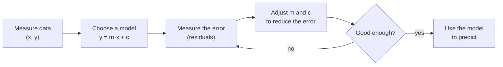
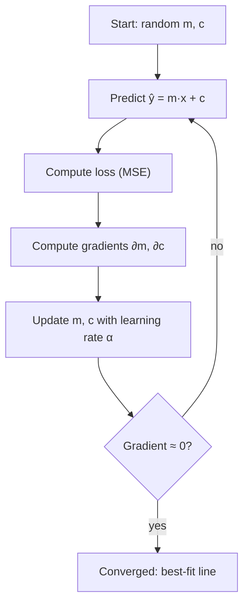
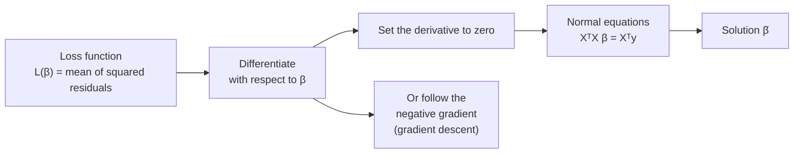

# Chapter 1 · Introduction to Linear Models

> **Series:** Linear Models for Engineers · Chapter 1 of 5
> **Prerequisites:** high-school algebra, the idea of an average
> **Interactive lab:** [LM101](https://rathachai.github.io/DA-LAB/learnings/linear/lm101.html)

---

## Learning Objectives

After completing this chapter, you will be able to:

1. Describe a linear model $y = mx + c$ and interpret its slope and intercept.
2. Explain what a **residual** is and why we minimise squared residuals.
3. Fit a line by **gradient descent** and by a closed-form formula, and explain the role of the learning rate.
4. Compute and interpret **MAE, RMSE, MAPE, MSE** and **R²**.
5. **Derive** the least-squares solution (normal equations) and the gradient-descent update, in scalar and matrix form.
6. State the **assumptions** behind linear regression and the **uncertainty** of its estimates.

---

## 1.1 Why Linear Models?

Engineers constantly ask questions of the form *"if I change this, what happens to that?"* — how much does a motor's temperature rise with load, how does stopping distance change with speed, how does a sensor reading drift with age?

A **linear model** is the simplest useful answer: it assumes the output changes by a constant amount for every unit change of the input. Although simple, linear models are

- **interpretable** — every coefficient has a physical meaning and a unit;
- **fast** — they can be fitted with a few arithmetic operations;
- **a foundation** — neural networks, logistic regression and time-series models all build on the same ideas.

---

## 1.2 The Simple Linear Model

With one input $x$ (the **feature**) and one output $y$ (the **target**), the model is

$$
\hat{y} = m\,x + c
$$

| Symbol | Name | Meaning |
|--------|------|---------|
| $x$ | feature / input | what we know |
| $y$ | target / output | what we want to predict |
| $\hat{y}$ | prediction | the model's estimate of $y$ |
| $m$ | slope (coefficient) | change in $\hat{y}$ per unit change in $x$ |
| $c$ | intercept | the prediction when $x = 0$ |

In the statistics literature the same model is written $y = \beta_0 + \beta_1 x + \varepsilon$, where $\varepsilon$ is random noise that no straight line can explain.

> **Engineering note.** Always carry units. If $x$ is temperature in °C and $y$ is resistance in Ω, then $m$ is in Ω/°C and $c$ is in Ω.

### Residuals

For each data point $i$, the **residual** is the vertical gap between the measured value and the prediction:

$$
e_i = y_i - \hat{y}_i = y_i - (m x_i + c)
$$

A good line makes the residuals small *overall*. Positive and negative residuals cancel if we simply add them up, so we square them.

---

## 1.3 Measuring Error

Let $n$ be the number of points. The standard error measures are:

| Metric | Formula | Unit | Notes |
|--------|---------|------|-------|
| **MSE** — mean squared error | $\dfrac{1}{n}\sum e_i^2$ | unit² | the quantity we minimise; punishes large errors heavily |
| **RMSE** — root MSE | $\sqrt{\text{MSE}}$ | same as $y$ | typical error size |
| **MAE** — mean absolute error | $\dfrac{1}{n}\sum \lvert e_i\rvert$ | same as $y$ | robust to outliers |
| **MAPE** — mean absolute % error | $\dfrac{100}{n}\sum \left\lvert \dfrac{e_i}{y_i}\right\rvert$ | % | scale-free, but unstable when $y_i \approx 0$ |
| **R²** — coefficient of determination | $1-\dfrac{\sum e_i^2}{\sum (y_i-\bar y)^2}$ | none | share of the variance in $y$ explained |

Choosing a metric is an engineering decision. If large errors are disproportionately costly, prefer RMSE; if outliers are measurement glitches, prefer MAE; if stakeholders think in percentages, report MAPE (and watch for near-zero targets).

---

## 1.4 Finding the Best Line

### 1.4.1 Closed form (ordinary least squares)

Minimising the MSE over $m$ and $c$ has an exact solution:

$$
m = \frac{\text{cov}(x,y)}{\text{var}(x)}, \qquad c = \bar{y} - m\,\bar{x}
$$

The fitted line always passes through the point of means $(\bar x, \bar y)$.

### 1.4.2 Gradient descent

For many problems there is no convenient formula, so we **iterate**. Picture the MSE as a bowl-shaped surface over the $(m, c)$ plane; we repeatedly step downhill.

The slope of the bowl (the **gradient**) is

$$
\frac{\partial \text{MSE}}{\partial m} = -\frac{2}{n}\sum x_i\,e_i,
\qquad
\frac{\partial \text{MSE}}{\partial c} = -\frac{2}{n}\sum e_i
$$

and each step updates

$$
m \leftarrow m - \alpha\,\frac{\partial \text{MSE}}{\partial m},
\qquad
c \leftarrow c - \alpha\,\frac{\partial \text{MSE}}{\partial c}
$$

where $\alpha$ is the **learning rate**.

| Learning rate | Behaviour |
|---------------|-----------|
| too small | converges, but very slowly |
| about right | smooth, steady descent |
| too large | overshoots the minimum and may **diverge** (loss grows) |

> **Practical tip.** When features have very different scales, gradient descent struggles because the bowl becomes a long, narrow valley. **Standardising** features (subtracting the mean and dividing by the standard deviation) makes the bowl rounder and the learning rate easier to choose. We rely on this in later chapters.

---

## 1.5 The Mathematics of Linear Regression

This section derives the results quoted in Section 1.4. The algebra is short and worth doing once by hand.

### 1.5.1 Simple regression: deriving $m$ and $c$

Let the loss be the sum of squared errors,

$$
L(m,c)=\sum_{i=1}^{n}\bigl(y_i-m x_i-c\bigr)^2 .
$$

At the minimum both partial derivatives vanish.

**Derivative with respect to $c$:**

$$
\frac{\partial L}{\partial c}=-2\sum_i (y_i-m x_i-c)=0
\;\;\Longrightarrow\;\;
n\bar y - m\,n\bar x - n c = 0
\;\;\Longrightarrow\;\;
c=\bar y-m\bar x .
$$

**Derivative with respect to $m$:**

$$
\frac{\partial L}{\partial m}=-2\sum_i x_i\,(y_i-m x_i-c)=0 .
$$

Substituting $c=\bar y-m\bar x$ and using $\sum_i x_i\,(y_i-\bar y)=\sum_i (x_i-\bar x)(y_i-\bar y)$ gives

$$
\sum_i (x_i-\bar x)(y_i-\bar y)\;-\;m\sum_i (x_i-\bar x)^2=0
\;\;\Longrightarrow\;\;
\boxed{\,m=\frac{S_{xy}}{S_{xx}}\,}
$$

where $S_{xy}=\sum_i (x_i-\bar x)(y_i-\bar y)$ and $S_{xx}=\sum_i (x_i-\bar x)^2$. Dividing numerator and denominator by $n-1$ recovers $m=\text{cov}(x,y)/\text{var}(x)$.

**Worked example.** Fit a line to the three points $(1,2),\,(2,3),\,(3,5)$.

| Quantity | Value |
|----------|-------|
| $\bar x,\ \bar y$ | $2,\ 10/3\approx 3.333$ |
| $S_{xy}$ | $(-1)(-1.333)+0+(1)(1.667)=3$ |
| $S_{xx}$ | $1+0+1=2$ |
| slope $m=S_{xy}/S_{xx}$ | $1.5$ |
| intercept $c=\bar y-m\bar x$ | $3.333-3=0.333$ |

The predictions are $1.833,\ 3.333,\ 4.833$, so the residuals are $+0.167,\,-0.333,\,+0.167$. Note that

- $\sum e_i = 0$ and $\sum x_i e_i = 0$ — the two conditions we set to zero;
- $\text{SSE}=0.1667$, so $\text{MSE}=0.0556$;
- $\text{SST}=\sum(y_i-\bar y)^2=4.667$, hence $R^2=1-0.1667/4.667\approx 0.964$.

### 1.5.2 Matrix form: the normal equations

With $p$ features, stack the data into a **design matrix** $X\in\mathbb R^{n\times(p+1)}$ whose first column is all ones (for the intercept), a target vector $\mathbf y$ and a parameter vector $\boldsymbol\beta$:

$$
X=\begin{bmatrix}
1 & x_{11} & \cdots & x_{1p}\\
\vdots & \vdots & & \vdots\\
1 & x_{n1} & \cdots & x_{np}
\end{bmatrix},\qquad
\hat{\mathbf y}=X\boldsymbol\beta .
$$

The loss and its gradient are

$$
L(\boldsymbol\beta)=\frac1n\,\lVert \mathbf y-X\boldsymbol\beta\rVert^2,
\qquad
\nabla L(\boldsymbol\beta)=-\frac{2}{n}\,X^\top(\mathbf y-X\boldsymbol\beta).
$$

Setting $\nabla L=\mathbf 0$ gives the **normal equations**

$$
X^\top X\,\boldsymbol\beta = X^\top\mathbf y
\quad\Longrightarrow\quad
\boxed{\;\hat{\boldsymbol\beta}=(X^\top X)^{-1}X^\top\mathbf y\;}
$$

The inverse exists when the columns of $X$ are linearly independent. If two features are (almost) copies of each other, $X^\top X$ is (almost) singular — the origin of the **multicollinearity** problems met in Chapter 2.

### 1.5.3 Why this is the minimum

The Hessian (matrix of second derivatives) of $L$ is

$$
H=\nabla^2 L=\frac{2}{n}\,X^\top X .
$$

For any vector $\mathbf v$, $\ \mathbf v^\top X^\top X\,\mathbf v=\lVert X\mathbf v\rVert^2\ge 0$, so $H$ is positive semi-definite and $L$ is **convex** — shaped like a bowl, with no false valleys. With independent columns it is strictly convex, so the minimum is **unique** and gradient descent cannot get trapped in a local minimum.

### 1.5.4 Geometry: least squares is a projection

Read $\mathbf y$ as a point in $n$-dimensional space and the columns of $X$ as vectors spanning a flat subspace. The fitted vector $\hat{\mathbf y}=X\hat{\boldsymbol\beta}$ is the **orthogonal projection** of $\mathbf y$ onto that subspace, and the residual vector $\mathbf e=\mathbf y-\hat{\mathbf y}$ is perpendicular to every column of $X$:

$$
X^\top\mathbf e=\mathbf 0 .
$$

Two consequences follow immediately: the residuals sum to zero (the column of ones), and they are uncorrelated with every feature.

### 1.5.5 Gradient descent in matrix form

Gradient descent repeats

$$
\boldsymbol\beta\;\leftarrow\;\boldsymbol\beta-\alpha\,\nabla L(\boldsymbol\beta)
=\boldsymbol\beta+\frac{2\alpha}{n}\,X^\top(\mathbf y-X\boldsymbol\beta).
$$

For one feature this reduces to the update of Section 1.4.2. Because the loss is a quadratic, the behaviour is fully characterised by the eigenvalues $\lambda_1\ge\dots\ge\lambda_{p+1}>0$ of $H$. Along the eigen-direction $k$, the distance to the minimum is multiplied each iteration by

$$
\lvert 1-\alpha\lambda_k\rvert .
$$

| Condition | Consequence |
|-----------|-------------|
| $0<\alpha<2/\lambda_1$ | every direction contracts: **converges** |
| $\alpha>2/\lambda_1$ | the steepest direction grows: **diverges** |
| $\lambda_1/\lambda_{p+1}$ large (*ill-conditioned*) | the steep directions force a small $\alpha$, so the flat directions crawl: **slow** convergence |

This explains two practical rules: **standardise** features (it makes the eigenvalues similar, so the condition number $\lambda_1/\lambda_{p+1}$ is small) and avoid highly correlated features (they create very small eigenvalues).

### 1.5.6 Decomposing the variance: why $R^2$ works

Because $\mathbf e\perp\hat{\mathbf y}-\bar y\mathbf 1$, the total variation splits cleanly (Pythagoras):

$$
\underbrace{\sum_i (y_i-\bar y)^2}_{\text{SST}}
=\underbrace{\sum_i (\hat y_i-\bar y)^2}_{\text{SSR (explained)}}
+\underbrace{\sum_i (y_i-\hat y_i)^2}_{\text{SSE (unexplained)}},
\qquad
R^2=\frac{\text{SSR}}{\text{SST}}=1-\frac{\text{SSE}}{\text{SST}} .
$$

In simple regression $R^2=r^2$, the square of the correlation coefficient (Chapter 2).

### 1.5.7 Assumptions and uncertainty

The least-squares formulas are purely algebraic and always produce a line. Statements about **how reliable** the coefficients are rest on assumptions about the noise $\varepsilon$ in $y=X\boldsymbol\beta+\varepsilon$:

| Assumption | Meaning | If violated |
|------------|---------|-------------|
| **Linearity** | $y$ is linear in the coefficients | systematic, curved residuals — add transforms |
| **Independence** | errors are independent of each other | typical in time series; standard errors are too small |
| **Constant variance** (*homoscedasticity*) | noise has the same spread everywhere | some regions are fitted too trustingly |
| **No perfect collinearity** | $X$ has full column rank | $(X^\top X)^{-1}$ does not exist |
| **Normal errors** (for confidence intervals) | $\varepsilon\sim\mathcal N(0,\sigma^2)$ | intervals are approximate |

Under the first four assumptions the **Gauss–Markov theorem** states that ordinary least squares is the *best linear unbiased estimator* (BLUE): among all unbiased linear estimators it has the smallest variance. If the noise is also Gaussian, minimising squared error is exactly **maximum likelihood** estimation.

The noise level is estimated from the residuals, and the coefficient uncertainty follows:

$$
\hat\sigma^2=\frac{\text{SSE}}{n-p-1},\qquad
\widehat{\text{Var}}(\hat{\boldsymbol\beta})=\hat\sigma^2\,(X^\top X)^{-1}.
$$

For simple regression the standard error of the slope is

$$
\text{SE}(\hat m)=\frac{\hat\sigma}{\sqrt{S_{xx}}},
$$

so the slope is estimated more precisely when the noise $\hat\sigma$ is small, when there are many points, and when the $x$-values are **spread widely** (large $S_{xx}$). The same reasoning shows that predictions **far from $\bar x$** are the least certain — the idea behind the extrapolation uncertainty used in Chapter 5.

---

## 1.6 Hands-on Lab

**[LM101 · Linear Regression Simulator](https://rathachai.github.io/DA-LAB/learnings/linear/lm101.html)** — spray points onto the chart, drag the line, watch the residuals, then run gradient descent step by step.

### Suggested experiments

1. In **LM101**, add 25 random points with low noise. Drag the line until the MSE is as small as you can, then tick **best fit** to overlay the closed-form line and compare it with your manual result.
2. Set the learning rate to its maximum. What happens to the loss curve? Reduce it until training is stable.

---

## Exercises

1. A fitted line is $\hat y = 2.5x + 10$. Predict $y$ for $x = 4$. Interpret the slope in words.
2. Five residuals are $+3,\,-3,\,+2,\,-2,\,0$. Compute the MAE, MSE and RMSE.
3. Why can MAPE be misleading when some $y_i$ are close to zero?
4. Starting from the point of means $(\bar x,\bar y)$, explain why the least-squares line must pass through it.
5. Fit a line by hand to $(0,1),\,(1,3),\,(2,4),\,(3,8)$ using $m=S_{xy}/S_{xx}$. Verify that $\sum e_i=0$ and compute $R^2$.
6. Show that $\sum_i x_i e_i = 0$ for the least-squares line, and interpret it geometrically.
7. For centred data ($\bar x=0$) with $\tfrac1n\sum x_i^2=9$, find the largest stable learning rate for gradient descent on $(m,c)$. (Hint: the Hessian is $2\begin{bmatrix}9&0\\0&1\end{bmatrix}$.)
8. Why does doubling the spread of the $x$-values reduce the standard error of the slope?

---

## Summary

- A linear model predicts with $\hat y = mx + c$; the **residual** is $y-\hat y$.
- We choose $m, c$ to minimise the **mean squared error**, by formula or by **gradient descent**.
- Error is reported with MAE, RMSE, MAPE, MSE and R²; the choice depends on the cost of mistakes.
- Setting the gradient to zero gives the **normal equations** $X^\top X\boldsymbol\beta=X^\top\mathbf y$; the loss is **convex**, so the minimum is unique and the least-squares fit is a **projection** (residuals are orthogonal to the features).
- Gradient descent converges when $0<\alpha<2/\lambda_{\max}$ and is slow when the problem is ill-conditioned; $R^2=\text{SSR}/\text{SST}$.
- Statements about coefficient uncertainty rely on assumptions (linearity, independence, constant variance, no collinearity); OLS is then BLUE.

**Next:** [Chapter 2 · Correlation and Feature Selection](en-02-feature-selection.md)

---

Powered by: Sonnet &nbsp;|&nbsp; AI Whisperer: [rathachai.github.io](https://rathachai.github.io)
