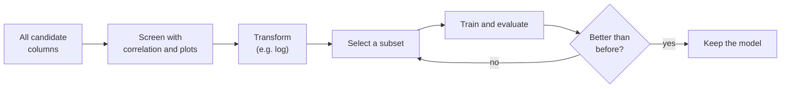
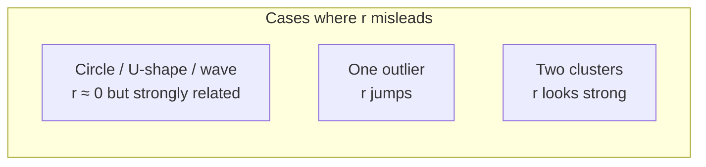
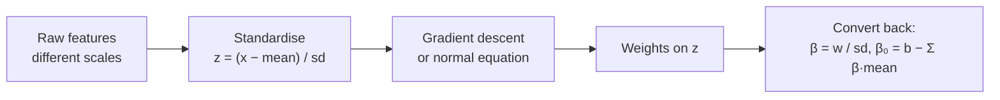

# Chapter 2 · Correlation and Feature Selection

> **Series:** Linear Models for Engineers · Chapter 2 of 5
> **Prerequisites:** [Chapter 1 · Introduction to Linear Models](en-01-linear-intro.md)
> **Interactive labs:** [CORR101](https://rathachai.github.io/DA-LAB/learnings/linear/corr101.html) · [LM201](https://rathachai.github.io/DA-LAB/learnings/linear/lm201.html)

---

## Learning Objectives

After completing this chapter, you will be able to:

1. Interpret the **Pearson correlation coefficient** $r$, and recognise where it fails.
2. Extend simple regression to **multiple linear regression** with several features.
3. Use correlation to **screen** candidate features, and explain why screening alone is not enough.
4. Recognise features that are **useless (noise)**, **non-linear**, or **leaky**.
5. Apply a **log transform** to straighten an exponential relationship.
6. Compare models fairly using **adjusted R²** and explain why plain R² never decreases.
7. Explain why features are **standardised** before gradient descent.

---

## 2.1 From One Feature to Many

Real systems have many measurable inputs. A model with $p$ features $x_1,\dots,x_p$ is

$$
\hat y = \beta_0 + \beta_1 x_1 + \beta_2 x_2 + \dots + \beta_p x_p
$$

In matrix form, with a column of ones for the intercept,

$$
\hat{\mathbf y} = X\boldsymbol\beta, \qquad
\boldsymbol\beta = (X^\top X)^{-1} X^\top \mathbf y \quad\text{(normal equation)}
$$

The coefficient $\beta_j$ is the change in $\hat y$ for a one-unit increase in $x_j$ **while all other features are held constant**. That last clause matters: when features are correlated with each other, a coefficient can change — even flip sign — depending on which other features are present.

---

## 2.2 Why Select Features?

More features are not automatically better.

| Problem | Consequence |
|---------|-------------|
| **Noise features** carry no signal | add variance; the model starts fitting accidental patterns |
| **Redundant features** (strongly correlated with each other) | unstable, hard-to-interpret coefficients (*multicollinearity*) |
| **Leaky features** contain the answer | spectacular training scores that vanish in deployment |
| **Cost** | every sensor has a price, and every extra input must be maintained |

The goal is the **smallest set of features that predicts well** — a principle sometimes called *parsimony* or Occam's razor.

---

## 2.3 Correlation

How strongly are two variables *linearly* related? The **Pearson correlation coefficient** answers with a single number:

$$
r = \frac{\sum (x_i-\bar x)(y_i-\bar y)}{\sqrt{\sum (x_i-\bar x)^2\;\sum (y_i-\bar y)^2}}
= \frac{\text{cov}(x,y)}{s_x\,s_y}
\quad\in[-1,\,1]
$$

- $r = +1$: all points lie on a rising straight line.
- $r = -1$: all points lie on a falling straight line.
- $r \approx 0$: no *linear* relationship.

Intuition: each point contributes the product $(x_i-\bar x)(y_i-\bar y)$. Points that are both above (or both below) their means push $r$ up; points on opposite sides push it down.

### Relationship to the regression line

For simple linear regression the slope and the correlation are tied together:

$$
m = r\,\frac{s_y}{s_x}, \qquad R^2 = r^2
$$

| $\lvert r\rvert$ | Common wording |
|-----------------|----------------|
| 0.9 – 1.0 | very strong |
| 0.7 – 0.9 | strong |
| 0.4 – 0.7 | moderate |
| 0.2 – 0.4 | weak |
| < 0.2 | very weak / none |

### Three warnings

1. **Only linear relationships.** A perfect circle, a U-shape or a sine wave can have $r \approx 0$ while $y$ is completely determined by $x$.
2. **Sensitivity to outliers.** A single extreme point can create or destroy a correlation.
3. **Correlation is not causation.** Two variables may move together because of a third factor, or by coincidence.

---

## 2.4 Screening with Correlation

The correlation of each feature with the target, $r(x_j, y)$, is a fast first filter (see Section 2.3).

- A **strong** $|r|$ (positive or negative) suggests a useful feature.
- $r \approx 0$ suggests *no linear* relationship — but be careful, as we see next.

### Always look at the plot

Correlation is a single number; a scatter plot shows the *shape*. In the lab's dataset, three kinds of column illustrate why both are needed:

| Column type | $r$ with $y$ | What the scatter plot reveals |
|-------------|-------------|-------------------------------|
| Linear signal | strong | cloud around a straight line — keep |
| **Pure noise** | ≈ 0 | shapeless blob — drop |
| **U-shape** | ≈ 0 | a clear parabola — related, but not *linearly* |
| **Exponential** | moderate | a curve that bends — fixable with a transform |

---

## 2.5 Transforming Features

A linear model is linear in its **coefficients**, not necessarily in the raw measurements. We may feed it transformed features such as $\ln x$, $x^2$ or $1/x$.

For an exponential relationship $x = a\,e^{k y}$, taking the natural logarithm gives

$$
\ln x = \ln a + k\,y
$$

— a straight line. Using $\ln x$ instead of $x$ typically raises $|r|$ and lowers the error.

> **Caution.** The logarithm requires positive values. A U-shape cannot be fixed by $\ln x$; it needs a squared term $x^2$, which is a different transformation.

---

## 2.6 Comparing Models Fairly

### Why plain R² is not enough

On the training data, **adding any feature — even random noise — cannot decrease R²**; the optimiser can always set that coefficient to zero. R² therefore always rewards complexity.

**Adjusted R²** adds a penalty for the number of features $p$:

$$
\bar R^{2} = 1 - (1-R^2)\,\frac{n-1}{n-p-1}
$$

Adding a useful feature raises $\bar R^2$; adding a useless one **lowers** it slightly.

| Situation | $R^2$ | $\bar R^2$ |
|-----------|-------|------------|
| add a genuinely informative feature | ↑ | ↑ |
| add a pure-noise feature | ≈ unchanged | ↓ |
| add a redundant feature | ≈ unchanged | ↓ or ≈ |

For stronger guarantees, evaluate on **held-out data** — the subject of Chapter 3.

### Leakage and labels

Two columns deserve special suspicion:

- **The target itself.** Using $y$ as a feature gives $R^2 = 1$ — a perfect, worthless model (*data leakage*).
- **Identifiers** such as a row number. They carry no physical meaning; any weight they receive is accidental.

---

## 2.7 Standardising Features

Features often have very different units and ranges (e.g. 20–40 vs. 100–200). In gradient descent such differences stretch the loss surface and force a tiny learning rate.

**Standardising** each feature,

$$
z_j = \frac{x_j-\bar x_j}{s_j}
$$

puts every feature on a comparable scale. Coefficients on standardised features (**standardised $\beta$**) can also be compared directly as a rough measure of importance, whereas coefficients in original units depend on the units chosen.

---

## 2.8 Hands-on Labs

### CORR101 · Pearson Correlation Demo

**[Open CORR101](https://rathachai.github.io/DA-LAB/learnings/linear/corr101.html)** — choose a pattern (positive, negative, no relation, perfect line, circle, U-shape, sine wave, two clusters, one outlier) or spray your own points, and watch $r$, $R^2$, the covariance and the correlation line respond.

**Experiments:** (1) select *Circle* and then *U-shape* — why is $r$ near zero although the pattern is obvious? (2) select *One outlier*, note $r$, and compare with the blob alone. (3) select *Two clusters* and explain why $r$ looks strong.

### LM201 · Feature Selection for Linear Models

**[Open LM201](https://rathachai.github.io/DA-LAB/learnings/linear/lm201.html)**

The lab provides a table of 100 samples with columns `id`, `x1`…`x7` and `y`.

| Column | Designed behaviour |
|--------|--------------------|
| `x1`, `x2` | strong positive relationship with $y$ |
| `x3` | U-shaped relationship; $r\approx 0$ (a trap) |
| `x4` | pure noise, uncorrelated with everything |
| `x5` | exponential; becomes linear after `log` |
| `x6`, `x7` | strong negative relationship |

**Workflow**

1. Click a column header to see its scatter plot and $r$.
2. Tick **use** for the columns you want, and **log** where a transform helps.
3. Press **Solve instantly** (or **Train**) and read the equation $\beta_0+\beta_1x_1+\dots$.
4. Compare the **Model comparison** table (MAE, RMSE, MAPE, R², adjusted R²) across feature sets.

### Suggested experiments

1. Train with `x1` alone, then add `x7`, `x6`, … one at a time. When does the improvement stop?
2. Add `x4` (noise). Does R² change? Does adjusted R² change?
3. Tick `log` for `x5` and watch its $r$ and the scatter plot change. Does the error improve?
4. Tick `x3`. Why does a U-shaped feature fail to help a *linear* model?
5. Tick `y` and then `id`. Interpret the warnings.

---

## Exercises

1. Show that if $r = 0.8$, $s_x = 2$ and $s_y = 10$, the regression slope is $m = 4$.
2. Give a real example of two variables with a strong correlation where neither causes the other.
3. A model has $R^2 = 0.900$ with $p=3$ features on $n=100$ samples. Compute the adjusted R².
4. Two features have a mutual correlation of 0.98. Explain why including both can make coefficients unstable.
5. A sensor reading grows as $x = 3e^{0.02y}$. Which transform linearises it, and what are the slope and intercept of the transformed relation?
6. Explain why $r(x_3, y)pprox 0$ does **not** mean $x_3$ is useless.
7. Why is it risky to choose features *only* by looking at training R²?

---

## Summary

- **Pearson's $r$** measures *linear* association only; beware non-linearity, outliers and confounding.
- Multiple regression predicts from several features; coefficients are interpreted *holding the others fixed*.
- Screen with correlation **and** plots; handle curvature with transforms such as $\ln x$.
- Plain R² always rewards extra features; **adjusted R²** penalises them.
- Never use the target or an identifier as a feature.
- **Standardise** features for stable gradient descent and comparable weights.

**Previous:** [Chapter 1 · Introduction to Linear Models](en-01-linear-intro.md) · **Next:** [Chapter 3 · Machine Learning and Train–Test Split](en-03-machine-learning.md)

---

Powered by: Sonnet &nbsp;|&nbsp; AI Whisperer: [rathachai.github.io](https://rathachai.github.io)
