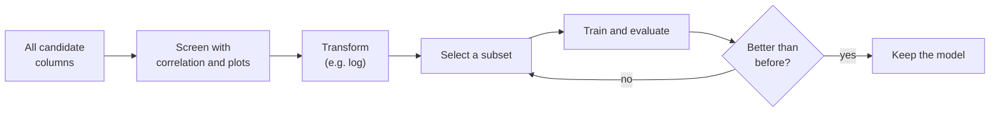
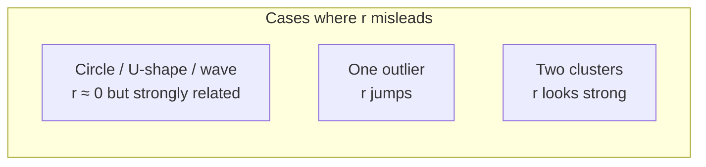
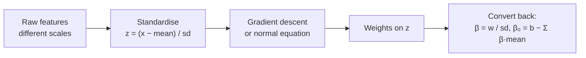

# Chapter 2 · Correlation and Feature Selection

> **Series:** Linear Models for Engineers · Chapter 2 of 5
> **Prerequisites:** [Chapter 1 · Introduction to Linear Models](en-01-linear-intro.md)
> **Interactive labs:** [CORR101](https://rathachai.github.io/DA-LAB/learnings/linear/corr101.html) · [LM201](https://rathachai.github.io/DA-LAB/learnings/linear/lm201.html)

---

## Learning Objectives

After completing this chapter, you will be able to:

1. Interpret the **Pearson correlation coefficient** $r$ (a number from −1 to +1 that tells how well two measurements follow a straight-line pattern), and recognise where it fails.
2. Extend simple regression to **multiple linear regression** (one output predicted from several inputs).
3. Use correlation to **screen** candidate features (inputs), and explain why screening alone is not enough.
4. Recognise features that are **useless (noise)**, **non-linear**, or **leaky** (they secretly contain the answer).
5. Apply a **log transform** to straighten an exponential relationship.
6. Compare models fairly using **adjusted R²** and explain why plain R² never decreases when you add inputs.
7. Explain why features are **standardised** (converted to a common scale) before gradient descent.

> **Key idea.** Choosing model inputs is the same job as choosing which sensors to install on a machine. Each sensor costs money, needs maintenance and adds wiring. You want the *fewest* sensors that still tell you what you need to know.

---

## 2.1 From One Feature to Many

In machine learning, an input measurement is called a **feature**. A feature is simply one column of your data table: temperature, pressure, flow rate, motor current, and so on. The quantity you want to predict is called the **target** (written $y$).

In Chapter 1 we used one feature. Real systems have many measurable inputs. A model with $p$ features $x_1, x_2, \dots, x_p$ is

$$
\hat y = \beta_0 + \beta_1 x_1 + \beta_2 x_2 + \dots + \beta_p x_p
$$

**In plain words:** the prediction is a starting value plus a weighted sum of the inputs.

| Symbol | Meaning | Unit |
|--------|---------|------|
| $\hat y$ ("y-hat") | the predicted value of the target | same as the target |
| $x_j$ | the $j$-th input feature | its own unit (°C, bar, A, …) |
| $p$ | the number of input features | count (no unit) |
| $\beta_0$ | the intercept: the prediction when all inputs are zero | same as the target |
| $\beta_j$ | the weight of input $j$ | unit of target per unit of $x_j$ |

> **Engineering analogy.** This is the same idea as a superposition of effects. If a room's temperature depends on the heater power and on the outside temperature, each effect has its own coefficient, and the total is the sum.

The same model can be written compactly with matrices. Stack all the measurements into a table $X$ (one row per sample, one column per feature, plus a column of ones for the intercept):

$$
\hat{\mathbf y} = X\boldsymbol\beta, \qquad
\boldsymbol\beta = (X^\top X)^{-1} X^\top \mathbf y \quad\text{(normal equation)}
$$

**In plain words:** the second formula is a ready-made recipe that gives the best weights in one step, with no iteration. Here $X$ is the table of inputs, $\mathbf y$ is the list of measured targets, $\boldsymbol\beta$ is the list of weights, $X^\top$ is $X$ with rows and columns swapped (the transpose), and $(\cdot)^{-1}$ is the matrix inverse. It is the least-squares solution you met in Chapter 1: the weights that make the squared errors as small as possible.

The weight $\beta_j$ is the change in $\hat y$ for a one-unit increase in $x_j$ **while all other features are held constant**. That last clause matters. When two inputs are related to each other, a weight can change, or even flip sign, depending on which other inputs are in the model.

> **Engineering analogy.** It is like a partial derivative $\partial y / \partial x_j$: you vary one variable and freeze the others.

---

## 2.2 Why Select Features?

More features are not automatically better. First, some plain-language definitions.

- **Noise feature:** an input that has no real link to the target. It is like a sensor that only reads random electrical interference.
- **Redundant feature / multicollinearity:** two inputs that carry the same information (for example, a temperature in °C and the same temperature in °F). The model cannot tell them apart, so its weights become unstable.
- **Leakage:** a feature that contains the answer itself, or is calculated from it. The model looks perfect on past data and fails in real use.

| Problem | Consequence |
|---------|-------------|
| **Noise features** carry no signal | add variance; the model starts fitting accidental patterns |
| **Redundant features** (strongly correlated with each other) | unstable, hard-to-interpret coefficients (*multicollinearity*) |
| **Leaky features** contain the answer | spectacular training scores that vanish in deployment |
| **Cost** | every sensor has a price, and every extra input must be maintained |

The goal is the **smallest set of features that predicts well**. This principle is called *parsimony*, or Occam's razor: do not use more than you need.

> **Engineering analogy.** Two thermocouples placed side by side give you almost the same reading. The second one adds cost but little information. Quality engineers do the same thing when they use a Pareto chart to find the "vital few" causes and ignore the "trivial many". Feature selection is a Pareto screening of your data columns.

---

## 2.3 Correlation

### A small example first

Suppose we measured five pairs of values (for example, pump speed $x$ in units of 100 rpm and flow $y$ in L/min):

| Sample | $x$ | $y$ |
|-------:|----:|----:|
| 1 | 1 | 2 |
| 2 | 2 | 4 |
| 3 | 3 | 5 |
| 4 | 4 | 4 |
| 5 | 5 | 6 |

**Step 1: find the averages.** $\bar x = 3$ and $\bar y = 4.2$. (A bar over a symbol means "average".)

**Step 2: find each point's distance from the averages.**

| $x_i-\bar x$ | $y_i-\bar y$ | product |
|------------:|------------:|--------:|
| −2 | −2.2 | 4.4 |
| −1 | −0.2 | 0.2 |
| 0 | 0.8 | 0.0 |
| 1 | −0.2 | −0.2 |
| 2 | 1.8 | 3.6 |
| | **sum** | **8.0** |

**Step 3: find the spread of each variable.** $\sum (x_i-\bar x)^2 = 4+1+0+1+4 = 10$ and $\sum (y_i-\bar y)^2 = 4.84+0.04+0.64+0.04+3.24 = 8.8$.

**Step 4: combine.**

$$
r = \frac{8.0}{\sqrt{10 \times 8.8}} = \frac{8.0}{9.38} \approx 0.85
$$

So $x$ and $y$ have a strong positive straight-line relationship.

### The general formula

The **Pearson correlation coefficient** $r$ gives the strength of a *straight-line* relationship as one number:

$$
r = \frac{\sum (x_i-\bar x)(y_i-\bar y)}{\sqrt{\sum (x_i-\bar x)^2\;\sum (y_i-\bar y)^2}}
= \frac{\text{cov}(x,y)}{s_x\,s_y}
\quad\in[-1,\,1]
$$

**In plain words:** multiply how far $x$ is from its average by how far $y$ is from its average, add up these products over all points, then divide by the overall spreads so that the answer has no unit and always lies between −1 and +1.

| Symbol | Meaning |
|--------|---------|
| $x_i,\ y_i$ | the $i$-th measured pair |
| $\bar x,\ \bar y$ | averages of $x$ and $y$ |
| $\text{cov}(x,y)$ | **covariance**: the average of the products $(x_i-\bar x)(y_i-\bar y)$. It says whether the two variables tend to rise together. Its unit is (unit of $x$) × (unit of $y$), so its size is hard to judge by itself. |
| $s_x,\ s_y$ | **standard deviations**: the typical distance of a variable from its average, in the variable's own unit |

Dividing the covariance by $s_x s_y$ cancels the units. This is exactly like **non-dimensionalisation**: dividing by a reference quantity so that the result is a pure number you can compare across problems. In the example above, $\text{cov}=8.0/4=2.0$, $s_x=1.58$, $s_y=1.48$, and $2.0/(1.58\times1.48)\approx 0.85$, the same answer.

- $r = +1$: all points lie on a rising straight line.
- $r = -1$: all points lie on a falling straight line.
- $r \approx 0$: no *linear* relationship.

**Intuition.** Each point contributes the product $(x_i-\bar x)(y_i-\bar y)$. A point that is above the average in both $x$ and $y$ (or below in both) gives a positive product and pushes $r$ up. A point on opposite sides gives a negative product and pushes $r$ down.

### Relationship to the regression line

For a fit of one feature, the slope of the best-fit line and the correlation are tied together:

$$
m = r\,\frac{s_y}{s_x}, \qquad R^2 = r^2
$$

**In plain words:** the slope $m$ is the correlation rescaled by the ratio of the spreads, so it carries the correct units (unit of $y$ per unit of $x$). $R^2$ ("R-squared") is the fraction of the variation in $y$ that the line explains. In our example, $m = 0.85 \times 1.48/1.58 = 0.80$ L/min per 100 rpm, and $R^2 = 0.85^2 \approx 0.73$, so the line explains about 73% of the variation in flow.

| $\lvert r\rvert$ | Common wording |
|-----------------|----------------|
| 0.9 – 1.0 | very strong |
| 0.7 – 0.9 | strong |
| 0.4 – 0.7 | moderate |
| 0.2 – 0.4 | weak |
| < 0.2 | very weak / none |

### Three warnings

1. **Only linear relationships.** A perfect circle, a U-shape or a sine wave can have $r \approx 0$ while $y$ is completely determined by $x$. (Think of a parabolic reflector: position fixes the height exactly, yet the straight-line correlation is zero.)
2. **Sensitivity to outliers.** An outlier is a point far from the rest. A single extreme point can create or destroy a correlation, just like one faulty sensor reading can ruin an average.
3. **Correlation is not causation.** Two variables may move together because of a third factor, or by coincidence. Ice-cream sales and power use both rise in summer, but neither causes the other.

> **Common mistake.** Reading $r \approx 0$ as "these variables are unrelated". It only means "there is no *straight-line* relationship". Always draw the scatter plot.

---

## 2.4 Screening with Correlation

**Screening** means a quick first check that removes obviously poor candidates. The correlation of each feature with the target, $r(x_j, y)$, is a fast first filter (see Section 2.3).

- A **strong** $|r|$ (positive or negative) suggests a useful feature.
- $r \approx 0$ suggests *no linear* relationship, but be careful, as we see next.

### Always look at the plot

Correlation is a single number. A scatter plot (each sample drawn as a dot, with $x$ on one axis and $y$ on the other) shows the *shape*. In the lab's dataset, four kinds of column show why both are needed:

| Column type | $r$ with $y$ | What the scatter plot reveals |
|-------------|-------------|-------------------------------|
| Linear signal | strong | cloud around a straight line, so keep |
| **Pure noise** | ≈ 0 | shapeless blob, so drop |
| **U-shape** | ≈ 0 | a clear parabola: related, but not *linearly* |
| **Exponential** | moderate | a curve that bends, fixable with a transform |

> **Key idea.** Screening has two possible errors. A good feature may look bad (the U-shape) and a feature may look good only because it is a copy of another feature. Correlation with the target does not detect redundancy between two inputs. For that, also check the correlation *between* the inputs.

---

## 2.5 Transforming Features

A linear model is linear in its **coefficients** (the $\beta$ values), not necessarily in the raw measurements. We may feed it transformed features such as $\ln x$ (natural logarithm), $x^2$ or $1/x$.

A **log transform** replaces each value by its logarithm. Engineers already use this idea: decibels (dB) for sound and signals, pH for acidity, and the Richter scale for earthquakes. On a log scale, multiplying by a constant becomes adding a constant, so growth by a fixed *ratio* turns into a straight line. This is why semi-log graph paper makes exponential curves straight.

For an exponential relationship $x = a\,e^{k y}$, taking the natural logarithm gives

$$
\ln x = \ln a + k\,y
$$

**In plain words:** if $x$ grows by the same *percentage* for each step in $y$, then $\ln x$ grows by the same *amount* for each step in $y$, which is a straight line. Here $a$ is the value of $x$ when $y=0$ and $k$ is the growth rate per unit of $y$.

A tiny example: if $x$ doubles each time $y$ rises by 1 (so $x = 1, 2, 4, 8, 16$), the raw values curve upward. But $\ln x = 0, 0.69, 1.39, 2.08, 2.77$ rises by 0.69 every step, a perfect straight line. Using $\ln x$ instead of $x$ typically raises $|r|$ and lowers the prediction error.

> **Common mistake.** The logarithm needs positive values, because $\ln 0$ and the log of a negative number do not exist. Also, a U-shape cannot be fixed by $\ln x$. It needs a squared term $x^2$, which is a different transformation.

---

## 2.6 Comparing Models Fairly

### Why plain R² is not enough

Recall that $R^2$ is the fraction of the variation in $y$ that the model explains. On the training data, **adding any feature, even random noise, cannot decrease $R^2$**. The reason is simple: the fitting method can always give the new feature a weight of zero, which returns the old model. In practice a noise feature gets a small accidental weight that fits a few random wiggles, so $R^2$ creeps up. Plain $R^2$ therefore always rewards complexity.

**Adjusted R²** adds a penalty for the number of features $p$:

$$
\bar R^{2} = 1 - (1-R^2)\,\frac{n-1}{n-p-1}
$$

**In plain words:** take the unexplained fraction $(1-R^2)$ and inflate it by a factor that grows as you add features. A new feature must reduce the error enough to beat this inflation.

| Symbol | Meaning |
|--------|---------|
| $R^2$ | ordinary R-squared of the model (no unit, 0 to 1) |
| $n$ | number of samples (rows of data) |
| $p$ | number of features used |
| $\bar R^2$ | adjusted R-squared |

**Worked example.** We have $n = 20$ samples and a model with $p = 2$ features and $R^2 = 0.900$.

$$
\bar R^2 = 1 - 0.100\times\frac{19}{17} = 1 - 0.1118 = 0.888
$$

Now add a pure-noise feature ($p=3$). Plain $R^2$ rises slightly to $0.901$, but

$$
\bar R^2 = 1 - 0.099\times\frac{19}{16} = 1 - 0.1176 = 0.882
$$

Plain $R^2$ went *up* (0.900 to 0.901), while adjusted $R^2$ went *down* (0.888 to 0.882). Adjusted $R^2$ correctly says "this feature did not help".

| Situation | $R^2$ | $\bar R^2$ |
|-----------|-------|------------|
| add a genuinely informative feature | ↑ | ↑ |
| add a pure-noise feature | ≈ unchanged | ↓ |
| add a redundant feature | ≈ unchanged | ↓ or ≈ |

> **Engineering analogy.** Think of the cost of instrumentation. Adding a sensor is only worth it if the improvement in accuracy justifies the extra cost. Adjusted $R^2$ builds that "cost" into the score.

For stronger guarantees, evaluate on **held-out data** (data the model has never seen), which is the subject of Chapter 3.

### Leakage and labels

Two columns deserve special suspicion:

- **The target itself.** Using $y$ as a feature gives $R^2 = 1$, a perfect and worthless model (*data leakage*). It is like predicting an exam score by looking at the answer sheet.
- **Identifiers** such as a row number. They carry no physical meaning, so any weight they receive is accidental.

> **Common mistake.** Celebrating a very high $R^2$ without asking where each feature comes from. If a feature would not be available *before* the value you are predicting, it is probably leaking.

---

## 2.7 Standardising Features

Features often have very different units and ranges (for example, 20–40 for a temperature versus 100–200 for a pressure). **Gradient descent** is the step-by-step method that adjusts the weights a little at a time to reduce the error. When features have very different ranges, the error surface becomes a long narrow valley, and the method must use a tiny step size to avoid overshooting. Training is then slow.

**Standardising** means converting each feature to a common scale: subtract its average, then divide by its standard deviation.

$$
z_j = \frac{x_j-\bar x_j}{s_j}
$$

**In plain words:** $z_j$ tells you "how many standard deviations above or below normal is this reading?" It has no unit. Here $x_j$ is the raw value (in its own unit), $\bar x_j$ is that feature's average and $s_j$ is its standard deviation, both in the same unit as $x_j$.

**Example.** Temperatures of 20, 30 and 40 °C have average 30 °C and standard deviation 10 °C. Their $z$ values are $-1,\ 0,\ +1$. A pressure of 100, 150 and 200 kPa (average 150, standard deviation 50) gives exactly the same $-1,\ 0,\ +1$. Both features now sit on the same scale.

> **Engineering analogy.** This is the same spirit as using dimensionless numbers (Reynolds number, per-unit values in power systems). Once variables are dimensionless, you can compare them directly.

Coefficients on standardised features (**standardised $\beta$**) can also be compared directly as a rough measure of importance. Coefficients in original units cannot, because they depend on the units chosen: a weight "per °C" and a weight "per kPa" are not comparable.

The last box converts the weights back to real units so that the model can be used directly on raw sensor readings. Here $w$ is a weight found on the standardised data, $b$ is the intercept found on the standardised data, and "sd" is the standard deviation of that feature.

---

## 2.8 Hands-on Labs

### CORR101 · Pearson Correlation Demo

**[Open CORR101](https://rathachai.github.io/DA-LAB/learnings/linear/corr101.html)** — choose a pattern (positive, negative, no relation, perfect line, circle, U-shape, sine wave, two clusters, one outlier) or spray your own points, and watch $r$, $R^2$, the covariance and the correlation line respond.

**Experiments:** (1) select *Circle* and then *U-shape* — why is $r$ near zero although the pattern is obvious? (2) select *One outlier*, note $r$, and compare with the blob alone. (3) select *Two clusters* and explain why $r$ looks strong.

### LM201 · Feature Selection for Linear Models

**[Open LM201](https://rathachai.github.io/DA-LAB/learnings/linear/lm201.html)**

The lab provides a table of 100 samples with columns `id`, `x1`…`x7` and `y`.

| Column | Designed behaviour |
|--------|--------------------|
| `x1`, `x2` | strong positive relationship with $y$ |
| `x3` | U-shaped relationship; $r\approx 0$ (a trap) |
| `x4` | pure noise, uncorrelated with everything |
| `x5` | exponential; becomes linear after `log` |
| `x6`, `x7` | strong negative relationship |

**Workflow**

1. Click a column header to see its scatter plot and $r$.
2. Tick **use** for the columns you want, and **log** where a transform helps.
3. Press **Solve instantly** (or **Train**) and read the equation $\beta_0+\beta_1x_1+\dots$.
4. Compare the **Model comparison** table (MAE, RMSE, MAPE, R², adjusted R²) across feature sets. These are different ways of measuring prediction error and fit quality.

### Suggested experiments

1. Train with `x1` alone, then add `x7`, `x6`, … one at a time. When does the improvement stop?
2. Add `x4` (noise). Does R² change? Does adjusted R² change?
3. Tick `log` for `x5` and watch its $r$ and the scatter plot change. Does the error improve?
4. Tick `x3`. Why does a U-shaped feature fail to help a *linear* model?
5. Tick `y` and then `id`. Interpret the warnings.

---

## Summary

- **Pearson's $r$** measures *linear* association only; beware non-linearity, outliers and confounding (a hidden third factor).
- Multiple regression predicts from several features; coefficients are interpreted *holding the others fixed*.
- Screen with correlation **and** plots; handle curvature with transforms such as $\ln x$.
- Plain R² always rewards extra features; **adjusted R²** penalises them, like a cost for each extra sensor.
- Never use the target or an identifier as a feature.
- **Standardise** features for stable gradient descent and comparable weights.

---

## Key Terms

| Term | Plain-language meaning | Engineering comparison |
|------|------------------------|------------------------|
| Feature | one input measurement (a column of data) | a sensor channel |
| Target | the quantity to be predicted | the output variable of the process |
| Correlation ($r$) | how well two variables follow a straight line, from −1 to +1 | a dimensionless measure of how in-step two signals are |
| Covariance | average product of the two variables' deviations from their averages | the unit-carrying version of correlation |
| Noise feature | an input unrelated to the target | a sensor reading only interference |
| Multicollinearity | two inputs carrying the same information | two redundant sensors |
| Leakage | a feature that contains the answer | reading the answer sheet during the test |
| Log transform | replace $x$ by $\ln x$ | dB scale, pH, semi-log paper |
| $R^2$ | fraction of the variation in $y$ explained by the model | fraction of variance accounted for by a fit |
| Adjusted $R^2$ | $R^2$ with a penalty for each extra feature | accuracy gain minus the cost of another sensor |
| Standardising | convert to $z=(x-\bar x)/s$ | non-dimensionalisation, per-unit values |
| Gradient descent | adjust weights in small steps to reduce error | iterative solver, like Newton or relaxation methods |

**Previous:** [Chapter 1 · Introduction to Linear Models](en-01-linear-intro.md) · **Next:** [Chapter 3 · Machine Learning and Train–Test Split](en-03-machine-learning.md)

---

Powered by: Sonnet &nbsp;|&nbsp; AI Whisperer: [rathachai.github.io](https://rathachai.github.io)
