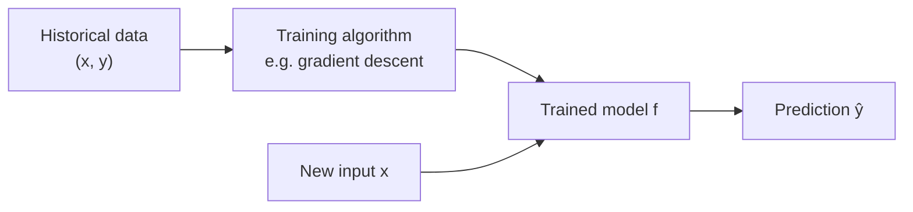
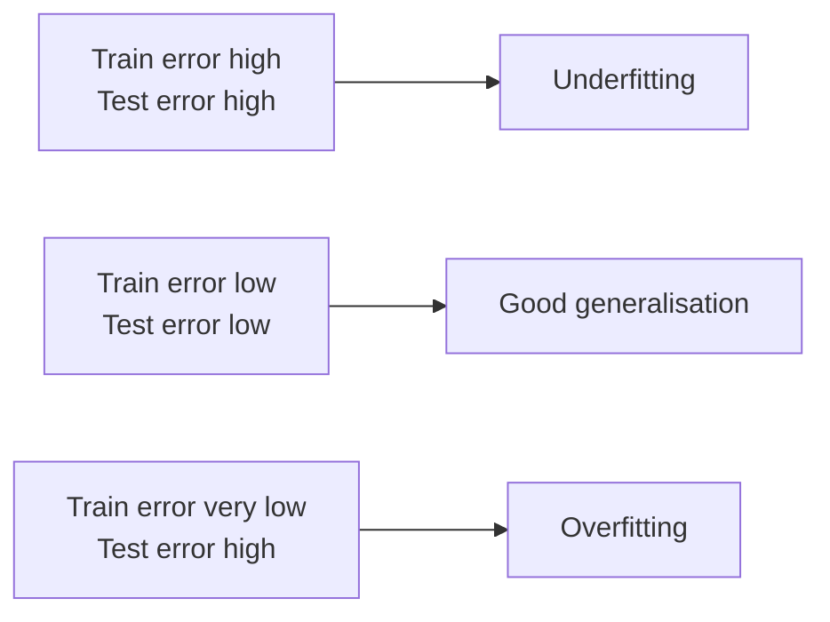
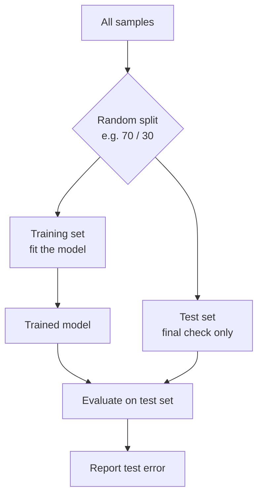
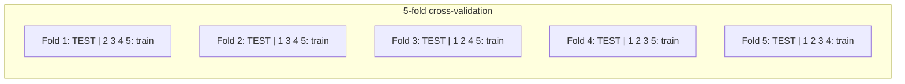

# Chapter 3 · Machine Learning and the Train–Test Split

> **Series:** Linear Models for Engineers · Chapter 3 of 5
> **Prerequisites:** [Chapter 1](en-01-linear-intro.md), [Chapter 2](en-02-feature-selection.md)
> **Interactive labs:** [LM301](https://rathachai.github.io/DA-LAB/learnings/linear/lm301.html) · [LM302](https://rathachai.github.io/DA-LAB/learnings/linear/lm302.html)

---

## Learning Objectives

After completing this chapter, you will be able to:

1. Place linear regression within the wider field of **machine learning**.
2. Distinguish **parameters** from **hyperparameters**, and **training** from **generalisation**.
3. Explain **underfitting** and **overfitting** and recognise them from train/test errors.
4. Split data into **train** and **test** sets, and justify the choice of ratio.
5. Identify **data leakage** and avoid it.
6. Explain why a single random split is a noisy estimate and how repeated splits or cross-validation help.

---

## 3.1 What Is Machine Learning?

**Machine learning (ML)** is the practice of building models whose behaviour is determined by data rather than by hand-written rules. In **supervised learning** we are given examples with known answers — pairs $(x, y)$ — and we learn a function $f$ such that $f(x)\approx y$ for *new* inputs.

| Type | Target $y$ | Example |
|------|-----------|---------|
| **Regression** | a number | predict remaining life in hours |
| **Classification** | a category | predict "healthy" vs. "faulty" |

Linear regression, the subject of this series, is both a statistical tool and the simplest supervised ML model. Everything in this chapter — splitting, overfitting, evaluation — applies equally to far more complex models.

### Parameters and hyperparameters

| | Parameters | Hyperparameters |
|---|-----------|-----------------|
| Examples | slope $m$, intercept $c$, weights $\beta_j$ | learning rate $\alpha$, number of features, train ratio |
| Who sets them? | the training algorithm | the engineer |
| Learned from | training data | experiments on held-out data |

---

## 3.2 The Real Goal: Generalisation

A model that merely reproduces the data it has seen is useless — a lookup table would do that. We want **generalisation**: accurate predictions on data the model has *never* seen. The error on training data is therefore an **optimistic** estimate of real-world performance.

### Underfitting and overfitting

| | Underfitting | Good fit | Overfitting |
|---|--------------|----------|-------------|
| Model | too simple | right complexity | too flexible / too many features |
| Train error | high | low | very low |
| Test error | high | low | **high** |
| Fix | richer features or model | — | fewer features, more data, regularisation |

The signature of overfitting is a **gap**: the model looks excellent on the data it trained on and noticeably worse on new data. Noise features (Chapter 2) and tiny training sets both widen the gap.

---

## 3.3 The Train–Test Split

The simplest remedy is to **hold out** part of the data:

1. Randomly assign each sample to the **training set** or the **test set**.
2. Fit the model using the training set **only**.
3. Evaluate on the test set, which the model has never seen.

### Choosing the ratio

| Training share | Typical effect |
|----------------|----------------|
| **very small** (e.g. 10–20 %) | the fitted line is **unstable**; it changes a lot with each random split |
| **moderate** (70–80 %) | a common, balanced choice |
| **very large** (e.g. 90 %) | the model is stable, but the **test set is tiny**, so the test score is noisy |

There is a genuine trade-off: more training data improves the **model**, more test data improves the **measurement** of the model.

### Rules that must never be broken

1. **Test data is never used for fitting** — including indirect uses such as choosing features by looking at test scores.
2. **Pre-processing statistics come from the training set only.** Standardise using the training mean and standard deviation, then apply them to the test set. Computing them on all data leaks information.
3. **Report the test score once**, at the end. Repeatedly tuning against it turns it into a training signal.

> **A third set.** When you tune hyperparameters or choose among many models, use a separate **validation set** (train / validation / test), or cross-validation, and keep the test set for a final unbiased check.

---

## 3.4 Data Leakage

**Leakage** occurs when information that would not be available at prediction time influences training or evaluation. It produces scores that look wonderful and then collapse in production.

| Source of leakage | Example |
|-------------------|---------|
| Feature contains the answer | using $y$ (or a transformed $y$) as an input |
| Pre-processing on all data | scaling with statistics computed on the test set too |
| Duplicated or near-duplicate rows across sets | many snapshots of the same machine in both train and test (see Chapter 5) |
| The future leaks into the past | random splitting of time-series data (see Chapter 4) |

---

## 3.5 One Split Is Not Enough

A random split is, by definition, random. A lucky split gives an optimistic test score; an unlucky one a pessimistic score. To judge the *typical* performance:

- **Repeat the split** many times and average (and examine the spread).
- **K-fold cross-validation**: divide the data into $K$ folds; train on $K-1$, test on the remaining fold, rotate $K$ times, and average the $K$ scores.

The variability is largest when the training set is small or the test set is small — exactly the trade-off described in Section 3.3.

---

## 3.6 Hands-on Labs

### LM301 · Train–Test Split

**[Open LM301](https://rathachai.github.io/DA-LAB/learnings/linear/lm301.html)** — a scatter-plot simulator in the style of LM101.

- Slide the **train ratio** between 10 % and 90 %; points move between **train (●)** and **test (◆)**.
- Only train points drive the fit; compare **train vs. test** MAE, RMSE, MAPE, MSE and R².
- Press **Random split again** to see how much the best-fit line moves.
- **Split experiment** repeats 50 random splits at the current ratio and reports the mean and range of the test RMSE.

### LM302 · Train–Test Split with Feature Selection

**[Open LM302](https://rathachai.github.io/DA-LAB/learnings/linear/lm302.html)** — the Chapter 2 data table with a train/test split.

- Choose features (and `log`), pick a train ratio, and train.
- Test rows are shaded **amber** in the table; test points are shown as diamonds in the charts, and train/test sets can be faded or highlighted independently.
- The **Model comparison** table logs train and test MAE and MAPE for each feature set and split.

### Suggested experiments

1. In **LM301**, set the ratio to 10 %, then press *Random split again* ten times. Describe how the line and the test RMSE behave. Repeat at 50 % and 90 %.
2. Run the **split experiment** at 10 %, 50 % and 90 %. Which ratio gives the *smallest range* of test RMSE? Which gives the *largest*? Explain with Section 3.3.
3. In **LM302**, train with `x1, x2, x5 (log), x6, x7`, then add the noise columns `x3` and `x4`. Compare train and test MAE at 80 % and at 20 % train. When does the noise hurt more?
4. Increase the noise slider in **LM301** and observe the gap between train and test error.

---

## Exercises

1. A model has train RMSE 2.1 and test RMSE 6.8. Diagnose the problem and propose two remedies.
2. Why should standardisation use training statistics only? Describe what goes wrong otherwise.
3. You have 50 samples. Compare the pros and cons of a 90/10 split and a 70/30 split.
4. Explain why a tuning loop that repeatedly checks the test score invalidates it.
5. Sketch how 5-fold cross-validation would be set up for 100 samples. How many models are trained, and on how many samples each?

---

## Summary

- Supervised ML learns $f$ from labelled examples; what matters is **generalisation** to unseen data.
- Training error is optimistic. **Overfitting** shows as a train–test gap.
- Split data into **train** and **test**; fit and pre-process with the training set only.
- The split ratio trades model stability against measurement reliability; **one split is noisy** — repeat or cross-validate.
- **Leakage** inflates scores and must be prevented by careful splitting.

**Previous:** [Chapter 2 · Feature Selection](en-02-feature-selection.md) · **Next:** [Chapter 4 · Time Series](en-04-time-series.md)

---

Powered by: Sonnet &nbsp;|&nbsp; AI Whisperer: [rathachai.github.io](https://rathachai.github.io)
