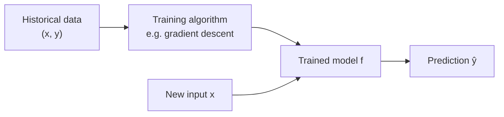
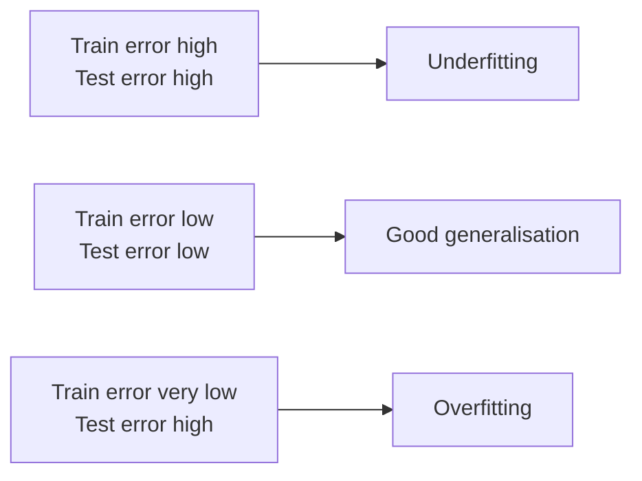
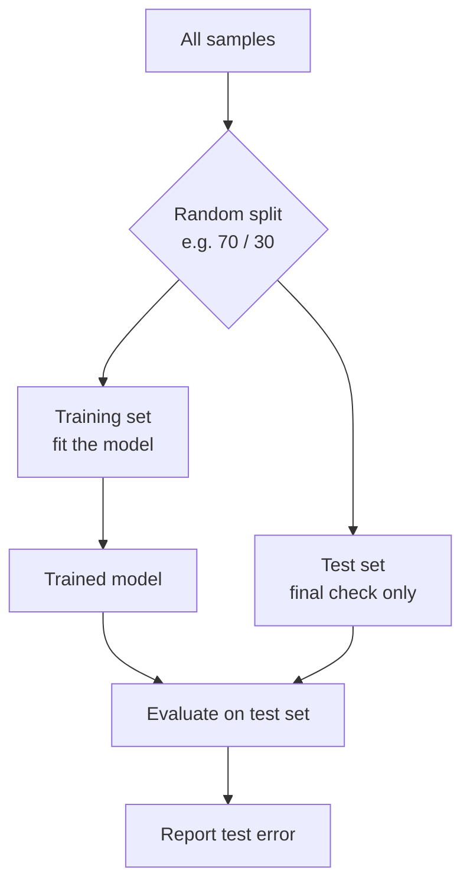
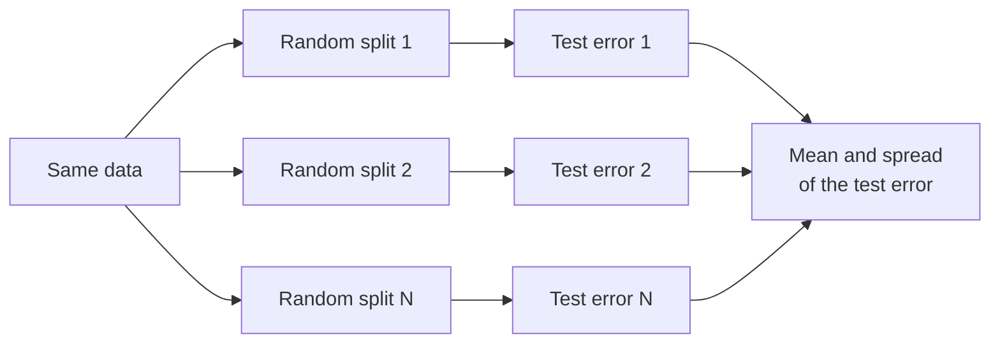

# Chapter 3 · Machine Learning and the Train–Test Split

> **Prerequisites:** fitting a line (or a multiple regression) to data and measuring its error
> **Interactive labs:** [LM301](https://rathachai.github.io/DA-LAB/learnings/linear/lm301.html) · [LM302](https://rathachai.github.io/DA-LAB/learnings/linear/lm302.html)

---

## Learning Objectives

After completing this chapter, you will be able to:

1. Place linear regression within the wider field of **machine learning** (computers learning rules from data).
2. Distinguish **parameters** (numbers the computer finds) from **hyperparameters** (settings you choose), and **training** (fitting) from **generalisation** (working on new data).
3. Explain **underfitting** and **overfitting** and recognise them from train and test errors.
4. Split data into **train** and **test** sets, and justify the choice of ratio.
5. Identify **data leakage** (the test data secretly helping the model) and avoid it.
6. Explain why a single random split is a noisy estimate and how **repeating** the split helps.

---

## 3.1 What Is Machine Learning?

In a classical engineering model, you write the rule yourself. For example, you derive Ohm's law, $V = IR$, from physics and then use it.

In **machine learning (ML)**, you let the computer find the rule from data. You supply many measured examples. The computer adjusts a formula until it matches them.

Here are the key words.

- **Model:** a formula that turns inputs into a prediction. Example: $\hat{y} = m x + c$.
- **Training (fitting):** adjusting the model's numbers until its predictions match the known data. For a straight line it means choosing the slope and the intercept.
- **Supervised learning:** learning from examples where the correct answer is known. Each example is a pair $(x, y)$: an input $x$ and its measured answer $y$. The goal is a function $f$ such that $f(x)\approx y$ for *new* inputs.

> **Engineering analogy.** Training a model is like calibrating an instrument. You feed it known reference values and tune it until its readings match. Prediction is using the calibrated instrument on an unknown sample.

Supervised problems come in two kinds, depending on what $y$ is.

| Type | Target $y$ | Plain-language meaning | Example |
|------|-----------|------------------------|---------|
| **Regression** | a number | predict "how much?" | predict remaining life in hours |
| **Classification** | a category | predict "which one?" | predict "healthy" vs. "faulty" |

Linear regression is both a statistical tool and the simplest supervised ML model. Everything in this chapter applies equally to far more complex models.

*In plain words:* past data goes in, the training step produces a model, and the model then predicts for new inputs.

### Parameters and hyperparameters

Two kinds of numbers appear in every model. Do not confuse them.

- **Parameters** are numbers the training algorithm finds by itself, such as the slope and intercept of a line.
- **Hyperparameters** are settings that you choose before or around training, such as how many features to use or what share of data to train on.

| | Parameters | Hyperparameters |
|---|-----------|-----------------|
| Plain meaning | the "dial positions" the computer finds | the "design choices" you make |
| Examples | slope $m$, intercept $c$, weights $\beta_j$ | learning rate $\alpha$ (step size of the search), number of features, train ratio |
| Who sets them? | the training algorithm | the engineer |
| Learned from | training data | experiments on held-out data |

> **Engineering analogy.** For a controller, the gains found by auto-tuning are like parameters. Your choice of controller type (P, PI or PID) and the sample time are like hyperparameters.

---

## 3.2 The Real Goal: Generalisation

Suppose you build a model that reproduces every data point you gave it perfectly. Is it good? Not necessarily. A lookup table also does that, and it cannot predict anything new.

What we really want is **generalisation**: accurate predictions on data the model has *never seen*. That is the whole point of a model.

Therefore the error on the training data is an **optimistic** estimate. The model has already seen those answers.

> **Engineering analogy.** Imagine you tune a controller on a simulation and it performs perfectly. That says little until you run it on the real plant. Or imagine a student who memorised last year's exam. They score 100 % on it, but they fail a new exam. A student who understood the subject does well on both. Generalisation measures understanding, not memory.

### Underfitting and overfitting

Look at three students.

- One barely studied. They do badly on old and new questions. This is **underfitting**: the model is too simple to capture the pattern.
- One understood the subject. They do well on both. This is a **good fit**.
- One memorised the answers, even the typos. They ace old questions and fail new ones. This is **overfitting**: the model has learned the noise in the training data, not just the pattern.

A curve-fitting picture helps. Imagine ten noisy data points that really follow a straight line.

- A straight line misses the pattern if the truth is curved: underfitting.
- A smooth fit follows the trend: good.
- A high-order polynomial passing through *every* point wiggles wildly between them: overfitting. It matches the noise exactly, so it predicts badly at the next point.

| | Underfitting | Good fit | Overfitting |
|---|--------------|----------|-------------|
| Model | too simple | right complexity | too flexible / too many features |
| Train error | high | low | very low |
| Test error | high | low | **high** |
| Fix | richer features or model | — | fewer features, more data, regularisation (a penalty that keeps the model simple) |

**A numeric example.** Say a model has a training RMSE of 2.1 and a test RMSE of 6.8.

- On data it has seen, it is off by about 2.1 units.
- On new data, it is off by about 6.8 units, more than three times worse.
- The gap (6.8 − 2.1 = 4.7) is the warning sign of overfitting. If both errors were near 6.8, the model would be underfitting instead.

*In plain words:* the signature of overfitting is a **gap**. The model looks excellent on the data it trained on and noticeably worse on new data. Noise features (inputs that carry no information) and tiny training sets both widen the gap.

> **Key idea.** Never judge a model by its training error alone. Ask: "How does it do on data it has not seen?"

---

## 3.3 The Train–Test Split

How do we measure performance on unseen data when we only have one data set? We pretend. We hide part of the data and treat it as "new".

> **Engineering analogy.** This is acceptance testing. You calibrate an instrument against one set of references, then check it against a different reference standard that was never used for calibration. Or think of prototype testing: you design with one set of loads, then verify with independent test loads.

The procedure is called **hold-out**:

1. Randomly assign each sample (each row of data) to the **training set** or the **test set**. This is a **random split**, like drawing samples at random for quality control.
2. Fit the model using the training set **only**.
3. Evaluate on the **test set**: data the model has never seen.

*In plain words:* split the data, fit on one part, grade on the other part, and report the grade.

### Choosing the ratio

The **train ratio** is the share of data used for training. A "70 / 30 split" means 70 % train and 30 % test.

| Training share | Typical effect |
|----------------|----------------|
| **very small** (e.g. 10–20 %) | the fitted line is **unstable**; it changes a lot with each random split |
| **moderate** (70–80 %) | a common, balanced choice |
| **very large** (e.g. 90 %) | the model is stable, but the **test set is tiny**, so the test score is noisy |

For example, with 100 samples, a 90 / 10 split leaves only 10 test points. One odd point can change the test error a lot. A 10 / 90 split leaves only 10 training points, so the fitted line swings wildly.

There is a genuine trade-off. More training data improves the **model**. More test data improves the **measurement** of the model.

> **Engineering analogy.** It is like sampling for quality control. A small sample gives an unreliable estimate of the defect rate. But every item you test is one fewer item you can ship.

### Rules that must never be broken

1. **Test data is never used for fitting.** This includes indirect uses, such as choosing features by looking at test scores.
2. **Pre-processing numbers come from the training set only.** If you standardise (subtract the mean, divide by the standard deviation), compute the mean and standard deviation on the training set. Then apply those same numbers to the test set. Computing them on all data leaks information.
3. **Report the test score once**, at the end. If you keep tuning until the test score looks good, the test set stops being independent. It becomes a second training set.

> **Common mistake.** Trying five feature sets, picking the one with the best test score, and then reporting that score as "the expected performance". You have used the test set to make a choice, so the score is too optimistic.

### A third set: validation

If you must compare many models or tune hyperparameters, use a separate **validation set**. The three sets then play three roles.

| Set | Role | Engineering comparison |
|-----|------|------------------------|
| **Train** | fit the parameters | calibrating the instrument |
| **Validation** | choose between designs and hyperparameters | comparing design alternatives on a bench |
| **Test** | one final, unbiased check | the final acceptance test |

---

## 3.4 Data Leakage

**Data leakage** means that information which would *not* be available when making a real prediction has influenced the training or the evaluation. The test is no longer a fair test. Scores look wonderful, then collapse in real use.

> **Engineering analogy.** It is like giving students the exam paper in advance. The results look great, but they say nothing about what the students know.

| Source of leakage | Example |
|-------------------|---------|
| Feature contains the answer | using $y$ (or a transformed $y$) as an input |
| Pre-processing on all data | scaling with statistics computed on the test set too |
| Duplicated or near-duplicate rows across sets | many snapshots of the same machine in both train and test |
| The future leaks into the past | random splitting of time-series data |

> **Common mistake.** A very high test score on the first try. Do not celebrate. Ask first: "Could the test data have helped the model in some hidden way?"

---

## 3.5 One Split Is Not Enough

A random split is, by definition, random. A lucky split gives an optimistic test score. An unlucky one gives a pessimistic score.

For example, five different random splits of the same data might give test RMSE values of 4.1, 5.0, 3.6, 6.2 and 4.4. Which one is "the" answer? None of them alone. The mean (about 4.7) and the spread (3.6 to 6.2) together tell the real story.

To judge the *typical* performance, **repeat the split** many times with different random assignments. Then look at both the **average** and the **spread** of the test error.

> **Engineering analogy.** You would never trust a single measurement of a noisy sensor. You take repeated readings and report the mean and the scatter. The same applies to test error.

*In plain words:* split many times, collect many test errors, and report their average and their range.

The variability is largest when the training set is small or the test set is small. This is exactly the trade-off described in Section 3.3.

---

## 3.6 Hands-on Labs

### LM301 · Train–Test Split

**[Open LM301](https://rathachai.github.io/DA-LAB/learnings/linear/lm301.html)** — a scatter-plot simulator in the style of LM101.

- Slide the **train ratio** between 10 % and 90 %; points move between **train (●)** and **test (◆)**.
- Only train points drive the fit; compare **train vs. test** MAE, RMSE, MAPE, MSE and R².
- Press **Random split again** to see how much the best-fit line moves.
- **Split experiment** repeats 50 random splits at the current ratio and reports the mean and range of the test RMSE.

### LM302 · Train–Test Split with Feature Selection

**[Open LM302](https://rathachai.github.io/DA-LAB/learnings/linear/lm302.html)** — the feature-selection data table (100 samples, `x1`–`x7`) with a train/test split.

- Choose features (and `log`), pick a train ratio, and train.
- Test rows are shaded **amber** in the table; test points are shown as diamonds in the charts, and train/test sets can be faded or highlighted independently.
- The **Model comparison** table logs train and test MAE and MAPE for each feature set and split.

### Suggested experiments

1. In **LM301**, set the ratio to 10 %, then press *Random split again* ten times. Describe how the line and the test RMSE behave. Repeat at 50 % and 90 %.
2. Run the **split experiment** at 10 %, 50 % and 90 %. Which ratio gives the *smallest range* of test RMSE? Which gives the *largest*? Explain with Section 3.3.
3. In **LM302**, train with `x1, x2, x5 (log), x6, x7`, then add the noise columns `x3` and `x4`. Compare train and test MAE at 80 % and at 20 % train. When does the noise hurt more?
4. Increase the noise slider in **LM301** and observe the gap between train and test error.

---

## Summary

- Supervised ML learns a function $f$ from labelled examples. What matters is **generalisation**: accuracy on unseen data.
- Training error is optimistic, like a student scoring well on a memorised exam. **Overfitting** shows as a train–test gap.
- Split data into **train** and **test**; fit and pre-process with the training set only.
- The split ratio trades model stability against measurement reliability. **One split is noisy**, so repeat the split and look at the spread.
- **Leakage** inflates scores and must be prevented by careful splitting.

### Key terms

| Term | Plain-language meaning | Engineering comparison |
|------|------------------------|------------------------|
| Machine learning | computer finds the rule from data | empirical calibration instead of a derived law |
| Model | formula that maps inputs to a prediction | transfer function or calibration curve |
| Supervised learning | learning from examples with known answers | calibrating against known references |
| Regression / classification | predict a number / predict a category | measuring a value / pass–fail inspection |
| Training | adjusting the model to fit the data | calibrating the instrument |
| Parameter | number the algorithm finds | tuned controller gains |
| Hyperparameter | setting the engineer chooses | controller type, sample time |
| Generalisation | accuracy on new, unseen data | performance on the real plant |
| Underfitting | model too simple; errors high everywhere | straight line through a curved response |
| Overfitting | model memorises noise; good on train, bad on test | polynomial through every noisy point |
| Train set | data used to fit the model | calibration references |
| Test set | held-out data for a final check | independent reference standard / acceptance test |
| Validation set | held-out data for choosing between designs | design-alternative bench test |
| Random split | assigning rows to train or test by chance | random sampling for quality control |
| Data leakage | test information secretly helps the model | giving students the exam in advance |

---

Powered by: Sonnet &nbsp;|&nbsp; AI Whisperer: [rathachai.github.io](https://rathachai.github.io)
