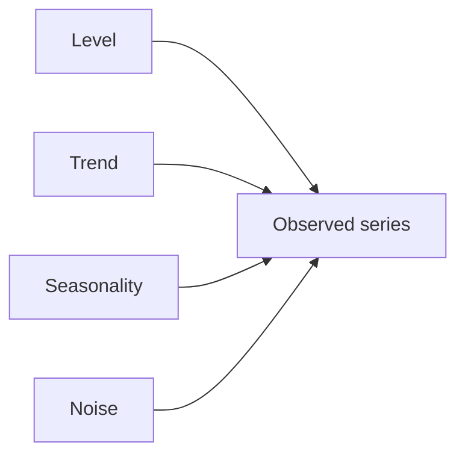
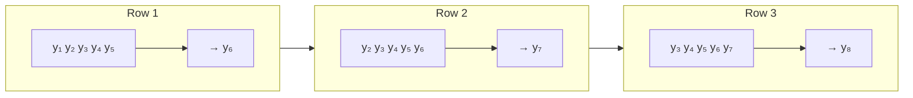
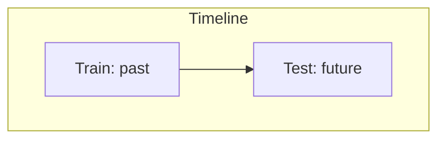
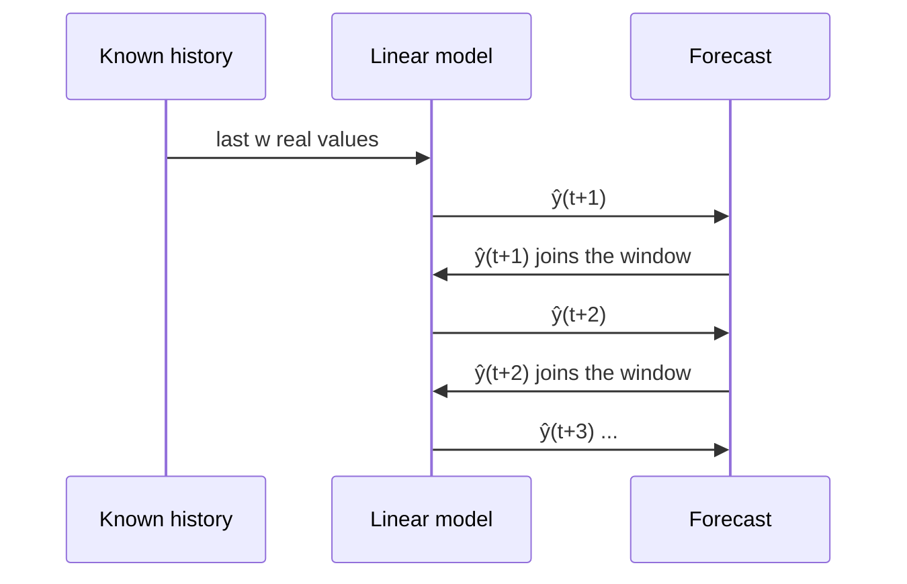

# Chapter 4 · Time Series with Linear Models

> **Series:** Linear Models for Engineers · Chapter 4 of 5
> **Prerequisites:** [Chapters 1–3](en-01-linear-intro.md)
> **Interactive lab:** [LM401](https://rathachai.github.io/DA-LAB/learnings/linear/lm401.html)

---

## Learning Objectives

After completing this chapter, you will be able to:

1. Describe the main components of a **time series**: level, trend, seasonality and noise.
2. Convert a series into a supervised-learning table using a **sliding window**.
3. Write and fit an **autoregressive (AR)** linear model.
4. Split time-series data **chronologically** and explain why random splitting is unsafe.
5. Distinguish **one-step-ahead prediction** from **multi-step (recursive) forecasting**.
6. Judge a forecast against a **naïve baseline**.

---

## 4.1 What Is a Time Series?

A **time series** is a sequence of measurements taken in time order, $y_1, y_2, \dots, y_T$ — motor current every second, daily demand, vibration every hour. The order carries information: today's value usually resembles yesterday's.

A series is often described as a combination of components:

| Component | Meaning | Example |
|-----------|---------|---------|
| **Level** | the typical value | average temperature of a furnace |
| **Trend** | slow, sustained rise or fall | gradual wear of a bearing |
| **Seasonality** | repeating cycle of fixed period | a daily production cycle |
| **Noise** | irregular random variation | sensor jitter |

Some series are fundamentally hard to predict: a **random walk** ($y_t = y_{t-1} + \text{step}$) and **white noise** contain little or nothing that a linear model can exploit beyond the last value or the average.

---

## 4.2 Turning a Series into a Table: The Sliding Window

Linear regression needs rows of features and a target. A time series offers only one column — so we **build features from the past**. Choose a **window size** $w$. For each time $t$:

- features: the previous $w$ values, $x_1 = y_{t-w},\; \dots,\; x_w = y_{t-1}$
- target: $y = y_t$

Slide the window forward by one step to get the next row.

A series of $T$ points yields $T-w$ rows. An example with $w=3$:

| $t$ | $x_1$ | $x_2$ | $x_3$ | $y$ |
|-----|-------|-------|-------|-----|
| 4 | $y_1$ | $y_2$ | $y_3$ | $y_4$ |
| 5 | $y_2$ | $y_3$ | $y_4$ | $y_5$ |
| 6 | $y_3$ | $y_4$ | $y_5$ | $y_6$ |

Once in this form, everything from Chapters 1–3 applies.

---

## 4.3 The Autoregressive Model

A linear regression on lagged values is an **autoregressive model of order $w$**, written AR($w$):

$$
\hat y_t = \beta_0 + \beta_1 y_{t-w} + \dots + \beta_w\, y_{t-1}
$$

The model predicts a series from **its own past**. Typical findings:

- **$w = 1$** captures "tomorrow resembles today" and follows slow trends well.
- **Larger $w$** lets the model represent oscillations (it can detect which way the series is turning) — a sine wave can be predicted almost exactly with $w \ge 2$.
- **Too large $w$** adds correlated features (neighbouring values are nearly identical), making gradient descent slow and coefficients unstable; fewer parameters are often better.

> Because lagged values are strongly correlated with each other, gradient descent converges slowly. A closed-form solution (the normal equation) is therefore convenient for AR models.

---

## 4.4 Splitting Time-Series Data

Chapter 3 recommended random splits. For time series that advice must change.

| Split | How | Verdict |
|-------|-----|---------|
| **Chronological** | train on the early part, test on the later part | **recommended** — mimics real forecasting |
| **Random** | shuffle windows into train and test | unsafe — windows overlap, so the model effectively **sees the future** |

Neighbouring windows share most of their values. If one window is in the training set and its neighbour is in the test set, the "unseen" test row is almost a copy of a training row. This is **leakage**, and it makes test scores look better than real forecasts.

---

## 4.5 Predicting: One Step Ahead vs. Multi-Step

There are two very different ways to use the fitted model on the test period.

### One-step-ahead (using actual data)

At each time $t$ the model is given the **real** last $w$ observations and predicts only the next value. Errors do not accumulate, because every prediction starts from truth. This answers: *"if I always know the recent past, how well can I predict the next value?"*

### Multi-step (recursive) forecasting

To look further ahead, feed the model's **own predictions** back in as inputs:

$$
\hat y_{t+1} = f(y_{t-w+1},\dots,y_t), \qquad
\hat y_{t+2} = f(y_{t-w+2},\dots,y_t,\,\hat y_{t+1}), \;\dots
$$

Each step inherits and amplifies earlier mistakes, so recursive forecasts typically **drift or flatten** and the test error is much larger than the one-step error. A linear AR model often decays towards a constant (the long-run level) rather than continuing an oscillation.

### Evaluate against a naïve baseline

A forecast is only valuable if it beats a trivial rule:

| Baseline | Rule |
|----------|------|
| **Persistence** (one step) | $\hat y_t = y_{t-1}$ |
| **Last-known value** (multi-step) | $\hat y_{t+k} = y_t$ for all $k$ |

If your model cannot beat the baseline — as for a **random walk** — more modelling effort will not help.

---

## 4.6 Hands-on Lab: LM401

**[Open LM401 · Time Series with Linear Models](https://rathachai.github.io/DA-LAB/learnings/linear/lm401.html)**

**Features**

- Ten 200-point **patterns**: sine, linear trend, trend + season, random walk, AR(1)-like wandering, level shifts, damped wave, exponential growth, sawtooth, white noise — with an adjustable noise level.
- **Click on the line and drag** up or down; neighbouring points follow smoothly, fading with distance (set the spread with the slider).
- **Window size** from 1 to 10, with the resulting **window table** ($x_1,\dots,x_w \to y$).
- **Chronological or random split** with a 10–90 % ratio.
- Train with gradient descent or solve directly; compare **Train**, **Test (uses actual data)** and **Test (chronological)** error, plus the naïve baseline.
- On the chart: train predictions (red, thin), test predictions from actual data (red, solid), and the recursive chronological forecast (red, dashed).

### Suggested experiments

1. Select *Sine wave* with low noise. Compare $w=1$ and $w=2$: why does a second lag make such a difference?
2. Select *Random walk*. Does the model beat the naïve baseline? Explain.
3. Select *Trend + season*. Observe the dashed chronological forecast. Why does it flatten while the one-step prediction follows the data?
4. Switch from **Chronological** to **Random** split. The test error drops — is the model really better?
5. Drag a bump into the **test period**. How do the one-step and recursive errors react differently?
6. Select *Level shifts* and find where the one-step prediction fails.

---

## Exercises

1. A series has 120 points and $w = 6$. How many rows does the window table have? Write out the first row symbolically.
2. For a perfectly linear series $y_t = 2t + 1$, find an AR(2) model that predicts it exactly.
3. Why does a random train/test split inflate performance on time-series windows?
4. Explain why recursive forecasts degrade with horizon, using the equations in Section 4.5.
5. When is the persistence baseline very hard to beat, and why?

---

## Summary

- A time series has level, trend, seasonality and noise; some series are essentially unpredictable.
- A **sliding window** converts a series to a table; a linear model on lags is an **AR($w$)** model.
- **Split chronologically** — random splits leak the future.
- **One-step** predictions use real data; **recursive** forecasts reuse predictions, so errors accumulate.
- Always compare with a **naïve baseline**.

**Previous:** [Chapter 3 · Machine Learning and Train–Test Split](en-03-machine-learning.md) · **Next:** [Chapter 5 · Predictive Maintenance](en-05-predictive-maintainance.md)

---

Powered by: Sonnet &nbsp;|&nbsp; AI Whisperer: [rathachai.github.io](https://rathachai.github.io)
