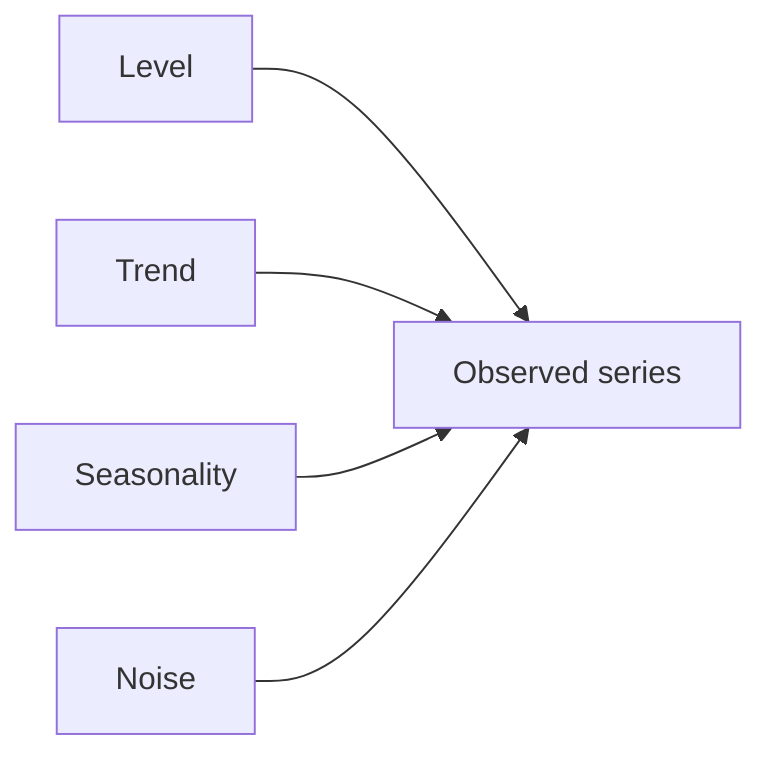
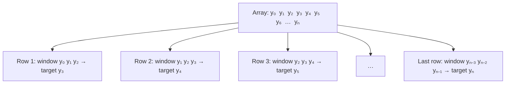
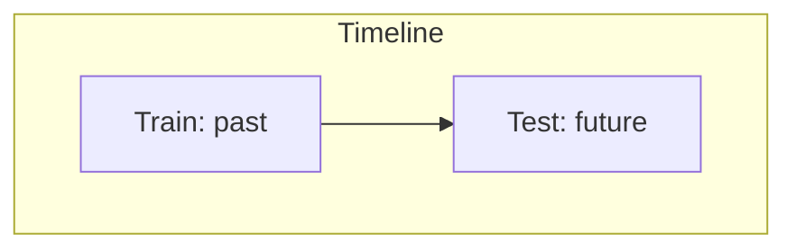
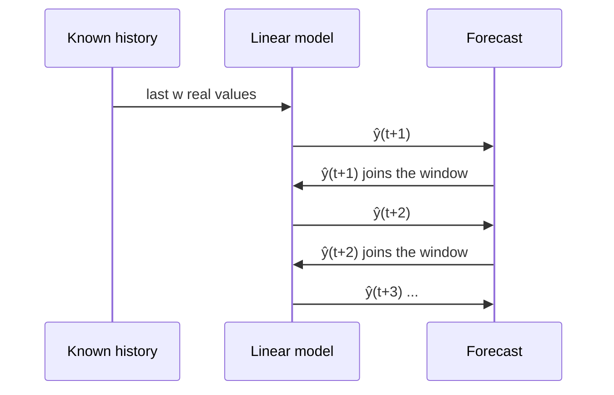

# Chapter 4 · Time Series with Linear Models

> **Series:** Linear Models for Engineers · Chapter 4 of 5
> **Prerequisites:** [Chapters 1–3](en-01-linear-intro.md)
> **Interactive lab:** [LM401](https://rathachai.github.io/DA-LAB/learnings/linear/lm401.html)

---

## Learning Objectives

After completing this chapter, you will be able to:

1. Describe the main components of a **time series** (a list of measurements in time order): level, trend, seasonality and noise.
2. Convert a series into a supervised-learning table using a **sliding window** (a small frame that moves along the data, one step at a time).
3. Write and fit an **autoregressive (AR)** linear model (a model that predicts a signal from its own past values).
4. Split time-series data **chronologically** (early data for training, later data for testing) and explain why random splitting is unsafe.
5. Distinguish **one-step-ahead prediction** from **multi-step (recursive) forecasting**.
6. Judge a forecast against a **naïve baseline** (a trivial rule that any useful model must beat).

> **Engineering analogy**
> Think of a time series as the trace on an oscilloscope or the file from a data logger. You cannot see the equations behind the signal. You only see what it did in the past, and you want to say what it will do next.

---

## 4.1 What Is a Time Series?

A **time series** is a sequence of measurements taken in time order, $y_1, y_2, \dots, y_T$. Examples: motor current every second, daily electricity demand, vibration every hour. A data logger produces exactly this kind of list.

The order carries information. Today's value usually resembles yesterday's. That is why we can predict from the past. If you shuffled the list, this information would be destroyed.

In plain words: a time series is a recorded signal, sampled at regular times.

A series is often described as a combination of simple parts:

| Component | Meaning in plain language | Example | Engineering comparison |
|-----------|---------------------------|---------|------------------------|
| **Level** | the typical value around which the signal sits | average temperature of a furnace | DC offset |
| **Trend** | a slow, sustained rise or fall | gradual wear of a bearing | slow drift |
| **Seasonality** | a pattern that repeats with a fixed period | a daily production cycle | a periodic (sinusoidal) component |
| **Noise** | small, irregular, random variation | sensor jitter | measurement noise |

> **Key idea**
> The recorded signal is the sum of a few simple parts. A linear model is good at the parts that follow a pattern (level, trend, seasonality). It cannot predict the noise.

Some series are fundamentally hard to predict.

- A **random walk** is a signal that moves by a random step each time: $y_t = y_{t-1} + \text{step}$. Think of a drunk person walking: the next position is the last position plus a random step.
- **White noise** is pure random jitter with no pattern at all.

For these signals, a linear model has nothing to learn beyond "use the last value" or "use the average".

---

## 4.2 Turning a Series into a Table: The Sliding Window

Linear regression (Chapter 1) needs a table: several input columns (features) and one output column (target). A time series is not a table. This section shows how to build one.

**Engineering analogy.** A **moving-average (FIR) filter** looks at the last few samples through a window and produces one output. We do the same. We look at the last few samples through a window, but instead of averaging them, we use them to **predict the next sample**.

### Step 1 — the series is a single array

A time series is stored as **one list of numbers in time order**. Using zero-based indices $t=0,1,\dots,n$, it is the array

| index $t$ | 0 | 1 | 2 | 3 | 4 | 5 | 6 | $\dots$ | $n$ |
|-----------|---|---|---|---|---|---|---|----------|-----|
| value | $y_0$ | $y_1$ | $y_2$ | $y_3$ | $y_4$ | $y_5$ | $y_6$ | $\dots$ | $y_n$ |

$$
\mathbf y=[\,y_0,\;y_1,\;y_2,\;\dots,\;y_n\,]\qquad\text{(}\,n+1\text{ values)}
$$

In plain words: $\mathbf y$ is the whole recorded list. $y_t$ is the sample at time index $t$. The list has $n+1$ samples because we start counting at 0.

There is **only one column** here. There are no separate features and no target. So we must *build* the features from the past.

> **In plain words (Step 1):** we start with one list of numbers.

### Step 2 — cut the array into overlapping windows

Choose a **window size** $w$. This is how many past samples the model may look at. For each time $t \ge w$:

- **features** (inputs): the previous $w$ values, $x_1 = y_{t-w},\; \dots,\; x_w = y_{t-1}$, from oldest to newest
- **target** (the answer we want): $y = y_t$, the value that comes **next**

Then **slide the window forward by one step** to make the next row.

In plain words: each row says, "Here are the last $w$ samples. What came next?" The past values are the inputs. The next value is the answer. A **lag** is simply a past value. $y_{t-1}$ is "lag 1" (one step ago), $y_{t-2}$ is "lag 2", and so on.

> **In plain words (Step 2):** slide a small frame along the list. Each position of the frame gives one row of the table.

### Step 3 — read off the table

For $w=3$ the resulting table is:

| row | $t$ (target index) | $x_1$ | $x_2$ | $x_3$ | $y$ |
|-----|-------------------|-------|-------|-------|-----|
| 1 | 3 | $y_0$ | $y_1$ | $y_2$ | $y_3$ |
| 2 | 4 | $y_1$ | $y_2$ | $y_3$ | $y_4$ |
| 3 | 5 | $y_2$ | $y_3$ | $y_4$ | $y_5$ |
| $\vdots$ | | | | | |
| $n-2$ | $n$ | $y_{n-3}$ | $y_{n-2}$ | $y_{n-1}$ | $y_n$ |

An array of $n+1$ values yields $(n+1)-w$ rows. The first $w$ values can only serve as inputs, because they have no full window before them.

> **In plain words (Step 3):** the number of rows is the number of samples minus the window size.

### Step 4 — a numerical example

Take $w=3$ and this array:

| array | $[\,10,\;12,\;13,\;15,\;18,\;20\,]$ |
|-------|---------------------------------------|

| row | $x_1$ | $x_2$ | $x_3$ | $y$ |
|-----|-------|-------|-------|-----|
| 1 | 10 | 12 | 13 | 15 |
| 2 | 12 | 13 | 15 | 18 |
| 3 | 13 | 15 | 18 | 20 |

Six values and $w=3$ give $6-3=3$ rows. Neighbouring rows overlap heavily. The second row repeats two of the first row's values. This matters when we split the data (Section 4.4).

> **In plain words (Step 4):** the same numbers appear in several rows, shifted by one place each time.

Once the data are in this form, everything from Chapters 1–3 applies.

> **Key idea**
> The sliding window turns "predict the future of a signal" into an ordinary regression problem: predict one column from several other columns.

---

## 4.3 The Autoregressive Model

A linear regression on lagged values is an **autoregressive model of order $w$**, written AR($w$). "Auto" means self. "Regressive" means fitted by regression. So the model is a regression on the signal's own past.

$$
\hat y_t = \beta_0 + \beta_1 y_{t-w} + \dots + \beta_w\, y_{t-1}
$$

In plain words: the predicted next value is a constant plus a weighted sum of the last $w$ values.

- $\hat y_t$ is the predicted value at time $t$ (the hat means "predicted, not measured").
- $y_{t-1}, \dots, y_{t-w}$ are the last $w$ measured values.
- $\beta_1, \dots, \beta_w$ are the weights (coefficients). The fitting step chooses them.
- $\beta_0$ is a constant offset.

> **Engineering analogy**
> This is a discrete-time difference equation, $y[k] = a_1\,y[k-1] + a_2\,y[k-2] + \dots + b_0$. It has the same form as a recursive (IIR) filter or a simple discrete-time system. The difference is that here you do not know the coefficients from physics. You **estimate them from recorded data** using linear regression.

The model predicts a series from **its own past**. Typical findings:

- **$w = 1$** captures "tomorrow resembles today". It follows slow trends well. Weather forecasting from yesterday's weather works like this.
- **Larger $w$** lets the model represent oscillations, because it can detect which way the signal is turning. A sine wave can be predicted almost exactly with $w \ge 2$. (Two recent points give both the position and the direction of motion.)
- **Too large $w$** adds inputs that are nearly identical to each other (neighbouring samples are almost equal). Gradient descent then becomes slow and the coefficients become unstable. Fewer parameters are often better.

> Because lagged values are strongly correlated with each other, gradient descent converges slowly. A closed-form solution (the normal equation) is therefore convenient for AR models.

> **Common mistake**
> Thinking that a bigger window is always better. More lags give more freedom, but they also add redundancy and a risk of fitting noise. Start small.

---

## 4.4 Splitting Time-Series Data

Chapter 3 recommended random splits. For time series that advice must change.

A **chronological split** means training on the early part of the record and testing on the later part. This is how real forecasting works: you always predict the future from the past.

| Split | How | Verdict |
|-------|-----|---------|
| **Chronological** | train on the early part, test on the later part | **recommended** — mimics real forecasting |
| **Random** | shuffle windows into train and test | unsafe — windows overlap, so the model effectively **sees the future** |

Neighbouring windows share most of their values (see Step 4 above). If one window is in the training set and its neighbour is in the test set, the "unseen" test row is almost a copy of a training row. This is **leakage**: information from the test data sneaks into training. It makes test scores look better than real forecasts.

> **Common mistake**
> Using a random split on windowed data and being happy that the test error is small. The low error is not skill. It is leakage. Real life never hands you tomorrow's neighbours.

---

## 4.5 Predicting: One Step Ahead vs. Multi-Step

There are two very different ways to use the fitted model on the test period.

### One-step-ahead (using actual data)

A **one-step-ahead prediction** predicts only the next sample. At each time $t$ the model receives the **real** last $w$ measurements. Errors do not accumulate, because every prediction starts from truth. This answers: *"if I always know the recent past, how well can I predict the next value?"*

> **Engineering analogy**
> This is a control-system predictor that gets a fresh sensor reading at every sample. It always corrects itself with measured data.

### Multi-step (recursive) forecasting

A **multi-step (recursive) forecast** looks several steps ahead without new measurements. To do this, feed the model's **own predictions** back in as inputs:

$$
\hat y_{t+1} = f(y_{t-w+1},\dots,y_t), \qquad
\hat y_{t+2} = f(y_{t-w+2},\dots,y_t,\,\hat y_{t+1}), \;\dots
$$

In plain words: predict one step. Treat that prediction as if it were a real measurement. Slide the window and predict again. Here $f$ is the fitted AR model, $\hat y_{t+k}$ is the prediction $k$ steps after the last known time $t$, and $y_t$ is the last real measurement.

> **Engineering analogy**
> This is **dead-reckoning navigation**. A ship without GPS estimates its next position from its last estimated position. Each small error is carried into the next step, so the error grows with distance travelled.

Each step inherits and amplifies earlier mistakes. Recursive forecasts therefore typically **drift or flatten**, and the test error is much larger than the one-step error. A linear AR model often decays towards a constant (the long-run level) rather than continuing an oscillation.

### Evaluate against a naïve baseline

A **naïve baseline** is a trivial rule that needs no model. A forecast is only valuable if it beats this rule:

| Baseline | Rule | Plain meaning |
|----------|------|---------------|
| **Persistence** (one step) | $\hat y_t = y_{t-1}$ | "the next value equals the last value" |
| **Last-known value** (multi-step) | $\hat y_{t+k} = y_t$ for all $k$ | "the signal stays at the last measured value" |

In plain words: $\hat y_t$ is the prediction, $y_{t-1}$ is the previous measurement, and $y_t$ is the last measurement we know.

If your model cannot beat the baseline, as for a **random walk**, more modelling effort will not help.

> **Key idea**
> A small error means nothing by itself. Always ask: "Is it smaller than the error of just repeating the last value?"

---

## 4.6 Hands-on Lab: LM401

**[Open LM401 · Time Series with Linear Models](https://rathachai.github.io/DA-LAB/learnings/linear/lm401.html)**

**Features**

- Ten 200-point **patterns**: sine, linear trend, trend + season, random walk, AR(1)-like wandering, level shifts, damped wave, exponential growth, sawtooth, white noise — with an adjustable noise level.
- **Click on the line and drag** up or down; neighbouring points follow smoothly, fading with distance (set the spread with the slider).
- **Window size** from 1 to 10, with the resulting **window table** ($x_1,\dots,x_w \to y$).
- **Chronological or random split** with a 10–90 % ratio.
- Train with gradient descent or solve directly; compare **Train**, **Test (uses actual data)** and **Test (chronological)** error, plus the naïve baseline.
- On the chart: train predictions (red, thin), test predictions from actual data (red, solid), and the recursive chronological forecast (red, dashed).

### Suggested experiments

1. Select *Sine wave* with low noise. Compare $w=1$ and $w=2$: why does a second lag make such a difference?
2. Select *Random walk*. Does the model beat the naïve baseline? Explain.
3. Select *Trend + season*. Observe the dashed chronological forecast. Why does it flatten while the one-step prediction follows the data?
4. Switch from **Chronological** to **Random** split. The test error drops — is the model really better?
5. Drag a bump into the **test period**. How do the one-step and recursive errors react differently?
6. Select *Level shifts* and find where the one-step prediction fails.

---

## Summary

- A time series is a recorded signal with level, trend, seasonality and noise; some series (random walk, white noise) are essentially unpredictable.
- A **sliding window** converts a series to a table; a linear model on lags is an **AR($w$)** model, much like a difference equation whose coefficients are fitted from data.
- **Split chronologically** — random splits leak the future.
- **One-step** predictions use real data; **recursive** forecasts reuse predictions, so errors accumulate, as in dead reckoning.
- Always compare with a **naïve baseline**.

---

## Key Terms

| Term | Plain-language meaning | Engineering comparison |
|------|------------------------|------------------------|
| Time series | measurements listed in time order | data-logger record, oscilloscope trace |
| Level | the typical value of the signal | DC offset |
| Trend | slow, sustained rise or fall | slow drift |
| Seasonality | pattern that repeats at a fixed period | periodic component of a signal |
| Noise | small random variation | measurement noise |
| Sliding window | a frame of the last $w$ samples that moves one step at a time | FIR / moving-average filter window |
| Lag | a past value, e.g. $y_{t-2}$ is lag 2 | delayed sample $y[k-2]$ |
| Autoregressive (AR) model | predicts the signal from its own past values | difference equation with fitted coefficients |
| One-step-ahead prediction | predict the next sample from real recent data | predictor with a fresh sensor reading each step |
| Recursive (multi-step) forecast | feed predictions back in to look further ahead | dead-reckoning navigation |
| Naïve baseline | trivial rule, e.g. "next = last" | hold the last value (zero-order hold) |
| Chronological split | train on earlier data, test on later data | calibrate first, then validate on new runs |
| Leakage | test information sneaking into training | answers leaking into the exam preparation |

**Previous:** [Chapter 3 · Machine Learning and Train–Test Split](en-03-machine-learning.md) · **Next:** [Chapter 5 · Predictive Maintenance](en-05-predictive-maintainance.md)

---

Powered by: Sonnet &nbsp;|&nbsp; AI Whisperer: [rathachai.github.io](https://rathachai.github.io)
