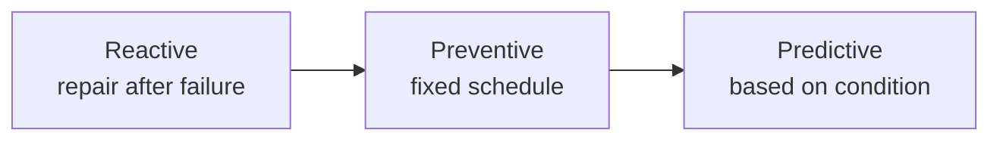
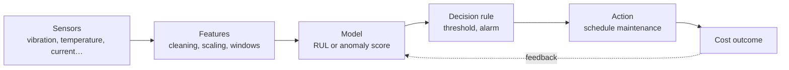
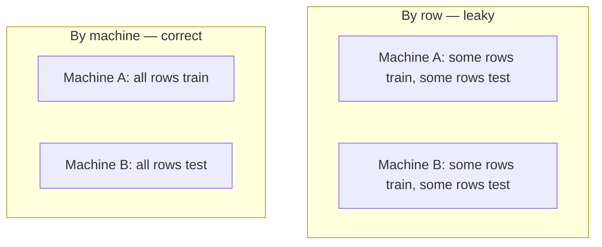
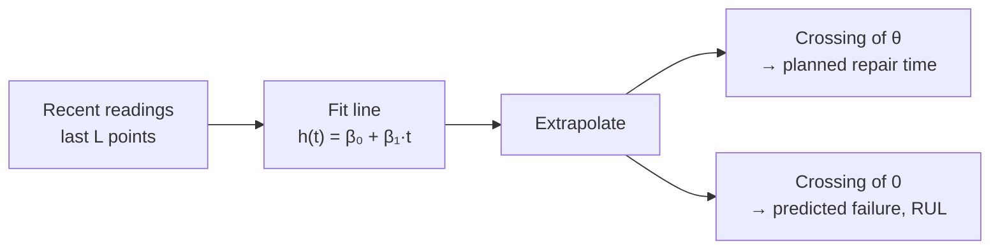
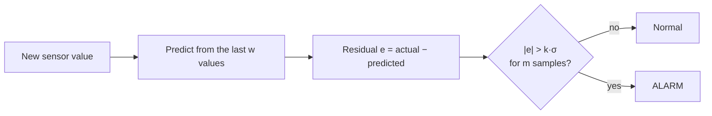
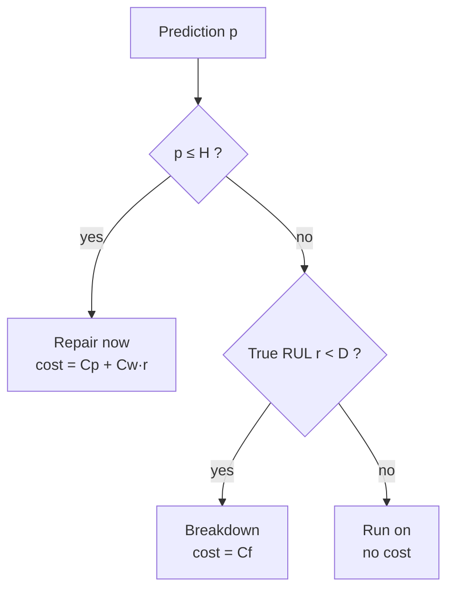
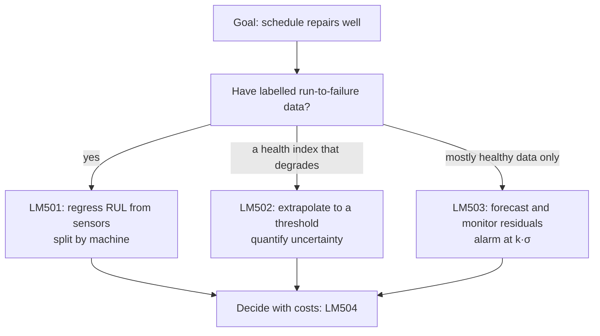

# Chapter 5 · Predictive Maintenance with Linear Models

> **Series:** Linear Models for Engineers · Chapter 5 of 5
> **Prerequisites:** [Chapters 1–4](en-01-linear-intro.md)
> **Interactive labs:** [LM501](https://rathachai.github.io/DA-LAB/learnings/linear/lm501.html) · [LM502](https://rathachai.github.io/DA-LAB/learnings/linear/lm502.html) · [LM503](https://rathachai.github.io/DA-LAB/learnings/linear/lm503.html) · [LM504](https://rathachai.github.io/DA-LAB/learnings/linear/lm504.html)

---

## Learning Objectives

After completing this chapter, you will be able to:

1. Compare **reactive, preventive and predictive** maintenance strategies.
2. Define **Remaining Useful Life (RUL)** and a **health index**, and build a regression model for RUL from sensor data.
3. Split data **by machine** rather than by row, and explain the leakage that row-wise splitting causes.
4. Extrapolate a degradation trend to a **threshold** and quantify the uncertainty of the predicted failure time.
5. Detect developing faults using **residuals** of a forecasting model and a $k\sigma$ alarm rule.
6. Choose decisions using **asymmetric costs**, and explain why the lowest-error model is not always the best.

---

## 5.1 Maintenance Strategies

Every machine eventually degrades. The question is *when* to intervene.

| Strategy | Rule | Weakness |
|----------|------|----------|
| **Reactive** (run-to-failure) | fix it when it breaks | unplanned downtime, collateral damage, safety risk |
| **Preventive** (time-based) | service every fixed interval | wastes useful life; may still miss early failures |
| **Predictive** (condition-based) | service when the *condition* indicates it is needed | needs sensors, data and a trustworthy model |

Predictive maintenance (PdM) aims to repair **just before** failure: late enough to use most of the machine's life, early enough to avoid a breakdown.

**Remaining Useful Life (RUL)** is the time left before a machine can no longer perform its function. A **health index** is a single indicator, such as 100 (like new) to 0 (failed), that summarises condition.

---

## 5.2 Predicting RUL from Sensors (LM501)

The first approach treats RUL as a regression target:

$$
\widehat{\text{RUL}} = \beta_0 + \beta_1\,\text{vibration} + \beta_2\,\text{temperature} + \dots
$$

This is exactly the multiple regression of Chapter 2. The same lessons apply:

- sensors with a **strong correlation** with RUL are valuable;
- **noise** sensors (e.g. a speed reading unrelated to wear) add nothing;
- a sensor that grows **exponentially** with wear (e.g. wear debris) becomes linear after a **log** transform;
- a sensor with a **U-shaped** relationship has $r\approx 0$ yet is related — a linear model cannot use it directly.

### Split by machine, not by row

PdM data contain **many snapshots from each machine**. Snapshots of one machine are near-copies of each other: the same fixture, the same bearings, the same operating habits. Every sensor therefore carries a machine-specific "fingerprint".

| Split | What the test set represents | Result |
|-------|------------------------------|--------|
| **By row** (random rows) | machines already seen in training | optimistic — **leakage** |
| **By machine** (whole machines held out) | **new machines** the model has never seen | honest estimate of field performance |

In deployment, the model will meet machines it has never seen, so the test set must imitate that situation. This is an instance of *group-wise* splitting: the **unit of independence** (the machine), not the row, decides which set a sample belongs to.

### Hands-on: LM501

**[Open LM501 · RUL from Sensors](https://rathachai.github.io/DA-LAB/learnings/linear/lm501.html)**

- A table of **2,400 snapshots** (60 machines × 40) with sensors `s1`–`s7` and the target `y` = RUL (hours).
- The first tab plots every sensor against operating time (normalised to 0–1, hover for names and values), with the RUL as a thicker line; choose one machine or all.
- Select features and **log** transforms, train, and compare train and test MAE/MAPE.
- Switch the split between **By machine (correct)** and **By row (leaky)**, and run the **Leakage demo** (30 random splits of each mode).

---

## 5.3 Degradation Curves and Thresholds (LM502)

Often a more natural question is *when will the health index reach a limit?* Fit a trend to the recent readings and **extrapolate**.

Given the fitted line $h(t)=\beta_0+\beta_1 t$ with $\beta_1<0$:

$$
t_\theta = \frac{\theta-\beta_0}{\beta_1}\quad\text{(plan repair)},\qquad
\hat t_{\text{fail}} = \frac{0-\beta_0}{\beta_1},\qquad
\widehat{\text{RUL}}=\hat t_{\text{fail}}-t_{\text{now}}
$$

where $\theta$ is the **maintenance threshold** (the health level at which you choose to repair).

### The trend model can be wrong in a systematic way

| True wear pattern | Straight-line extrapolation | Consequence |
|-------------------|----------------------------|-------------|
| linear | accurate | ideal case |
| **accelerating** | **too optimistic** — predicts failure too late | breakdown before the planned repair |
| fast early wear that levels off | too pessimistic — predicts failure too early | wasted life |
| late-onset fault | blind to the fault until it starts | surprise failure |

The **fit window** matters: a short window follows recent behaviour but is noisy; a long window is smoother but reacts slowly.

### Uncertainty of the predicted failure time

A fitted line has uncertainty. Using the regression's residual standard deviation $s_r$ over $n$ points, the standard error of the predicted crossing time is approximately

$$
\text{SE}(\hat t)\;\approx\;\frac{s_r}{\lvert\beta_1\rvert}\sqrt{\frac1n+\frac{(\hat t-\bar t)^2}{S_{tt}}},
\qquad S_{tt}=\sum_i (t_i-\bar t)^2 .
$$

The further the extrapolation reaches beyond the data, the larger this uncertainty — **extrapolation is riskier than interpolation**.

### Hands-on: LM502

**[Open LM502 · Degradation Curve and Maintenance Threshold](https://rathachai.github.io/DA-LAB/learnings/linear/lm502.html)**

- Choose a degradation pattern; scrub **now** along the timeline (the model sees only readings up to *now*).
- Fit the trend (gradient descent or exact), read the equation, the predicted failure and the **RUL error** versus the truth.
- A **data table** lists readings, fitted values and residuals; the *RUL prediction over time* chart shows how forecasts improve nearer to failure.
- The **Cost of the decision** card shows the expected cost from the trend's uncertainty and the real outcome; the **cost-versus-threshold** chart marks the best $\theta$.

---

## 5.4 Early Warning from Residuals (LM503)

Sometimes there is no clear degradation curve; instead we want to notice that *something has changed*. The idea:

1. Train a forecasting model (Chapter 4) on the **healthy** part of a signal.
2. In operation, compare each prediction with reality; the **residual** is $e_t=y_t-\hat y_t$.
3. While the machine is healthy, residuals are small and random. When a fault develops, the model's picture of "normal" no longer matches, and residuals grow.

Let $\sigma$ be the standard deviation of the **training** residuals. Raise an alarm when

$$
\lvert e_t\rvert > k\,\sigma \quad\text{for } m \text{ consecutive samples.}
$$

### The threshold trade-off

| Smaller $k$ (sensitive) | Larger $k$ (conservative) |
|-------------------------|---------------------------|
| detects faults sooner | detects faults later, or not at all |
| more **false alarms** (stops that were not needed) | fewer false alarms |

Requiring $m>1$ consecutive exceedances reduces false alarms at the price of a small extra delay. Fault types differ in detectability: a sudden level shift is caught immediately, a growing oscillation after some time, and a **slow drift** is the hardest because a model with a long window may partly follow the drift.

### Hands-on: LM503

**[Open LM503 · Early Warning with a Sliding Window](https://rathachai.github.io/DA-LAB/learnings/linear/lm503.html)**

- Choose a healthy pattern and a fault type (drift, sudden shift, growing variance, bearing-like oscillation); optionally **drag the signal** to inject your own anomaly.
- Set the window $w$, the training fraction, $k$ and $m$; read the **detection delay** and **false-alarm count**.
- The **threshold trade-off** table sweeps $k=1\ldots6$.

---

## 5.5 Decisions and Costs (LM504)

A prediction is only a means to a decision, and decisions have costs that are rarely symmetric.

| Outcome | Cost |
|---------|------|
| **Preventive repair** (needed or not) | repair cost $C_p$, plus the value of the **life wasted** — $C_w$ per unused hour |
| **Breakdown** | breakdown cost $C_f$, typically **much larger** than $C_p$ |
| Run on safely | none |

Consider a fleet where each machine has a true RUL $r$ and a model prediction $p$. A simple policy: *repair now if $p\le H$*; otherwise run until the next inspection $D$ hours later, which fails the machine if $r<D$.

The threshold $H$ trades one error for the other:

- **Low $H$** → few unnecessary repairs, but more breakdowns.
- **High $H$** → few breakdowns, but much wasted life.

Because $C_f \gg C_p$, the cost-minimising $H$ is **higher (more cautious)** than the one that treats both mistakes equally.

### Why the lowest-error model may not win

A model with the lowest RMSE treats over- and under-predictions symmetrically. In PdM an **optimistic** error (predicting more life than exists) risks a breakdown, whereas a **pessimistic** error wastes some life. A slightly pessimistic model — equivalent to a **safety margin** — can therefore have a *higher* RMSE yet a *lower* total cost.

### Expected cost under uncertainty

If the failure time is modelled as $T\sim\mathcal N(\mu,\text{SE}^2)$ and a repair is planned at time $t_p$, the expected cost is

$$
\mathbb E[\text{cost}] = P(T\le t_p)\,C_f \;+\; P(T> t_p)\,C_p \;+\; C_w\,\mathbb E\big[(T-t_p)^+\big].
$$

Plotting this against the threshold $\theta$ gives the characteristic **U-shaped** curve of the cost-versus-threshold charts: too late is expensive because of breakdowns, too early because of wasted life.

### Hands-on: LM504

**[Open LM504 · The Cost of Wrong Predictions](https://rathachai.github.io/DA-LAB/learnings/linear/lm504.html)**

- Simulate a 200-machine fleet; set the prediction noise $\sigma$ and **bias** (positive = optimistic), and spray in extra machines.
- Set the threshold $H$, inspection interval $D$ and the three costs; see outcomes, total cost and the **cost-versus-H** curve.
- **Save scenarios** to compare the *lowest-RMSE* row with the *lowest-cost* row.

---

## 5.6 Putting It Together

| Chapter concept | Where it appears in PdM |
|-----------------|-------------------------|
| Regression, metrics (Ch. 1) | RUL error in hours, MAE, MAPE |
| Feature selection, log transform (Ch. 2) | which sensors, wear-debris exponential growth |
| Train–test split, leakage (Ch. 3) | split by machine, not by row |
| Time series, sliding window (Ch. 4) | forecasting the healthy signal, residual monitoring |

---

## Exercises

1. A bearing's health index is $h(t) = 100 - 0.4\,t$. Compute the planned repair time for $\theta = 30$ and the failure time. What is the RUL at $t = 80$?
2. A machine's wear accelerates exponentially but you extrapolate a straight line. Is the predicted failure early or late? What are the consequences, and what can reduce the risk?
3. In LM503, a larger $k$ reduces false alarms. What is the price? When might you accept it?
4. Explain, with the cost formulas, why a safety margin can lower total cost even though it increases RMSE.
5. A dataset has 5 machines with 200 snapshots each. Why would a random 80/20 *row* split give an over-confident test score? How should you split?
6. Suggest a sensible health index for an electric motor and describe how you would choose its maintenance threshold.

---

## Summary

- Predictive maintenance schedules repair **just in time**; it needs a model **and** a decision rule.
- **RUL regression** uses the multiple-regression toolkit; **split by machine** to avoid leakage.
- **Degradation extrapolation** gives repair and failure times; honest predictions include **uncertainty**, and biased trend models mislead.
- **Residual monitoring** detects change without labelled failures; $k$ and $m$ balance sensitivity and false alarms.
- With **asymmetric costs**, the best decision threshold is more cautious than the lowest-error model suggests.

**Previous:** [Chapter 4 · Time Series](en-04-time-series.md)

---

Powered by: Sonnet &nbsp;|&nbsp; AI Whisperer: [rathachai.github.io](https://rathachai.github.io)
