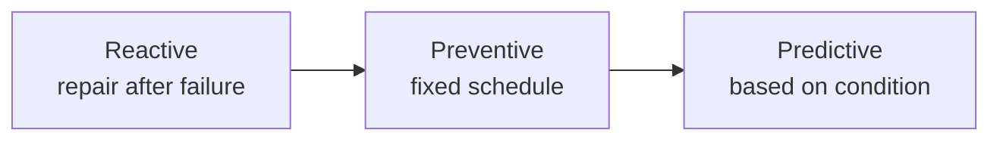
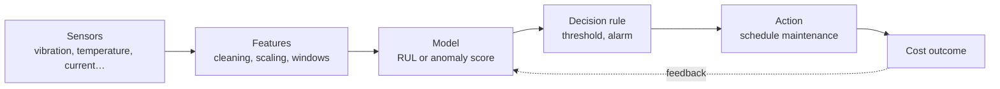
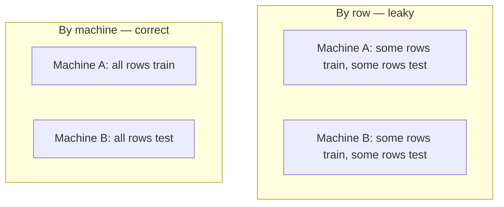
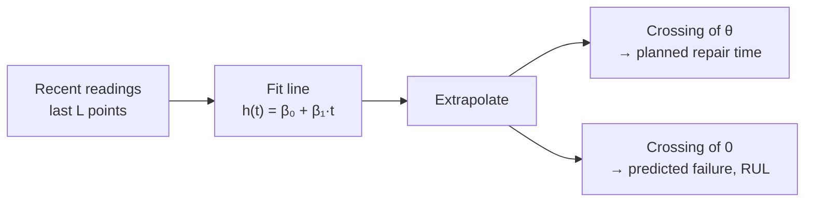
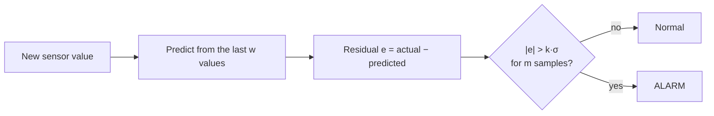
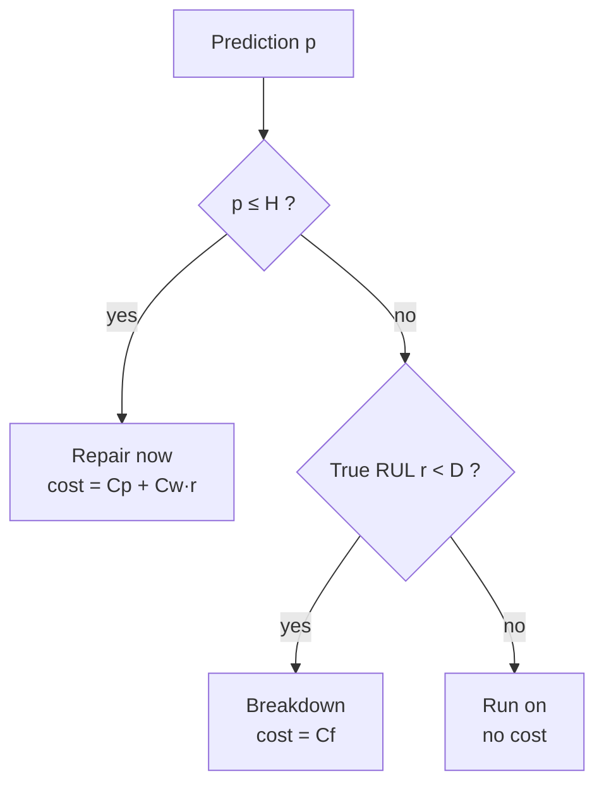
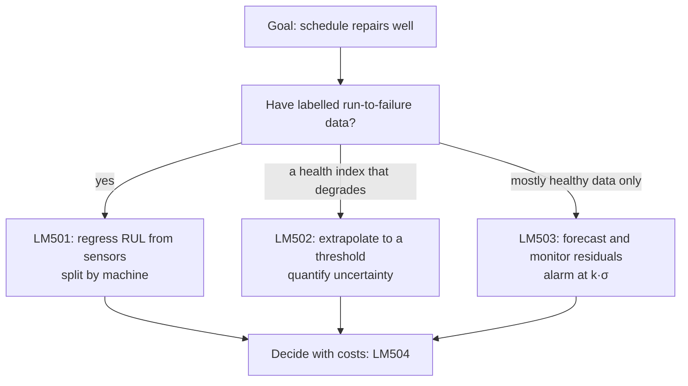

# Chapter 5 · Predictive Maintenance with Linear Models

> **Series:** Linear Models for Engineers · Chapter 5 of 5
> **Prerequisites:** [Chapters 1–4](en-01-linear-intro.md)
> **Interactive labs:** [LM501](https://rathachai.github.io/DA-LAB/learnings/linear/lm501.html) · [LM502](https://rathachai.github.io/DA-LAB/learnings/linear/lm502.html) · [LM503](https://rathachai.github.io/DA-LAB/learnings/linear/lm503.html) · [LM504](https://rathachai.github.io/DA-LAB/learnings/linear/lm504.html)

---

## Learning Objectives

After completing this chapter, you will be able to:

1. Compare **reactive, preventive and predictive** maintenance strategies.
2. Define **Remaining Useful Life (RUL)** (how many hours a machine has left) and a **health index** (one number that says how healthy it is), and build a regression model for RUL from sensor data.
3. Split data **by machine** rather than by row, and explain the **leakage** (the test "peeks" at the training data) that row-wise splitting causes.
4. Extrapolate a degradation trend to a **threshold** (a limit you choose) and quantify the uncertainty of the predicted failure time.
5. Detect developing faults using **residuals** (prediction errors) of a forecasting model and a $k\sigma$ alarm rule, the same idea as a control chart.
6. Choose decisions using **asymmetric costs** (one mistake costs far more than the other), and explain why the lowest-error model is not always the best.

> **Key idea**
> A prediction is only useful if it leads to a better decision. This chapter links two things: a *model* that estimates condition, and a *decision rule* that turns the estimate into "repair now" or "keep running".

---

## 5.1 Maintenance Strategies

Every machine eventually degrades: bearings wear, belts stretch, insulation ages. The question is *when* to intervene.

| Strategy | Rule | Weakness |
|----------|------|----------|
| **Reactive** (run-to-failure) | fix it when it breaks | unplanned downtime, collateral damage, safety risk |
| **Preventive** (time-based) | service every fixed interval | wastes useful life; may still miss early failures |
| **Predictive** (condition-based) | service when the *condition* indicates it is needed | needs sensors, data and a trustworthy model |

**Predictive maintenance (PdM)** means using sensor data to decide *when* to repair a machine. The aim is to repair **just before** failure: late enough to use most of the machine's life, early enough to avoid a breakdown.

> **Engineering analogy**
> Think of a car. *Reactive*: you drive until the engine stops. *Preventive*: you change the oil every 10,000 km, whatever the oil looks like. *Predictive*: a sensor measures the oil quality and tells you when it is actually worn out. In a plant, predictive maintenance is the data version of **condition monitoring** by vibration analysis: you service the pump because its vibration signature changed, not because the calendar says so.

Two terms are used throughout the chapter.

- **Remaining Useful Life (RUL)** is the time left before a machine can no longer do its job. It is the *"how many km left?"* reading of a **fuel gauge**, but for hours of operation. Example: a pump with an RUL of 200 h can run about 200 more hours.
- A **health index** is one number that summarises condition, for example 100 (like new) down to 0 (failed). It plays the role of the dial on a gauge. Engineers build it by combining sensor readings such as vibration, temperature and motor current.

> **Key idea**
> RUL is a *forecast*, not a measurement. Nobody can read it directly from the machine. We estimate it from sensors, and the estimate always has an error.

---

## 5.2 Predicting RUL from Sensors (LM501)

The first approach treats RUL as an ordinary regression target. A **regression model** is a formula that predicts one number from several others:

$$
\widehat{\text{RUL}} = \beta_0 + \beta_1\,\text{vibration} + \beta_2\,\text{temperature} + \dots
$$

In plain words: *predicted remaining life equals a base value, plus a weight times the vibration reading, plus a weight times the temperature reading, and so on.* The hat on $\widehat{\text{RUL}}$ means "estimate". The $\beta_0$ is the base value (hours), and each $\beta_j$ is a weight in hours per unit of that sensor, found from past run-to-failure data. This is exactly the multiple regression of Chapter 2. A small numeric example (invented numbers): with $\beta_0=600$ h, $\beta_1=-80$ h per mm/s and a vibration of 4 mm/s, the model predicts $600-80\times 4=280$ h of remaining life.

The same lessons apply:

- sensors with a **strong correlation** with RUL are valuable;
- **noise** sensors (e.g. a speed reading unrelated to wear) add nothing;
- a sensor that grows **exponentially** with wear (e.g. wear debris) becomes linear after a **log** transform, in the same way a log scale straightens an exponential curve on semi-log paper;
- a sensor with a **U-shaped** relationship has a correlation $r\approx 0$ yet is clearly related to RUL. A straight-line model cannot use it directly.

### Split by machine, not by row

To judge a model honestly, we hold back some data as a **test set** that the model never sees during training. How we pick that test set matters a great deal.

PdM data contain **many snapshots from each machine**. Snapshots of one machine are near-copies of each other: the same fixture, the same bearings, the same operating habits. Every sensor therefore carries a machine-specific "fingerprint".

| Split | What the test set represents | Result |
|-------|------------------------------|--------|
| **By row** (random rows) | machines already seen in training | optimistic: **leakage** |
| **By machine** (whole machines held out) | **new machines** the model has never seen | honest estimate of field performance |

**Leakage** means information from the test data sneaks into training, so the test score looks better than reality. With a row split, the model has already seen the "fingerprint" of Machine A in training, so it can recognise Machine A's test rows easily.

> **Engineering analogy**
> Imagine you calibrate a strain-gauge model on bridge girder A and then "validate" it on other readings from girder A. It will look excellent. The real question is whether it works on girder B, which you have never measured. A **group split** (here, split by machine) validates on girder B.

In deployment, the model will meet machines it has never seen, so the test set must imitate that situation. The **unit of independence** (the machine, not the row) decides which set a sample belongs to.

> **Common mistake**
> Shuffling all rows and taking 80 % for training. The score looks great, then drops sharply on the first new machine in the plant.

### Hands-on: LM501

**[Open LM501 · RUL from Sensors](https://rathachai.github.io/DA-LAB/learnings/linear/lm501.html)**

- A table of **2,400 snapshots** (60 machines × 40) with sensors `s1`–`s7` and the target `y` = RUL (hours).
- The first tab plots every sensor against operating time (normalised to 0–1, hover for names and values), with the RUL as a thicker line; choose one machine or all.
- Select features and **log** transforms, train, and compare train and test MAE/MAPE (mean absolute error, and the same error as a percentage).
- Switch the split between **By machine (correct)** and **By row (leaky)**, and run the **Leakage demo** (30 random splits of each mode).

---

## 5.3 Degradation Curves and Thresholds (LM502)

Often a more natural question is: *when will the health index reach a limit?* A **degradation curve** is the plot of the health index against time as the machine wears. To answer the question, fit a straight line to the recent readings and **extrapolate** it, which means extending the line beyond the data into the future.

> **Engineering analogy**
> This is how you estimate fatigue life from crack growth, or how a fuel gauge predicts range: take the current rate of consumption and project it forward until the tank is empty.

### A worked example by hand

A bearing's health index is 80 at time $t=100$ h and is falling by 0.4 points per hour. We choose to repair when the index reaches $\theta=50$ (the **maintenance threshold**, the health level at which we decide to repair). The line is

$$
h(t)=80-0.4\,(t-100)=120-0.4\,t,
$$

so $\beta_0=120$ and $\beta_1=-0.4$ points per hour.

- Repair time: $50 = 120-0.4\,t \Rightarrow t=(50-120)/(-0.4)=175$ h. That is 75 h from now.
- Failure time (index $=0$): $t=120/0.4=300$ h.
- RUL now: $300-100=200$ h.

Now the general formulas. Given the fitted line $h(t)=\beta_0+\beta_1 t$ with $\beta_1<0$:

$$
t_\theta = \frac{\theta-\beta_0}{\beta_1}\quad\text{(plan repair)},\qquad
\hat t_{\text{fail}} = \frac{0-\beta_0}{\beta_1},\qquad
\widehat{\text{RUL}}=\hat t_{\text{fail}}-t_{\text{now}}
$$

In plain words: *solve the line equation for the time at which the index hits the threshold (repair) or hits zero (failure); the RUL is the failure time minus today's time.* Symbols:

| Symbol | Meaning | Unit |
|--------|---------|------|
| $h(t)$ | health index at time $t$ | points (0–100) |
| $\beta_0$ | intercept, the line's value at $t=0$ | points |
| $\beta_1$ | slope, change of index per hour (negative while wearing) | points/h |
| $\theta$ | maintenance threshold | points |
| $t_\theta$ | time the line crosses $\theta$ | h |
| $\hat t_{\text{fail}}$ | predicted failure time (the hat means "estimated") | h |
| $t_{\text{now}}$ | present time | h |

### The trend model can be wrong in a systematic way

A straight line assumes the wear rate stays constant. Real wear often does not. Compare with the **bathtub curve** of reliability: early failures, a flat useful-life period, then rising wear-out failures.

| True wear pattern | Straight-line extrapolation | Consequence |
|-------------------|----------------------------|-------------|
| linear | accurate | ideal case |
| **accelerating** | **too optimistic**: predicts failure too late | breakdown before the planned repair |
| fast early wear that levels off | too pessimistic: predicts failure too early | wasted life |
| late-onset fault | blind to the fault until it starts | surprise failure |

> **Common mistake**
> Trusting the straight line without checking its shape. Crack growth and bearing spalling usually *accelerate*, so a linear forecast tends to promise more life than the machine really has.

The **fit window** (how many recent points $L$ you use) matters: a short window follows recent behaviour but is noisy; a long window is smoother but reacts slowly.

### Uncertainty of the predicted failure time

A fitted line is never exact, so the crossing time is not exact either. Engineers state this as a **standard error** (SE): a typical size of the error in the prediction, like the $\pm$ on a measurement. For this chapter, the formula below is **optional reading**; the sentences after it give the idea.

Let $s_r$ be the **residual standard deviation** (how far the readings scatter around the fitted line, in index points), $n$ the number of points in the window, and $\bar t$ the average time of those points. Then the standard error of the predicted crossing time is approximately

$$
\text{SE}(\hat t)\;\approx\;\frac{s_r}{\lvert\beta_1\rvert}\sqrt{\frac1n+\frac{(\hat t-\bar t)^2}{S_{tt}}},
\qquad S_{tt}=\sum_i (t_i-\bar t)^2 .
$$

In plain words: *take the scatter of the data, convert it from "index points" to "hours" by dividing by the slope, and then enlarge it by a factor that grows the farther the predicted time $\hat t$ lies from the middle of the data.* Here $S_{tt}$ (hours$^2$) measures how spread out the time points are, and $\hat t$ is the predicted crossing time (h).

Number example: a window of $n=20$ hourly readings (times 81 to 100 h, so $\bar t=90.5$ h and $S_{tt}\approx 665\ \text{h}^2$), scatter $s_r=2$ points, slope $|\beta_1|=0.4$ points/h, and predicted failure at $\hat t=300$ h.

- $s_r/|\beta_1| = 2/0.4 = 5$ h.
- $(\hat t-\bar t)^2/S_{tt} = 209.5^2/665 \approx 66$, and $1/n=0.05$, so the square root is $\sqrt{66.05}\approx 8.1$.
- $\text{SE}\approx 5\times 8.1\approx 41$ h.

So the failure is predicted at 300 h, give or take about 41 h. The big factor 8.1 comes from looking about 210 h beyond the centre of a 20 h window.

> **Key idea**
> **Extrapolation is riskier than interpolation.** The farther you project beyond your data, the wider the uncertainty. A forecast "300 h" without a $\pm$ is as incomplete as a measurement without a tolerance.

### Hands-on: LM502

**[Open LM502 · Degradation Curve and Maintenance Threshold](https://rathachai.github.io/DA-LAB/learnings/linear/lm502.html)**

- Choose a degradation pattern; scrub **now** along the timeline (the model sees only readings up to *now*).
- Fit the trend (gradient descent or exact), read the equation, the predicted failure and the **RUL error** versus the truth.
- A **data table** lists readings, fitted values and residuals; the *RUL prediction over time* chart shows how forecasts improve nearer to failure.
- The **Cost of the decision** card shows the expected cost from the trend's uncertainty and the real outcome; the **cost-versus-threshold** chart marks the best $\theta$.

---

## 5.4 Early Warning from Residuals (LM503)

Sometimes there is no clear degradation curve; instead we want to notice that *something has changed*. This is the idea behind a **control chart** in statistical process control (SPC), where a point outside the 3-sigma limits signals that the process has shifted.

The method:

1. Train a forecasting model (Chapter 4) on the **healthy** part of a signal. It learns what "normal" looks like.
2. In operation, compare each prediction with reality. The **residual** is the prediction error: $e_t=y_t-\hat y_t$, where $y_t$ is the actual reading at time $t$ and $\hat y_t$ is the model's forecast (both in sensor units, e.g. mm/s).
3. While the machine is healthy, residuals are small and random. When a fault develops, the model's picture of "normal" no longer matches, and residuals grow.

Let $\sigma$ ("sigma", the **standard deviation** of the *training* residuals, i.e. the typical size of a healthy error) set the scale. Raise an alarm when

$$
\lvert e_t\rvert > k\,\sigma \quad\text{for } m \text{ consecutive samples.}
$$

In plain words: *raise the alarm when the error is larger than $k$ times its normal size, and stays that large for $m$ samples in a row.* Here $k$ is a multiplier you choose (a common choice is 3, as in "3-sigma limits") and $m$ is the number of consecutive samples required (a count, unitless). This is the **$k\sigma$ rule**.

Number example: a healthy vibration forecast has $\sigma=0.5$ mm/s. With $k=3$ the alarm limit is $3\times 0.5=1.5$ mm/s. With $m=3$, the residuals 0.3, 0.8, 1.7, 1.9, 2.2 mm/s give: 1.7 exceeds the limit (count 1), 1.9 (count 2), 2.2 (count 3), so the alarm sounds at the fifth sample. A single spike of 1.7 mm/s followed by 0.4 mm/s would **not** trigger it.

The window $w$ is how many recent values the forecasting model uses to make its prediction.

### The threshold trade-off

A **false alarm** is an alarm when nothing is wrong, such as a needless line stop. A *missed* or late detection is the opposite error. You choose $k$ to balance the two.

| Smaller $k$ (sensitive) | Larger $k$ (conservative) |
|-------------------------|---------------------------|
| detects faults sooner | detects faults later, or not at all |
| more **false alarms** (stops that were not needed) | fewer false alarms |

Requiring $m>1$ consecutive exceedances reduces false alarms at the price of a small extra delay. Fault types differ in detectability: a sudden level shift is caught immediately, a growing oscillation after some time, and a **slow drift** is the hardest because a model with a long window may partly follow the drift.

> **Engineering analogy**
> On a control chart, $\pm 3\sigma$ limits give about 1 false signal in 370 points for a stable process. Tightening to $\pm 2\sigma$ catches shifts sooner but cries wolf more often. Choosing $k$ is the same trade-off.

> **Common mistake**
> Computing $\sigma$ from data that already include the fault. Use only healthy training data, otherwise the limits become too wide and the fault hides inside them.

### Hands-on: LM503

**[Open LM503 · Early Warning with a Sliding Window](https://rathachai.github.io/DA-LAB/learnings/linear/lm503.html)**

- Choose a healthy pattern and a fault type (drift, sudden shift, growing variance, bearing-like oscillation); optionally **drag the signal** to inject your own anomaly.
- Set the window $w$, the training fraction, $k$ and $m$; read the **detection delay** and **false-alarm count**.
- The **threshold trade-off** table sweeps $k=1\ldots6$.

---

## 5.5 Decisions and Costs (LM504)

A prediction is only a means to a decision, and decisions have costs that are rarely symmetric. **Asymmetric cost** means one kind of mistake is far more expensive than the other.

> **Engineering analogy**
> A **safety factor** works the same way. We design a shaft stronger than the calculated load, because an overloaded shaft breaks (very costly) while an oversized shaft only costs a little extra steel. Likewise, in spare-parts and warranty planning we keep a stock margin because a stock-out costs more than a few extra parts on the shelf.

| Outcome | Cost |
|---------|------|
| **Preventive repair** (needed or not) | repair cost $C_p$, plus the value of the **life wasted**: $C_w$ per unused hour |
| **Breakdown** | breakdown cost $C_f$, typically **much larger** than $C_p$ |
| Run on safely | none |

Symbols: $C_p$ is the cost of a planned repair, $C_f$ the cost of a breakdown (both in currency), and $C_w$ the value of one hour of life thrown away (currency per hour).

Example numbers: $C_p=1{,}000$, $C_f=10{,}000$ and $C_w=20$ per hour. A machine with a true RUL of 100 h that is repaired now costs $1{,}000+20\times100=3{,}000$. If it breaks down instead, it costs $10{,}000$. If it runs on safely, it costs nothing.

Consider a fleet where each machine has a true RUL $r$ (hours, known only afterwards) and a model prediction $p$ (hours). A simple policy: *repair now if $p\le H$*, where $H$ is the **decision threshold** in hours. Otherwise run until the next inspection $D$ hours later (the inspection interval). The machine fails in between if $r<D$.

The threshold $H$ trades one error for the other:

- **Low $H$** → few unnecessary repairs, but more breakdowns.
- **High $H$** → few breakdowns, but much wasted life.

Because $C_f \gg C_p$, the cost-minimising $H$ is **higher (more cautious)** than the one that treats both mistakes equally.

### Why the lowest-error model may not win

**RMSE** (root-mean-square error) is a typical size of the prediction error in hours. A model with the lowest RMSE treats over- and under-predictions symmetrically. In PdM an **optimistic** error (predicting more life than exists) risks a breakdown, whereas a **pessimistic** error wastes some life. A slightly pessimistic model, which builds in a **bias** or safety margin (a deliberate shift of predictions toward the safe side), can therefore have a *higher* RMSE yet a *lower* total cost.

> **Key idea**
> Do not pick the model with the smallest error. Pick the model, and the threshold, with the smallest **total cost**. A safety margin is engineering judgement under uncertainty: you accept a small, certain loss to avoid a rare, large one.

### Expected cost under uncertainty

**Expected cost** is the average cost you would pay if the same decision were repeated many times: each possible outcome's cost multiplied by its probability, then added up. This part is **optional reading** for the formula; the table that follows gives the same message in numbers.

Suppose the true failure time $T$ is uncertain and follows a bell curve (a normal distribution) with mean $\mu$ and standard deviation $\text{SE}$ (the standard error from Section 5.3). If a repair is planned at time $t_p$, the expected cost is

$$
\mathbb E[\text{cost}] = P(T\le t_p)\,C_f \;+\; P(T> t_p)\,C_p \;+\; C_w\,\mathbb E\big[(T-t_p)^+\big].
$$

In plain words: *(chance the machine fails before the repair) × (breakdown cost), plus (chance it is still alive at the repair) × (repair cost), plus (hours of life left unused, on average) × (value per hour).* The notation $(T-t_p)^+$ means "$T-t_p$ if positive, otherwise 0", so it counts only the unused hours.

Number example with $C_p=1{,}000$, $C_f=10{,}000$, $C_w=20$ per hour (the unused-hours figures are approximate):

| Plan the repair | $P(T\le t_p)$ | Average unused life (h) | Expected cost |
|-----------------|---------------|-------------------------|---------------|
| Early | 2 % | 120 | $0.02\times10{,}000+0.98\times1{,}000+20\times120=3{,}580$ |
| Middle | 10 % | 60 | $0.10\times10{,}000+0.90\times1{,}000+20\times60=3{,}100$ |
| Late | 50 % | 16 | $0.50\times10{,}000+0.50\times1{,}000+20\times16=5{,}820$ |

The middle plan is cheapest. Waiting longer saves unused life but breakdowns dominate; repairing earlier is safe but wasteful. Plotting this against the threshold $\theta$ gives the characteristic **U-shaped** curve of the cost-versus-threshold charts: too late is expensive because of breakdowns, too early because of wasted life. Note that the best plan accepts a 10 % breakdown risk, not 0 %, because zero risk would cost more in wasted life.

### Hands-on: LM504

**[Open LM504 · The Cost of Wrong Predictions](https://rathachai.github.io/DA-LAB/learnings/linear/lm504.html)**

- Simulate a 200-machine fleet; set the prediction noise $\sigma$ and **bias** (positive = optimistic), and spray in extra machines.
- Set the threshold $H$, inspection interval $D$ and the three costs; see outcomes, total cost and the **cost-versus-H** curve.
- **Save scenarios** to compare the *lowest-RMSE* row with the *lowest-cost* row.

---

## 5.6 Putting It Together

| Chapter concept | Where it appears in PdM |
|-----------------|-------------------------|
| Regression, metrics (Ch. 1) | RUL error in hours, MAE, MAPE |
| Feature selection, log transform (Ch. 2) | which sensors, wear-debris exponential growth |
| Train–test split, leakage (Ch. 3) | split by machine, not by row |
| Time series, sliding window (Ch. 4) | forecasting the healthy signal, residual monitoring |

---

## Summary

- Predictive maintenance schedules repair **just in time**; it needs a model **and** a decision rule.
- **RUL regression** uses the multiple-regression toolkit; **split by machine** to avoid leakage.
- **Degradation extrapolation** gives repair and failure times; honest predictions include **uncertainty** (a $\pm$), and biased trend models mislead.
- **Residual monitoring** detects change without labelled failures, like a control chart; $k$ and $m$ balance sensitivity and false alarms.
- With **asymmetric costs**, the best decision threshold is more cautious than the lowest-error model suggests.

### Key terms

| Term | Plain-language meaning | Engineering comparison |
|------|------------------------|------------------------|
| Predictive maintenance | repair when sensor data say it is needed | condition monitoring by vibration analysis |
| Remaining Useful Life (RUL) | hours of operation left before failure | "km left" on a fuel gauge; remaining fatigue life |
| Health index | one number (e.g. 100 to 0) for machine condition | the dial of a gauge |
| Degradation curve | health index plotted against time | wear-out region of the bathtub curve |
| Threshold ($\theta$, $H$) | the limit at which you choose to act | alarm setpoint |
| Extrapolation | extending a trend beyond the data | projecting crack growth forward |
| Standard error (SE) | typical size of the error in a prediction | the $\pm$ tolerance on a measurement |
| Leakage | test data secretly resemble the training data, so scores look too good | validating a model on the same girder it was calibrated on |
| Group split | keep all rows of one machine in the same set | validate on a new bridge, not the same one |
| Residual | actual value minus predicted value | deviation from the control-chart centre line |
| Alarm ($k\sigma$ rule) | alarm if the residual is above $k$ times its normal size for $m$ samples | 3-sigma control limits |
| False alarm | alarm when nothing is wrong | needless line stop |
| Asymmetric cost | one error costs much more than the other | safety factor: oversizing is cheap, failure is not |
| Expected cost | probability-weighted average cost of a decision | insurance and warranty-reserve calculation |
| Bias / safety margin | deliberately shifting predictions to the safe side | design margin on load |

**Previous:** [Chapter 4 · Time Series](en-04-time-series.md)

---

Powered by: Sonnet &nbsp;|&nbsp; AI Whisperer: [rathachai.github.io](https://rathachai.github.io)
