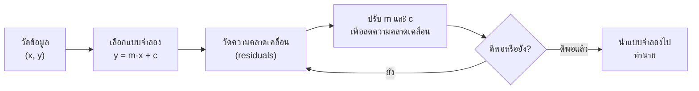
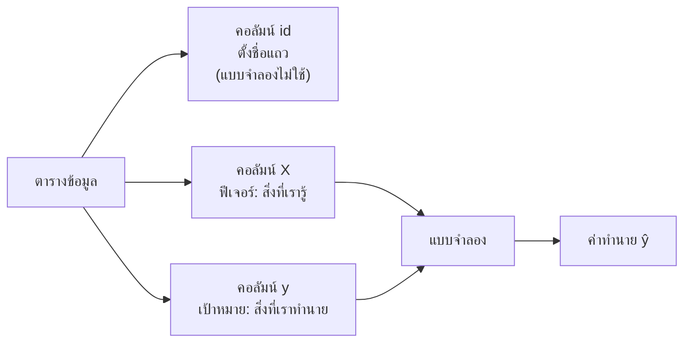
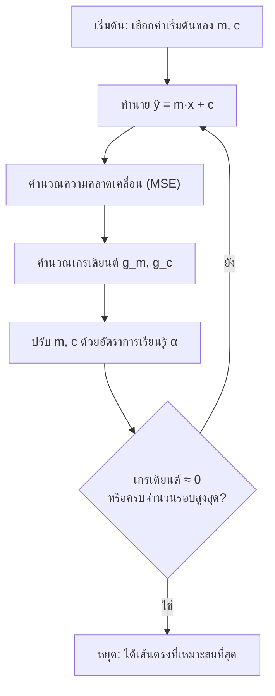

# บทที่ 1 · แนะนำแบบจำลองเชิงเส้น

> **ความรู้พื้นฐาน:** พีชคณิตระดับมัธยมปลาย และแนวคิดเรื่องค่าเฉลี่ย
> **แล็บเชิงโต้ตอบ:** [LM101](https://rathachai.github.io/DA-LAB/learnings/linear/lm101.html)

---

## วัตถุประสงค์การเรียนรู้

เมื่อเรียนจบบทนี้ ผู้เรียนจะสามารถ

1. อ่าน **ตารางข้อมูล** (data table) และระบุคอลัมน์ได้ 3 ประเภท คือ `id`, `X` (ตัวแปรต้น/ฟีเจอร์ คือค่าที่วัดมาเป็นอินพุต) และ `y` (ตัวแปรเป้าหมาย คือปริมาณที่ต้องการทำนาย)
2. เรียกชื่อองค์ประกอบทุกตัวของสมการเชิงเส้น $\hat y = m x + c$ และอธิบายความหมายพร้อมหน่วยได้
3. อธิบายได้ว่า **ค่าคลาดเคลื่อนส่วนเหลือ** (residual คือความผิดพลาดที่เหลืออยู่ที่จุดข้อมูลหนึ่งจุด) คืออะไร และเหตุใดจึงต้องทำให้ผลรวมกำลังสองของค่านี้น้อยที่สุด
4. แยกความแตกต่างระหว่าง **พารามิเตอร์** (parameter คือตัวเลขที่คอมพิวเตอร์เรียนรู้เอง) กับ **ไฮเปอร์พารามิเตอร์** (hyperparameter คือค่าตั้งที่วิศวกรเป็นผู้เลือก) และอธิบายบทบาทของอัตราการเรียนรู้ (learning rate หรือขนาดก้าว) ได้
5. หาเส้นตรงที่เหมาะสมที่สุดได้ทั้งด้วยสูตรเฉพาะ (closed-form) และด้วย **เกรเดียนต์ดีเซนต์** (gradient descent คือการค้นหาแบบเดินลงเขาทีละก้าว โดยไม่จำเป็นต้องใช้แคลคูลัสในการนำไปใช้)
6. คำนวณและตีความ **MAE, RMSE, MAPE, MSE** และ **R²** ซึ่งเป็นวิธีให้คะแนนความคลาดเคลื่อนที่แตกต่างกัน
7. ระบุ **ข้อสมมติ** (assumption) ที่อยู่เบื้องหลังการถดถอยเชิงเส้นได้

---

## 1.1 ทำไมต้องใช้แบบจำลองเชิงเส้น

วิศวกรมักตั้งคำถามในรูปแบบ *"ถ้าเปลี่ยนสิ่งนี้ แล้วสิ่งนั้นจะเปลี่ยนไปอย่างไร"* เช่น อุณหภูมิของมอเตอร์สูงขึ้นเท่าใดเมื่อภาระเพิ่มขึ้น ระยะเบรกเปลี่ยนไปอย่างไรตามความเร็ว หรือค่าที่อ่านจากเซนเซอร์คลาดเคลื่อน (drift) ไปตามอายุการใช้งานมากเพียงใด

**แบบจำลองเชิงเส้น** (linear model) คือคำตอบที่ง่ายที่สุดแต่ใช้งานได้จริง โดยสมมติว่าเอาต์พุตเปลี่ยนไปเป็นปริมาณคงที่ทุกครั้งที่อินพุตเปลี่ยนไปหนึ่งหน่วย ผู้เรียนรู้จักความสัมพันธ์เชิงเส้นมาแล้วหลายอย่าง เช่น

- **กฎของฮุก** (Hooke's law): แรง = ความแข็ง × ระยะยืด
- **เส้นสอบเทียบของสเตรนเกจหรือเซนเซอร์:** ความสัมพันธ์ระหว่างแรงดันไฟฟ้ากับน้ำหนักบรรทุก
- **ความต้านทานของโลหะในช่วงอุณหภูมิแคบๆ:** $R = R_0 (1 + \alpha \Delta T)$

การเรียนรู้ของเครื่อง (machine learning: ML) เพิ่มแนวคิดใหม่เพียงอย่างเดียว คือ แทนที่จะมีคนบอกค่าคงที่ให้ คอมพิวเตอร์จะ **หาค่าเหล่านั้นจากข้อมูลที่วัดได้** ซึ่งก็คืองานเดียวกับการลากเส้นสอบเทียบที่ดีที่สุดผ่านค่าที่อ่านได้ในห้องปฏิบัติการนั่นเอง

แบบจำลองเชิงเส้นได้รับความนิยมเพราะ

- **ตีความได้**: สัมประสิทธิ์ทุกตัวมีความหมายทางกายภาพและมีหน่วย
- **รวดเร็ว**: หาค่าได้ด้วยการคำนวณเลขคณิตเพียงไม่กี่ขั้นตอน
- **เป็นรากฐาน**: โครงข่ายประสาทเทียม การถดถอยโลจิสติก และแบบจำลองอนุกรมเวลา ล้วนต่อยอดจากแนวคิดเดียวกันนี้

> **แนวคิดสำคัญ** *การปรับแบบจำลองให้เข้ากับข้อมูล* (fitting a model) หมายถึงการเลือกตัวเลขภายในสมการ เพื่อให้สมการสอดคล้องกับข้อมูลที่วัดได้มากที่สุด ทุกเรื่องในบทนี้คือวิธีทำเช่นนั้น และวิธีตรวจสอบว่าสอดคล้องกันมากเพียงใด

ให้อ่านวงวนข้างต้นเป็นขั้นตอนการจูนระบบ ซึ่งคล้ายการจูนตัวควบคุม คือลองตั้งค่า วัดความคลาดเคลื่อน ปรับ แล้วทำซ้ำจนความคลาดเคลื่อนอยู่ในระดับที่ยอมรับได้

---

## 1.2 ตารางข้อมูล: `id`, `X` และ `y`

ปัญหาการเรียนรู้ของเครื่องทุกปัญหาเริ่มจาก **ตาราง** ของค่าที่วัดได้ แต่ละ **แถว** คือ **ตัวอย่าง** (sample หรือเรียกว่าข้อสังเกต/เรคคอร์ด) หนึ่งรายการ ได้แก่การวัดหนึ่งครั้ง เครื่องจักรหนึ่งเครื่อง หรือช่วงเวลาหนึ่งขณะ ส่วนแต่ละ **คอลัมน์** คือปริมาณที่วัดหนึ่งชนิด โดยคอลัมน์มีบทบาทต่างกัน 3 แบบ

| บทบาท | สัญลักษณ์ | ความหมาย | ใช้ปรับแบบจำลองหรือไม่ |
|------|--------|---------|------------------------|
| **`id`** | – | ป้ายที่ระบุแถว (เลขแถว รหัสเครื่องจักร หรือเวลา) | **ไม่ใช้**: ทำหน้าที่เพียงตั้งชื่อแถว |
| **`X`** (ฟีเจอร์) | $x_1, x_2,\dots,x_p$ | อินพุตที่เรา **รู้** และใช้ทำนาย *ฟีเจอร์* (feature) ก็คือค่าที่วัดมาเป็นอินพุตนั่นเอง | **ใช้**: แบบจำลองอ่านค่าเหล่านี้ |
| **`y`** (ตัวแปรเป้าหมาย) | $y$ | เอาต์พุตที่เราต้องการ **ทำนาย** ในข้อมูลย้อนหลังนี่คือคำตอบที่ถูกต้อง | **ใช้**: แบบจำลองเรียนรู้เพื่อให้ได้ค่านี้ |

ตัวอย่างขนาดเล็ก: ทำนายอุณหภูมิขดลวดของมอเตอร์จากภาระที่ใช้

| `id` | `x` = ภาระ (kW) | `y` = อุณหภูมิ (°C) |
|------|-----------------|------------------------|
| 1 | 10 | 52 |
| 2 | 20 | 61 |
| 3 | 30 | 68 |
| 4 | 40 | 80 |
| 5 | 50 | 88 |

เราจะใช้ตารางนี้เป็นตัวอย่างหลักตลอดทั้งบท หากเขียนกราฟจะได้จุดห้าจุดที่เรียงสูงขึ้นโดยประมาณตามเส้นตรง เหมือนเส้นโค้งสอบเทียบที่มีการกระจายเล็กน้อย

เมื่อมีหลายฟีเจอร์ ตารางก็เพียงมีคอลัมน์เพิ่มขึ้น ฟีเจอร์ทั้งหมดรวมกันเขียนเป็น **เมทริกซ์** (matrix คือตารางตัวเลขสี่เหลี่ยม) $X$ ที่มี $n$ แถว (ตัวอย่าง) และ $p$ คอลัมน์ (ฟีเจอร์) ส่วนตัวแปรเป้าหมาย $y$ เป็น **เวกเตอร์คอลัมน์** (column vector คือตัวเลขหนึ่งคอลัมน์) ที่เก็บคำตอบ $n$ ค่า

| `id` | $x_1$ | $x_2$ | $\dots$ | $x_p$ | $y$ |
|------|-------|-------|---------|-------|-----|
| 1 | $x_{11}$ | $x_{12}$ | $\dots$ | $x_{1p}$ | $y_1$ |
| 2 | $x_{21}$ | $x_{22}$ | $\dots$ | $x_{2p}$ | $y_2$ |
| $\vdots$ | | | | | |
| $n$ | $x_{n1}$ | $x_{n2}$ | $\dots$ | $x_{np}$ | $y_n$ |

พูดง่ายๆ: $x_{ij}$ หมายถึง "ค่าของฟีเจอร์ที่ $j$ ในตัวอย่าง (แถว) ที่ $i$"

ข้อควรระวังเชิงปฏิบัติ 3 ประการ

1. **`id` ไม่ใช่ฟีเจอร์** เลขแถวไม่มีข้อมูลทางกายภาพใดๆ หากแบบจำลองให้น้ำหนักแก่ค่านี้มาก นั่นเป็นเพียงความบังเอิญ
2. **`y` ต้องไม่ถูกใช้เป็นอินพุต** การนำตัวแปรเป้าหมายมาเป็นฟีเจอร์ ทำให้แบบจำลอง "ทำนาย" คำตอบที่ถูกส่งให้ไว้แล้ว เรียกว่า *การรั่วไหลของข้อมูล* (data leakage)
3. **หนึ่งแถว = หนึ่งตัวอย่าง** ในบทนี้เราใช้ฟีเจอร์เดียว ดังนั้นแต่ละแถวคือจุด $(x_i, y_i)$ บนแผนภาพการกระจาย ซึ่งตรงกับที่แล็บวาดให้ดู

> **เปรียบเทียบกับงานวิศวกรรม** `id` เปรียบเหมือนหมายเลขป้ายบนชิ้นงานทดสอบ มันบอกว่าเป็นชิ้นงานใด แต่ไม่ใช่ค่าที่วัดความแข็งแรงของชิ้นงานนั้น

---

## 1.3 แบบจำลองเชิงเส้นอย่างง่ายและองค์ประกอบ

เมื่อมีฟีเจอร์ $x$ หนึ่งตัวและตัวแปรเป้าหมาย $y$ หนึ่งตัว แบบจำลองคือ

$$
\hat{y} = m\,x + c
$$

**พูดง่ายๆ:** ค่าเอาต์พุตที่ทำนายเท่ากับความชันคูณอินพุต แล้วบวกค่าชดเชย นี่คือสมการเส้นตรง $y = mx + c$ ที่เรียนมาตั้งแต่สมัยเรียนมัธยม หมวกเล็กๆ บน $\hat y$ (อ่านว่า "วายแฮต") หมายถึง *ค่าที่แบบจำลองทำนาย* เพื่อแยกจาก $y$ ซึ่งเป็นค่า *ที่วัดได้จริง*

### องค์ประกอบ

| สัญลักษณ์ | ชื่อ | บทบาท | หน่วย | ตัวอย่าง (ภาระ → อุณหภูมิ) |
|--------|------|------|------|------------------------------|
| $x$ | ฟีเจอร์ (feature), อินพุต, ตัวแปรทำนาย (predictor) | สิ่งที่เรา **รู้** (หนึ่งคอลัมน์ของ $X$) | หน่วยของอินพุต | ภาระเป็น kW |
| $y$ | ตัวแปรเป้าหมาย (target), เอาต์พุต, ตัวแปรตอบสนอง (response) | ค่า **ที่วัดได้** ซึ่งเราต้องการทำนาย (คอลัมน์ `y`) | หน่วยของเอาต์พุต | อุณหภูมิเป็น °C |
| $\hat{y}$ ("วายแฮต") | ค่าทำนาย (prediction), ค่าที่ปรับเข้าแบบจำลอง (fitted value) | **ค่าประมาณ** ของ $y$ จากแบบจำลอง | เหมือน $y$ | อุณหภูมิที่ทำนาย |
| $m$ | ความชัน (slope), สัมประสิทธิ์ (coefficient), น้ำหนัก (weight) | การเปลี่ยนแปลงของ $\hat y$ เมื่อ $x$ เพิ่มขึ้น **หนึ่งหน่วย** | หน่วยของ $y$ ต่อหน่วยของ $x$ | °C ต่อ kW (เช่น 0.9) |
| $c$ | ค่าตัดแกน (intercept), ไบแอส (bias), ค่าชดเชย (offset) | ค่าทำนายเมื่อ $x=0$ | หน่วยของ $y$ | °C ที่ภาระเป็นศูนย์ (เช่น 43) |
| $e = y-\hat y$ | ค่าคลาดเคลื่อนส่วนเหลือ (residual) | **ส่วนของ $y$ ที่เส้นตรงอธิบายไม่ได้** | หน่วยของ $y$ | ค่าที่วัดได้ลบค่าทำนาย |
| $\varepsilon$ | สัญญาณรบกวน (noise) หรือพจน์ความคลาดเคลื่อน (error term) | การแปรผันสุ่มที่เส้นตรงใดๆ ก็อธิบายไม่ได้ เป็นคู่ที่ *แท้จริง* ของค่าคลาดเคลื่อนส่วนเหลือ | หน่วยของ $y$ | การสั่นของเซนเซอร์ ผลกระทบที่ไม่ได้ใส่ในแบบจำลอง |

ในวรรณกรรมสถิติ แบบจำลองเดียวกันนี้เขียนเป็น $y=\beta_0+\beta_1x+\varepsilon$ โดย $\beta_0=c$ และ $\beta_1=m$ ผู้เรียนอาจพบสัญกรณ์นี้ในตำราเล่มอื่น

> **เปรียบเทียบกับงานวิศวกรรม** ความชัน $m$ คือ *ความไว* (sensitivity) หรือ *อัตราขยาย* (gain) เช่น โวลต์ต่อนิวตันของโหลดเซลล์ ส่วนค่าตัดแกน $c$ คือ *ค่าชดเชยศูนย์* (zero offset) หรือไบแอส คือค่าที่อ่านได้เมื่ออินพุตเป็นศูนย์

> **การอ่านแบบจำลองที่ปรับแล้ว** สมมติการฝึกให้ผล $\hat y = 0.9x + 43$ หมายความว่า *"เมื่อไม่มีภาระ ขดลวดมีอุณหภูมิประมาณ 43 °C และทุกๆ กิโลวัตต์ที่เพิ่มขึ้นจะทำให้อุณหภูมิสูงขึ้นประมาณ 0.9 °C"* ควรระบุหน่วยเสมอ สมการที่ไม่มีหน่วยถือว่าไม่สมบูรณ์

### ค่าคลาดเคลื่อนส่วนเหลือ (residual)

สำหรับตัวอย่างที่ $i$ แต่ละตัว **ค่าคลาดเคลื่อนส่วนเหลือ** คือช่องว่างในแนวดิ่งระหว่างค่าที่วัดได้กับค่าทำนาย

$$
e_i = y_i - \hat{y}_i = y_i - (m x_i + c)
$$

**พูดง่ายๆ:** ค่าคลาดเคลื่อนส่วนเหลือ = ค่าที่วัดได้ ลบ ค่าทำนาย โดย $e_i$ มีหน่วยเดียวกับ $y$ (ในตัวอย่างคือ °C) และ $i$ เป็นเพียงเลขแถว

**ตัวอย่างเชิงตัวเลข** สำหรับข้อมูลมอเตอร์ เส้นที่ดีที่สุดคือ $\hat y = 0.91x + 42.5$ (จะแสดงที่มาในหัวข้อ 1.5.1) สำหรับตัวอย่างที่ 3 ซึ่ง $x=30$ kW จะได้ $\hat y = 0.91\times 30 + 42.5 = 69.8$ °C แต่ค่าที่วัดได้คือ 68 °C ดังนั้น $e_3 = 68 - 69.8 = -1.8$ °C หมายความว่าเส้นตรงทำนายสูงเกินจริงไป 1.8 °C ที่จุดนี้

เส้นที่ดีควรทำให้ค่าคลาดเคลื่อนส่วนเหลือมีค่าน้อย *โดยรวม* แต่ค่าบวกและค่าลบจะหักล้างกันหากเพียงนำมารวมกัน เราจึง **ยกกำลังสอง** ค่าเหล่านั้น ซึ่งยังช่วยให้การพลาดครั้งใหญ่ถูกลงโทษมากกว่าการพลาดเล็กน้อยด้วย

> **เปรียบเทียบกับงานวิศวกรรม** ค่าคลาดเคลื่อนส่วนเหลือก็คือสิ่งเดียวกับ *ค่าคลาดเคลื่อนในการติดตาม* (tracking error) ในระบบควบคุม หรือ *ส่วนเบี่ยงเบนจากเส้นโค้งสอบเทียบ* ในรายงานการทดลอง

### พารามิเตอร์และไฮเปอร์พารามิเตอร์

ตัวเลขสองชนิดควบคุมแบบจำลองการเรียนรู้ของเครื่อง และสำคัญที่ต้องไม่สับสนกัน

| | **พารามิเตอร์** (parameter) | **ไฮเปอร์พารามิเตอร์** (hyperparameter) |
|---|---------------|---------------------|
| ความหมายอย่างง่าย | ตัวเลข *ภายใน* แบบจำลองที่ถูกปรับให้เข้ากับข้อมูล | *ค่าตั้งของกระบวนการปรับ* ที่วิศวกรเป็นผู้เลือก |
| ในบทนี้ | $m$ และ $c$ | อัตราการเรียนรู้ $\alpha$ จำนวนรอบการวนซ้ำ ค่าเริ่มต้นของ $m$ และ $c$ |
| ใครเป็นผู้กำหนด | **อัลกอริทึมการฝึก** โดยเรียนรู้จากข้อมูล | **วิศวกร** ก่อนเริ่มฝึก |
| เก็บไว้ที่ใด | ภายในแบบจำลองที่เสร็จแล้ว | ไม่เป็นส่วนของแบบจำลอง ใช้เพียงกำกับการฝึก |
| เลือกอย่างไร | โดยทำให้ความคลาดเคลื่อนน้อยที่สุด | โดยการทดลอง ประสบการณ์ และข้อมูลที่กันไว้ |
| เทียบกับงานวิศวกรรม | ค่าคงที่สอบเทียบ | ค่าตั้งของตัวแก้สมการ: ขนาดก้าว ค่าความคลาดเคลื่อนที่ยอมรับ จำนวนรอบสูงสุด |

**การฝึก** (training) หมายถึงการปรับพารามิเตอร์จนแบบจำลองเข้ากับข้อมูล ส่วนไฮเปอร์พารามิเตอร์จะอธิบายอย่างละเอียดในหัวข้อ 1.5.3

---

## 1.4 การวัดความคลาดเคลื่อน

ให้ $n$ เป็นจำนวนตัวอย่าง (แถว) ตัววัดความคลาดเคลื่อนมาตรฐาน หรือเรียกว่า *เมตริก* (metric) ได้แก่

| เมตริก | สูตร | หน่วย | หมายเหตุ |
|--------|---------|------|-------|
| **MSE**: ค่าเฉลี่ยของความคลาดเคลื่อนกำลังสอง (mean squared error) | $\dfrac{1}{n}\sum e_i^2$ | หน่วย² | ปริมาณที่เราทำให้น้อยที่สุด ลงโทษความคลาดเคลื่อนขนาดใหญ่อย่างหนัก |
| **RMSE**: รากที่สองของค่าเฉลี่ยความคลาดเคลื่อนกำลังสอง (root mean squared error) | $\sqrt{\text{MSE}}$ | เหมือน $y$ | ขนาดความคลาดเคลื่อนโดยทั่วไป |
| **MAE**: ค่าเฉลี่ยของความคลาดเคลื่อนสัมบูรณ์ (mean absolute error) | $\dfrac{1}{n}\sum \lvert e_i\rvert$ | เหมือน $y$ | ทนต่อค่าผิดปกติ |
| **MAPE**: ค่าเฉลี่ยของร้อยละความคลาดเคลื่อนสัมบูรณ์ (mean absolute % error) | $\dfrac{100}{n}\sum \left\lvert \dfrac{e_i}{y_i}\right\rvert$ | % | ไม่ขึ้นกับสเกล แต่ไม่เสถียรเมื่อ $y_i \approx 0$ |
| **R²**: สัมประสิทธิ์การตัดสินใจ (coefficient of determination) | $1-\dfrac{\sum e_i^2}{\sum (y_i-\bar y)^2}$ | ไม่มีหน่วย | สัดส่วนของการแปรผันใน $y$ ที่แบบจำลองอธิบายได้ |

ในที่นี้ $\sum$ ("ซิกมา") หมายถึง *รวมค่าจากทุกตัวอย่าง* สัญลักษณ์ $\lvert e\rvert$ หมายถึงขนาดของ $e$ โดยไม่คิดเครื่องหมาย สัญลักษณ์ $\bar y$ ("วายบาร์") คือค่าเฉลี่ยของค่า $y$ ที่วัดได้ทั้งหมด ส่วน **ค่าผิดปกติ** (outlier) คือจุดที่อยู่ห่างจากจุดอื่นๆ มาก ซึ่งมักเกิดจากความผิดพลาดในการวัด

**พูดง่ายๆ:**

- **MSE** คือค่าเฉลี่ยของความพลาดที่ยกกำลังสองแล้ว
- **RMSE** ถอดรากที่สองเพื่อให้กลับมามีหน่วยเดียวกับ $y$ คล้ายกับค่า RMS ของสัญญาณความคลาดเคลื่อน
- **MAE** คือค่าเฉลี่ยของความพลาดโดยไม่คิดเครื่องหมาย
- **MAPE** คือค่าเฉลี่ยของความพลาดในรูปร้อยละของค่าจริง
- **R²** เปรียบเทียบเส้นของเรากับแบบจำลองที่ "ขี้เกียจ" ที่สุด คือแบบจำลองที่ทำนายเป็นค่าเฉลี่ย $\bar y$ เสมอ $R^2 = 1$ หมายถึงเข้ากับข้อมูลสมบูรณ์แบบ $R^2 = 0$ หมายถึงไม่ดีไปกว่าการเดาด้วยค่าเฉลี่ย

**ตัวอย่างเชิงตัวเลข** สำหรับข้อมูลมอเตอร์และเส้น $\hat y = 0.91x + 42.5$:

| `id` | $y$ (°C) | $\hat y$ (°C) | $e$ (°C) | $e^2$ (°C²) |
|------|----------|---------------|----------|-------------|
| 1 | 52 | 51.6 | +0.4 | 0.16 |
| 2 | 61 | 60.7 | +0.3 | 0.09 |
| 3 | 68 | 69.8 | −1.8 | 3.24 |
| 4 | 80 | 78.9 | +1.1 | 1.21 |
| 5 | 88 | 88.0 | 0.0 | 0.00 |

- MSE $= 4.70/5 = 0.94$ °C²
- RMSE $=\sqrt{0.94}\approx 0.97$ °C
- MAE $= (0.4+0.3+1.8+1.1+0)/5 = 0.72$ °C
- MAPE $\approx 1.06\ \%$
- R² $= 1 - 4.70/832.8 \approx 0.994$ เพราะการแปรผันรวม $\sum(y_i-\bar y)^2$ ของอุณหภูมิเท่ากับ 832.8 °C²

ดังนั้นแบบจำลองทำนายอุณหภูมิได้คลาดเคลื่อนไม่เกินประมาณ 1 °C และอธิบายการแปรผันของอุณหภูมิในการทดสอบทั้งห้าครั้งได้ประมาณ 99 %

การเลือกเมตริกเป็นการตัดสินใจเชิงวิศวกรรม หากความคลาดเคลื่อนขนาดใหญ่ก่อความเสียหายสูงเป็นพิเศษ ให้เลือก RMSE หากค่าผิดปกติเกิดจากความผิดพลาดในการวัด ให้เลือก MAE หากผู้เกี่ยวข้องคิดเป็นร้อยละ ให้รายงาน MAPE (และระวังกรณีที่ค่าเป้าหมายใกล้ศูนย์)

> **ข้อผิดพลาดที่พบบ่อย** R² สูงไม่ได้พิสูจน์ว่าแบบจำลองถูกต้องหรือมีประโยชน์ มันบอกเพียงว่าเส้นตรงเข้ากับข้อมูลที่เรามีอยู่ ควรดูค่าคลาดเคลื่อนส่วนเหลือและหน่วยของ RMSE หรือ MAE ควบคู่กันเสมอ

---

## 1.5 การหาเส้นตรงที่ดีที่สุด

### 1.5.1 สูตรเฉพาะ (กำลังสองน้อยที่สุดแบบสามัญ)

คำตอบแบบ **สูตรเฉพาะ** (closed-form) คือสูตรที่แทนค่าเพียงครั้งเดียวก็ได้คำตอบ โดยไม่ต้องวนซ้ำ เหมือนการแก้สมการกำลังสอง การทำให้ MSE น้อยที่สุดมีคำตอบที่แน่นอนในลักษณะนี้ เรียกว่า **กำลังสองน้อยที่สุดแบบสามัญ** (ordinary least squares: OLS)

$$
m = \frac{S_{xy}}{S_{xx}}, \qquad c = \bar{y} - m\,\bar{x}
$$

โดย $\bar x$ และ $\bar y$ คือค่าเฉลี่ย, $S_{xy}=\sum (x_i-\bar x)(y_i-\bar y)$ และ $S_{xx}=\sum (x_i-\bar x)^2$

**พูดง่ายๆ:** ความชันคือ "ปริมาณที่ $x$ และ $y$ เคลื่อนไปด้วยกัน" หารด้วย "ปริมาณที่ $x$ เคลื่อนเองโดยลำพัง" เส้นตรงจะผ่านจุดค่าเฉลี่ย $(\bar x,\bar y)$ เสมอ หน่วยก็สอดคล้องกัน คือ $S_{xy}$ มีหน่วย (หน่วยของ $x$)(หน่วยของ $y$) และ $S_{xx}$ มีหน่วย (หน่วยของ $x$)² ดังนั้น $m$ จึงมีหน่วยเป็นหน่วยของ $y$ ต่อหน่วยของ $x$

**ตัวอย่างเชิงตัวเลข (ข้อมูลมอเตอร์)**

| ปริมาณ | ค่า |
|----------|-------|
| $\bar x$ | $(10+20+30+40+50)/5 = 30$ kW |
| $\bar y$ | $(52+61+68+80+88)/5 = 69.8$ °C |
| $S_{xy}$ | $(-20)(-17.8)+(-10)(-8.8)+0+(10)(10.2)+(20)(18.2)=910$ |
| $S_{xx}$ | $400+100+0+100+400=1000$ |
| ความชัน $m = S_{xy}/S_{xx}$ | $0.91$ °C/kW |
| ค่าตัดแกน $c=\bar y-m\bar x$ | $69.8-0.91\times 30 = 42.5$ °C |

ดังนั้น $\hat y = 0.91x + 42.5$ ซึ่งเป็นเส้นที่ใช้ในตารางค่าคลาดเคลื่อนส่วนเหลือของหัวข้อ 1.4 ที่ภาระ 25 kW แบบจำลองทำนายได้ $0.91\times 25 + 42.5 = 65.25$ °C

> **เปรียบเทียบกับงานวิศวกรรม** นี่คือสิ่งเดียวกับที่เส้นแนวโน้ม (trendline) ในสเปรดชีต หรือการปรับเส้นโค้งสอบเทียบ ทำอยู่

### 1.5.2 เกรเดียนต์ดีเซนต์ (gradient descent)

แบบจำลองจำนวนมากไม่มีสูตรสำเร็จรูป เราจึง **วนซ้ำ** (iterate) หมายถึงการปรับปรุงค่าเดาซ้ำแล้วซ้ำอีก ความคลาดเคลื่อนที่ต้องการทำให้น้อยที่สุดเรียกว่า **ฟังก์ชันสูญเสีย** (loss) ซึ่งในที่นี้คือ MSE ลองนึกภาพว่าฟังก์ชันสูญเสียเป็นพื้นผิวรูปชามเหนือระนาบ $(m,c)$ ทุกคู่ค่า $(m,c)$ คือจุดหนึ่งบนชาม และความสูงของจุดคือความคลาดเคลื่อน เส้นตรงที่ดีที่สุดอยู่ที่ก้นชาม

เริ่มจากค่าเดาหนึ่งค่า แล้วก้าว **ลงเขา** ซ้ำๆ ดังนี้

1. ทำนาย $\hat y = m x + c$ ของทุกตัวอย่าง
2. วัดความคลาดเคลื่อน (MSE)
3. คำนวณ **เกรเดียนต์** (gradient) คือสำหรับ $m$ และ $c$ แต่ละตัว ความชันของชาม หรือทิศทางที่ความคลาดเคลื่อนเพิ่มขึ้นเร็วที่สุด
4. ขยับ $m$ และ $c$ ไปเป็นก้าวเล็กๆ ใน *ทิศตรงข้าม*

กฎการก้าวคือ

$$
m \leftarrow m - \alpha\,g_m,
\qquad
c \leftarrow c - \alpha\,g_c,
\qquad\text{with}\quad
g_m=-\frac{2}{n}\sum x_i\,e_i,\;\;
g_c=-\frac{2}{n}\sum e_i .
$$

**พูดง่ายๆ:** ลูกศร $\leftarrow$ หมายถึง "แทนค่าเดิมด้วยค่าใหม่" ส่วน $\alpha$ ("แอลฟา") คือ **อัตราการเรียนรู้** (learning rate) หรือขนาดก้าว เป็นจำนวนบวกขนาดเล็กที่เราเลือก ปริมาณ $g_m$ และ $g_c$ คือเกรเดียนต์ หรือความชันเฉพาะที่ของชามความคลาดเคลื่อนในทิศทางของ $m$ และ $c$

ไม่จำเป็นต้องพิสูจน์สูตรเกรเดียนต์เพื่อนำไปใช้

- $g_c$ คือ *ลบสองเท่าของค่าเฉลี่ยของค่าคลาดเคลื่อนส่วนเหลือ*
- $g_m$ คือ *ลบสองเท่าของค่าเฉลี่ยของ $x\cdot$ค่าคลาดเคลื่อนส่วนเหลือ*

ถ้าเส้นตรงอยู่ต่ำเกินไป ค่าคลาดเคลื่อนส่วนเหลือจะเป็นบวก $c$ จึงถูกดันให้สูงขึ้น ถ้าเส้นอยู่สูงเกินไป $c$ ก็ถูกดันให้ต่ำลง ที่จุดต่ำสุด เกรเดียนต์ทั้งสองเป็นศูนย์ คือค่าคลาดเคลื่อนส่วนเหลือมีค่าเฉลี่ยเป็นศูนย์ และไม่สัมพันธ์กับ $x$ ภาวะนี้เรียกว่า **การลู่เข้า** (convergence) คือการปรับค่าไม่ทำให้คำตอบเปลี่ยนอีกต่อไป

> **เปรียบเทียบกับงานวิศวกรรม** เกรเดียนต์ดีเซนต์คือตัวแก้สมการแบบวนซ้ำ เช่น วิธีของนิวตันหรือวิธีแบ่งครึ่งในการหาราก คือเริ่มจากค่าเดาแล้วแก้ไขซ้ำๆ อัตราการเรียนรู้ทำหน้าที่เหมือนขนาดก้าวหรือตัวประกอบการผ่อน (relaxation factor) ของตัวแก้สมการ และยังคล้ายกับการจูน PID ด้วยมือ คือวัดความคลาดเคลื่อน ขยับค่าตั้งสวนทางกับความคลาดเคลื่อน แล้วทำซ้ำ

**หนึ่งก้าวด้วยมือ** ใช้สามตัวอย่าง $(1,2),(2,3),(3,5)$ เริ่มจากค่าเดาที่ไม่ดี $m=0$, $c=0$ และเลือก $\alpha=0.1$

1. ค่าทำนายเป็น 0 ทั้งหมด ดังนั้นค่าคลาดเคลื่อนส่วนเหลือคือ $e = 2,\,3,\,5$
2. $g_c = -\tfrac{2}{3}(2+3+5) = -6.67$
3. $g_m = -\tfrac{2}{3}(1\cdot2 + 2\cdot3 + 3\cdot5) = -\tfrac{2}{3}(23) = -15.33$
4. ค่าใหม่: $m = 0 - 0.1(-15.33) = 1.53$ และ $c = 0 - 0.1(-6.67) = 0.67$

หลังก้าวเดียว เส้นตรงก็ใกล้ค่าที่เหมาะสมที่สุดแล้ว ($m=1.5$, $c=0.33$ ดูหัวข้อ 1.6.1) คอมพิวเตอร์ทำก้าวนี้ซ้ำหลายร้อยครั้งได้ในพริบตา

### 1.5.3 ไฮเปอร์พารามิเตอร์ของเกรเดียนต์ดีเซนต์

อัลกอริทึมการฝึกต้องมีตัวเลือกบางอย่างที่ **ไม่ได้เรียนรู้จากข้อมูล** ซึ่งก็คือไฮเปอร์พารามิเตอร์

| ไฮเปอร์พารามิเตอร์ | ควบคุมอะไร | ค่าน้อยเกินไป | ค่ามากเกินไป |
|----------------|------------------|---------------------|----------------------|
| **อัตราการเรียนรู้ $\alpha$** | **ขนาดของแต่ละก้าว** ที่ลงเขา | ลู่เข้า แต่ช้ามาก | ก้าวข้ามจุดต่ำสุด ความคลาดเคลื่อนเพิ่มขึ้น และการฝึก **ลู่ออก** (diverge) |
| **จำนวนรอบการวนซ้ำ** (steps / epochs) | การฝึกวิ่งได้นานเท่าใด | หยุดก่อนถึงจุดต่ำสุด (*ฝึกไม่พอ*) | เสียเวลาเมื่อลู่เข้าแล้ว |
| **ค่าเริ่มต้นของ $m$, $c$** | จุดที่เริ่มเดิน | – | เริ่มไกลจุดต่ำสุดต้องใช้ก้าวมากขึ้น |
| **ค่าความคลาดเคลื่อนที่ยอมรับเพื่อหยุด** (stopping tolerance) | เมื่อใดที่เกรเดียนต์ "ใกล้ศูนย์พอ" | หยุดเร็วเกินไป | ฝึกนานเกินจำเป็น |

คำว่า **ลู่ออก** (diverge) หมายถึงตัวเลขพุ่งสูงขึ้นแทนที่จะนิ่ง เหมือนตัวแก้สมการแบบวนซ้ำที่ไม่เสถียร ส่วน **เอพ็อก** (epoch) คือการผ่านข้อมูลทุกแถวครบหนึ่งรอบ

**อัตราการเรียนรู้** สำคัญที่สุด ลองนึกถึงการเดินลงเขาในหมอก ก้าวเล็กๆ ปลอดภัยแต่ช้า ส่วนการกระโดดไกลอาจพาข้ามหุบเขาไปติดอยู่อีกฝั่ง

| อัตราการเรียนรู้ | ลักษณะของเส้นโค้งฟังก์ชันสูญเสียโดยทั่วไป |
|---------------|-------------------------------------|
| น้อยเกินไป | ลดลง แต่ช้ามาก |
| พอเหมาะ | ลดลงเร็วอย่างราบรื่นแล้วแบนราบ |
| มากเกินไป | แกว่ง หรือ **เพิ่มขึ้น** (ลู่ออก) |

สำหรับตัวอย่างสามจุดข้างต้น $\alpha = 0.1$ เสถียร แต่ $\alpha = 0.3$ จะก้าวเกินมากขึ้นทุกก้าว และความคลาดเคลื่อนจะเพิ่มขึ้นไม่สิ้นสุด

**กฎคร่าวๆ:** ถ้าฟังก์ชันสูญเสียเพิ่มขึ้นจากก้าวหนึ่งไปอีกก้าวหนึ่ง ให้ลด $\alpha$ ค่าที่เหมาะสมยังขึ้นกับ **สเกล** ของข้อมูลด้วย ถ้า $x$ มีช่วงตั้งแต่ 0 ถึง 1000 เกรเดียนต์จะมีค่ามาก และ $\alpha$ ต้องเล็กมาก

**การทำให้เป็นมาตรฐาน** (standardising) ฟีเจอร์ หมายถึงการลบค่าเฉลี่ยแล้วหารด้วยส่วนเบี่ยงเบนมาตรฐาน (standard deviation คือตัววัดการกระจายโดยทั่วไป) ซึ่งทำให้ทุกฟีเจอร์อยู่บนสเกลร่วมกันที่ประมาณ −2 ถึง +2 จึงใช้อัตราการเรียนรู้ค่าเดียวได้กับทุกฟีเจอร์ คล้ายกับการใช้ตัวแปรไร้มิติในกลศาสตร์ของไหล หรือค่าต่อหน่วย (per-unit) ในระบบไฟฟ้ากำลัง

> **ข้อผิดพลาดที่พบบ่อย** เห็นฟังก์ชันสูญเสียเพิ่มขึ้นแล้วฝึกต่อด้วยจำนวนรอบมากขึ้น ค่าสูญเสียที่เพิ่มขึ้นหมายความว่าก้าวใหญ่เกินไป ให้ลด $\alpha$ แทน

> **การเลือกไฮเปอร์พารามิเตอร์อย่างซื่อตรง** เนื่องจากไฮเปอร์พารามิเตอร์ถูกเลือกโดยวิศวกร จึงต้องประเมินผลด้วยข้อมูลที่แบบจำลองไม่เคยใช้ฝึก (ชุดทดสอบ (test set) ที่กันไว้ต่างหาก)

---

## 1.6 คณิตศาสตร์เบื้องหลังกำลังสองน้อยที่สุดเล็กน้อย

หัวข้อนี้รวบรวมข้อเท็จจริงสำคัญเกี่ยวกับกำลังสองน้อยที่สุด การพิสูจน์ใช้แคลคูลัส แต่ **ผลลัพธ์ก็เพียงพอ** สำหรับการใช้งาน และแล็บให้ผู้เรียนตรวจสอบผลเหล่านี้ด้วยตัวเลขได้

### 1.6.1 ตัวอย่างที่คำนวณเต็ม

ปรับเส้นตรงให้เข้ากับสามตัวอย่าง $(1,2),\,(2,3),\,(3,5)$

| ปริมาณ | ค่า |
|----------|-------|
| $\bar x,\ \bar y$ | $2,\ 10/3\approx 3.333$ |
| $S_{xy}$ | $(-1)(-1.333)+0+(1)(1.667)=3$ |
| $S_{xx}$ | $1+0+1=2$ |
| ความชัน $m=S_{xy}/S_{xx}$ | $1.5$ |
| ค่าตัดแกน $c=\bar y-m\bar x$ | $3.333-3=0.333$ |

ค่าทำนายคือ $1.833,\ 3.333,\ 4.833$ ดังนั้นค่าคลาดเคลื่อนส่วนเหลือคือ $+0.167,\,-0.333,\,+0.167$ สังเกตว่า

- ค่าคลาดเคลื่อนส่วนเหลือรวมกันได้ศูนย์ และ $\sum x_i e_i = 0$ ด้วย (สองเงื่อนไขนี้เป็นตัวกำหนดเส้นตรงที่ดีที่สุด และเป็นสิ่งเดียวกับ "เกรเดียนต์ทั้งสองเท่ากับศูนย์" ในหัวข้อ 1.5.2)
- $\text{SSE}=\sum e_i^2=0.1667$ ดังนั้น $\text{MSE}=0.0556$ โดย SSE ย่อมาจาก *ผลรวมของความคลาดเคลื่อนกำลังสอง* (sum of squared errors)
- $\text{SST}=\sum(y_i-\bar y)^2=4.667$ จึงได้ $R^2=1-0.1667/4.667\approx 0.964$ โดย SST ย่อมาจาก *ผลรวมกำลังสองทั้งหมด* (total sum of squares) คือการแปรผันรวมของ $y$ รอบค่าเฉลี่ย

### 1.6.2 หลายฟีเจอร์: รูปแบบเมทริกซ์

เมื่อมี $p$ ฟีเจอร์ ให้เขียนตารางข้อมูลเป็นเมทริกซ์ $X$ (โดยมีคอลัมน์แรกเป็นเลขหนึ่งทั้งหมดสำหรับค่าตัดแกน) และเขียนเป้าหมายเป็นเวกเตอร์ $\mathbf y$ แบบจำลองจะเป็น $\hat{\mathbf y}=X\boldsymbol\beta$ โดย $\boldsymbol\beta$ ("เบตา") คือรายการพารามิเตอร์ทั้งหมด (ค่าตัดแกนและความชัน) พารามิเตอร์ที่ดีที่สุดสอดคล้องกับ **สมการปกติ** (normal equations)

$$
X^\top X\,\boldsymbol\beta = X^\top\mathbf y
\quad\Longrightarrow\quad
\hat{\boldsymbol\beta}=(X^\top X)^{-1}X^\top\mathbf y .
$$

**พูดง่ายๆ:** นี่คือระบบสมการเชิงเส้น $A\boldsymbol\beta = \mathbf b$ โดย $A = X^\top X$ และ $\mathbf b = X^\top \mathbf y$ ที่เราแก้หาพารามิเตอร์ที่ไม่ทราบค่า เหมือนวงจรไฟฟ้าหรือโครงถักที่มีตัวไม่ทราบค่าหลายตัว สัญลักษณ์ $X^\top$ คือทรานสโพส (transpose) ของ $X$ (สลับแถวกับคอลัมน์) สัญลักษณ์ $^{-1}$ หมายถึงเมทริกซ์ผกผัน (matrix inverse) ส่วนหมวกบน $\hat{\boldsymbol\beta}$ หมายถึง *ประมาณจากข้อมูล*

นี่คือผลลัพธ์ของหัวข้อ 1.5.1 ที่เขียนให้ใช้ได้กับฟีเจอร์จำนวนเท่าใดก็ได้ วิธีนี้ใช้ไม่ได้เมื่อมีสองฟีเจอร์ที่ (เกือบ) เป็นสำเนาของกันและกัน ซึ่งเป็นปัญหา *พหุสัมพันธ์เชิงเส้น* (multicollinearity) และเปรียบได้กับระบบสมการที่แถวต่างๆ ไม่เป็นอิสระต่อกัน พื้นผิวความคลาดเคลื่อนเป็นชามใบเดียว ดังนั้นจุดต่ำสุดจึงมีเพียงจุดเดียว และเกรเดียนต์ดีเซนต์จะไม่ติดอยู่ในหุบเขาลวง

### 1.6.3 เรขาคณิตและความแปรปรวน

- ค่าคลาดเคลื่อนส่วนเหลือ **ตั้งฉาก** กับทุกคอลัมน์ฟีเจอร์: $X^\top\mathbf e=\mathbf 0$ นี่คือเหตุที่ค่าเหล่านี้รวมกันได้ศูนย์และไม่สัมพันธ์กับฟีเจอร์ เป็นแนวคิดเดียวกับที่ระยะทางสั้นที่สุดจากจุดไปยังเส้นตรงต้องตั้งฉากกับเส้นนั้น
- การแปรผันรวมใน $y$ แยกเป็นส่วนที่อธิบายได้และส่วนที่อธิบายไม่ได้

$$
\underbrace{\sum (y_i-\bar y)^2}_{\text{SST}}
=\underbrace{\sum (\hat y_i-\bar y)^2}_{\text{SSR (explained)}}
+\underbrace{\sum (y_i-\hat y_i)^2}_{\text{SSE (unexplained)}},
\qquad R^2=\frac{\text{SSR}}{\text{SST}} .
$$

**พูดง่ายๆ:** การกระจายรวมของข้อมูล = การกระจายที่เส้นตรงจับได้ + การกระจายที่เหลืออยู่ $R^2$ คือสัดส่วนที่จับได้ ทุกพจน์มีหน่วยเป็นหน่วยของ $y$ ยกกำลังสอง

### 1.6.4 ข้อสมมติ

สูตรข้างต้นสร้างเส้นตรงออกมาได้เสมอ แต่ข้อความเกี่ยวกับ **ความน่าเชื่อถือ** ของสัมประสิทธิ์ต้องอาศัยข้อสมมติเกี่ยวกับสัญญาณรบกวน $\varepsilon$ ใน $y = X\boldsymbol\beta+\varepsilon$

| ข้อสมมติ | ความหมาย | ถ้าไม่เป็นจริง |
|------------|---------|-------------|
| **ความเป็นเชิงเส้น** (linearity) | $y$ เป็นเชิงเส้นต่อสัมประสิทธิ์ | ค่าคลาดเคลื่อนส่วนเหลือมีรูปแบบโค้ง ให้เพิ่มการแปลงตัวแปร เช่น $\ln x$ |
| **ความเป็นอิสระ** (independence) | ความคลาดเคลื่อนไม่ขึ้นต่อกัน | พบบ่อยในอนุกรมเวลา ความไม่แน่นอนจะถูกประเมินต่ำเกินไป |
| **ความแปรปรวนคงที่** (constant variance) | สัญญาณรบกวนมีการกระจายเท่ากันทุกที่ | บางช่วงถูกปรับเข้าแบบจำลองด้วยความเชื่อมั่นเกินจริง |
| **ไม่มีพหุสัมพันธ์เชิงเส้นสมบูรณ์** (no perfect collinearity) | ไม่มีฟีเจอร์ใดเป็นสำเนาหรือผลรวมเชิงเส้นของฟีเจอร์อื่นอย่างแน่นอน | สมการปกติไม่มีคำตอบเดียว |

ระดับสัญญาณรบกวนประมาณได้จาก $\hat\sigma^2=\text{SSE}/(n-p-1)$ ซึ่งคือค่าเฉลี่ยของค่าคลาดเคลื่อนส่วนเหลือกำลังสองโดยปรับแก้เล็กน้อยสำหรับพารามิเตอร์ $p+1$ ตัวที่เราปรับ สำหรับฟีเจอร์เดียว **ค่าคลาดเคลื่อนมาตรฐาน** (standard error) ของความชัน (ความไม่แน่นอนที่น่าจะเป็น เหมือนแถบความคลาดเคลื่อนของค่าคงที่ที่วัดได้) คือ $\hat\sigma/\sqrt{S_{xx}}$

**พูดง่ายๆ:** ความชันจะถูกประมาณได้แม่นยำขึ้นเมื่อ **สัญญาณรบกวนน้อยลง ข้อมูลมากขึ้น และค่า $x$ กระจายกว้างขึ้น** ซึ่งตรงกับหลักปฏิบัติในการทดลอง คือหากต้องการวัดความชันให้ดี ให้ทดสอบในช่วงภาระที่กว้าง ไม่ใช่เฉพาะใกล้ค่าใดค่าหนึ่ง

การทำนายที่อยู่ไกลจาก $\bar x$ (*การพยากรณ์นอกช่วง* หรือการทำนายนอกช่วงข้อมูล) เป็นการทำนายที่ไม่แน่นอนที่สุด

> **ข้อผิดพลาดที่พบบ่อย** การทำนายนอกช่วงข้อมูล (extrapolation) เส้นตรงที่ปรับจากข้อมูล 10 ถึง 50 kW ไม่ได้บอกสิ่งที่เชื่อถือได้เกี่ยวกับ 200 kW ซึ่งมอเตอร์อาจร้อนเกินแบบไม่เป็นเชิงเส้น กฎของฮุกก็ใช้ไม่ได้เมื่อเกินขีดจำกัดความยืดหยุ่นเช่นกัน

---

## 1.7 แล็บปฏิบัติ

**[LM101 · ตัวจำลองการถดถอยเชิงเส้น](https://rathachai.github.io/DA-LAB/learnings/linear/lm101.html)** — โปรยจุดลงบนกราฟ ลากเส้นตรง ดูค่าคลาดเคลื่อนส่วนเหลือ แล้วรันเกรเดียนต์ดีเซนต์ทีละก้าว

ความสัมพันธ์ระหว่างแล็บกับเนื้อหาในบท

| ในแล็บ | ในบทเรียน |
|------------|----------------|
| แต่ละจุดบนกราฟ | หนึ่งแถว $(x_i, y_i)$ ของตารางข้อมูล |
| แถบเลื่อน / จุดจับสำหรับความชันและค่าตัดแกน | พารามิเตอร์ $m$, $c$ |
| เส้นแนวดิ่งสีแดงบางๆ | ค่าคลาดเคลื่อนส่วนเหลือ $e_i$ |
| ตัวควบคุมอัตราการเรียนรู้และความเร็ว | ไฮเปอร์พารามิเตอร์ $\alpha$ และจำนวนก้าวต่อเฟรม |
| เส้นโค้งฟังก์ชันสูญเสีย | MSE เทียบกับรอบการวนซ้ำ |
| ช่องทำเครื่องหมาย *best fit* | เส้นตรงแบบสูตรเฉพาะในหัวข้อ 1.5.1 |

### การทดลองที่แนะนำ

1. เพิ่มจุดสุ่ม 25 จุดที่มีสัญญาณรบกวนต่ำ ลากเส้นจนได้ MSE ต่ำที่สุดเท่าที่ทำได้ จากนั้นติ๊ก **best fit** เพื่อซ้อนเส้นแบบสูตรเฉพาะและเปรียบเทียบกับผลที่ทำด้วยมือ
2. ตั้งอัตราการเรียนรู้เป็นค่าสูงสุด เส้นโค้งฟังก์ชันสูญเสียเป็นอย่างไร ลดค่าลงจนการฝึกเสถียร อัตราการเรียนรู้ที่ดีที่สุดเปลี่ยนไปอย่างไรหากโปรยจุดที่มีช่วง $x$ กว้างมาก
3. กด **Random model** หลายครั้งและรันการฝึกจากแต่ละจุดเริ่มต้น ทุกครั้งได้เส้นเดียวกันหรือไม่ เพราะเหตุใด
4. เพิ่มแถบเลื่อนสัญญาณรบกวน MAE, RMSE และ R² เปลี่ยนไปอย่างไร และเส้น best fit เคลื่อนหรือไม่

---

## สรุป

- ตารางข้อมูลมีคอลัมน์ 3 ประเภท คือ **`id`** (ตั้งชื่อแถว), **`X`** (ฟีเจอร์: สิ่งที่เรารู้) และ **`y`** (เป้าหมาย: สิ่งที่เราทำนาย)
- แบบจำลอง $\hat y = mx + c$ มี **ความชัน** $m$ (การเปลี่ยนแปลงของ $\hat y$ ต่อหนึ่งหน่วยของ $x$ เหมือนความไว) และ **ค่าตัดแกน** $c$ (ค่าที่ $x=0$ เหมือนค่าชดเชยศูนย์) **ค่าคลาดเคลื่อนส่วนเหลือ** คือ $y-\hat y$ และ **สัญญาณรบกวน** $\varepsilon$ คือสิ่งที่เส้นตรงใดๆ ก็อธิบายไม่ได้
- **พารามิเตอร์** ($m$, $c$) เรียนรู้จากข้อมูล ส่วน **ไฮเปอร์พารามิเตอร์** (อัตราการเรียนรู้ จำนวนรอบ ค่าเริ่มต้น) วิศวกรเป็นผู้กำหนด เหมือนค่าตั้งของตัวแก้สมการ
- เส้นตรงที่ดีที่สุดได้จากสูตรเฉพาะหรือจาก **เกรเดียนต์ดีเซนต์** **อัตราการเรียนรู้** ต้องไม่น้อยเกินไป (ช้า) และไม่มากเกินไป (ลู่ออก) และการทำให้ฟีเจอร์เป็นมาตรฐานช่วยได้
- ความคลาดเคลื่อนรายงานด้วย MAE, RMSE, MAPE, MSE และ R² การเลือกใช้ขึ้นกับต้นทุนของความผิดพลาด
- คำตอบกำลังสองน้อยที่สุดสอดคล้องกับ **สมการปกติ** ค่าคลาดเคลื่อนส่วนเหลือตั้งฉาก (orthogonal) กับฟีเจอร์ และ $R^2=\text{SSR}/\text{SST}$

### คำศัพท์สำคัญ

| คำศัพท์ | ความหมายอย่างง่าย | เปรียบเทียบกับงานวิศวกรรม |
|------|------------------------|------------------------|
| ตัวอย่าง/แถว (sample, row) | การวัดหนึ่งครั้ง | การทดสอบหนึ่งรอบหรือชิ้นงานหนึ่งชิ้น |
| ฟีเจอร์ (feature, $x$) | ค่าที่วัดเป็นอินพุต | ตัวแปรอิสระบนกราฟสอบเทียบ |
| ตัวแปรเป้าหมาย (target, $y$) | ปริมาณที่เราต้องการทำนาย | ค่าตอบสนองที่วัดได้ |
| ค่าทำนาย (prediction, $\hat y$) | ค่าประมาณของ $y$ จากแบบจำลอง | ค่าที่อ่านจากเส้นโค้งที่ปรับแล้ว |
| ความชัน (slope, $m$) | การเปลี่ยนแปลงของเอาต์พุตต่อหนึ่งหน่วยอินพุต | ความไว อัตราขยาย ความแข็ง |
| ค่าตัดแกน (intercept, $c$) | เอาต์พุตเมื่ออินพุตเป็นศูนย์ | ค่าชดเชยศูนย์ ไบแอส |
| ค่าคลาดเคลื่อนส่วนเหลือ (residual, $e$) | ค่าที่วัดได้ลบค่าทำนาย | ส่วนเบี่ยงเบนจากเส้นโค้งสอบเทียบ ค่าคลาดเคลื่อนในการติดตาม |
| สัญญาณรบกวน (noise, $\varepsilon$) | การแปรผันสุ่มที่เส้นตรงอธิบายไม่ได้ | การสั่นของเซนเซอร์ ค่าที่กระจาย |
| พารามิเตอร์ (parameter) | ตัวเลขที่เรียนรู้จากข้อมูล | ค่าคงที่สอบเทียบ |
| ไฮเปอร์พารามิเตอร์ (hyperparameter) | ค่าตั้งที่วิศวกรเลือก | ค่าความคลาดเคลื่อนของตัวแก้สมการ ขนาดก้าว |
| การฝึก (training) | การปรับพารามิเตอร์จนแบบจำลองเข้ากับข้อมูล | การจูนตัวควบคุมหรือการปรับเส้นโค้ง |
| ฟังก์ชันสูญเสีย (loss, MSE) | ค่าความคลาดเคลื่อนที่ถูกทำให้น้อยที่สุด | ฟังก์ชันต้นทุน ฟังก์ชันเป้าหมาย |
| เกรเดียนต์ (gradient) | ทิศทางที่ค่าสูญเสียเพิ่มขึ้นเร็วที่สุด | ความชันของพื้นผิวค่าสูญเสีย |
| อัตราการเรียนรู้ (learning rate, $\alpha$) | ขนาดของแต่ละก้าวที่ปรับ | ขนาดก้าวในตัวแก้สมการแบบวนซ้ำ |
| การลู่เข้า (convergence) | การปรับค่าไม่ทำให้คำตอบเปลี่ยนอีก | การวนซ้ำที่ถึงค่าความคลาดเคลื่อนที่ยอมรับ |
| การลู่ออก (divergence) | การปรับค่าทำให้ความคลาดเคลื่อนเพิ่มขึ้น | การวนซ้ำที่ไม่เสถียร |
| การทำให้เป็นมาตรฐาน (standardising) | การปรับสเกลให้ค่าเฉลี่ยเป็นศูนย์และการกระจายเป็นหนึ่งหน่วย | การทำให้ไร้มิติ ค่าต่อหน่วย |
| ค่าผิดปกติ (outlier) | จุดที่อยู่ห่างจากจุดอื่นมาก | ความผิดพลาดหรือค่าที่อ่านผิด |
| R² | สัดส่วนของการแปรผันที่แบบจำลองอธิบายได้ | ความเหมาะสมของเส้นแนวโน้ม |
| การทำนายนอกช่วงข้อมูล (extrapolation) | การทำนายนอกช่วงของข้อมูล | การใช้กฎนอกช่วงที่ใช้ได้ |

---

Powered by: Sonnet &nbsp;|&nbsp; AI Whisperer: [rathachai.github.io](https://rathachai.github.io)
