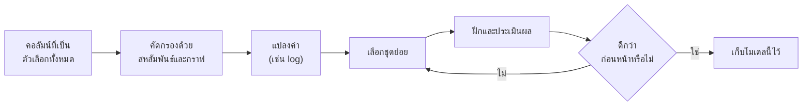
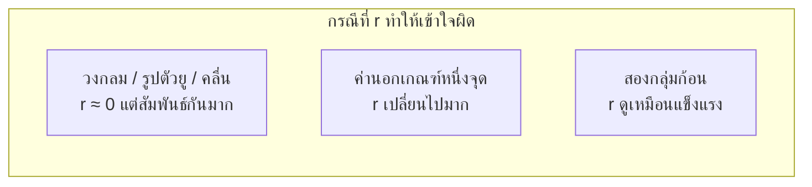
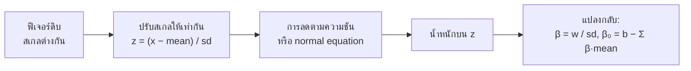

# บทที่ 2 · สหสัมพันธ์และการเลือกฟีเจอร์

> **ความรู้พื้นฐานที่ต้องมี:** แนวคิดของโมเดลเส้นตรง $\hat y = mx + c$ ค่าคลาดเคลื่อนส่วนเหลือ (residual) และตัวชี้วัดความคลาดเคลื่อน
> **แล็บแบบโต้ตอบ:** [CORR101](https://rathachai.github.io/DA-LAB/learnings/linear/corr101.html) · [LM201](https://rathachai.github.io/DA-LAB/learnings/linear/lm201.html)

---

## วัตถุประสงค์การเรียนรู้

เมื่อเรียนจบบทนี้ ผู้เรียนจะสามารถ

1. ตีความ **สัมประสิทธิ์สหสัมพันธ์เพียร์สัน (Pearson correlation coefficient)** $r$ (ตัวเลขตั้งแต่ −1 ถึง +1 ที่บอกว่าการวัดสองชนิดเรียงตัวตามแนวเส้นตรงได้ดีเพียงใด) และรู้ว่าค่านี้ใช้ไม่ได้ผลในกรณีใด
2. ขยายการถดถอยเชิงเส้นอย่างง่ายไปเป็น **การถดถอยเชิงเส้นพหุคูณ (multiple linear regression)** (ทำนายเอาต์พุตหนึ่งตัวจากอินพุตหลายตัว)
3. ใช้สหสัมพันธ์ **คัดกรอง (screen)** ฟีเจอร์ (อินพุต) ที่เป็นตัวเลือก และอธิบายได้ว่าเหตุใดการคัดกรองเพียงอย่างเดียวจึงไม่เพียงพอ
4. จำแนกฟีเจอร์ที่ **ไร้ประโยชน์ (สัญญาณรบกวน)** **ไม่เป็นเชิงเส้น** หรือ **รั่วไหล (leaky)** (แอบมีคำตอบอยู่ในตัว)
5. ใช้ **การแปลงลอการิทึม (log transform)** เพื่อทำให้ความสัมพันธ์แบบเอกซ์โพเนนเชียลกลายเป็นเส้นตรง
6. เปรียบเทียบโมเดลอย่างเป็นธรรมด้วย **adjusted R²** และอธิบายได้ว่าเหตุใด R² แบบธรรมดาจึงไม่เคยลดลงเมื่อเพิ่มอินพุต
7. อธิบายได้ว่าเหตุใดจึงต้อง **ปรับฟีเจอร์ให้อยู่ในสเกลเดียวกัน (standardise)** ก่อนใช้การลดตามความชัน

> **แนวคิดสำคัญ** การเลือกอินพุตของโมเดลก็คืองานเดียวกับการเลือกว่าจะติดตั้งเซนเซอร์ตัวใดบนเครื่องจักร เซนเซอร์แต่ละตัวมีค่าใช้จ่าย ต้องบำรุงรักษา และเพิ่มสายไฟ เราจึงต้องการเซนเซอร์ให้ *น้อยที่สุด* เท่าที่ยังบอกสิ่งที่ต้องรู้ได้ครบ

---

## 2.1 จากหนึ่งฟีเจอร์สู่หลายฟีเจอร์

ในการเรียนรู้ของเครื่อง (machine learning) ค่าที่วัดได้ซึ่งใช้เป็นอินพุตเรียกว่า **ฟีเจอร์ (feature)** ฟีเจอร์ก็คือหนึ่งคอลัมน์ในตารางข้อมูล เช่น อุณหภูมิ ความดัน อัตราการไหล กระแสมอเตอร์ เป็นต้น ส่วนปริมาณที่ต้องการทำนายเรียกว่า **เป้าหมาย (target)** (เขียนแทนด้วย $y$)

โมเดลอย่างง่ายใช้เพียงหนึ่งฟีเจอร์ แต่ระบบจริงมีอินพุตที่วัดได้หลายตัว โมเดลที่มี $p$ ฟีเจอร์ $x_1, x_2, \dots, x_p$ เขียนได้เป็น

$$
\hat y = \beta_0 + \beta_1 x_1 + \beta_2 x_2 + \dots + \beta_p x_p
$$

**พูดง่ายๆ:** ค่าทำนายคือค่าเริ่มต้นบวกกับผลรวมถ่วงน้ำหนักของอินพุต

| สัญลักษณ์ | ความหมาย | หน่วย |
|--------|---------|------|
| $\hat y$ ("y-hat") | ค่าทำนายของเป้าหมาย | เหมือนเป้าหมาย |
| $x_j$ | ฟีเจอร์อินพุตตัวที่ $j$ | หน่วยของตัวเอง (°C, bar, A, …) |
| $p$ | จำนวนฟีเจอร์อินพุต | จำนวนนับ (ไม่มีหน่วย) |
| $\beta_0$ | ค่าจุดตัดแกน (intercept): ค่าทำนายเมื่ออินพุตทั้งหมดเป็นศูนย์ | เหมือนเป้าหมาย |
| $\beta_j$ | น้ำหนักของอินพุตตัวที่ $j$ | หน่วยของเป้าหมายต่อหนึ่งหน่วยของ $x_j$ |

> **เปรียบเทียบกับงานวิศวกรรม** แนวคิดนี้เหมือนการซ้อนทับของผลกระทบ (superposition) หากอุณหภูมิห้องขึ้นกับกำลังของฮีตเตอร์และอุณหภูมิภายนอก ผลกระทบแต่ละอย่างจะมีสัมประสิทธิ์ของตัวเอง และผลรวมทั้งหมดคือการบวกกัน

โมเดลเดียวกันนี้เขียนอย่างกะทัดรัดด้วยเมทริกซ์ได้ โดยนำการวัดทั้งหมดมาเรียงเป็นตาราง $X$ (หนึ่งแถวต่อหนึ่งตัวอย่าง หนึ่งคอลัมน์ต่อหนึ่งฟีเจอร์ และเพิ่มคอลัมน์ของเลขหนึ่งสำหรับค่าจุดตัดแกน)

$$
\hat{\mathbf y} = X\boldsymbol\beta, \qquad
\boldsymbol\beta = (X^\top X)^{-1} X^\top \mathbf y \quad\text{(normal equation)}
$$

**พูดง่ายๆ:** สูตรที่สองเป็นสูตรสำเร็จรูปที่ให้น้ำหนักที่ดีที่สุดในขั้นตอนเดียว โดยไม่ต้องทำซ้ำหลายรอบ โดย $X$ คือตารางอินพุต $\mathbf y$ คือรายการเป้าหมายที่วัดได้ $\boldsymbol\beta$ คือรายการน้ำหนัก $X^\top$ คือ $X$ ที่สลับแถวกับคอลัมน์ (ทรานสโพส) และ $(\cdot)^{-1}$ คืออินเวอร์สของเมทริกซ์ นี่คือคำตอบกำลังสองน้อยที่สุด (least squares) คือน้ำหนักที่ทำให้ผลรวมของความคลาดเคลื่อนกำลังสองน้อยที่สุด

น้ำหนัก $\beta_j$ คือการเปลี่ยนแปลงของ $\hat y$ เมื่อ $x_j$ เพิ่มขึ้นหนึ่งหน่วย **โดยที่ฟีเจอร์อื่นทั้งหมดคงที่** ข้อความท้ายนี้สำคัญมาก เมื่ออินพุตสองตัวสัมพันธ์กันเอง น้ำหนักอาจเปลี่ยนค่า หรือกระทั่งเปลี่ยนเครื่องหมาย ขึ้นอยู่กับว่ามีอินพุตตัวอื่นใดอยู่ในโมเดลบ้าง

> **เปรียบเทียบกับงานวิศวกรรม** เหมือนอนุพันธ์ย่อย $\partial y / \partial x_j$ คือเปลี่ยนตัวแปรหนึ่งตัวและตรึงตัวอื่นไว้

---

## 2.2 เหตุใดจึงต้องเลือกฟีเจอร์

ฟีเจอร์ที่มากขึ้นไม่ได้ดีขึ้นโดยอัตโนมัติ เริ่มจากนิยามด้วยภาษาง่ายๆ ก่อน

- **ฟีเจอร์สัญญาณรบกวน (noise feature):** อินพุตที่ไม่มีความเชื่อมโยงที่แท้จริงกับเป้าหมาย เหมือนเซนเซอร์ที่อ่านได้แต่สัญญาณรบกวนไฟฟ้าแบบสุ่ม
- **ฟีเจอร์ซ้ำซ้อน / พหุสัมพันธ์เชิงเส้น (redundant feature / multicollinearity):** อินพุตสองตัวที่มีข้อมูลเหมือนกัน (เช่น อุณหภูมิเป็น °C กับอุณหภูมิเดียวกันเป็น °F) โมเดลแยกสองตัวนี้ออกจากกันไม่ได้ น้ำหนักจึงไม่เสถียร
- **การรั่วไหลของข้อมูล (leakage):** ฟีเจอร์ที่มีคำตอบอยู่ในตัวเอง หรือคำนวณมาจากคำตอบ โมเดลจะดูสมบูรณ์แบบกับข้อมูลในอดีต แต่ใช้งานจริงแล้วล้มเหลว

| ปัญหา | ผลที่ตามมา |
|---------|-------------|
| **ฟีเจอร์สัญญาณรบกวน** ไม่มีสัญญาณที่แท้จริง | เพิ่มความแปรปรวน โมเดลเริ่มเรียนรู้รูปแบบที่บังเอิญเกิดขึ้น |
| **ฟีเจอร์ซ้ำซ้อน** (สัมพันธ์กันเองสูง) | สัมประสิทธิ์ไม่เสถียรและตีความยาก (*พหุสัมพันธ์เชิงเส้น*) |
| **ฟีเจอร์รั่วไหล** มีคำตอบอยู่ในตัว | คะแนนตอนฝึกสวยหรู แต่หายไปเมื่อนำไปใช้งานจริง |
| **ต้นทุน** | เซนเซอร์ทุกตัวมีราคา และอินพุตที่เพิ่มขึ้นทุกตัวต้องมีการบำรุงรักษา |

เป้าหมายคือ **ชุดฟีเจอร์ที่เล็กที่สุดที่ยังทำนายได้ดี** หลักการนี้เรียกว่า *ความประหยัด (parsimony)* หรือมีดโกนของอ็อกแคม (Occam's razor) คืออย่าใช้มากกว่าที่จำเป็น

> **เปรียบเทียบกับงานวิศวกรรม** เทอร์โมคัปเปิลสองตัวที่วางข้างกันให้ค่าอ่านเกือบเท่ากัน ตัวที่สองเพิ่มต้นทุนแต่เพิ่มข้อมูลเพียงเล็กน้อย วิศวกรคุณภาพก็ทำเช่นเดียวกันเมื่อใช้แผนภูมิพาเรโต (Pareto chart) หา "สาเหตุสำคัญไม่กี่ข้อ" และละเลย "สาเหตุเล็กน้อยจำนวนมาก" การเลือกฟีเจอร์ก็คือการคัดกรองแบบพาเรโตกับคอลัมน์ข้อมูลของเรา

---

## 2.3 สหสัมพันธ์ (Correlation)

### เริ่มจากตัวอย่างเล็กๆ

สมมติว่าเราวัดค่าได้ห้าคู่ (เช่น ความเร็วปั๊ม $x$ ในหน่วย 100 rpm และอัตราไหล $y$ ในหน่วย L/min)

| ตัวอย่าง | $x$ | $y$ |
|-------:|----:|----:|
| 1 | 1 | 2 |
| 2 | 2 | 4 |
| 3 | 3 | 5 |
| 4 | 4 | 4 |
| 5 | 5 | 6 |

**ขั้นที่ 1: หาค่าเฉลี่ย** $\bar x = 3$ และ $\bar y = 4.2$ (เครื่องหมายขีดบนตัวแปรหมายถึง "ค่าเฉลี่ย")

**ขั้นที่ 2: หาระยะห่างของแต่ละจุดจากค่าเฉลี่ย**

| $x_i-\bar x$ | $y_i-\bar y$ | ผลคูณ |
|------------:|------------:|--------:|
| −2 | −2.2 | 4.4 |
| −1 | −0.2 | 0.2 |
| 0 | 0.8 | 0.0 |
| 1 | −0.2 | −0.2 |
| 2 | 1.8 | 3.6 |
| | **ผลรวม** | **8.0** |

**ขั้นที่ 3: หาการกระจายของแต่ละตัวแปร** $\sum (x_i-\bar x)^2 = 4+1+0+1+4 = 10$ และ $\sum (y_i-\bar y)^2 = 4.84+0.04+0.64+0.04+3.24 = 8.8$

**ขั้นที่ 4: รวมเข้าด้วยกัน**

$$
r = \frac{8.0}{\sqrt{10 \times 8.8}} = \frac{8.0}{9.38} \approx 0.85
$$

ดังนั้น $x$ และ $y$ มีความสัมพันธ์เชิงเส้นตรงทางบวกที่แข็งแรง

### สูตรทั่วไป

**สัมประสิทธิ์สหสัมพันธ์เพียร์สัน (Pearson correlation coefficient)** $r$ บอกความแข็งแรงของความสัมพันธ์ *แนวเส้นตรง* ด้วยตัวเลขเพียงตัวเดียว

$$
r = \frac{\sum (x_i-\bar x)(y_i-\bar y)}{\sqrt{\sum (x_i-\bar x)^2\;\sum (y_i-\bar y)^2}}
= \frac{\text{cov}(x,y)}{s_x\,s_y}
\quad\in[-1,\,1]
$$

**พูดง่ายๆ:** นำระยะที่ $x$ ห่างจากค่าเฉลี่ยของมัน คูณกับระยะที่ $y$ ห่างจากค่าเฉลี่ยของมัน แล้วรวมผลคูณเหล่านี้ของทุกจุด จากนั้นหารด้วยการกระจายโดยรวม เพื่อให้คำตอบไม่มีหน่วยและอยู่ระหว่าง −1 ถึง +1 เสมอ

| สัญลักษณ์ | ความหมาย |
|--------|---------|
| $x_i,\ y_i$ | คู่ค่าวัดตัวที่ $i$ |
| $\bar x,\ \bar y$ | ค่าเฉลี่ยของ $x$ และ $y$ |
| $\text{cov}(x,y)$ | **ความแปรปรวนร่วม (covariance)**: ค่าเฉลี่ยของผลคูณ $(x_i-\bar x)(y_i-\bar y)$ บอกว่าตัวแปรสองตัวมีแนวโน้มเพิ่มขึ้นไปด้วยกันหรือไม่ หน่วยคือ (หน่วยของ $x$) × (หน่วยของ $y$) จึงตัดสินขนาดของมันโดยลำพังได้ยาก |
| $s_x,\ s_y$ | **ส่วนเบี่ยงเบนมาตรฐาน (standard deviation)**: ระยะห่างโดยทั่วไปของตัวแปรจากค่าเฉลี่ย ในหน่วยของตัวแปรนั้นเอง |

การหารความแปรปรวนร่วมด้วย $s_x s_y$ ทำให้หน่วยหักล้างกันหมด ซึ่งเหมือนกับ **การทำให้ไร้มิติ (non-dimensionalisation)** คือการหารด้วยปริมาณอ้างอิง เพื่อให้ผลลัพธ์เป็นตัวเลขล้วนที่นำไปเปรียบเทียบข้ามปัญหาได้ ในตัวอย่างข้างต้น $\text{cov}=8.0/4=2.0$, $s_x=1.58$, $s_y=1.48$ และ $2.0/(1.58\times1.48)\approx 0.85$ ได้คำตอบเดียวกัน

- $r = +1$: ทุกจุดอยู่บนเส้นตรงที่ชันขึ้น
- $r = -1$: ทุกจุดอยู่บนเส้นตรงที่ลาดลง
- $r \approx 0$: ไม่มีความสัมพันธ์ *เชิงเส้น*

**ความเข้าใจเชิงสัญชาตญาณ** แต่ละจุดให้ผลคูณ $(x_i-\bar x)(y_i-\bar y)$ จุดที่อยู่เหนือค่าเฉลี่ยทั้งใน $x$ และ $y$ (หรือต่ำกว่าทั้งคู่) ให้ผลคูณเป็นบวกและดัน $r$ ขึ้น จุดที่อยู่คนละด้านให้ผลคูณเป็นลบและดึง $r$ ลง

### ความสัมพันธ์กับเส้นถดถอย

สำหรับการฟิตด้วยหนึ่งฟีเจอร์ ความชันของเส้นที่เหมาะสมที่สุดและสหสัมพันธ์มีความเชื่อมโยงกัน

$$
m = r\,\frac{s_y}{s_x}, \qquad R^2 = r^2
$$

**พูดง่ายๆ:** ความชัน $m$ คือสหสัมพันธ์ที่ปรับสเกลด้วยอัตราส่วนของการกระจาย จึงมีหน่วยถูกต้อง (หน่วยของ $y$ ต่อหนึ่งหน่วยของ $x$) ส่วน $R^2$ ("อาร์สแควร์") คือสัดส่วนของความแปรผันใน $y$ ที่เส้นตรงอธิบายได้ ในตัวอย่างของเรา $m = 0.85 \times 1.48/1.58 = 0.80$ L/min ต่อ 100 rpm และ $R^2 = 0.85^2 \approx 0.73$ ดังนั้นเส้นตรงอธิบายความแปรผันของอัตราไหลได้ประมาณ 73%

| $\lvert r\rvert$ | คำเรียกที่ใช้กัน |
|-----------------|----------------|
| 0.9 – 1.0 | แข็งแรงมาก |
| 0.7 – 0.9 | แข็งแรง |
| 0.4 – 0.7 | ปานกลาง |
| 0.2 – 0.4 | อ่อน |
| < 0.2 | อ่อนมาก / ไม่มี |

### คำเตือนสามข้อ

1. **ใช้ได้กับความสัมพันธ์เชิงเส้นเท่านั้น** วงกลมสมบูรณ์ รูปตัวยู หรือคลื่นไซน์ อาจมี $r \approx 0$ ทั้งที่ $y$ ถูกกำหนดโดย $x$ อย่างสมบูรณ์ (ลองนึกถึงจานสะท้อนพาราโบลา ตำแหน่งกำหนดความสูงได้แน่นอน แต่สหสัมพันธ์เชิงเส้นตรงเป็นศูนย์)
2. **ไวต่อค่านอกเกณฑ์ (outlier)** ค่านอกเกณฑ์คือจุดที่อยู่ไกลจากจุดอื่นๆ จุดสุดโต่งเพียงจุดเดียวอาจสร้างหรือทำลายสหสัมพันธ์ได้ เหมือนค่าจากเซนเซอร์ที่เสียเพียงค่าเดียวอาจทำลายค่าเฉลี่ยทั้งชุด
3. **สหสัมพันธ์ไม่ใช่ความเป็นเหตุเป็นผล** ตัวแปรสองตัวอาจเคลื่อนไหวไปด้วยกันเพราะปัจจัยที่สาม หรือเพียงบังเอิญ ยอดขายไอศกรีมและการใช้ไฟฟ้าต่างเพิ่มขึ้นในหน้าร้อน แต่ไม่มีตัวใดเป็นสาเหตุของอีกตัว

> **ข้อผิดพลาดที่พบบ่อย** การอ่านว่า $r \approx 0$ หมายถึง "ตัวแปรเหล่านี้ไม่เกี่ยวข้องกัน" ความจริงมันหมายถึงเพียง "ไม่มีความสัมพันธ์ *แนวเส้นตรง*" เท่านั้น ควรวาดแผนภาพการกระจาย (scatter plot) เสมอ

---

## 2.4 การคัดกรองด้วยสหสัมพันธ์

**การคัดกรอง (screening)** คือการตรวจสอบเบื้องต้นอย่างรวดเร็วเพื่อตัดตัวเลือกที่แย่อย่างชัดเจนออกไป สหสัมพันธ์ของแต่ละฟีเจอร์กับเป้าหมาย $r(x_j, y)$ เป็นตัวกรองแรกที่รวดเร็ว (ดูหัวข้อ 2.3)

- ค่า $|r|$ ที่ **สูง** (บวกหรือลบ) บ่งชี้ว่าเป็นฟีเจอร์ที่มีประโยชน์
- $r \approx 0$ บ่งชี้ว่า *ไม่มีความสัมพันธ์เชิงเส้น* แต่ต้องระวัง ดังที่จะเห็นต่อไป

### ดูกราฟเสมอ

สหสัมพันธ์เป็นเพียงตัวเลขเดียว ส่วนแผนภาพการกระจาย (วาดแต่ละตัวอย่างเป็นจุด โดยให้ $x$ อยู่แกนหนึ่งและ $y$ อยู่อีกแกนหนึ่ง) แสดง *รูปร่าง* ของข้อมูล ในชุดข้อมูลของแล็บ คอลัมน์สี่ประเภทต่อไปนี้แสดงให้เห็นว่าเหตุใดจึงต้องใช้ทั้งสองอย่าง

| ประเภทของคอลัมน์ | $r$ กับ $y$ | สิ่งที่แผนภาพการกระจายเผยให้เห็น |
|-------------|-------------|-------------------------------|
| สัญญาณเชิงเส้น | สูง | กลุ่มจุดรอบเส้นตรง จึงเก็บไว้ |
| **สัญญาณรบกวนล้วน** | ≈ 0 | กลุ่มก้อนไร้รูปร่าง จึงตัดทิ้ง |
| **รูปตัวยู** | ≈ 0 | พาราโบลาชัดเจน: สัมพันธ์กัน แต่ไม่ใช่ *แบบเชิงเส้น* |
| **เอกซ์โพเนนเชียล** | ปานกลาง | เส้นโค้งที่โก่งงอ แก้ได้ด้วยการแปลงค่า |

> **แนวคิดสำคัญ** การคัดกรองมีข้อผิดพลาดได้สองแบบ ฟีเจอร์ที่ดีอาจดูแย่ (รูปตัวยู) และฟีเจอร์อาจดูดีเพียงเพราะเป็นสำเนาของฟีเจอร์อื่น สหสัมพันธ์กับเป้าหมายตรวจจับความซ้ำซ้อนระหว่างอินพุตสองตัวไม่ได้ ดังนั้นจึงควรตรวจสหสัมพันธ์ *ระหว่าง* อินพุตด้วย

---

## 2.5 การแปลงฟีเจอร์

โมเดลเชิงเส้นเป็นเชิงเส้นใน **สัมประสิทธิ์ (coefficient)** (ค่า $\beta$) ไม่จำเป็นต้องเป็นเชิงเส้นในค่าวัดดิบ เราจึงป้อนฟีเจอร์ที่แปลงแล้วให้โมเดลได้ เช่น $\ln x$ (ลอการิทึมธรรมชาติ) $x^2$ หรือ $1/x$

**การแปลงลอการิทึม (log transform)** คือการแทนแต่ละค่าด้วยลอการิทึมของมัน วิศวกรใช้แนวคิดนี้อยู่แล้ว เช่น เดซิเบล (dB) สำหรับเสียงและสัญญาณ ค่า pH สำหรับความเป็นกรด และมาตราริกเตอร์สำหรับแผ่นดินไหว บนสเกลลอการิทึม การคูณด้วยค่าคงที่กลายเป็นการบวกด้วยค่าคงที่ ดังนั้นการเติบโตด้วย *อัตราส่วน* คงที่จึงกลายเป็นเส้นตรง นี่คือเหตุผลที่กระดาษกราฟกึ่งลอการิทึม (semi-log) ทำให้เส้นโค้งเอกซ์โพเนนเชียลเป็นเส้นตรง

สำหรับความสัมพันธ์แบบเอกซ์โพเนนเชียล $x = a\,e^{k y}$ การใช้ลอการิทึมธรรมชาติจะได้

$$
\ln x = \ln a + k\,y
$$

**พูดง่ายๆ:** ถ้า $x$ เพิ่มขึ้นด้วย *เปอร์เซ็นต์* เท่ากันทุกครั้งที่ $y$ เพิ่มหนึ่งขั้น แล้ว $\ln x$ จะเพิ่มขึ้นด้วย *ปริมาณ* เท่ากันทุกครั้งที่ $y$ เพิ่มหนึ่งขั้น ซึ่งก็คือเส้นตรง โดย $a$ คือค่าของ $x$ เมื่อ $y=0$ และ $k$ คืออัตราการเติบโตต่อหนึ่งหน่วยของ $y$

ตัวอย่างเล็กๆ: ถ้า $x$ เพิ่มเป็นสองเท่าทุกครั้งที่ $y$ เพิ่มขึ้น 1 (นั่นคือ $x = 1, 2, 4, 8, 16$) ค่าดิบจะโค้งขึ้น แต่ $\ln x = 0, 0.69, 1.39, 2.08, 2.77$ เพิ่มขึ้นทีละ 0.69 ทุกขั้น เป็นเส้นตรงสมบูรณ์ การใช้ $\ln x$ แทน $x$ มักทำให้ $|r|$ สูงขึ้นและความคลาดเคลื่อนของการทำนายลดลง

> **ข้อผิดพลาดที่พบบ่อย** ลอการิทึมต้องใช้ค่าบวก เพราะ $\ln 0$ และลอการิทึมของจำนวนลบไม่มีค่า นอกจากนี้ รูปตัวยูไม่สามารถแก้ด้วย $\ln x$ ได้ ต้องใช้พจน์กำลังสอง $x^2$ ซึ่งเป็นการแปลงอีกแบบหนึ่ง

---

## 2.6 การเปรียบเทียบโมเดลอย่างเป็นธรรม

### เหตุใด R² แบบธรรมดาจึงไม่เพียงพอ

จำไว้ว่า $R^2$ คือสัดส่วนของความแปรผันใน $y$ ที่โมเดลอธิบายได้ บนข้อมูลที่ใช้ฝึก **การเพิ่มฟีเจอร์ใดๆ แม้แต่สัญญาณรบกวนแบบสุ่ม ก็ไม่สามารถทำให้ $R^2$ ลดลงได้** เหตุผลง่ายๆ คือ วิธีการฟิตสามารถให้น้ำหนักศูนย์แก่ฟีเจอร์ใหม่ได้เสมอ ซึ่งจะได้โมเดลเดิมกลับมา ในทางปฏิบัติ ฟีเจอร์สัญญาณรบกวนจะได้น้ำหนักเล็กๆ ที่บังเอิญเกิดขึ้น เพื่อฟิตความสั่นไหวแบบสุ่มเล็กน้อย $R^2$ จึงขยับสูงขึ้นเล็กน้อย ดังนั้น $R^2$ แบบธรรมดาจึงให้รางวัลแก่ความซับซ้อนเสมอ

**Adjusted R²** เพิ่มบทลงโทษตามจำนวนฟีเจอร์ $p$

$$
\bar R^{2} = 1 - (1-R^2)\,\frac{n-1}{n-p-1}
$$

**พูดง่ายๆ:** นำสัดส่วนที่อธิบายไม่ได้ $(1-R^2)$ มาขยายด้วยตัวคูณที่เพิ่มขึ้นเมื่อเพิ่มฟีเจอร์ ฟีเจอร์ใหม่จึงต้องลดความคลาดเคลื่อนให้มากพอที่จะชนะการขยายนี้

| สัญลักษณ์ | ความหมาย |
|--------|---------|
| $R^2$ | R-squared ปกติของโมเดล (ไม่มีหน่วย ตั้งแต่ 0 ถึง 1) |
| $n$ | จำนวนตัวอย่าง (จำนวนแถวของข้อมูล) |
| $p$ | จำนวนฟีเจอร์ที่ใช้ |
| $\bar R^2$ | adjusted R-squared |

**ตัวอย่างการคำนวณ** เรามี $n = 20$ ตัวอย่าง และโมเดลที่มี $p = 2$ ฟีเจอร์ กับ $R^2 = 0.900$

$$
\bar R^2 = 1 - 0.100\times\frac{19}{17} = 1 - 0.1118 = 0.888
$$

ตอนนี้เพิ่มฟีเจอร์สัญญาณรบกวนล้วน ($p=3$) $R^2$ แบบธรรมดาเพิ่มขึ้นเล็กน้อยเป็น $0.901$ แต่

$$
\bar R^2 = 1 - 0.099\times\frac{19}{16} = 1 - 0.1176 = 0.882
$$

$R^2$ แบบธรรมดา *เพิ่มขึ้น* (0.900 เป็น 0.901) ขณะที่ adjusted $R^2$ *ลดลง* (0.888 เป็น 0.882) Adjusted $R^2$ บอกได้ถูกต้องว่า "ฟีเจอร์นี้ไม่ได้ช่วยอะไร"

| สถานการณ์ | $R^2$ | $\bar R^2$ |
|-----------|-------|------------|
| เพิ่มฟีเจอร์ที่ให้ข้อมูลจริง | ↑ | ↑ |
| เพิ่มฟีเจอร์สัญญาณรบกวนล้วน | ≈ ไม่เปลี่ยน | ↓ |
| เพิ่มฟีเจอร์ซ้ำซ้อน | ≈ ไม่เปลี่ยน | ↓ หรือ ≈ |

> **เปรียบเทียบกับงานวิศวกรรม** ลองนึกถึงต้นทุนของเครื่องมือวัด การเพิ่มเซนเซอร์จะคุ้มค่าก็ต่อเมื่อความแม่นยำที่ดีขึ้นคุ้มกับต้นทุนที่เพิ่ม Adjusted $R^2$ ใส่ "ต้นทุน" นั้นเข้าไปในคะแนนแล้ว

เพื่อความมั่นใจที่มากขึ้น ให้ประเมินบน **ข้อมูลที่กันไว้ (held-out data)** คือข้อมูลที่โมเดลไม่เคยเห็น

### การรั่วไหลและตัวระบุ

มีสองคอลัมน์ที่ควรสงสัยเป็นพิเศษ

- **ตัวเป้าหมายเอง** การใช้ $y$ เป็นฟีเจอร์ให้ $R^2 = 1$ ซึ่งเป็นโมเดลที่สมบูรณ์แบบแต่ไร้ค่า (*การรั่วไหลของข้อมูล, data leakage*) เหมือนการทำนายคะแนนสอบด้วยการดูกระดาษเฉลย
- **ตัวระบุ (identifier)** เช่น หมายเลขแถว ไม่มีความหมายทางกายภาพ น้ำหนักใดๆ ที่ได้จึงเกิดขึ้นโดยบังเอิญ

> **ข้อผิดพลาดที่พบบ่อย** การดีใจกับ $R^2$ ที่สูงมากโดยไม่ถามว่าแต่ละฟีเจอร์มาจากไหน ถ้าฟีเจอร์ใดจะไม่มีให้ใช้ *ก่อน* ค่าที่เรากำลังทำนาย ฟีเจอร์นั้นก็น่าจะรั่วไหล

---

## 2.7 การปรับฟีเจอร์ให้อยู่ในสเกลเดียวกัน (Standardisation)

ฟีเจอร์มักมีหน่วยและช่วงค่าที่ต่างกันมาก (เช่น 20–40 สำหรับอุณหภูมิ เทียบกับ 100–200 สำหรับความดัน) **การลดตามความชัน (gradient descent)** คือวิธีทีละขั้นที่ปรับน้ำหนักทีละเล็กน้อยเพื่อลดความคลาดเคลื่อน เมื่อฟีเจอร์มีช่วงค่าต่างกันมาก พื้นผิวความคลาดเคลื่อนจะกลายเป็นหุบเขาแคบยาว และวิธีนี้ต้องใช้ขนาดก้าวที่เล็กมากเพื่อไม่ให้ก้าวเลยจุดต่ำสุด การฝึกจึงช้า

**การปรับให้อยู่ในสเกลเดียวกัน (standardising)** หมายถึงการแปลงแต่ละฟีเจอร์ให้อยู่ในสเกลร่วมกัน โดยลบด้วยค่าเฉลี่ย แล้วหารด้วยส่วนเบี่ยงเบนมาตรฐาน

$$
z_j = \frac{x_j-\bar x_j}{s_j}
$$

**พูดง่ายๆ:** $z_j$ บอกว่า "ค่าที่อ่านได้นี้สูงหรือต่ำกว่าปกติกี่เท่าของส่วนเบี่ยงเบนมาตรฐาน" และไม่มีหน่วย โดย $x_j$ คือค่าดิบ (ในหน่วยของมันเอง) $\bar x_j$ คือค่าเฉลี่ยของฟีเจอร์นั้น และ $s_j$ คือส่วนเบี่ยงเบนมาตรฐาน ทั้งสองมีหน่วยเดียวกับ $x_j$

**ตัวอย่าง** อุณหภูมิ 20, 30 และ 40 °C มีค่าเฉลี่ย 30 °C และส่วนเบี่ยงเบนมาตรฐาน 10 °C ค่า $z$ ของมันคือ $-1,\ 0,\ +1$ ความดัน 100, 150 และ 200 kPa (ค่าเฉลี่ย 150 ส่วนเบี่ยงเบนมาตรฐาน 50) ได้ $-1,\ 0,\ +1$ เหมือนกันทุกประการ ตอนนี้ทั้งสองฟีเจอร์อยู่บนสเกลเดียวกันแล้ว

> **เปรียบเทียบกับงานวิศวกรรม** หลักการนี้คล้ายกับการใช้เลขไร้มิติ (เลขเรย์โนลด์ส ค่าต่อหน่วยหรือ per-unit ในระบบไฟฟ้ากำลัง) เมื่อตัวแปรไร้มิติแล้ว เราเปรียบเทียบกันได้โดยตรง

สัมประสิทธิ์ของฟีเจอร์ที่ปรับสเกลแล้ว (**$\beta$ มาตรฐาน, standardised $\beta$**) ยังนำมาเปรียบเทียบกันโดยตรงเป็นตัวชี้วัดความสำคัญอย่างคร่าวๆ ได้ ส่วนสัมประสิทธิ์ในหน่วยเดิมทำไม่ได้ เพราะขึ้นกับหน่วยที่เลือก น้ำหนัก "ต่อ °C" กับน้ำหนัก "ต่อ kPa" เปรียบเทียบกันไม่ได้

กล่องสุดท้ายแปลงน้ำหนักกลับเป็นหน่วยจริง เพื่อให้นำโมเดลไปใช้กับค่าดิบจากเซนเซอร์ได้โดยตรง โดย $w$ คือน้ำหนักที่หาได้จากข้อมูลที่ปรับสเกลแล้ว $b$ คือค่าจุดตัดแกนที่หาได้จากข้อมูลที่ปรับสเกลแล้ว และ "sd" คือส่วนเบี่ยงเบนมาตรฐานของฟีเจอร์นั้น

---

## 2.8 แล็บปฏิบัติการ

### CORR101 · การสาธิตสหสัมพันธ์เพียร์สัน

**[เปิด CORR101](https://rathachai.github.io/DA-LAB/learnings/linear/corr101.html)** — เลือกรูปแบบ (บวก ลบ ไม่มีความสัมพันธ์ เส้นตรงสมบูรณ์ วงกลม รูปตัวยู คลื่นไซน์ สองกลุ่มก้อน ค่านอกเกณฑ์หนึ่งจุด) หรือโรยจุดของตัวเอง แล้วดูว่า $r$, $R^2$, ความแปรปรวนร่วม และเส้นสหสัมพันธ์ตอบสนองอย่างไร

**การทดลอง:** (1) เลือก *Circle* แล้วเลือก *U-shape* เหตุใด $r$ จึงใกล้ศูนย์ทั้งที่รูปแบบชัดเจน (2) เลือก *One outlier* จดค่า $r$ แล้วเปรียบเทียบกับกลุ่มก้อนเพียงอย่างเดียว (3) เลือก *Two clusters* และอธิบายว่าเหตุใด $r$ จึงดูแข็งแรง

### LM201 · การเลือกฟีเจอร์สำหรับโมเดลเชิงเส้น

**[เปิด LM201](https://rathachai.github.io/DA-LAB/learnings/linear/lm201.html)**

แล็บมีตารางข้อมูล 100 ตัวอย่าง ประกอบด้วยคอลัมน์ `id`, `x1`…`x7` และ `y`

| คอลัมน์ | พฤติกรรมที่ออกแบบไว้ |
|--------|--------------------|
| `x1`, `x2` | ความสัมพันธ์ทางบวกที่แข็งแรงกับ $y$ |
| `x3` | ความสัมพันธ์รูปตัวยู; $r\approx 0$ (เป็นกับดัก) |
| `x4` | สัญญาณรบกวนล้วน ไม่สัมพันธ์กับสิ่งใดเลย |
| `x5` | เอกซ์โพเนนเชียล; กลายเป็นเส้นตรงหลังใช้ `log` |
| `x6`, `x7` | ความสัมพันธ์ทางลบที่แข็งแรง |

**ขั้นตอนการทำงาน**

1. คลิกหัวคอลัมน์เพื่อดูแผนภาพการกระจายและ $r$
2. ติ๊ก **use** ที่คอลัมน์ที่ต้องการใช้ และติ๊ก **log** ตรงที่การแปลงช่วยได้
3. กด **Solve instantly** (หรือ **Train**) แล้วอ่านสมการ $\beta_0+\beta_1x_1+\dots$
4. เปรียบเทียบตาราง **Model comparison** (MAE, RMSE, MAPE, R², adjusted R²) ข้ามชุดฟีเจอร์ต่างๆ ค่าเหล่านี้คือวิธีวัดความคลาดเคลื่อนของการทำนายและคุณภาพของการฟิตที่ต่างกัน

### การทดลองที่แนะนำ

1. ฝึกด้วย `x1` เพียงตัวเดียว แล้วเพิ่ม `x7`, `x6`, … ทีละตัว การปรับปรุงหยุดเมื่อใด
2. เพิ่ม `x4` (สัญญาณรบกวน) R² เปลี่ยนหรือไม่ adjusted R² เปลี่ยนหรือไม่
3. ติ๊ก `log` ให้ `x5` แล้วดู $r$ และแผนภาพการกระจายเปลี่ยนไป ความคลาดเคลื่อนดีขึ้นหรือไม่
4. ติ๊ก `x3` เหตุใดฟีเจอร์รูปตัวยูจึงช่วยโมเดล *เชิงเส้น* ไม่ได้
5. ติ๊ก `y` แล้วติ๊ก `id` ตีความคำเตือนที่ปรากฏ

---

## สรุป

- **$r$ ของเพียร์สัน** วัดความสัมพันธ์ *เชิงเส้น* เท่านั้น ต้องระวังความไม่เป็นเชิงเส้น ค่านอกเกณฑ์ และตัวแปรกวน (confounding, ปัจจัยที่สามที่ซ่อนอยู่)
- การถดถอยพหุคูณทำนายจากหลายฟีเจอร์ สัมประสิทธิ์ตีความ *โดยให้ตัวอื่นคงที่*
- คัดกรองด้วยสหสัมพันธ์ **และ** กราฟ จัดการความโค้งด้วยการแปลง เช่น $\ln x$
- R² แบบธรรมดาให้รางวัลแก่ฟีเจอร์ที่เพิ่มเสมอ ส่วน **adjusted R²** ลงโทษ เหมือนต้นทุนของเซนเซอร์ที่เพิ่มแต่ละตัว
- ห้ามใช้เป้าหมายหรือตัวระบุเป็นฟีเจอร์
- **ปรับฟีเจอร์ให้อยู่ในสเกลเดียวกัน** เพื่อให้การลดตามความชันเสถียรและน้ำหนักเปรียบเทียบกันได้

---

## คำศัพท์สำคัญ

| คำศัพท์ | ความหมายในภาษาง่าย | เปรียบเทียบกับงานวิศวกรรม |
|------|------------------------|------------------------|
| ฟีเจอร์ (Feature) | ค่าที่วัดได้หนึ่งตัวที่ใช้เป็นอินพุต (หนึ่งคอลัมน์ของข้อมูล) | ช่องสัญญาณเซนเซอร์หนึ่งช่อง |
| เป้าหมาย (Target) | ปริมาณที่ต้องการทำนาย | ตัวแปรเอาต์พุตของกระบวนการ |
| สหสัมพันธ์ (Correlation, $r$) | ตัวแปรสองตัวเรียงตัวตามแนวเส้นตรงได้ดีเพียงใด ตั้งแต่ −1 ถึง +1 | ตัวชี้วัดไร้มิติว่าสัญญาณสองตัวไปในจังหวะเดียวกันเพียงใด |
| ความแปรปรวนร่วม (Covariance) | ค่าเฉลี่ยของผลคูณของการเบี่ยงเบนจากค่าเฉลี่ยของตัวแปรสองตัว | สหสัมพันธ์ในรูปที่มีหน่วย |
| ฟีเจอร์สัญญาณรบกวน (Noise feature) | อินพุตที่ไม่เกี่ยวกับเป้าหมาย | เซนเซอร์ที่อ่านได้แต่สัญญาณรบกวน |
| พหุสัมพันธ์เชิงเส้น (Multicollinearity) | อินพุตสองตัวที่มีข้อมูลเหมือนกัน | เซนเซอร์สำรองสองตัวที่ซ้ำกัน |
| การรั่วไหล (Leakage) | ฟีเจอร์ที่มีคำตอบอยู่ในตัว | แอบดูกระดาษเฉลยระหว่างสอบ |
| การแปลงลอการิทึม (Log transform) | แทน $x$ ด้วย $\ln x$ | สเกล dB, pH, กระดาษกึ่งลอการิทึม |
| $R^2$ | สัดส่วนของความแปรผันใน $y$ ที่โมเดลอธิบายได้ | สัดส่วนของความแปรปรวนที่การฟิตอธิบายได้ |
| Adjusted $R^2$ | $R^2$ ที่มีบทลงโทษสำหรับแต่ละฟีเจอร์ที่เพิ่ม | ความแม่นยำที่เพิ่มขึ้นหักลบต้นทุนของเซนเซอร์อีกตัว |
| การปรับสเกล (Standardising) | แปลงเป็น $z=(x-\bar x)/s$ | การทำให้ไร้มิติ ค่าต่อหน่วย (per-unit) |
| การลดตามความชัน (Gradient descent) | ปรับน้ำหนักทีละก้าวเล็กๆ เพื่อลดความคลาดเคลื่อน | ตัวแก้ปัญหาแบบวนซ้ำ เช่น วิธีนิวตันหรือวิธีผ่อนคลาย (relaxation) |

---

Powered by: Sonnet &nbsp;|&nbsp; AI Whisperer: [rathachai.github.io](https://rathachai.github.io)
