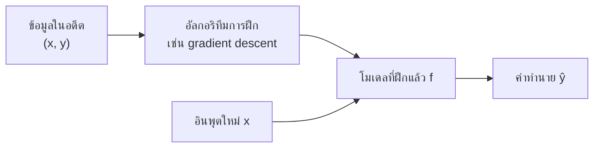
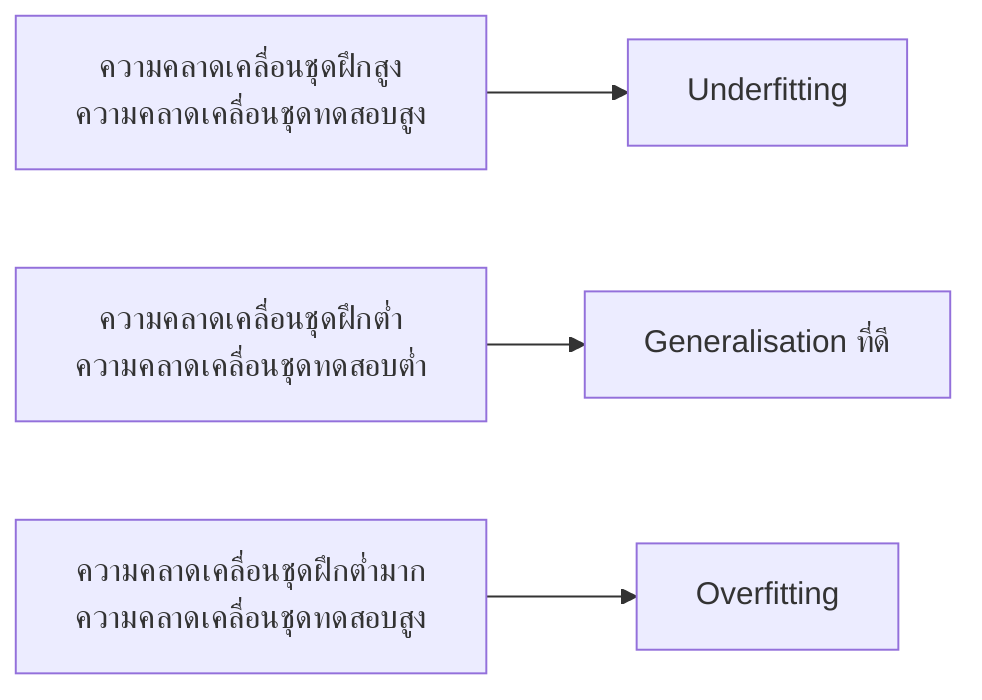
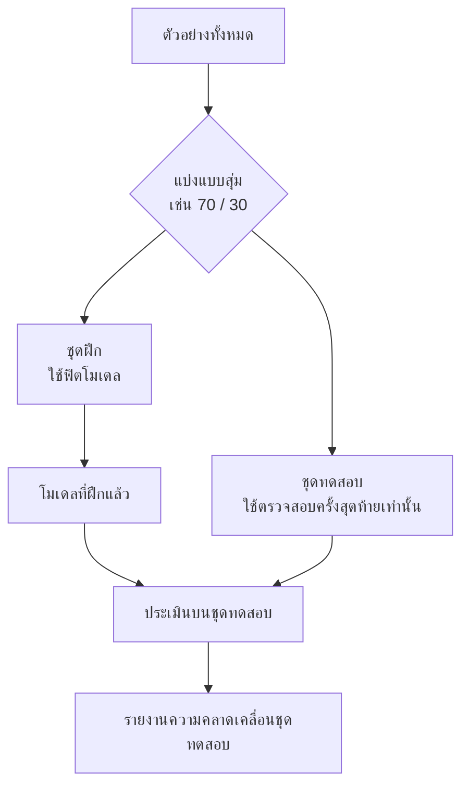
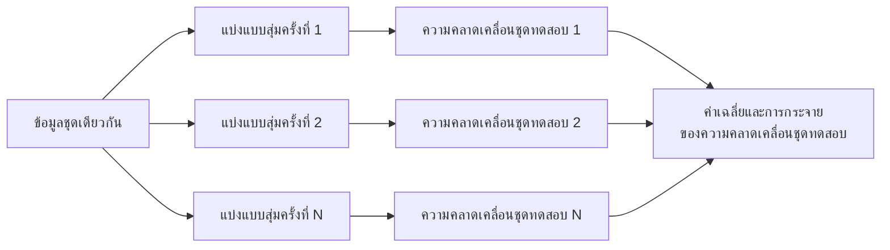

# บทที่ 3 · การเรียนรู้ของเครื่องและการแบ่งข้อมูลฝึก–ทดสอบ

> **ความรู้พื้นฐานที่ต้องมี:** การฟิตเส้นตรง (หรือการถดถอยพหุคูณ) กับข้อมูลและการวัดความคลาดเคลื่อน
> **แล็บเชิงโต้ตอบ:** [LM301](https://rathachai.github.io/DA-LAB/learnings/linear/lm301.html) · [LM302](https://rathachai.github.io/DA-LAB/learnings/linear/lm302.html)

---

## วัตถุประสงค์การเรียนรู้

เมื่อเรียนจบบทนี้ ผู้เรียนจะสามารถ

1. อธิบายตำแหน่งของการถดถอยเชิงเส้น (linear regression) ในวงกว้างของ **การเรียนรู้ของเครื่อง (machine learning)** (คอมพิวเตอร์เรียนรู้กฎจากข้อมูล)
2. แยกแยะ **พารามิเตอร์ (parameters)** (ตัวเลขที่คอมพิวเตอร์หาได้เอง) ออกจาก **ไฮเปอร์พารามิเตอร์ (hyperparameters)** (ค่าตั้งที่ผู้ใช้เลือก) และแยก **การฝึก (training / fitting)** ออกจาก **การนำไปใช้ได้กับข้อมูลใหม่ (generalisation)**
3. อธิบาย **การเรียนรู้ต่ำเกินไป (underfitting)** และ **การเรียนรู้เกินพอดี (overfitting)** และสังเกตได้จากค่าความคลาดเคลื่อนของชุดฝึกและชุดทดสอบ
4. แบ่งข้อมูลเป็น **ชุดฝึก (train set)** และ **ชุดทดสอบ (test set)** พร้อมให้เหตุผลประกอบการเลือกสัดส่วน
5. ระบุ **การรั่วไหลของข้อมูล (data leakage)** (ข้อมูลทดสอบแอบช่วยโมเดล) และหลีกเลี่ยงได้
6. อธิบายว่าเหตุใดการแบ่งข้อมูลแบบสุ่มเพียงครั้งเดียวจึงให้ค่าประมาณที่แกว่ง และการ **แบ่งซ้ำหลายครั้ง** ช่วยได้อย่างไร

---

## 3.1 การเรียนรู้ของเครื่องคืออะไร

ในแบบจำลองทางวิศวกรรมแบบดั้งเดิม ผู้ใช้เขียนกฎขึ้นเอง ตัวอย่างเช่น นำกฎของโอห์ม $V = IR$ ที่พิสูจน์จากหลักฟิสิกส์มาใช้งาน

ใน **การเรียนรู้ของเครื่อง (machine learning: ML)** ผู้ใช้ปล่อยให้คอมพิวเตอร์หากฎจากข้อมูลเอง โดยป้อนตัวอย่างที่วัดได้จริงจำนวนมาก แล้วคอมพิวเตอร์จะปรับสูตรจนสอดคล้องกับตัวอย่างเหล่านั้น

คำสำคัญมีดังนี้

- **โมเดล (model):** สูตรที่แปลงอินพุตเป็นค่าทำนาย เช่น $\hat{y} = m x + c$
- **การฝึก (training / fitting):** การปรับตัวเลขในโมเดลจนค่าทำนายตรงกับข้อมูลที่ทราบคำตอบ สำหรับเส้นตรงหมายถึงการเลือกความชันและจุดตัดแกน
- **การเรียนรู้แบบมีผู้สอน (supervised learning):** การเรียนรู้จากตัวอย่างที่ทราบคำตอบที่ถูกต้อง แต่ละตัวอย่างเป็นคู่ $(x, y)$ คืออินพุต $x$ และคำตอบที่วัดได้ $y$ เป้าหมายคือหาฟังก์ชัน $f$ ที่ทำให้ $f(x)\approx y$ สำหรับอินพุต *ใหม่*

> **เปรียบเทียบกับงานวิศวกรรม** การฝึกโมเดลเหมือนการสอบเทียบ (calibrate) เครื่องมือวัด ผู้ใช้ป้อนค่าอ้างอิงที่ทราบแล้วปรับเครื่องจนค่าที่อ่านได้ตรงกัน ส่วนการทำนายคือการนำเครื่องมือที่สอบเทียบแล้วไปวัดตัวอย่างที่ไม่ทราบค่า

ปัญหาแบบมีผู้สอนแบ่งเป็นสองชนิดตามลักษณะของ $y$

| ชนิด | เป้าหมาย $y$ | ความหมายแบบภาษาง่าย | ตัวอย่าง |
|------|-----------|------------------------|---------|
| **การถดถอย (Regression)** | ตัวเลข | ทำนาย "เท่าไร" | ทำนายอายุการใช้งานที่เหลือเป็นชั่วโมง |
| **การจำแนกประเภท (Classification)** | หมวดหมู่ | ทำนาย "อันไหน" | ทำนาย "ปกติ" หรือ "ชำรุด" |

การถดถอยเชิงเส้นเป็นทั้งเครื่องมือทางสถิติและเป็นโมเดล ML แบบมีผู้สอนที่ง่ายที่สุด ทุกสิ่งในบทนี้ใช้ได้เช่นเดียวกันกับโมเดลที่ซับซ้อนกว่ามาก

*พูดง่ายๆ:* ข้อมูลในอดีตเข้าไป ขั้นตอนการฝึกสร้างโมเดลขึ้นมา แล้วโมเดลจึงทำนายอินพุตใหม่

### พารามิเตอร์และไฮเปอร์พารามิเตอร์

ตัวเลขในทุกโมเดลมีสองชนิด อย่าสับสนกัน

- **พารามิเตอร์ (parameters)** คือตัวเลขที่อัลกอริทึมการฝึกหาได้เอง เช่น ความชันและจุดตัดแกนของเส้นตรง
- **ไฮเปอร์พารามิเตอร์ (hyperparameters)** คือค่าตั้งที่ผู้ใช้เลือกก่อนหรือระหว่างการฝึก เช่น จำนวนคุณลักษณะที่ใช้ หรือสัดส่วนข้อมูลที่ใช้ฝึก

| | พารามิเตอร์ | ไฮเปอร์พารามิเตอร์ |
|---|-----------|-----------------|
| ความหมายแบบภาษาง่าย | "ตำแหน่งปุ่มหมุน" ที่คอมพิวเตอร์หาได้ | "ทางเลือกในการออกแบบ" ที่ผู้ใช้ตัดสินใจ |
| ตัวอย่าง | ความชัน $m$, จุดตัดแกน $c$, น้ำหนัก $\beta_j$ | อัตราการเรียนรู้ $\alpha$ (ขนาดก้าวของการค้นหา), จำนวนคุณลักษณะ, สัดส่วนชุดฝึก |
| ใครเป็นผู้กำหนด | อัลกอริทึมการฝึก | วิศวกร |
| เรียนรู้จาก | ข้อมูลฝึก | การทดลองกับข้อมูลที่กันไว้ |

> **เปรียบเทียบกับงานวิศวกรรม** สำหรับตัวควบคุม ค่าเกนที่ได้จากการปรับจูนอัตโนมัติเปรียบได้กับพารามิเตอร์ ส่วนการเลือกชนิดตัวควบคุม (P, PI หรือ PID) และคาบเวลาการสุ่มสัญญาณ (sample time) เปรียบได้กับไฮเปอร์พารามิเตอร์

---

## 3.2 เป้าหมายที่แท้จริง: การนำไปใช้ได้กับข้อมูลใหม่ (Generalisation)

สมมติว่าสร้างโมเดลที่ทำนายทุกจุดข้อมูลที่ป้อนให้ได้ตรงเป๊ะ โมเดลนี้ดีหรือไม่ ไม่จำเป็น เพราะตารางค้นหา (lookup table) ก็ทำได้เช่นกัน แต่ทำนายสิ่งใหม่ไม่ได้เลย

สิ่งที่ต้องการจริงๆ คือ **การนำไปใช้ได้กับข้อมูลใหม่ (generalisation)** กล่าวคือทำนายได้แม่นยำกับข้อมูลที่โมเดล *ไม่เคยเห็น* ซึ่งเป็นจุดประสงค์ทั้งหมดของการมีโมเดล

ดังนั้น ค่าความคลาดเคลื่อนบนข้อมูลฝึกจึงเป็นค่าประมาณที่ **มองโลกในแง่ดีเกินจริง** เพราะโมเดลเคยเห็นคำตอบเหล่านั้นแล้ว

> **เปรียบเทียบกับงานวิศวกรรม** ลองนึกภาพการจูนตัวควบคุมบนแบบจำลองจนทำงานได้สมบูรณ์แบบ ผลนั้นบอกอะไรได้น้อยจนกว่าจะนำไปทดสอบกับโรงงานจริง หรือนึกถึงนักศึกษาที่ท่องข้อสอบปีที่แล้ว เขาได้คะแนนเต็มกับข้อสอบชุดนั้น แต่สอบตกเมื่อเจอข้อสอบชุดใหม่ ส่วนนักศึกษาที่เข้าใจเนื้อหาจะทำได้ดีทั้งสองชุด การนำไปใช้ได้กับข้อมูลใหม่จึงวัดความเข้าใจ ไม่ใช่ความจำ

### การเรียนรู้ต่ำเกินไปและการเรียนรู้เกินพอดี (Underfitting และ Overfitting)

ลองพิจารณานักศึกษาสามคน

- คนแรกแทบไม่ได้ทบทวนเลย ทำข้อสอบเก่าและใหม่ได้แย่ทั้งคู่ นี่คือ **การเรียนรู้ต่ำเกินไป (underfitting)** คือโมเดลเรียบง่ายเกินกว่าจะจับรูปแบบของข้อมูลได้
- คนที่สองเข้าใจเนื้อหา ทำได้ดีทั้งสองแบบ นี่คือ **การฟิตที่ดี (good fit)**
- คนที่สามท่องจำคำตอบ แม้กระทั่งคำพิมพ์ผิด ทำข้อสอบเก่าได้เต็ม แต่ตกข้อสอบใหม่ นี่คือ **การเรียนรู้เกินพอดี (overfitting)** คือโมเดลเรียนรู้สัญญาณรบกวน (noise) ในข้อมูลฝึกมาด้วย ไม่ใช่เฉพาะรูปแบบที่แท้จริง

ภาพของการฟิตเส้นโค้งช่วยให้เข้าใจได้ง่ายขึ้น สมมติมีจุดข้อมูลที่มีสัญญาณรบกวนสิบจุดซึ่งจริงๆ แล้วเรียงตัวตามเส้นตรง

- เส้นตรงจะจับรูปแบบไม่ได้ถ้าความจริงเป็นเส้นโค้ง: นี่คือ underfitting
- เส้นที่เรียบและตามแนวโน้มได้: ดี
- พหุนามดีกรีสูงที่ลากผ่าน *ทุกจุด* จะแกว่งอย่างรุนแรงระหว่างจุดต่างๆ: นี่คือ overfitting เพราะฟิตกับสัญญาณรบกวนตรงเป๊ะ จึงทำนายจุดถัดไปได้แย่

| | Underfitting | Good fit | Overfitting |
|---|--------------|----------|-------------|
| โมเดล | เรียบง่ายเกินไป | ความซับซ้อนพอดี | ยืดหยุ่นเกินไป / มีคุณลักษณะมากเกินไป |
| ความคลาดเคลื่อนชุดฝึก | สูง | ต่ำ | ต่ำมาก |
| ความคลาดเคลื่อนชุดทดสอบ | สูง | ต่ำ | **สูง** |
| วิธีแก้ | เพิ่มคุณลักษณะหรือใช้โมเดลที่สมบูรณ์ขึ้น | — | ลดคุณลักษณะ เพิ่มข้อมูล ใช้การทำเรกูลาไรเซชัน (regularisation) (ตัวลงโทษที่ช่วยให้โมเดลเรียบง่าย) |

**ตัวอย่างเชิงตัวเลข** สมมติโมเดลมี RMSE ของชุดฝึก 2.1 และ RMSE ของชุดทดสอบ 6.8

- กับข้อมูลที่เคยเห็น โมเดลคลาดเคลื่อนประมาณ 2.1 หน่วย
- กับข้อมูลใหม่ โมเดลคลาดเคลื่อนประมาณ 6.8 หน่วย แย่กว่าเกินสามเท่า
- ช่องว่าง (6.8 − 2.1 = 4.7) คือสัญญาณเตือนของ overfitting ถ้าความคลาดเคลื่อนทั้งสองค่าอยู่ใกล้ 6.8 ก็จะเป็น underfitting แทน

*พูดง่ายๆ:* ลักษณะเด่นของ overfitting คือ **ช่องว่าง** โมเดลดูยอดเยี่ยมกับข้อมูลที่ใช้ฝึก แต่แย่ลงอย่างเห็นได้ชัดกับข้อมูลใหม่ คุณลักษณะที่เป็นสัญญาณรบกวน (อินพุตที่ไม่มีข้อมูลที่เป็นประโยชน์) และชุดฝึกที่เล็กมากต่างทำให้ช่องว่างนี้กว้างขึ้น

> **แนวคิดสำคัญ** อย่าตัดสินโมเดลจากความคลาดเคลื่อนของชุดฝึกเพียงอย่างเดียว ให้ถามเสมอว่า "โมเดลทำงานกับข้อมูลที่ไม่เคยเห็นได้ดีเพียงใด"

---

## 3.3 การแบ่งข้อมูลฝึก–ทดสอบ (Train–Test Split)

เราจะวัดสมรรถนะบนข้อมูลที่ไม่เคยเห็นได้อย่างไร ในเมื่อมีข้อมูลเพียงชุดเดียว คำตอบคือเราแกล้งทำ โดยซ่อนข้อมูลส่วนหนึ่งไว้แล้วถือว่าเป็นข้อมูล "ใหม่"

> **เปรียบเทียบกับงานวิศวกรรม** นี่คือการทดสอบรับมอบ (acceptance testing) ผู้ใช้สอบเทียบเครื่องมือกับค่าอ้างอิงชุดหนึ่ง แล้วตรวจสอบกับมาตรฐานอ้างอิงอีกชุดที่ไม่เคยใช้สอบเทียบ หรือนึกถึงการทดสอบต้นแบบ คือออกแบบด้วยน้ำหนักบรรทุกชุดหนึ่ง แล้วตรวจสอบด้วยน้ำหนักทดสอบอิสระ

ขั้นตอนนี้เรียกว่า **การกันข้อมูลไว้ (hold-out)**

1. สุ่มกำหนดแต่ละตัวอย่าง (แต่ละแถวของข้อมูล) ให้อยู่ใน **ชุดฝึก (training set)** หรือ **ชุดทดสอบ (test set)** นี่คือ **การแบ่งแบบสุ่ม (random split)** เหมือนการสุ่มหยิบตัวอย่างมาตรวจสอบคุณภาพ
2. ฟิตโมเดลโดยใช้ชุดฝึก **เท่านั้น**
3. ประเมินผลบน **ชุดทดสอบ** ซึ่งเป็นข้อมูลที่โมเดลไม่เคยเห็น

*พูดง่ายๆ:* แบ่งข้อมูล ฟิตด้วยส่วนหนึ่ง ตรวจให้คะแนนด้วยอีกส่วนหนึ่ง แล้วรายงานคะแนนนั้น

### การเลือกสัดส่วน

**สัดส่วนชุดฝึก (train ratio)** คือส่วนแบ่งของข้อมูลที่ใช้ฝึก "การแบ่ง 70 / 30" หมายถึงใช้ฝึก 70 % และทดสอบ 30 %

| สัดส่วนชุดฝึก | ผลที่มักเกิดขึ้น |
|----------------|----------------|
| **น้อยมาก** (เช่น 10–20 %) | เส้นที่ฟิตได้ **ไม่เสถียร** เปลี่ยนไปมากในการสุ่มแต่ละครั้ง |
| **ปานกลาง** (70–80 %) | ทางเลือกที่พบทั่วไปและสมดุล |
| **มากมาก** (เช่น 90 %) | โมเดลเสถียร แต่ **ชุดทดสอบเล็กมาก** ทำให้คะแนนทดสอบแกว่ง |

ตัวอย่างเช่น หากมีข้อมูล 100 ตัวอย่าง การแบ่ง 90 / 10 จะเหลือจุดทดสอบเพียง 10 จุด จุดที่ผิดปกติเพียงจุดเดียวก็เปลี่ยนความคลาดเคลื่อนของชุดทดสอบได้มาก ส่วนการแบ่ง 10 / 90 จะเหลือจุดฝึกเพียง 10 จุด เส้นที่ฟิตได้จึงแกว่งอย่างรุนแรง

นี่คือการแลกเปลี่ยนที่แท้จริง ข้อมูลฝึกที่มากขึ้นช่วยปรับปรุง **โมเดล** ข้อมูลทดสอบที่มากขึ้นช่วยปรับปรุง **การวัดผล** ของโมเดล

> **เปรียบเทียบกับงานวิศวกรรม** เหมือนการสุ่มตัวอย่างเพื่อควบคุมคุณภาพ ตัวอย่างขนาดเล็กให้ค่าประมาณอัตราของเสียที่ไม่น่าเชื่อถือ แต่ชิ้นงานทุกชิ้นที่นำไปทดสอบก็คือชิ้นงานที่ส่งมอบไม่ได้อีกหนึ่งชิ้น

### กฎที่ห้ามละเมิด

1. **ห้ามใช้ข้อมูลทดสอบในการฟิต** รวมถึงการใช้ทางอ้อม เช่น เลือกคุณลักษณะโดยดูคะแนนทดสอบ
2. **ตัวเลขสำหรับการเตรียมข้อมูล (pre-processing) ต้องคำนวณจากชุดฝึกเท่านั้น** หากทำการมาตรฐาน (standardise) คือลบค่าเฉลี่ยแล้วหารด้วยส่วนเบี่ยงเบนมาตรฐาน ให้คำนวณค่าเฉลี่ยและส่วนเบี่ยงเบนมาตรฐานจากชุดฝึก แล้วนำตัวเลขชุดเดียวกันนั้นไปใช้กับชุดทดสอบ การคำนวณจากข้อมูลทั้งหมดทำให้ข้อมูลรั่วไหล
3. **รายงานคะแนนทดสอบเพียงครั้งเดียว** ในตอนท้าย ถ้าปรับจูนไปเรื่อยๆ จนคะแนนทดสอบดูดี ชุดทดสอบจะหมดความเป็นอิสระ และกลายเป็นชุดฝึกชุดที่สอง

> **ข้อผิดพลาดที่พบบ่อย** ลองชุดคุณลักษณะห้าชุด เลือกชุดที่ได้คะแนนทดสอบดีที่สุด แล้วรายงานคะแนนนั้นเป็น "สมรรถนะที่คาดหวัง" ซึ่งเท่ากับใช้ชุดทดสอบในการตัดสินใจเลือก คะแนนจึงมองโลกในแง่ดีเกินไป

### ชุดที่สาม: ชุดตรวจสอบ (validation set)

หากต้องเปรียบเทียบหลายโมเดลหรือปรับจูนไฮเปอร์พารามิเตอร์ ให้ใช้ **ชุดตรวจสอบ (validation set)** แยกต่างหาก ชุดข้อมูลทั้งสามจะมีบทบาทต่างกันสามอย่าง

| ชุด | บทบาท | เปรียบเทียบกับงานวิศวกรรม |
|-----|------|------------------------|
| **ชุดฝึก (Train)** | ฟิตพารามิเตอร์ | การสอบเทียบเครื่องมือ |
| **ชุดตรวจสอบ (Validation)** | เลือกระหว่างแบบและไฮเปอร์พารามิเตอร์ | การเปรียบเทียบทางเลือกการออกแบบบนโต๊ะทดสอบ |
| **ชุดทดสอบ (Test)** | การตรวจสอบครั้งสุดท้ายที่ปราศจากอคติเพียงครั้งเดียว | การทดสอบรับมอบขั้นสุดท้าย |

---

## 3.4 การรั่วไหลของข้อมูล (Data Leakage)

**การรั่วไหลของข้อมูล (data leakage)** หมายถึงข้อมูลที่ *จะไม่มี* ในตอนทำนายจริง ได้เข้ามามีอิทธิพลต่อการฝึกหรือการประเมินผล การทดสอบจึงไม่ยุติธรรมอีกต่อไป คะแนนดูยอดเยี่ยม แต่พังทลายเมื่อใช้งานจริง

> **เปรียบเทียบกับงานวิศวกรรม** เหมือนการแจกข้อสอบให้นักศึกษาล่วงหน้า ผลคะแนนดูดีมาก แต่ไม่ได้บอกอะไรเลยว่านักศึกษารู้อะไรจริง

| แหล่งที่มาของการรั่วไหล | ตัวอย่าง |
|-------------------|---------|
| คุณลักษณะมีคำตอบอยู่ในตัว | ใช้ $y$ (หรือ $y$ ที่แปลงแล้ว) เป็นอินพุต |
| เตรียมข้อมูลจากข้อมูลทั้งหมด | ปรับสเกลด้วยสถิติที่คำนวณรวมชุดทดสอบด้วย |
| แถวที่ซ้ำกันหรือเกือบซ้ำกันข้ามชุด | ภาพถ่ายสถานะหลายครั้งของเครื่องจักรเครื่องเดียวกันอยู่ทั้งในชุดฝึกและชุดทดสอบ |
| อนาคตรั่วไหลไปสู่อดีต | การสุ่มแบ่งข้อมูลอนุกรมเวลา |

> **ข้อผิดพลาดที่พบบ่อย** ได้คะแนนทดสอบสูงมากตั้งแต่ครั้งแรก อย่าเพิ่งดีใจ ให้ถามก่อนว่า "ข้อมูลทดสอบอาจแอบช่วยโมเดลด้วยวิธีใดที่มองไม่เห็นหรือไม่"

---

## 3.5 การแบ่งเพียงครั้งเดียวไม่เพียงพอ

การแบ่งแบบสุ่มย่อมเป็นการสุ่มโดยนิยาม การแบ่งที่โชคดีให้คะแนนทดสอบที่มองโลกในแง่ดี การแบ่งที่โชคร้ายให้คะแนนที่มองโลกในแง่ร้าย

ตัวอย่างเช่น การแบ่งแบบสุ่มห้าครั้งกับข้อมูลชุดเดียวกันอาจให้ RMSE ของชุดทดสอบเป็น 4.1, 5.0, 3.6, 6.2 และ 4.4 ค่าไหนคือ "คำตอบ" ไม่มีค่าใดค่าหนึ่งเพียงลำพัง ค่าเฉลี่ย (ประมาณ 4.7) และการกระจาย (3.6 ถึง 6.2) รวมกันจึงบอกเรื่องจริงได้

เพื่อประเมินสมรรถนะ *ทั่วไป* ให้ **แบ่งซ้ำ** หลายครั้งด้วยการสุ่มกำหนดที่ต่างกัน แล้วดูทั้ง **ค่าเฉลี่ย** และ **การกระจาย** ของความคลาดเคลื่อนชุดทดสอบ

> **เปรียบเทียบกับงานวิศวกรรม** ไม่มีใครเชื่อการวัดครั้งเดียวจากเซ็นเซอร์ที่มีสัญญาณรบกวน เรามักอ่านค่าซ้ำหลายครั้งแล้วรายงานค่าเฉลี่ยและการกระจาย ความคลาดเคลื่อนชุดทดสอบก็เช่นกัน

*พูดง่ายๆ:* แบ่งหลายครั้ง เก็บความคลาดเคลื่อนชุดทดสอบหลายค่า แล้วรายงานค่าเฉลี่ยและช่วงของค่าเหล่านั้น

ความแปรปรวนจะมากที่สุดเมื่อชุดฝึกเล็กหรือชุดทดสอบเล็ก ซึ่งตรงกับการแลกเปลี่ยนที่อธิบายไว้ในหัวข้อ 3.3

---

## 3.6 แล็บปฏิบัติ

### LM301 · การแบ่งข้อมูลฝึก–ทดสอบ

**[เปิด LM301](https://rathachai.github.io/DA-LAB/learnings/linear/lm301.html)** — ตัวจำลองแผนภาพกระจาย (scatter plot) ในรูปแบบเดียวกับ LM101

- เลื่อน **สัดส่วนชุดฝึก (train ratio)** ระหว่าง 10 % ถึง 90 % จุดต่างๆ จะย้ายระหว่าง **ชุดฝึก (●)** และ **ชุดทดสอบ (◆)**
- เฉพาะจุดชุดฝึกเท่านั้นที่กำหนดเส้นที่ฟิต เปรียบเทียบ MAE, RMSE, MAPE, MSE และ R² ของ **ชุดฝึกกับชุดทดสอบ**
- กด **Random split again** เพื่อดูว่าเส้นที่ฟิตดีที่สุดขยับมากเพียงใด
- **Split experiment** ทำการแบ่งแบบสุ่มซ้ำ 50 ครั้งที่สัดส่วนปัจจุบัน และรายงานค่าเฉลี่ยและช่วงของ RMSE ชุดทดสอบ

### LM302 · การแบ่งข้อมูลฝึก–ทดสอบร่วมกับการเลือกคุณลักษณะ

**[เปิด LM302](https://rathachai.github.io/DA-LAB/learnings/linear/lm302.html)** — ตารางข้อมูลการเลือกฟีเจอร์ (100 ตัวอย่าง `x1`–`x7`) พร้อมการแบ่งฝึก/ทดสอบ

- เลือกคุณลักษณะ (และ `log`) เลือกสัดส่วนชุดฝึก แล้วฝึกโมเดล
- แถวชุดทดสอบจะถูกแรเงาเป็นสี **อำพัน (amber)** ในตาราง จุดชุดทดสอบแสดงเป็นรูปข้าวหลามตัดในแผนภูมิ และสามารถทำให้ชุดฝึก/ชุดทดสอบจางลงหรือเน้นสีได้อย่างอิสระ
- ตาราง **Model comparison** บันทึก MAE และ MAPE ของชุดฝึกและชุดทดสอบสำหรับแต่ละชุดคุณลักษณะและแต่ละการแบ่ง

### การทดลองที่แนะนำ

1. ใน **LM301** ตั้งสัดส่วนเป็น 10 % แล้วกด *Random split again* สิบครั้ง อธิบายพฤติกรรมของเส้นและ RMSE ชุดทดสอบ จากนั้นทำซ้ำที่ 50 % และ 90 %
2. รัน **split experiment** ที่ 10 %, 50 % และ 90 % สัดส่วนใดให้ช่วงของ RMSE ชุดทดสอบ *แคบที่สุด* และสัดส่วนใดให้ *กว้างที่สุด* จงอธิบายโดยอ้างอิงหัวข้อ 3.3
3. ใน **LM302** ฝึกด้วย `x1, x2, x5 (log), x6, x7` จากนั้นเพิ่มคอลัมน์สัญญาณรบกวน `x3` และ `x4` เปรียบเทียบ MAE ของชุดฝึกและชุดทดสอบที่ชุดฝึก 80 % และ 20 % สัญญาณรบกวนส่งผลเสียมากกว่าเมื่อใด
4. เพิ่มตัวเลื่อนสัญญาณรบกวนใน **LM301** และสังเกตช่องว่างระหว่างความคลาดเคลื่อนของชุดฝึกและชุดทดสอบ

---

## สรุป

- ML แบบมีผู้สอนเรียนรู้ฟังก์ชัน $f$ จากตัวอย่างที่มีป้ายกำกับ สิ่งสำคัญคือ **การนำไปใช้ได้กับข้อมูลใหม่ (generalisation)** คือความแม่นยำกับข้อมูลที่ไม่เคยเห็น
- ความคลาดเคลื่อนของชุดฝึกมองโลกในแง่ดีเกินจริง เหมือนนักศึกษาที่ได้คะแนนดีจากข้อสอบที่ท่องมา **Overfitting** ปรากฏเป็นช่องว่างระหว่างชุดฝึกและชุดทดสอบ
- แบ่งข้อมูลเป็น **ชุดฝึก** และ **ชุดทดสอบ** ฟิตและเตรียมข้อมูลด้วยชุดฝึกเท่านั้น
- สัดส่วนการแบ่งเป็นการแลกเปลี่ยนระหว่างความเสถียรของโมเดลกับความน่าเชื่อถือของการวัดผล **การแบ่งครั้งเดียวมีความแกว่ง** จึงควรแบ่งซ้ำและดูการกระจาย
- **การรั่วไหลของข้อมูล** ทำให้คะแนนสูงเกินจริง และต้องป้องกันด้วยการแบ่งข้อมูลอย่างระมัดระวัง

### ศัพท์สำคัญ

| คำศัพท์ | ความหมายแบบภาษาง่าย | เปรียบเทียบกับงานวิศวกรรม |
|------|------------------------|------------------------|
| การเรียนรู้ของเครื่อง (Machine learning) | คอมพิวเตอร์หากฎจากข้อมูล | การสอบเทียบเชิงประจักษ์แทนกฎที่พิสูจน์ได้ |
| โมเดล (Model) | สูตรที่แปลงอินพุตเป็นค่าทำนาย | ฟังก์ชันถ่ายโอนหรือเส้นโค้งสอบเทียบ |
| การเรียนรู้แบบมีผู้สอน (Supervised learning) | เรียนรู้จากตัวอย่างที่ทราบคำตอบ | การสอบเทียบกับค่าอ้างอิงที่ทราบ |
| การถดถอย / การจำแนกประเภท (Regression / classification) | ทำนายตัวเลข / ทำนายหมวดหมู่ | การวัดค่า / การตรวจแบบผ่าน–ไม่ผ่าน |
| การฝึก (Training) | ปรับโมเดลให้พอดีกับข้อมูล | การสอบเทียบเครื่องมือ |
| พารามิเตอร์ (Parameter) | ตัวเลขที่อัลกอริทึมหาได้ | ค่าเกนของตัวควบคุมที่จูนแล้ว |
| ไฮเปอร์พารามิเตอร์ (Hyperparameter) | ค่าตั้งที่วิศวกรเลือก | ชนิดตัวควบคุม คาบเวลาการสุ่มสัญญาณ |
| การนำไปใช้ได้กับข้อมูลใหม่ (Generalisation) | ความแม่นยำกับข้อมูลใหม่ที่ไม่เคยเห็น | สมรรถนะบนโรงงานจริง |
| การเรียนรู้ต่ำเกินไป (Underfitting) | โมเดลเรียบง่ายเกินไป คลาดเคลื่อนสูงทุกที่ | เส้นตรงผ่านการตอบสนองที่เป็นเส้นโค้ง |
| การเรียนรู้เกินพอดี (Overfitting) | โมเดลจำสัญญาณรบกวน ดีกับชุดฝึก แย่กับชุดทดสอบ | พหุนามที่ผ่านทุกจุดที่มีสัญญาณรบกวน |
| ชุดฝึก (Train set) | ข้อมูลที่ใช้ฟิตโมเดล | ค่าอ้างอิงสำหรับสอบเทียบ |
| ชุดทดสอบ (Test set) | ข้อมูลที่กันไว้สำหรับตรวจสอบครั้งสุดท้าย | มาตรฐานอ้างอิงอิสระ / การทดสอบรับมอบ |
| ชุดตรวจสอบ (Validation set) | ข้อมูลที่กันไว้เพื่อเลือกระหว่างแบบ | การทดสอบทางเลือกการออกแบบบนโต๊ะทดสอบ |
| การแบ่งแบบสุ่ม (Random split) | กำหนดแถวไปชุดฝึกหรือชุดทดสอบโดยบังเอิญ | การสุ่มตัวอย่างเพื่อควบคุมคุณภาพ |
| การรั่วไหลของข้อมูล (Data leakage) | ข้อมูลทดสอบแอบช่วยโมเดล | การแจกข้อสอบให้นักศึกษาล่วงหน้า |

---

Powered by: Sonnet &nbsp;|&nbsp; AI Whisperer: [rathachai.github.io](https://rathachai.github.io)
