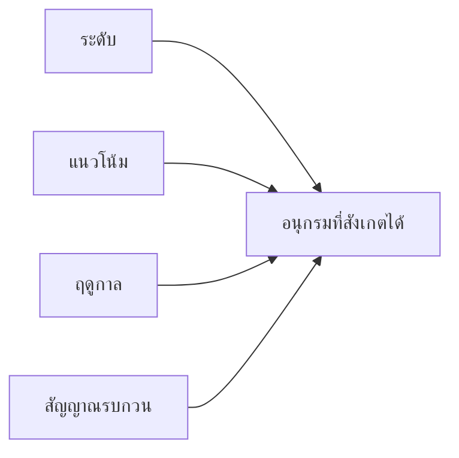
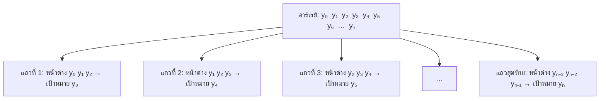
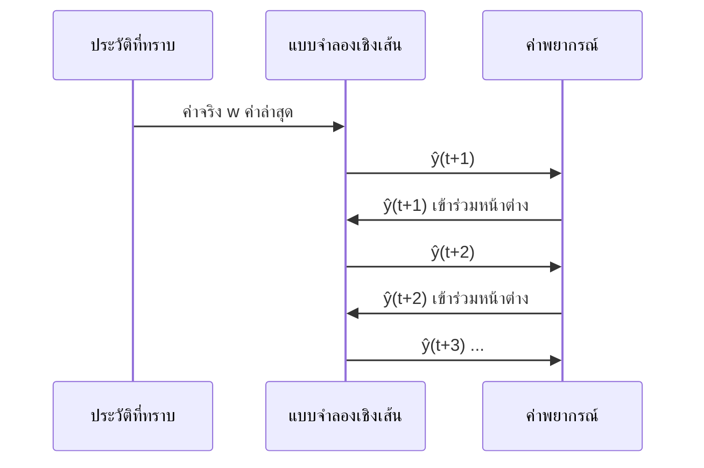

# บทที่ 4 · อนุกรมเวลาด้วยแบบจำลองเชิงเส้น

> **ความรู้พื้นฐานที่ควรมี:** การถดถอยเบื้องต้น (การฟิตโมเดลกับตารางข้อมูลเข้าและเป้าหมาย) และแนวคิดการแบ่งฝึก/ทดสอบ
> **แล็บเชิงโต้ตอบ:** [LM401](https://rathachai.github.io/DA-LAB/learnings/linear/lm401.html)

---

## วัตถุประสงค์การเรียนรู้

เมื่อเรียนจบบทนี้ ผู้เรียนจะสามารถ

1. อธิบายองค์ประกอบหลักของ **อนุกรมเวลา (time series)** (รายการค่าที่วัดได้เรียงตามลำดับเวลา) ได้แก่ ระดับ (level) แนวโน้ม (trend) ฤดูกาล (seasonality) และสัญญาณรบกวน (noise)
2. แปลงอนุกรมเวลาให้เป็นตารางสำหรับการเรียนรู้แบบมีผู้สอน (supervised learning) โดยใช้ **หน้าต่างเลื่อน (sliding window)** (กรอบเล็กๆ ที่เลื่อนไปตามข้อมูลทีละก้าว)
3. เขียนและปรับค่า (fit) **แบบจำลองถดถอยในตัวเอง (autoregressive model, AR)** เชิงเส้น (แบบจำลองที่ทำนายสัญญาณจากค่าในอดีตของสัญญาณนั้นเอง)
4. แบ่งข้อมูลอนุกรมเวลาตาม **ลำดับเวลา (chronological split)** (ข้อมูลช่วงแรกใช้ฝึก ข้อมูลช่วงหลังใช้ทดสอบ) และอธิบายได้ว่าเหตุใดการสุ่มแบ่งจึงไม่ปลอดภัย
5. แยกความแตกต่างระหว่าง **การทำนายล่วงหน้าหนึ่งก้าว (one-step-ahead prediction)** กับ **การพยากรณ์ล่วงหน้าหลายก้าว (multi-step / recursive forecast)**
6. ประเมินผลการพยากรณ์โดยเทียบกับ **เส้นฐานแบบไร้เดียงสา (naïve baseline)** (กฎง่ายๆ ที่แบบจำลองที่มีประโยชน์ต้องทำได้ดีกว่า)

> **เปรียบเทียบกับงานวิศวกรรม**
> ลองนึกถึงอนุกรมเวลาเหมือนเส้นสัญญาณบนออสซิลโลสโคป หรือไฟล์จากเครื่องบันทึกข้อมูล (data logger) เราไม่เห็นสมการที่อยู่เบื้องหลังสัญญาณ เห็นเพียงสิ่งที่สัญญาณเคยทำในอดีต และต้องการบอกว่าสัญญาณจะทำอะไรต่อไป

---

## 4.1 อนุกรมเวลาคืออะไร

**อนุกรมเวลา (time series)** คือลำดับของค่าที่วัดได้เรียงตามเวลา $y_1, y_2, \dots, y_T$ ตัวอย่างเช่น กระแสไฟฟ้าของมอเตอร์ทุกวินาที ความต้องการใช้ไฟฟ้ารายวัน หรือค่าการสั่นสะเทือนทุกชั่วโมง เครื่องบันทึกข้อมูลสร้างรายการค่าชนิดนี้ขึ้นมาโดยตรง

ลำดับของข้อมูลมีข้อมูลสารสนเทศซ่อนอยู่ ค่าของวันนี้มักคล้ายกับค่าของเมื่อวาน นี่คือเหตุผลที่เราทำนายจากอดีตได้ หากสลับลำดับของรายการ ข้อมูลส่วนนี้จะสูญหายไป

พูดง่ายๆ: อนุกรมเวลาคือสัญญาณที่บันทึกไว้ โดยสุ่มค่า (sample) ที่เวลาห่างเท่าๆ กัน

อนุกรมเวลามักอธิบายได้ว่าเป็นการรวมกันของส่วนประกอบง่ายๆ

| องค์ประกอบ | ความหมายแบบภาษาง่าย | ตัวอย่าง | เปรียบเทียบกับงานวิศวกรรม |
|------------|---------------------|----------|----------------------------|
| **ระดับ (Level)** | ค่าทั่วไปที่สัญญาณแกว่งอยู่รอบๆ | อุณหภูมิเฉลี่ยของเตาหลอม | ค่าออฟเซ็ต DC |
| **แนวโน้ม (Trend)** | การเพิ่มขึ้นหรือลดลงอย่างช้าๆ และต่อเนื่อง | การสึกหรอของตลับลูกปืนทีละน้อย | การเลื่อนไหล (drift) ช้าๆ |
| **ฤดูกาล (Seasonality)** | รูปแบบที่เกิดซ้ำตามคาบเวลาคงที่ | วงจรการผลิตรายวัน | องค์ประกอบเป็นคาบ (ไซน์ซอยด์) |
| **สัญญาณรบกวน (Noise)** | ความแปรปรวนเล็กน้อยที่ไม่เป็นระเบียบและสุ่ม | การสั่นกระเพื่อมของเซนเซอร์ | สัญญาณรบกวนจากการวัด |

> **แนวคิดสำคัญ**
> สัญญาณที่บันทึกได้คือผลรวมของส่วนประกอบง่ายๆ ไม่กี่ส่วน แบบจำลองเชิงเส้นทำงานได้ดีกับส่วนที่มีรูปแบบ (ระดับ แนวโน้ม ฤดูกาล) แต่ไม่สามารถทำนายสัญญาณรบกวนได้

อนุกรมเวลาบางชนิดทำนายได้ยากโดยธรรมชาติ

- **การเดินสุ่ม (random walk)** คือสัญญาณที่เคลื่อนที่ด้วยก้าวสุ่มในแต่ละครั้ง: $y_t = y_{t-1} + \text{step}$ ลองนึกถึงคนเมาที่เดินเซ ตำแหน่งถัดไปคือตำแหน่งล่าสุดบวกกับก้าวแบบสุ่ม
- **สัญญาณรบกวนขาว (white noise)** คือความแกว่งสุ่มล้วนๆ ที่ไม่มีรูปแบบใดเลย

สำหรับสัญญาณเหล่านี้ แบบจำลองเชิงเส้นไม่มีอะไรให้เรียนรู้เกินกว่า "ใช้ค่าล่าสุด" หรือ "ใช้ค่าเฉลี่ย"

---

## 4.2 การเปลี่ยนอนุกรมให้เป็นตาราง: หน้าต่างเลื่อน

การถดถอยเชิงเส้นต้องใช้ตารางที่มีคอลัมน์ข้อมูลเข้าหลายคอลัมน์ (ฟีเจอร์) และคอลัมน์ผลลัพธ์หนึ่งคอลัมน์ (เป้าหมาย) แต่อนุกรมเวลาไม่ใช่ตาราง หัวข้อนี้แสดงวิธีสร้างตารางขึ้นมา

**เปรียบเทียบกับงานวิศวกรรม** **ตัวกรองค่าเฉลี่ยเคลื่อนที่ (moving-average / FIR filter)** มองดูตัวอย่างล่าสุดไม่กี่ตัวผ่านหน้าต่างแล้วให้ผลลัพธ์หนึ่งค่า เราทำสิ่งเดียวกัน คือมองตัวอย่างล่าสุดไม่กี่ตัวผ่านหน้าต่าง แต่แทนที่จะนำมาเฉลี่ย เรานำมา **ทำนายตัวอย่างถัดไป**

### ขั้นที่ 1 — อนุกรมคืออาร์เรย์เดียว

อนุกรมเวลาถูกเก็บเป็น **รายการตัวเลขหนึ่งรายการเรียงตามเวลา** เมื่อใช้ดัชนีที่เริ่มจากศูนย์ $t=0,1,\dots,n$ จะได้อาร์เรย์

| ดัชนี $t$ | 0 | 1 | 2 | 3 | 4 | 5 | 6 | $\dots$ | $n$ |
|-----------|---|---|---|---|---|---|---|----------|-----|
| ค่า | $y_0$ | $y_1$ | $y_2$ | $y_3$ | $y_4$ | $y_5$ | $y_6$ | $\dots$ | $y_n$ |

$$
\mathbf y=[\,y_0,\;y_1,\;y_2,\;\dots,\;y_n\,]\qquad\text{(}\,n+1\text{ values)}
$$

พูดง่ายๆ: $\mathbf y$ คือรายการที่บันทึกไว้ทั้งหมด $y_t$ คือตัวอย่าง ณ ดัชนีเวลา $t$ รายการนี้มี $n+1$ ตัวอย่าง เพราะเริ่มนับจาก 0

ตรงนี้มี **เพียงคอลัมน์เดียว** ไม่มีฟีเจอร์แยกต่างหากและไม่มีเป้าหมาย ดังนั้นเราต้อง *สร้าง* ฟีเจอร์จากอดีต

> **พูดง่ายๆ (ขั้นที่ 1):** เริ่มต้นเรามีรายการตัวเลขเพียงหนึ่งรายการ

### ขั้นที่ 2 — ตัดอาร์เรย์เป็นหน้าต่างที่ซ้อนทับกัน

เลือก **ขนาดหน้าต่าง (window size)** $w$ คือจำนวนค่าในอดีตที่แบบจำลองมองดูได้ สำหรับแต่ละเวลา $t \ge w$

- **ฟีเจอร์** (ข้อมูลเข้า): $w$ ค่าก่อนหน้า $x_1 = y_{t-w},\; \dots,\; x_w = y_{t-1}$ เรียงจากเก่าสุดไปใหม่สุด
- **เป้าหมาย** (คำตอบที่ต้องการ): $y = y_t$ คือค่าที่เกิด **ถัดไป**

จากนั้น **เลื่อนหน้าต่างไปข้างหน้าหนึ่งก้าว** เพื่อสร้างแถวถัดไป

พูดง่ายๆ: แต่ละแถวบอกว่า "นี่คือตัวอย่างล่าสุด $w$ ตัว แล้วตัวถัดไปคืออะไร" ค่าในอดีตคือข้อมูลเข้า ค่าถัดไปคือคำตอบ **ค่าหน่วงเวลา (lag)** ก็คือค่าในอดีต $y_{t-1}$ คือ "lag 1" (หนึ่งก้าวก่อนหน้า) $y_{t-2}$ คือ "lag 2" และต่อไปเรื่อยๆ

> **พูดง่ายๆ (ขั้นที่ 2):** เลื่อนกรอบเล็กๆ ไปตามรายการ แต่ละตำแหน่งของกรอบให้หนึ่งแถวของตาราง

### ขั้นที่ 3 — อ่านค่าจากตาราง

เมื่อ $w=3$ ตารางที่ได้เป็นดังนี้

| แถว | $t$ (ดัชนีเป้าหมาย) | $x_1$ | $x_2$ | $x_3$ | $y$ |
|-----|-------------------|-------|-------|-------|-----|
| 1 | 3 | $y_0$ | $y_1$ | $y_2$ | $y_3$ |
| 2 | 4 | $y_1$ | $y_2$ | $y_3$ | $y_4$ |
| 3 | 5 | $y_2$ | $y_3$ | $y_4$ | $y_5$ |
| $\vdots$ | | | | | |
| $n-2$ | $n$ | $y_{n-3}$ | $y_{n-2}$ | $y_{n-1}$ | $y_n$ |

อาร์เรย์ที่มี $n+1$ ค่าจะได้ $(n+1)-w$ แถว ค่า $w$ ตัวแรกทำหน้าที่เป็นข้อมูลเข้าได้เท่านั้น เพราะไม่มีหน้าต่างเต็มอยู่ข้างหน้า

> **พูดง่ายๆ (ขั้นที่ 3):** จำนวนแถวเท่ากับจำนวนตัวอย่างลบด้วยขนาดหน้าต่าง

### ขั้นที่ 4 — ตัวอย่างเชิงตัวเลข

กำหนด $w=3$ และอาร์เรย์ต่อไปนี้

| อาร์เรย์ | $[\,10,\;12,\;13,\;15,\;18,\;20\,]$ |
|-------|---------------------------------------|

| แถว | $x_1$ | $x_2$ | $x_3$ | $y$ |
|-----|-------|-------|-------|-----|
| 1 | 10 | 12 | 13 | 15 |
| 2 | 12 | 13 | 15 | 18 |
| 3 | 13 | 15 | 18 | 20 |

ค่า 6 ค่าและ $w=3$ ให้ $6-3=3$ แถว แถวที่อยู่ติดกันซ้อนทับกันมาก แถวที่สองใช้ค่าซ้ำกับแถวแรกสองค่า ข้อนี้สำคัญเมื่อเราแบ่งข้อมูล (หัวข้อ 4.4)

> **พูดง่ายๆ (ขั้นที่ 4):** ตัวเลขชุดเดียวกันปรากฏในหลายแถว โดยเลื่อนตำแหน่งไปทีละหนึ่งช่อง

เมื่อข้อมูลอยู่ในรูปแบบนี้แล้ว ทุกสิ่งที่เรารู้เกี่ยวกับการถดถอยบนตารางก็นำมาใช้ได้ ทั้งการฟิต การวัดความคลาดเคลื่อน และการแบ่งฝึก/ทดสอบ

> **แนวคิดสำคัญ**
> หน้าต่างเลื่อนเปลี่ยนโจทย์ "ทำนายอนาคตของสัญญาณ" ให้เป็นปัญหาการถดถอยธรรมดา คือทำนายหนึ่งคอลัมน์จากอีกหลายคอลัมน์

---

## 4.3 แบบจำลองถดถอยในตัวเอง (Autoregressive Model)

การถดถอยเชิงเส้นบนค่าหน่วงเวลาคือ **แบบจำลองถดถอยในตัวเองอันดับ $w$ (autoregressive model of order $w$)** เขียนเป็น AR($w$) คำว่า "auto" แปลว่าตัวเอง "regressive" แปลว่าปรับค่าด้วยการถดถอย ดังนั้นแบบจำลองนี้คือการถดถอยบนอดีตของสัญญาณเอง

$$
\hat y_t = \beta_0 + \beta_1 y_{t-w} + \dots + \beta_w\, y_{t-1}
$$

พูดง่ายๆ: ค่าถัดไปที่ทำนายได้ คือค่าคงที่บวกกับผลรวมถ่วงน้ำหนักของ $w$ ค่าล่าสุด

- $\hat y_t$ คือค่าที่ทำนายได้ ณ เวลา $t$ (เครื่องหมายหมวกหมายถึง "ค่าทำนาย ไม่ใช่ค่าที่วัดได้")
- $y_{t-1}, \dots, y_{t-w}$ คือ $w$ ค่าล่าสุดที่วัดได้
- $\beta_1, \dots, \beta_w$ คือน้ำหนัก (สัมประสิทธิ์) ซึ่งขั้นตอนการปรับค่าจะเป็นผู้เลือก
- $\beta_0$ คือค่าออฟเซ็ตคงที่

> **เปรียบเทียบกับงานวิศวกรรม**
> นี่คือสมการผลต่างเวลาไม่ต่อเนื่อง (discrete-time difference equation) $y[k] = a_1\,y[k-1] + a_2\,y[k-2] + \dots + b_0$ มีรูปแบบเดียวกับตัวกรองแบบวนกลับ (recursive / IIR filter) หรือระบบเวลาไม่ต่อเนื่องอย่างง่าย ข้อแตกต่างคือ ในที่นี้เราไม่ทราบสัมประสิทธิ์จากหลักฟิสิกส์ แต่ **ประมาณค่าจากข้อมูลที่บันทึกไว้** ด้วยการถดถอยเชิงเส้น

แบบจำลองนี้ทำนายอนุกรมจาก **อดีตของมันเอง** ข้อสังเกตทั่วไปมีดังนี้

- **$w = 1$** จับแนวคิด "พรุ่งนี้คล้ายวันนี้" ตามแนวโน้มช้าๆ ได้ดี การพยากรณ์อากาศจากอากาศของเมื่อวานทำงานในลักษณะนี้
- **$w$ ที่ใหญ่ขึ้น** ทำให้แบบจำลองแสดงการแกว่งได้ เพราะตรวจจับได้ว่าสัญญาณกำลังเปลี่ยนทิศไปทางใด คลื่นไซน์ทำนายได้เกือบแม่นยำเมื่อ $w \ge 2$ (จุดล่าสุดสองจุดบอกทั้งตำแหน่งและทิศทางการเคลื่อนที่)
- **$w$ ใหญ่เกินไป** จะเพิ่มข้อมูลเข้าที่เกือบเหมือนกันทั้งหมด (ตัวอย่างที่อยู่ติดกันมีค่าเกือบเท่ากัน) ทำให้การลดความชันแบบเกรเดียนต์ (gradient descent) ช้าลงและสัมประสิทธิ์ไม่เสถียร พารามิเตอร์ที่น้อยกว่ามักดีกว่า

> เนื่องจากค่าหน่วงเวลามีสหสัมพันธ์สูงต่อกัน gradient descent จึงลู่เข้าช้า ดังนั้นคำตอบรูปแบบปิด (สมการปกติ, normal equation) จึงสะดวกสำหรับแบบจำลอง AR

> **ข้อผิดพลาดที่พบบ่อย**
> การคิดว่าหน้าต่างที่ใหญ่กว่าย่อมดีกว่าเสมอ ค่าหน่วงเวลาที่มากขึ้นให้อิสระมากขึ้น แต่ก็เพิ่มความซ้ำซ้อนและความเสี่ยงที่จะปรับตามสัญญาณรบกวน ควรเริ่มจากขนาดเล็กก่อน

---

## 4.4 การแบ่งข้อมูลอนุกรมเวลา

สำหรับตารางทั่วไป การแบ่งฝึก/ทดสอบแบบสุ่มเป็นวิธีปกติ แต่สำหรับอนุกรมเวลา คำแนะนำนั้นต้องเปลี่ยนไป

**การแบ่งตามลำดับเวลา (chronological split)** หมายถึงการฝึกแบบจำลองด้วยข้อมูลช่วงแรกของบันทึก และทดสอบด้วยช่วงหลัง นี่คือวิธีที่การพยากรณ์จริงทำงาน คือทำนายอนาคตจากอดีตเสมอ

| การแบ่ง | วิธี | ข้อสรุป |
|---------|------|---------|
| **ตามลำดับเวลา** | ฝึกด้วยช่วงแรก ทดสอบด้วยช่วงหลัง | **แนะนำ** — เลียนแบบการพยากรณ์จริง |
| **สุ่ม** | สลับหน้าต่างเข้าชุดฝึกและชุดทดสอบ | ไม่ปลอดภัย — หน้าต่างซ้อนทับกัน แบบจำลองจึงเท่ากับ **เห็นอนาคต** |

หน้าต่างที่อยู่ติดกันมีค่าร่วมกันเป็นส่วนใหญ่ (ดูขั้นที่ 4 ข้างต้น) หากหน้าต่างหนึ่งอยู่ในชุดฝึกและหน้าต่างข้างเคียงอยู่ในชุดทดสอบ แถวทดสอบที่ "ไม่เคยเห็น" ก็แทบจะเป็นสำเนาของแถวในชุดฝึก นี่คือ **การรั่วไหลของข้อมูล (leakage)** คือข้อมูลจากชุดทดสอบแอบเข้าไปในการฝึก ทำให้คะแนนการทดสอบดูดีกว่าการพยากรณ์จริง

> **ข้อผิดพลาดที่พบบ่อย**
> การใช้การแบ่งแบบสุ่มกับข้อมูลที่ทำหน้าต่างแล้วดีใจที่ค่าความคลาดเคลื่อนของการทดสอบต่ำ ค่าต่ำนั้นไม่ใช่ความสามารถ แต่คือการรั่วไหลของข้อมูล ในชีวิตจริงไม่มีใครส่งหน้าต่างข้างเคียงของวันพรุ่งนี้มาให้

---

## 4.5 การทำนาย: ล่วงหน้าหนึ่งก้าว เทียบกับหลายก้าว

มีสองวิธีที่แตกต่างกันมากในการใช้แบบจำลองที่ปรับค่าแล้วกับช่วงทดสอบ

### ล่วงหน้าหนึ่งก้าว (ใช้ข้อมูลจริง)

**การทำนายล่วงหน้าหนึ่งก้าว (one-step-ahead prediction)** ทำนายเฉพาะตัวอย่างถัดไป ในแต่ละเวลา $t$ แบบจำลองได้รับค่าวัดจริง $w$ ค่าล่าสุด ความคลาดเคลื่อนไม่สะสม เพราะทุกการทำนายเริ่มจากความจริง วิธีนี้ตอบคำถามว่า *"หากเรารู้อดีตล่าสุดเสมอ เราทำนายค่าถัดไปได้ดีเพียงใด"*

> **เปรียบเทียบกับงานวิศวกรรม**
> นี่คือตัวทำนายในระบบควบคุมที่ได้ค่าอ่านจากเซนเซอร์ใหม่ทุกครั้งที่สุ่มตัวอย่าง จึงแก้ตัวเองด้วยข้อมูลที่วัดได้อยู่เสมอ

### หลายก้าว (แบบวนกลับ)

**การพยากรณ์ล่วงหน้าหลายก้าว (multi-step / recursive forecast)** มองไปข้างหน้าหลายก้าวโดยไม่มีการวัดใหม่ วิธีทำคือป้อน **ค่าทำนายของแบบจำลองเอง** กลับเข้าไปเป็นข้อมูลเข้า

$$
\hat y_{t+1} = f(y_{t-w+1},\dots,y_t), \qquad
\hat y_{t+2} = f(y_{t-w+2},\dots,y_t,\,\hat y_{t+1}), \;\dots
$$

พูดง่ายๆ: ทำนายหนึ่งก้าว แล้วถือว่าค่าทำนายนั้นเป็นค่าวัดจริง เลื่อนหน้าต่างแล้วทำนายอีกครั้ง ในที่นี้ $f$ คือแบบจำลอง AR ที่ปรับค่าแล้ว $\hat y_{t+k}$ คือค่าทำนายที่ $k$ ก้าวหลังเวลาสุดท้ายที่ทราบ $t$ และ $y_t$ คือค่าวัดจริงล่าสุด

> **เปรียบเทียบกับงานวิศวกรรม**
> นี่คือ **การนำทางแบบประมาณตำแหน่ง (dead-reckoning)** เรือที่ไม่มี GPS ประมาณตำแหน่งถัดไปจากตำแหน่งที่ประมาณไว้ล่าสุด ความคลาดเคลื่อนเล็กน้อยแต่ละครั้งถูกส่งต่อไปยังก้าวถัดไป ความคลาดเคลื่อนจึงเพิ่มขึ้นตามระยะทางที่เดินทาง

แต่ละก้าวสืบทอดและขยายความผิดพลาดก่อนหน้า การพยากรณ์แบบวนกลับจึงมักจะ **เลื่อนไหลหรือแบนราบลง** และความคลาดเคลื่อนในการทดสอบมากกว่าความคลาดเคลื่อนแบบหนึ่งก้าวมาก แบบจำลอง AR เชิงเส้นมักค่อยๆ ลดลงเข้าสู่ค่าคงที่ (ระดับระยะยาว) แทนที่จะแกว่งต่อไป

### ประเมินเทียบกับเส้นฐานแบบไร้เดียงสา

**เส้นฐานแบบไร้เดียงสา (naïve baseline)** คือกฎง่ายๆ ที่ไม่ต้องใช้แบบจำลอง การพยากรณ์จะมีคุณค่าก็ต่อเมื่อทำได้ดีกว่ากฎนี้

| เส้นฐาน | กฎ | ความหมายแบบภาษาง่าย |
|---------|----|---------------------|
| **การคงค่าเดิม (Persistence)** (หนึ่งก้าว) | $\hat y_t = y_{t-1}$ | "ค่าถัดไปเท่ากับค่าล่าสุด" |
| **ค่าที่ทราบล่าสุด (Last-known value)** (หลายก้าว) | $\hat y_{t+k} = y_t$ สำหรับทุก $k$ | "สัญญาณคงอยู่ที่ค่าที่วัดได้ล่าสุด" |

พูดง่ายๆ: $\hat y_t$ คือค่าทำนาย $y_{t-1}$ คือค่าวัดก่อนหน้า และ $y_t$ คือค่าวัดล่าสุดที่เรารู้

หากแบบจำลองของเราทำได้ไม่ดีกว่าเส้นฐาน เช่นกรณี **การเดินสุ่ม (random walk)** การใช้ความพยายามสร้างแบบจำลองเพิ่มขึ้นก็ไม่ช่วยอะไร

> **แนวคิดสำคัญ**
> ความคลาดเคลื่อนที่น้อยไม่มีความหมายในตัวเอง ควรถามเสมอว่า "น้อยกว่าความคลาดเคลื่อนของการแค่ทวนค่าล่าสุดหรือไม่"

---

## 4.6 แล็บปฏิบัติการ: LM401

**[เปิด LM401 · อนุกรมเวลาด้วยแบบจำลองเชิงเส้น](https://rathachai.github.io/DA-LAB/learnings/linear/lm401.html)**

**คุณสมบัติ**

- **รูปแบบสัญญาณ (pattern)** 10 แบบ แบบละ 200 จุด ได้แก่ คลื่นไซน์ แนวโน้มเชิงเส้น แนวโน้ม + ฤดูกาล การเดินสุ่ม การแกว่งคล้าย AR(1) การเลื่อนระดับ (level shift) คลื่นลดทอน (damped wave) การเติบโตแบบเอกซ์โพเนนเชียล คลื่นฟันเลื่อย และสัญญาณรบกวนขาว — พร้อมระดับสัญญาณรบกวนที่ปรับได้
- **คลิกบนเส้นแล้วลาก** ขึ้นหรือลง จุดข้างเคียงจะเคลื่อนตามอย่างนุ่มนวลและจางลงตามระยะห่าง (กำหนดความกว้างด้วยแถบเลื่อน)
- **ขนาดหน้าต่าง** ตั้งแต่ 1 ถึง 10 พร้อม **ตารางหน้าต่าง** ที่ได้ ($x_1,\dots,x_w \to y$)
- **การแบ่งตามลำดับเวลาหรือแบบสุ่ม** ด้วยสัดส่วน 10–90 %
- ฝึกด้วย gradient descent หรือแก้โดยตรง เปรียบเทียบความคลาดเคลื่อนของ **Train** **Test (ใช้ข้อมูลจริง)** และ **Test (ตามลำดับเวลา)** รวมทั้งเส้นฐานแบบไร้เดียงสา
- บนกราฟ: ค่าทำนายชุดฝึก (สีแดง เส้นบาง) ค่าทำนายชุดทดสอบจากข้อมูลจริง (สีแดง เส้นทึบ) และการพยากรณ์ตามลำดับเวลาแบบวนกลับ (สีแดง เส้นประ)

### การทดลองที่แนะนำ

1. เลือก *Sine wave* โดยใช้สัญญาณรบกวนต่ำ เปรียบเทียบ $w=1$ กับ $w=2$ เหตุใดค่าหน่วงเวลาตัวที่สองจึงสร้างความแตกต่างได้มากถึงเพียงนี้
2. เลือก *Random walk* แบบจำลองชนะเส้นฐานแบบไร้เดียงสาหรือไม่ จงอธิบาย
3. เลือก *Trend + season* สังเกตเส้นประของการพยากรณ์ตามลำดับเวลา เหตุใดจึงแบนราบลง ในขณะที่การทำนายแบบหนึ่งก้าวตามข้อมูลได้
4. สลับจากการแบ่งแบบ **Chronological** เป็น **Random** ความคลาดเคลื่อนของการทดสอบลดลง — แบบจำลองดีขึ้นจริงหรือไม่
5. ลากให้เกิดตุ่มนูนในช่วง **ทดสอบ** ความคลาดเคลื่อนแบบหนึ่งก้าวและแบบวนกลับตอบสนองต่างกันอย่างไร
6. เลือก *Level shifts* และหาว่าการทำนายแบบหนึ่งก้าวล้มเหลวตรงจุดใด

---

## สรุป

- อนุกรมเวลาคือสัญญาณที่บันทึกไว้ซึ่งประกอบด้วยระดับ แนวโน้ม ฤดูกาล และสัญญาณรบกวน อนุกรมบางชนิด (การเดินสุ่ม สัญญาณรบกวนขาว) โดยพื้นฐานแล้วทำนายไม่ได้
- **หน้าต่างเลื่อน** แปลงอนุกรมให้เป็นตาราง แบบจำลองเชิงเส้นบนค่าหน่วงเวลาคือแบบจำลอง **AR($w$)** ซึ่งคล้ายสมการผลต่างที่สัมประสิทธิ์ถูกปรับค่าจากข้อมูล
- **แบ่งตามลำดับเวลา** — การแบ่งแบบสุ่มทำให้อนาคตรั่วไหลเข้ามา
- การทำนาย **หนึ่งก้าว** ใช้ข้อมูลจริง ส่วนการพยากรณ์ **แบบวนกลับ** นำค่าทำนายกลับมาใช้ซ้ำ ความคลาดเคลื่อนจึงสะสม เหมือนการนำทางแบบ dead reckoning
- เปรียบเทียบกับ **เส้นฐานแบบไร้เดียงสา** เสมอ

---

## คำศัพท์สำคัญ

| คำศัพท์ | ความหมายแบบภาษาง่าย | เปรียบเทียบกับงานวิศวกรรม |
|---------|---------------------|----------------------------|
| อนุกรมเวลา (Time series) | ค่าที่วัดได้เรียงตามลำดับเวลา | บันทึกจากเครื่องบันทึกข้อมูล เส้นสัญญาณบนออสซิลโลสโคป |
| ระดับ (Level) | ค่าทั่วไปของสัญญาณ | ค่าออฟเซ็ต DC |
| แนวโน้ม (Trend) | การเพิ่มขึ้นหรือลดลงอย่างช้าๆ และต่อเนื่อง | การเลื่อนไหลช้าๆ |
| ฤดูกาล (Seasonality) | รูปแบบที่เกิดซ้ำตามคาบคงที่ | องค์ประกอบเป็นคาบของสัญญาณ |
| สัญญาณรบกวน (Noise) | ความแปรปรวนสุ่มเล็กน้อย | สัญญาณรบกวนจากการวัด |
| หน้าต่างเลื่อน (Sliding window) | กรอบของตัวอย่างล่าสุด $w$ ตัวที่เลื่อนไปทีละก้าว | หน้าต่างของตัวกรอง FIR / ค่าเฉลี่ยเคลื่อนที่ |
| ค่าหน่วงเวลา (Lag) | ค่าในอดีต เช่น $y_{t-2}$ คือ lag 2 | ตัวอย่างที่หน่วงเวลา $y[k-2]$ |
| แบบจำลองถดถอยในตัวเอง (Autoregressive, AR) | ทำนายสัญญาณจากค่าในอดีตของมันเอง | สมการผลต่างที่มีสัมประสิทธิ์ซึ่งปรับค่าจากข้อมูล |
| การทำนายล่วงหน้าหนึ่งก้าว (One-step-ahead prediction) | ทำนายตัวอย่างถัดไปจากข้อมูลจริงล่าสุด | ตัวทำนายที่ได้ค่าจากเซนเซอร์ใหม่ทุกก้าว |
| การพยากรณ์แบบวนกลับ (Recursive / multi-step forecast) | ป้อนค่าทำนายกลับเข้าไปเพื่อมองไกลขึ้น | การนำทางแบบประมาณตำแหน่ง (dead-reckoning) |
| เส้นฐานแบบไร้เดียงสา (Naïve baseline) | กฎง่ายๆ เช่น "ค่าถัดไป = ค่าล่าสุด" | การคงค่าสุดท้ายไว้ (zero-order hold) |
| การแบ่งตามลำดับเวลา (Chronological split) | ฝึกด้วยข้อมูลก่อนหน้า ทดสอบด้วยข้อมูลหลัง | สอบเทียบก่อน แล้วตรวจสอบกับการทดลองรอบใหม่ |
| การรั่วไหลของข้อมูล (Leakage) | ข้อมูลทดสอบแอบเข้าไปในการฝึก | เฉลยข้อสอบรั่วไหลเข้ามาในการเตรียมสอบ |

---

Powered by: Sonnet &nbsp;|&nbsp; AI Whisperer: [rathachai.github.io](https://rathachai.github.io)
