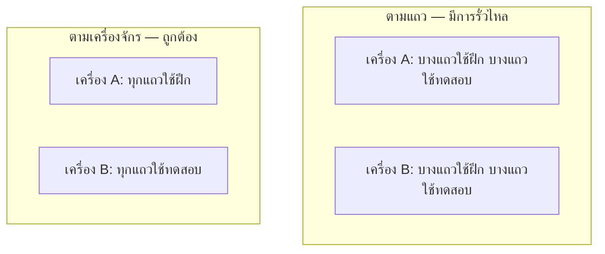
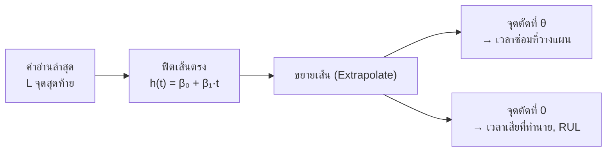
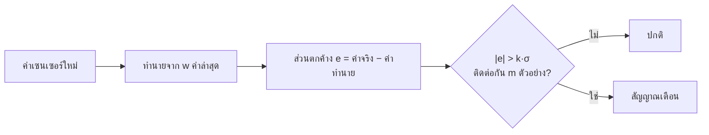
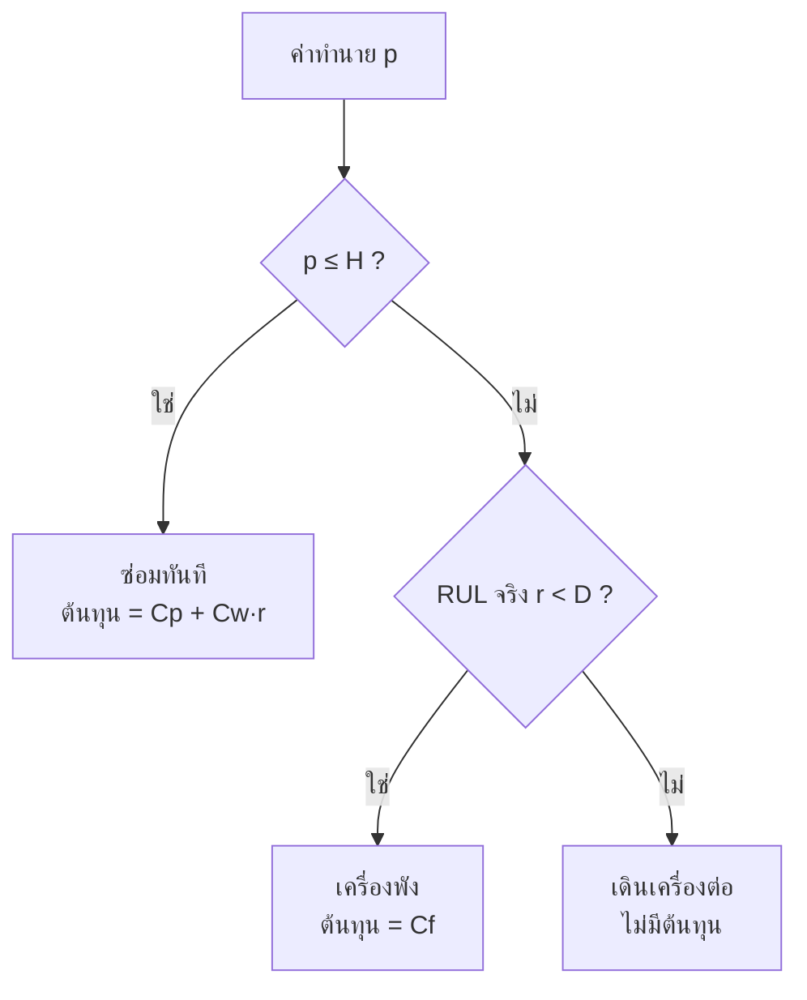
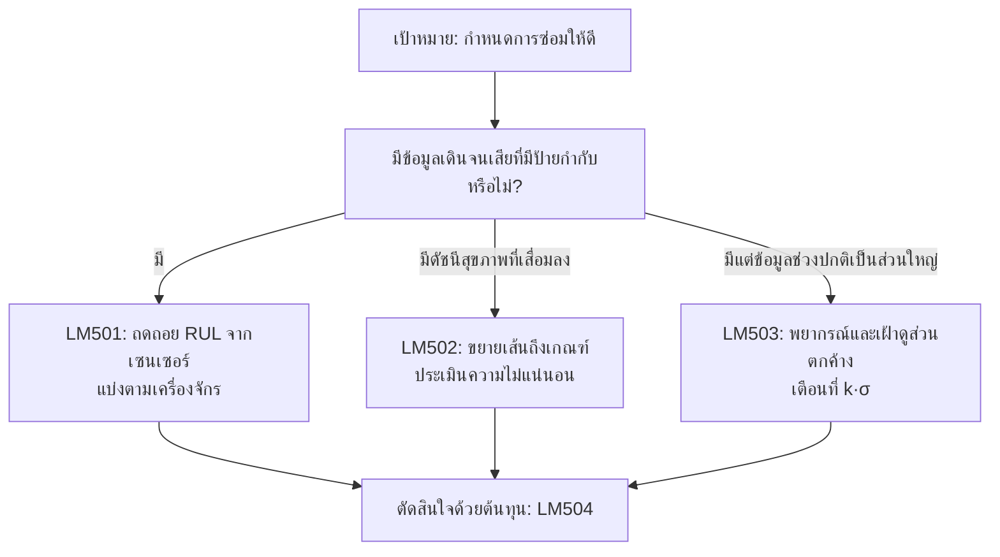

# บทที่ 5 · การบำรุงรักษาเชิงพยากรณ์ด้วยโมเดลเชิงเส้น

> **ความรู้พื้นฐานที่ควรมี:** การถดถอยเบื้องต้น การแบ่งฝึก/ทดสอบ และแนวคิดการพยากรณ์ด้วยหน้าต่างเลื่อน
> **แล็บเชิงโต้ตอบ:** [LM501](https://rathachai.github.io/DA-LAB/learnings/linear/lm501.html) · [LM502](https://rathachai.github.io/DA-LAB/learnings/linear/lm502.html) · [LM503](https://rathachai.github.io/DA-LAB/learnings/linear/lm503.html) · [LM504](https://rathachai.github.io/DA-LAB/learnings/linear/lm504.html)

---

## วัตถุประสงค์การเรียนรู้

เมื่อจบบทนี้ ผู้เรียนจะสามารถ

1. เปรียบเทียบกลยุทธ์การบำรุงรักษาแบบ **เชิงรับ (reactive) เชิงป้องกัน (preventive) และเชิงพยากรณ์ (predictive)** ได้
2. นิยาม **อายุการใช้งานที่เหลือ (Remaining Useful Life, RUL)** (เครื่องจักรเหลือชั่วโมงใช้งานอีกกี่ชั่วโมง) และ **ดัชนีสุขภาพ (health index)** (ตัวเลขตัวเดียวที่บอกว่าเครื่องจักรสุขภาพดีเพียงใด) รวมทั้งสร้างโมเดลถดถอยเพื่อทำนาย RUL จากข้อมูลเซนเซอร์ได้
3. แบ่งข้อมูล **ตามเครื่องจักร** แทนการแบ่งตามแถว และอธิบาย **การรั่วไหลของข้อมูล (leakage)** (ชุดทดสอบ "แอบดู" ชุดฝึก) ที่เกิดจากการแบ่งตามแถวได้
4. ขยายแนวโน้มการเสื่อมสภาพ (extrapolate) ไปจนถึง **เกณฑ์ (threshold)** (ขีดจำกัดที่เราเลือกเอง) และประเมินความไม่แน่นอนของเวลาที่คาดว่าจะเสียได้
5. ตรวจจับความผิดปกติที่กำลังก่อตัวโดยใช้ **ส่วนตกค้าง (residual)** (ค่าความคลาดเคลื่อนของการพยากรณ์) จากโมเดลพยากรณ์ร่วมกับกฎสัญญาณเตือน $k\sigma$ ซึ่งเป็นแนวคิดเดียวกับแผนภูมิควบคุม (control chart)
6. เลือกการตัดสินใจโดยพิจารณา **ต้นทุนที่ไม่สมมาตร (asymmetric cost)** (ความผิดพลาดชนิดหนึ่งมีค่าเสียหายสูงกว่าอีกชนิดมาก) และอธิบายได้ว่าเหตุใดโมเดลที่ความคลาดเคลื่อนต่ำที่สุดจึงไม่ใช่โมเดลที่ดีที่สุดเสมอไป

> **แนวคิดสำคัญ**
> การพยากรณ์จะมีประโยชน์ก็ต่อเมื่อนำไปสู่การตัดสินใจที่ดีขึ้น บทนี้เชื่อมสองสิ่งเข้าด้วยกัน คือ *โมเดล* ที่ประเมินสภาพของเครื่องจักร และ *กฎการตัดสินใจ* ที่เปลี่ยนค่าประเมินนั้นให้เป็นคำตอบว่า "ซ่อมเดี๋ยวนี้" หรือ "เดินเครื่องต่อ"

---

## 5.1 กลยุทธ์การบำรุงรักษา

เครื่องจักรทุกเครื่องย่อมเสื่อมสภาพในที่สุด เช่น ตลับลูกปืนสึกหรอ สายพานยืด ฉนวนเสื่อม คำถามคือ *เมื่อใด* จึงควรเข้าไปดำเนินการ

| กลยุทธ์ | กฎ | จุดอ่อน |
|---------|-----|---------|
| **เชิงรับ (Reactive)** (เดินจนเสีย) | ซ่อมเมื่อเสีย | หยุดเครื่องโดยไม่ได้วางแผน ความเสียหายลุกลาม และเสี่ยงต่อความปลอดภัย |
| **เชิงป้องกัน (Preventive)** (ตามเวลา) | บำรุงรักษาตามรอบเวลาคงที่ | สิ้นเปลืองอายุการใช้งานที่ยังเหลือ และอาจยังพลาดความเสียหายที่เกิดเร็วกว่ากำหนด |
| **เชิงพยากรณ์ (Predictive)** (ตามสภาพ) | บำรุงรักษาเมื่อ *สภาพ* เครื่องบ่งชี้ว่าจำเป็น | ต้องมีเซนเซอร์ ข้อมูล และโมเดลที่เชื่อถือได้ |

**การบำรุงรักษาเชิงพยากรณ์ (predictive maintenance, PdM)** คือการใช้ข้อมูลจากเซนเซอร์เพื่อตัดสินใจว่า *เมื่อใด* ควรซ่อมเครื่องจักร เป้าหมายคือซ่อม **ก่อนเสียเพียงเล็กน้อย** คือช้าพอที่จะใช้อายุเครื่องได้เกือบเต็มที่ แต่เร็วพอที่จะไม่ให้เครื่องพังเสียก่อน

> **เปรียบเทียบกับงานวิศวกรรม**
> ลองนึกถึงรถยนต์ *เชิงรับ*: ขับไปจนเครื่องดับ *เชิงป้องกัน*: เปลี่ยนน้ำมันเครื่องทุก 10,000 กม. ไม่ว่าสภาพน้ำมันจะเป็นอย่างไร *เชิงพยากรณ์*: เซนเซอร์วัดคุณภาพน้ำมันแล้วบอกว่าเมื่อใดเสื่อมสภาพจริง ในโรงงาน การบำรุงรักษาเชิงพยากรณ์ก็คือ **การเฝ้าระวังสภาพเครื่องจักร (condition monitoring)** ด้วยการวิเคราะห์การสั่นสะเทือนในรูปแบบข้อมูล กล่าวคือ เราซ่อมปั๊มเพราะลายเซ็นการสั่นสะเทือนของมันเปลี่ยนไป ไม่ใช่เพราะปฏิทินบอกว่าถึงเวลา

บทนี้ใช้ศัพท์สองคำตลอดทั้งบท

- **อายุการใช้งานที่เหลือ (Remaining Useful Life, RUL)** คือเวลาที่เหลืออยู่ก่อนที่เครื่องจักรจะทำหน้าที่ไม่ได้อีกต่อไป เปรียบได้กับค่า *"วิ่งได้อีกกี่ กม."* บน **มาตรวัดน้ำมันเชื้อเพลิง** เพียงแต่นับเป็นชั่วโมงการเดินเครื่อง ตัวอย่างเช่น ปั๊มที่มี RUL เท่ากับ 200 ชม. สามารถเดินเครื่องต่อได้อีกประมาณ 200 ชั่วโมง
- **ดัชนีสุขภาพ (health index)** คือตัวเลขตัวเดียวที่สรุปสภาพของเครื่อง เช่น 100 (เหมือนใหม่) ลดลงจนถึง 0 (เสีย) ทำหน้าที่เหมือนหน้าปัดของมาตรวัด วิศวกรสร้างดัชนีนี้โดยรวมค่าจากเซนเซอร์หลายตัว เช่น การสั่นสะเทือน อุณหภูมิ และกระแสมอเตอร์

> **แนวคิดสำคัญ**
> RUL เป็น *ค่าพยากรณ์* ไม่ใช่ค่าที่วัดได้ ไม่มีใครอ่านค่านี้ตรงจากเครื่องจักรได้ เราประเมินมันจากเซนเซอร์ และค่าประเมินย่อมมีความคลาดเคลื่อนเสมอ

---

## 5.2 การทำนาย RUL จากเซนเซอร์ (LM501)

แนวทางแรกถือว่า RUL เป็นตัวแปรเป้าหมายของการถดถอยทั่วไป **โมเดลถดถอย (regression model)** คือสูตรที่ทำนายตัวเลขหนึ่งตัวจากตัวเลขอื่นหลายตัว

$$
\widehat{\text{RUL}} = \beta_0 + \beta_1\,\text{vibration} + \beta_2\,\text{temperature} + \dots
$$

พูดง่ายๆ: *อายุที่เหลือที่ทำนายได้ เท่ากับค่าฐาน บวกน้ำหนักคูณค่าการสั่นสะเทือน บวกน้ำหนักคูณค่าอุณหภูมิ และต่อไปเรื่อยๆ* เครื่องหมายหมวกบน $\widehat{\text{RUL}}$ หมายถึง "ค่าประมาณ" ส่วน $\beta_0$ คือค่าฐาน (ชั่วโมง) และแต่ละ $\beta_j$ คือน้ำหนัก มีหน่วยเป็นชั่วโมงต่อหน่วยของเซนเซอร์ตัวนั้น หาได้จากข้อมูลการเดินเครื่องจนเสียในอดีต นี่คือการถดถอยพหุคูณ (multiple regression) ธรรมดา ตัวอย่างตัวเลขสั้นๆ (ตัวเลขสมมติ): เมื่อ $\beta_0=600$ ชม. $\beta_1=-80$ ชม. ต่อ mm/s และการสั่นสะเทือนเท่ากับ 4 mm/s โมเดลจะทำนายอายุที่เหลือได้ $600-80\times 4=280$ ชม.

บทเรียนเดิมยังใช้ได้เช่นกัน

- เซนเซอร์ที่ **สหสัมพันธ์สูง (strong correlation)** กับ RUL มีคุณค่า
- เซนเซอร์ที่เป็น **สัญญาณรบกวน (noise)** (เช่น ค่าความเร็วที่ไม่เกี่ยวกับการสึกหรอ) ไม่ช่วยอะไร
- เซนเซอร์ที่เพิ่มขึ้นแบบ **เอกซ์โปเนนเชียล** ตามการสึกหรอ (เช่น เศษโลหะจากการสึกหรอ) จะกลายเป็นเส้นตรงหลังการแปลงด้วย **ลอการิทึม (log)** เช่นเดียวกับที่กระดาษกึ่งลอการิทึม (semi-log) ทำให้เส้นโค้งเอกซ์โปเนนเชียลกลายเป็นเส้นตรง
- เซนเซอร์ที่มีความสัมพันธ์แบบ **รูปตัว U** จะมีสหสัมพันธ์ $r\approx 0$ แต่สัมพันธ์กับ RUL อย่างชัดเจน โมเดลเส้นตรงไม่สามารถใช้ค่านี้ได้โดยตรง

### แบ่งตามเครื่องจักร ไม่ใช่ตามแถว

เพื่อประเมินโมเดลอย่างซื่อตรง เราเก็บข้อมูลส่วนหนึ่งไว้เป็น **ชุดทดสอบ (test set)** ที่โมเดลไม่เคยเห็นระหว่างการฝึก วิธีเลือกชุดทดสอบนี้มีความสำคัญอย่างยิ่ง

ข้อมูล PdM มี **ภาพถ่ายสถานะ (snapshot) จำนวนมากจากเครื่องจักรแต่ละเครื่อง** snapshot ของเครื่องเดียวกันแทบจะเป็นสำเนาของกันและกัน คือใช้แท่นยึดเดียวกัน ตลับลูกปืนชุดเดียวกัน และพฤติกรรมการใช้งานแบบเดียวกัน เซนเซอร์ทุกตัวจึงมี "ลายนิ้วมือ" เฉพาะเครื่องติดอยู่

| วิธีแบ่ง | ชุดทดสอบแทนอะไร | ผลลัพธ์ |
|----------|------------------|---------|
| **ตามแถว (By row)** (สุ่มแถว) | เครื่องที่เคยเห็นแล้วในการฝึก | ผลดีเกินจริง: เกิด **การรั่วไหลของข้อมูล (leakage)** |
| **ตามเครื่องจักร (By machine)** (กันทั้งเครื่องไว้ทดสอบ) | **เครื่องใหม่** ที่โมเดลไม่เคยเห็น | ค่าประเมินที่ซื่อตรงของสมรรถนะในสนามจริง |

**การรั่วไหลของข้อมูล (leakage)** หมายถึงข้อมูลจากชุดทดสอบแอบเข้าไปอยู่ในการฝึก ทำให้คะแนนทดสอบดูดีกว่าความเป็นจริง เมื่อแบ่งตามแถว โมเดลได้เห็น "ลายนิ้วมือ" ของเครื่อง A ในการฝึกไปแล้ว จึงจำแถวทดสอบของเครื่อง A ได้อย่างง่ายดาย

> **เปรียบเทียบกับงานวิศวกรรม**
> สมมติว่าคุณสอบเทียบ (calibrate) โมเดลสเตรนเกจกับคานสะพาน A แล้ว "ตรวจสอบความถูกต้อง" ด้วยค่าอ่านอื่นๆ จากคาน A เดิม ผลย่อมดูยอดเยี่ยม แต่คำถามจริงคือมันใช้กับคาน B ซึ่งไม่เคยวัดมาก่อนได้หรือไม่ **การแบ่งแบบกลุ่ม (group split)** (ในที่นี้คือแบ่งตามเครื่องจักร) คือการตรวจสอบกับคาน B

เมื่อนำไปใช้งานจริง โมเดลจะพบกับเครื่องจักรที่ไม่เคยเห็นมาก่อน ชุดทดสอบจึงต้องจำลองสถานการณ์นั้น **หน่วยของความเป็นอิสระ (unit of independence)** (คือเครื่องจักร ไม่ใช่แถว) เป็นตัวกำหนดว่าตัวอย่างหนึ่งๆ ควรอยู่ในชุดใด

> **ข้อผิดพลาดที่พบบ่อย**
> การสับเปลี่ยนทุกแถวแล้วเอา 80 % ไปฝึก คะแนนดูดีมาก แต่แล้วกลับตกฮวบเมื่อเจอเครื่องใหม่เครื่องแรกในโรงงาน

### ลงมือปฏิบัติ: LM501

**[เปิด LM501 · RUL จากเซนเซอร์](https://rathachai.github.io/DA-LAB/learnings/linear/lm501.html)**

- ตารางข้อมูล **2,400 snapshot** (60 เครื่อง × 40) พร้อมเซนเซอร์ `s1`–`s7` และตัวแปรเป้าหมาย `y` = RUL (ชั่วโมง)
- แท็บแรกพล็อตเซนเซอร์ทุกตัวเทียบกับเวลาเดินเครื่อง (ปรับให้อยู่ในช่วง 0–1 วางเมาส์เพื่อดูชื่อและค่า) โดยแสดง RUL เป็นเส้นหนากว่า สามารถเลือกเครื่องเดียวหรือทุกเครื่อง
- เลือกฟีเจอร์และการแปลงด้วย **log** ฝึกโมเดล แล้วเปรียบเทียบ MAE/MAPE ของชุดฝึกและชุดทดสอบ (ค่าคลาดเคลื่อนสัมบูรณ์เฉลี่ย และค่าคลาดเคลื่อนเดียวกันในรูปร้อยละ)
- สลับวิธีแบ่งระหว่าง **ตามเครื่องจักร (ถูกต้อง)** กับ **ตามแถว (มีการรั่วไหล)** และรัน **การสาธิตการรั่วไหล (Leakage demo)** (สุ่มแบ่ง 30 ครั้งในแต่ละโหมด)

---

## 5.3 เส้นโค้งการเสื่อมสภาพและเกณฑ์ (LM502)

คำถามที่เป็นธรรมชาติกว่ามักเป็นว่า *ดัชนีสุขภาพจะถึงขีดจำกัดเมื่อใด?* **เส้นโค้งการเสื่อมสภาพ (degradation curve)** คือกราฟของดัชนีสุขภาพเทียบกับเวลาในขณะที่เครื่องจักรสึกหรอ เพื่อตอบคำถามนี้ ให้ฟิตเส้นตรงกับค่าอ่านล่าสุดแล้ว **ขยายเส้น (extrapolate)** ออกไป ซึ่งหมายถึงต่อเส้นเลยช่วงข้อมูลไปในอนาคต

> **เปรียบเทียบกับงานวิศวกรรม**
> นี่คือวิธีประเมินอายุความล้า (fatigue life) จากการลามของรอยร้าว หรือวิธีที่มาตรวัดน้ำมันทำนายระยะทางที่วิ่งได้ คือนำอัตราการสิ้นเปลืองปัจจุบันมาต่อไปข้างหน้าจนถังว่าง

### ตัวอย่างคำนวณด้วยมือ

ดัชนีสุขภาพของตลับลูกปืนเท่ากับ 80 ที่เวลา $t=100$ ชม. และลดลง 0.4 คะแนนต่อชั่วโมง เราเลือกซ่อมเมื่อดัชนีถึง $\theta=50$ (**เกณฑ์การบำรุงรักษา (maintenance threshold)** คือระดับสุขภาพที่เราตัดสินใจซ่อม) เส้นตรงคือ

$$
h(t)=80-0.4\,(t-100)=120-0.4\,t,
$$

ดังนั้น $\beta_0=120$ และ $\beta_1=-0.4$ คะแนนต่อชั่วโมง

- เวลาซ่อม: $50 = 120-0.4\,t \Rightarrow t=(50-120)/(-0.4)=175$ ชม. คือ 75 ชม. นับจากตอนนี้
- เวลาเสีย (ดัชนี $=0$): $t=120/0.4=300$ ชม.
- RUL ในขณะนี้: $300-100=200$ ชม.

ต่อไปเป็นสูตรทั่วไป เมื่อมีเส้นตรงที่ฟิตแล้ว $h(t)=\beta_0+\beta_1 t$ โดย $\beta_1<0$

$$
t_\theta = \frac{\theta-\beta_0}{\beta_1}\quad\text{(plan repair)},\qquad
\hat t_{\text{fail}} = \frac{0-\beta_0}{\beta_1},\qquad
\widehat{\text{RUL}}=\hat t_{\text{fail}}-t_{\text{now}}
$$

พูดง่ายๆ: *แก้สมการเส้นตรงเพื่อหาเวลาที่ดัชนีลงมาถึงเกณฑ์ (ซ่อม) หรือถึงศูนย์ (เสีย) แล้ว RUL คือเวลาเสียลบด้วยเวลาปัจจุบัน* ความหมายของสัญลักษณ์

| สัญลักษณ์ | ความหมาย | หน่วย |
|-----------|----------|-------|
| $h(t)$ | ดัชนีสุขภาพที่เวลา $t$ | คะแนน (0–100) |
| $\beta_0$ | จุดตัดแกน (intercept) คือค่าของเส้นตรงที่ $t=0$ | คะแนน |
| $\beta_1$ | ความชัน (slope) คือการเปลี่ยนแปลงของดัชนีต่อชั่วโมง (เป็นลบขณะสึกหรอ) | คะแนน/ชม. |
| $\theta$ | เกณฑ์การบำรุงรักษา | คะแนน |
| $t_\theta$ | เวลาที่เส้นตรงตัดผ่าน $\theta$ | ชม. |
| $\hat t_{\text{fail}}$ | เวลาเสียที่ทำนาย (เครื่องหมายหมวกหมายถึง "ค่าประมาณ") | ชม. |
| $t_{\text{now}}$ | เวลาปัจจุบัน | ชม. |

### โมเดลแนวโน้มอาจผิดแบบเป็นระบบได้

เส้นตรงสมมติว่าอัตราการสึกหรอคงที่ แต่การสึกหรอจริงมักไม่เป็นเช่นนั้น ลองเทียบกับ **เส้นโค้งอ่างอาบน้ำ (bathtub curve)** ของงานความน่าเชื่อถือ คือช่วงแรกเสียเร็ว ช่วงอายุใช้งานที่ราบเรียบ แล้วจึงเสียจากการสึกหรอที่เพิ่มขึ้น

| รูปแบบการสึกหรอจริง | การขยายเส้นตรง | ผลที่ตามมา |
|---------------------|----------------|------------|
| เชิงเส้น | แม่นยำ | กรณีอุดมคติ |
| **เร่งขึ้น (accelerating)** | **มองโลกในแง่ดีเกินไป**: ทำนายว่าเสียช้ากว่าความจริง | เครื่องพังก่อนกำหนดซ่อมที่วางไว้ |
| สึกหรอเร็วช่วงต้นแล้วชะลอลง | มองโลกในแง่ร้ายเกินไป: ทำนายว่าเสียเร็วกว่าความจริง | สิ้นเปลืองอายุการใช้งาน |
| ความผิดปกติที่เริ่มช่วงปลาย | มองไม่เห็นความผิดปกติจนกว่าจะเริ่มเกิดขึ้น | เสียแบบไม่คาดคิด |

> **ข้อผิดพลาดที่พบบ่อย**
> เชื่อเส้นตรงโดยไม่ตรวจสอบรูปร่างของข้อมูล การลามของรอยร้าวและการหลุดล่อน (spalling) ของตลับลูกปืนมักจะ *เร่งขึ้น* การพยากรณ์เชิงเส้นจึงมักสัญญาว่ายังมีอายุเหลือมากกว่าที่เครื่องมีจริง

**หน้าต่างการฟิต (fit window)** (จำนวนจุดล่าสุด $L$ ที่ใช้) มีผลต่อคำตอบ คือหน้าต่างสั้นตามพฤติกรรมล่าสุดได้ดีแต่มีสัญญาณรบกวนมาก หน้าต่างยาวเรียบกว่าแต่ตอบสนองช้า

### ความไม่แน่นอนของเวลาที่คาดว่าจะเสีย

เส้นตรงที่ฟิตมาไม่เคยแม่นยำสมบูรณ์ เวลาที่เส้นตรงตัดเกณฑ์จึงไม่แน่นอนเช่นกัน วิศวกรระบุสิ่งนี้เป็น **ค่าคลาดเคลื่อนมาตรฐาน (standard error, SE)** คือขนาดทั่วไปของความคลาดเคลื่อนในการพยากรณ์ เหมือนเครื่องหมาย $\pm$ ของการวัด สำหรับบทนี้ สูตรด้านล่างเป็น **ส่วนอ่านเพิ่มเติม (ไม่บังคับ)** ประโยคที่ตามมาให้แนวคิดหลักไว้แล้ว

ให้ $s_r$ คือ **ส่วนเบี่ยงเบนมาตรฐานของส่วนตกค้าง (residual standard deviation)** (ค่าอ่านกระจายรอบเส้นตรงที่ฟิตมากเพียงใด หน่วยเป็นคะแนนดัชนี) $n$ คือจำนวนจุดในหน้าต่าง และ $\bar t$ คือเวลาเฉลี่ยของจุดเหล่านั้น ค่าคลาดเคลื่อนมาตรฐานของเวลาที่เส้นตัดเกณฑ์ มีค่าโดยประมาณ

$$
\text{SE}(\hat t)\;\approx\;\frac{s_r}{\lvert\beta_1\rvert}\sqrt{\frac1n+\frac{(\hat t-\bar t)^2}{S_{tt}}},
\qquad S_{tt}=\sum_i (t_i-\bar t)^2 .
$$

พูดง่ายๆ: *นำความกระจายของข้อมูลมาแปลงจาก "คะแนนดัชนี" เป็น "ชั่วโมง" โดยหารด้วยความชัน แล้วขยายด้วยตัวคูณที่ยิ่งโตขึ้นเมื่อเวลาที่ทำนาย $\hat t$ อยู่ห่างจากกลางข้อมูลมากขึ้น* ในที่นี้ $S_{tt}$ (ชม.$^2$) วัดว่าจุดเวลากระจายตัวมากเพียงใด และ $\hat t$ คือเวลาที่เส้นตัดเกณฑ์ที่ทำนาย (ชม.)

ตัวอย่างตัวเลข: หน้าต่าง $n=20$ ค่าอ่านรายชั่วโมง (เวลา 81 ถึง 100 ชม. ดังนั้น $\bar t=90.5$ ชม. และ $S_{tt}\approx 665\ \text{h}^2$) ความกระจาย $s_r=2$ คะแนน ความชัน $|\beta_1|=0.4$ คะแนน/ชม. และทำนายว่าเสียที่ $\hat t=300$ ชม.

- $s_r/|\beta_1| = 2/0.4 = 5$ ชม.
- $(\hat t-\bar t)^2/S_{tt} = 209.5^2/665 \approx 66$ และ $1/n=0.05$ ดังนั้นรากที่สองคือ $\sqrt{66.05}\approx 8.1$
- $\text{SE}\approx 5\times 8.1\approx 41$ ชม.

ดังนั้นคาดว่าจะเสียที่ 300 ชม. คลาดเคลื่อนประมาณ 41 ชม. ตัวคูณ 8.1 ที่ใหญ่นี้เกิดจากการมองไปไกลกว่ากึ่งกลางของหน้าต่าง 20 ชม. ประมาณ 210 ชม.

> **แนวคิดสำคัญ**
> **การขยายเส้นออกนอกช่วงข้อมูล (extrapolation) เสี่ยงกว่าการประมาณค่าในช่วง (interpolation)** ยิ่งขยายออกไปไกลเกินข้อมูลเท่าใด ความไม่แน่นอนก็ยิ่งกว้างขึ้น การพยากรณ์ว่า "300 ชม." โดยไม่มี $\pm$ ก็ไม่สมบูรณ์พอๆ กับการวัดที่ไม่ระบุค่าความคลาดเคลื่อนที่ยอมรับได้

### ลงมือปฏิบัติ: LM502

**[เปิด LM502 · เส้นโค้งการเสื่อมสภาพและเกณฑ์การบำรุงรักษา](https://rathachai.github.io/DA-LAB/learnings/linear/lm502.html)**

- เลือกรูปแบบการเสื่อมสภาพ เลื่อน **ตอนนี้ (now)** ไปตามเส้นเวลา (โมเดลเห็นเฉพาะค่าอ่านจนถึง *ตอนนี้*)
- ฟิตแนวโน้ม (ด้วยเกรเดียนต์ดีเซนต์ (gradient descent) หรือวิธีแม่นตรง) อ่านสมการ เวลาเสียที่ทำนาย และ **ค่าคลาดเคลื่อนของ RUL** เทียบกับค่าจริง
- **ตารางข้อมูล** แสดงค่าอ่าน ค่าที่ฟิตได้ และส่วนตกค้าง กราฟ *การทำนาย RUL ตามเวลา* แสดงว่าการพยากรณ์แม่นขึ้นเมื่อใกล้เวลาเสีย
- การ์ด **ต้นทุนของการตัดสินใจ** แสดงต้นทุนคาดหวังจากความไม่แน่นอนของแนวโน้มและผลลัพธ์จริง กราฟ **ต้นทุนเทียบกับเกณฑ์** ทำเครื่องหมายค่า $\theta$ ที่ดีที่สุด

---

## 5.4 การเตือนล่วงหน้าจากส่วนตกค้าง (LM503)

บางครั้งไม่มีเส้นโค้งการเสื่อมสภาพที่ชัดเจน แต่เราต้องการสังเกตว่า *มีบางอย่างเปลี่ยนไป* นี่คือแนวคิดของ **แผนภูมิควบคุม (control chart)** ในการควบคุมกระบวนการเชิงสถิติ (statistical process control, SPC) ซึ่งจุดที่ตกนอกขีดจำกัด 3 ซิกมาบอกว่ากระบวนการเปลี่ยนไปแล้ว

วิธีการมีดังนี้

1. ฝึกโมเดลพยากรณ์กับช่วง **ปกติดี (healthy)** ของสัญญาณ โมเดลจะเรียนรู้ว่า "ภาวะปกติ" หน้าตาเป็นอย่างไร
2. ในระหว่างใช้งาน เปรียบเทียบค่าพยากรณ์แต่ละค่ากับความเป็นจริง **ส่วนตกค้าง (residual)** คือความคลาดเคลื่อนของการพยากรณ์: $e_t=y_t-\hat y_t$ โดย $y_t$ คือค่าอ่านจริงที่เวลา $t$ และ $\hat y_t$ คือค่าพยากรณ์ของโมเดล (ทั้งสองมีหน่วยของเซนเซอร์ เช่น mm/s)
3. ขณะเครื่องปกติดี ส่วนตกค้างจะเล็กและสุ่ม เมื่อความผิดปกติเกิดขึ้น ภาพ "ภาวะปกติ" ของโมเดลไม่ตรงกับความจริงอีกต่อไป และส่วนตกค้างจะโตขึ้น

ให้ $\sigma$ ("ซิกมา" คือ **ส่วนเบี่ยงเบนมาตรฐาน (standard deviation)** ของส่วนตกค้างในชุด *ฝึก* กล่าวคือขนาดทั่วไปของความคลาดเคลื่อนเมื่อเครื่องปกติดี) เป็นตัวกำหนดสเกล ส่งสัญญาณเตือนเมื่อ

$$
\lvert e_t\rvert > k\,\sigma \quad\text{for } m \text{ consecutive samples.}
$$

พูดง่ายๆ: *ส่งสัญญาณเตือนเมื่อความคลาดเคลื่อนมีขนาดใหญ่กว่า $k$ เท่าของขนาดปกติ และคงอยู่ในระดับนั้นติดต่อกัน $m$ ตัวอย่าง* ในที่นี้ $k$ คือตัวคูณที่เราเลือก (ค่าที่นิยมคือ 3 เหมือน "ขีดจำกัด 3 ซิกมา") และ $m$ คือจำนวนตัวอย่างติดต่อกันที่ต้องการ (เป็นจำนวนนับ ไม่มีหน่วย) นี่คือ **กฎ $k\sigma$**

ตัวอย่างตัวเลข: การพยากรณ์การสั่นสะเทือนเมื่อปกติดีมี $\sigma=0.5$ mm/s เมื่อ $k=3$ ขีดจำกัดสัญญาณเตือนคือ $3\times 0.5=1.5$ mm/s เมื่อ $m=3$ ส่วนตกค้าง 0.3, 0.8, 1.7, 1.9, 2.2 mm/s ให้ผลดังนี้ 1.7 เกินขีดจำกัด (นับได้ 1) 1.9 (นับได้ 2) 2.2 (นับได้ 3) สัญญาณเตือนจึงดังที่ตัวอย่างที่ห้า ส่วนการพุ่งขึ้นครั้งเดียวที่ 1.7 mm/s แล้วตามด้วย 0.4 mm/s จะ **ไม่** ทำให้เตือน

หน้าต่าง $w$ คือจำนวนค่าล่าสุดที่โมเดลพยากรณ์ใช้ในการทำนาย

### การแลกเปลี่ยนของเกณฑ์

**สัญญาณเตือนเท็จ (false alarm)** คือสัญญาณเตือนทั้งที่ไม่มีอะไรผิดปกติ เช่น การหยุดสายการผลิตโดยไม่จำเป็น ส่วนการตรวจพบที่ *พลาด* หรือล่าช้าคือความผิดพลาดตรงกันข้าม เราเลือก $k$ เพื่อถ่วงดุลระหว่างสองอย่างนี้

| $k$ น้อย (ไวต่อความผิดปกติ) | $k$ มาก (อนุรักษ์นิยม) |
|-----------------------------|--------------------------|
| ตรวจพบความผิดปกติเร็วกว่า | ตรวจพบช้ากว่า หรือไม่พบเลย |
| **สัญญาณเตือนเท็จ** มากกว่า (หยุดโดยไม่จำเป็น) | สัญญาณเตือนเท็จน้อยกว่า |

การกำหนดให้ $m>1$ คือต้องเกินขีดจำกัดติดต่อกันหลายครั้ง ช่วยลดสัญญาณเตือนเท็จโดยแลกกับความล่าช้าเพิ่มขึ้นเล็กน้อย ความผิดปกติแต่ละชนิดตรวจจับได้ยากง่ายต่างกัน การเลื่อนระดับกะทันหัน (level shift) ถูกจับได้ทันที การแกว่งที่ขยายตัวถูกจับได้หลังผ่านไปสักพัก และ **การไหลช้า (slow drift)** ตรวจจับยากที่สุด เพราะโมเดลที่ใช้หน้าต่างยาวอาจตามการไหลนั้นไปบางส่วน

> **เปรียบเทียบกับงานวิศวกรรม**
> บนแผนภูมิควบคุม ขีดจำกัด $\pm 3\sigma$ ให้สัญญาณผิดประมาณ 1 ครั้งใน 370 จุดสำหรับกระบวนการที่เสถียร การบีบเหลือ $\pm 2\sigma$ จับการเปลี่ยนแปลงได้เร็วขึ้นแต่ "ร้องหมาป่ามา" บ่อยขึ้น การเลือก $k$ ก็คือการแลกเปลี่ยนแบบเดียวกันนี้

> **ข้อผิดพลาดที่พบบ่อย**
> การคำนวณ $\sigma$ จากข้อมูลที่มีความผิดปกติรวมอยู่แล้ว ต้องใช้เฉพาะข้อมูลฝึกที่ปกติดีเท่านั้น มิฉะนั้นขีดจำกัดจะกว้างเกินไปและความผิดปกติจะซ่อนอยู่ในขีดจำกัดนั้น

### ลงมือปฏิบัติ: LM503

**[เปิด LM503 · การเตือนล่วงหน้าด้วยหน้าต่างเลื่อน](https://rathachai.github.io/DA-LAB/learnings/linear/lm503.html)**

- เลือกรูปแบบสัญญาณปกติและชนิดของความผิดปกติ (การไหล การเลื่อนกะทันหัน ความแปรปรวนที่เพิ่มขึ้น การแกว่งแบบตลับลูกปืน) หรือจะ **ลากสัญญาณ** เพื่อใส่ความผิดปกติของตนเองก็ได้
- ตั้งค่าหน้าต่าง $w$ สัดส่วนข้อมูลฝึก $k$ และ $m$ แล้วอ่าน **ความล่าช้าในการตรวจจับ (detection delay)** และ **จำนวนสัญญาณเตือนเท็จ**
- ตาราง **การแลกเปลี่ยนของเกณฑ์** กวาดค่า $k=1\ldots6$

---

## 5.5 การตัดสินใจและต้นทุน (LM504)

การพยากรณ์เป็นเพียงเครื่องมือเพื่อไปสู่การตัดสินใจ และการตัดสินใจมีต้นทุนที่ไม่ค่อยสมมาตร **ต้นทุนที่ไม่สมมาตร (asymmetric cost)** หมายถึงความผิดพลาดชนิดหนึ่งมีราคาแพงกว่าอีกชนิดมาก

> **เปรียบเทียบกับงานวิศวกรรม**
> **ตัวประกอบความปลอดภัย (safety factor)** ทำงานในลักษณะเดียวกัน เราออกแบบเพลาให้แข็งแรงกว่าภาระที่คำนวณได้ เพราะเพลาที่รับภาระเกินจะหัก (เสียหายมาก) ส่วนเพลาที่ใหญ่เกินเสียเพียงเหล็กเพิ่มเล็กน้อย ในทำนองเดียวกัน ในการวางแผนอะไหล่และการรับประกัน เราเก็บสต็อกเผื่อไว้ เพราะของขาดสต็อกมีต้นทุนสูงกว่าอะไหล่ส่วนเกินไม่กี่ชิ้นบนชั้น

| ผลลัพธ์ | ต้นทุน |
|---------|--------|
| **ซ่อมเชิงป้องกัน** (จำเป็นหรือไม่ก็ตาม) | ค่าซ่อม $C_p$ บวกมูลค่าของ **อายุที่สูญเปล่า**: $C_w$ ต่อชั่วโมงที่ไม่ได้ใช้ |
| **เครื่องพัง (Breakdown)** | ต้นทุนเครื่องพัง $C_f$ ซึ่งโดยทั่วไป **มากกว่า** $C_p$ มาก |
| เดินเครื่องต่ออย่างปลอดภัย | ไม่มี |

สัญลักษณ์: $C_p$ คือต้นทุนของการซ่อมตามแผน $C_f$ คือต้นทุนของเครื่องพัง (ทั้งสองเป็นสกุลเงิน) และ $C_w$ คือมูลค่าของอายุการใช้งานหนึ่งชั่วโมงที่ทิ้งไป (สกุลเงินต่อชั่วโมง)

ตัวอย่างตัวเลข: $C_p=1{,}000$, $C_f=10{,}000$ และ $C_w=20$ ต่อชั่วโมง เครื่องที่มี RUL จริง 100 ชม. แล้วซ่อมตอนนี้ มีต้นทุน $1{,}000+20\times100=3{,}000$ ถ้าปล่อยให้พังแทนจะมีต้นทุน $10{,}000$ ถ้าเดินต่อได้อย่างปลอดภัยก็ไม่มีต้นทุน

พิจารณากลุ่มเครื่องจักร (fleet) ที่เครื่องแต่ละเครื่องมี RUL จริง $r$ (ชั่วโมง ซึ่งรู้ได้ภายหลังเท่านั้น) และค่าทำนายของโมเดล $p$ (ชั่วโมง) นโยบายอย่างง่ายคือ *ซ่อมทันทีถ้า $p\le H$* โดย $H$ คือ **เกณฑ์การตัดสินใจ (decision threshold)** หน่วยชั่วโมง มิฉะนั้นเดินเครื่องต่อจนถึงการตรวจครั้งถัดไปในอีก $D$ ชั่วโมง (ช่วงห่างของการตรวจ) เครื่องจะเสียระหว่างนั้นถ้า $r<D$

เกณฑ์ $H$ ใช้แลกความผิดพลาดชนิดหนึ่งกับอีกชนิดหนึ่ง

- **$H$ ต่ำ** → ซ่อมโดยไม่จำเป็นน้อย แต่เครื่องพังมากขึ้น
- **$H$ สูง** → เครื่องพังน้อย แต่สิ้นเปลืองอายุการใช้งานมาก

เนื่องจาก $C_f \gg C_p$ ค่า $H$ ที่ทำให้ต้นทุนต่ำสุดจึง **สูงกว่า (ระมัดระวังกว่า)** ค่าที่ปฏิบัติต่อความผิดพลาดทั้งสองชนิดอย่างเท่าเทียมกัน

### เหตุใดโมเดลที่ความคลาดเคลื่อนต่ำสุดอาจไม่ใช่โมเดลที่ดีที่สุด

**RMSE** (รากที่สองของค่าคลาดเคลื่อนกำลังสองเฉลี่ย, root-mean-square error) คือขนาดทั่วไปของความคลาดเคลื่อนในการทำนายหน่วยชั่วโมง โมเดลที่ RMSE ต่ำสุดปฏิบัติต่อการทำนายสูงเกินและต่ำเกินอย่างสมมาตร แต่ใน PdM ความคลาดเคลื่อนแบบ **มองโลกในแง่ดี** (ทำนายว่ามีอายุเหลือมากกว่าความจริง) เสี่ยงต่อเครื่องพัง ขณะที่ความคลาดเคลื่อนแบบ **มองโลกในแง่ร้าย** เพียงสิ้นเปลืองอายุไปบ้าง โมเดลที่มองโลกในแง่ร้ายเล็กน้อย ซึ่งใส่ **ความเอนเอียง (bias)** หรือส่วนเผื่อความปลอดภัย (คือการจงใจเลื่อนค่าทำนายไปทางด้านปลอดภัย) จึงอาจมี RMSE *สูงกว่า* แต่มีต้นทุนรวม *ต่ำกว่า*

> **แนวคิดสำคัญ**
> อย่าเลือกโมเดลที่มีความคลาดเคลื่อนน้อยที่สุด จงเลือกโมเดลและเกณฑ์ที่มี **ต้นทุนรวม** น้อยที่สุด ส่วนเผื่อความปลอดภัยคือวิจารณญาณทางวิศวกรรมภายใต้ความไม่แน่นอน กล่าวคือเรายอมรับความสูญเสียเล็กน้อยที่แน่นอน เพื่อหลีกเลี่ยงความสูญเสียใหญ่ที่เกิดได้ยาก

### ต้นทุนคาดหวังภายใต้ความไม่แน่นอน

**ต้นทุนคาดหวัง (expected cost)** คือต้นทุนเฉลี่ยที่จะต้องจ่ายหากตัดสินใจแบบเดียวกันซ้ำหลายครั้ง คือนำต้นทุนของแต่ละผลลัพธ์ที่เป็นไปได้คูณกับความน่าจะเป็นของมัน แล้วบวกรวมกัน ส่วนนี้เป็น **ส่วนอ่านเพิ่มเติม (ไม่บังคับ)** สำหรับสูตร ตารางที่ตามมาให้ใจความเดียวกันเป็นตัวเลข

สมมติว่าเวลาเสียจริง $T$ ไม่แน่นอนและมีการแจกแจงรูประฆัง (การแจกแจงแบบปกติ, normal distribution) ที่มีค่าเฉลี่ย $\mu$ และส่วนเบี่ยงเบนมาตรฐาน $\text{SE}$ (ค่าคลาดเคลื่อนมาตรฐานจากหัวข้อ 5.3) ถ้าวางแผนซ่อมที่เวลา $t_p$ ต้นทุนคาดหวังคือ

$$
\mathbb E[\text{cost}] = P(T\le t_p)\,C_f \;+\; P(T> t_p)\,C_p \;+\; C_w\,\mathbb E\big[(T-t_p)^+\big].
$$

พูดง่ายๆ: *(โอกาสที่เครื่องพังก่อนซ่อม) × (ต้นทุนเครื่องพัง) บวก (โอกาสที่เครื่องยังอยู่ ณ เวลาซ่อม) × (ต้นทุนซ่อม) บวก (จำนวนชั่วโมงของอายุที่เหลือไม่ได้ใช้โดยเฉลี่ย) × (มูลค่าต่อชั่วโมง)* สัญกรณ์ $(T-t_p)^+$ หมายถึง "$T-t_p$ ถ้าเป็นบวก มิฉะนั้นเป็น 0" จึงนับเฉพาะชั่วโมงที่ไม่ได้ใช้

ตัวอย่างตัวเลขเมื่อ $C_p=1{,}000$, $C_f=10{,}000$, $C_w=20$ ต่อชั่วโมง (ค่าชั่วโมงที่ไม่ได้ใช้เป็นค่าประมาณ)

| วางแผนซ่อม | $P(T\le t_p)$ | อายุที่ไม่ได้ใช้โดยเฉลี่ย (ชม.) | ต้นทุนคาดหวัง |
|------------|---------------|-----------------------------------|---------------|
| เร็ว | 2 % | 120 | $0.02\times10{,}000+0.98\times1{,}000+20\times120=3{,}580$ |
| กลาง | 10 % | 60 | $0.10\times10{,}000+0.90\times1{,}000+20\times60=3{,}100$ |
| ช้า | 50 % | 16 | $0.50\times10{,}000+0.50\times1{,}000+20\times16=5{,}820$ |

แผนกลางถูกที่สุด การรอนานขึ้นช่วยประหยัดอายุที่ไม่ได้ใช้ แต่ต้นทุนเครื่องพังจะเข้ามาครอบงำ การซ่อมเร็วขึ้นปลอดภัยแต่สิ้นเปลือง เมื่อพล็อตค่านี้เทียบกับเกณฑ์ $\theta$ จะได้เส้นโค้ง **รูปตัว U** อันเป็นลักษณะเฉพาะของกราฟต้นทุนเทียบกับเกณฑ์ คือช้าเกินไปแพงเพราะเครื่องพัง เร็วเกินไปแพงเพราะอายุสูญเปล่า ข้อสังเกตคือแผนที่ดีที่สุดยอมรับความเสี่ยงเครื่องพัง 10 % ไม่ใช่ 0 % เพราะความเสี่ยงศูนย์จะมีต้นทุนอายุสูญเปล่าสูงกว่า

### ลงมือปฏิบัติ: LM504

**[เปิด LM504 · ต้นทุนของการทำนายที่ผิดพลาด](https://rathachai.github.io/DA-LAB/learnings/linear/lm504.html)**

- จำลองกลุ่มเครื่องจักร 200 เครื่อง ตั้งค่าสัญญาณรบกวนของการทำนาย $\sigma$ และ **ความเอนเอียง (bias)** (ค่าบวก = มองโลกในแง่ดี) และเพิ่มเครื่องจักรพิเศษเข้าไปได้
- ตั้งค่าเกณฑ์ $H$ ช่วงห่างการตรวจ $D$ และต้นทุนทั้งสามค่า ดูผลลัพธ์ ต้นทุนรวม และเส้นโค้ง **ต้นทุนเทียบกับ H**
- **บันทึกสถานการณ์ (Save scenarios)** เพื่อเปรียบเทียบแถวที่ *RMSE ต่ำสุด* กับแถวที่ *ต้นทุนต่ำสุด*

---

## 5.6 สรุปรวมทั้งหมด

| แนวคิดจากการถดถอยและการพยากรณ์ | ปรากฏในการบำรุงรักษาเชิงพยากรณ์อย่างไร |
|-------------------|----------------------|
| การถดถอยและตัวชี้วัดความคลาดเคลื่อน | ค่าคลาดเคลื่อนของ RUL เป็นชั่วโมง, MAE, MAPE |
| การเลือกฟีเจอร์ การแปลงด้วย log | เลือกเซนเซอร์ตัวใด การเติบโตแบบเอกซ์โปเนนเชียลของเศษโลหะจากการสึกหรอ |
| การแบ่งฝึก–ทดสอบ การรั่วไหล | แบ่งตามเครื่องจักร ไม่ใช่ตามแถว |
| อนุกรมเวลา หน้าต่างเลื่อน | พยากรณ์สัญญาณปกติ เฝ้าดูส่วนตกค้าง |

---

## สรุป

- การบำรุงรักษาเชิงพยากรณ์กำหนดการซ่อม **ให้ทันเวลาพอดี** ต้องมีทั้งโมเดล **และ** กฎการตัดสินใจ
- **การถดถอย RUL** ใช้ชุดเครื่องมือของการถดถอยพหุคูณ และต้อง **แบ่งตามเครื่องจักร** เพื่อหลีกเลี่ยงการรั่วไหลของข้อมูล
- **การขยายเส้นการเสื่อมสภาพ** ให้เวลาซ่อมและเวลาเสีย การพยากรณ์ที่ซื่อตรงต้องระบุ **ความไม่แน่นอน** (เครื่องหมาย $\pm$) และโมเดลแนวโน้มที่เอนเอียงจะชักนำให้เข้าใจผิด
- **การเฝ้าดูส่วนตกค้าง** ตรวจจับการเปลี่ยนแปลงได้โดยไม่ต้องมีข้อมูลการเสียที่มีป้ายกำกับ เหมือนแผนภูมิควบคุม โดย $k$ และ $m$ ถ่วงดุลระหว่างความไวกับสัญญาณเตือนเท็จ
- เมื่อ **ต้นทุนไม่สมมาตร** เกณฑ์การตัดสินใจที่ดีที่สุดจะระมัดระวังกว่าที่โมเดลที่ความคลาดเคลื่อนต่ำสุดชี้นำ

### ศัพท์สำคัญ

| คำศัพท์ | ความหมายแบบเข้าใจง่าย | เปรียบเทียบกับงานวิศวกรรม |
|---------|------------------------|----------------------------|
| การบำรุงรักษาเชิงพยากรณ์ (Predictive maintenance) | ซ่อมเมื่อข้อมูลเซนเซอร์บอกว่าจำเป็น | การเฝ้าระวังสภาพเครื่องจักรด้วยการวิเคราะห์การสั่นสะเทือน |
| อายุการใช้งานที่เหลือ (Remaining Useful Life, RUL) | ชั่วโมงการเดินเครื่องที่เหลือก่อนเสีย | "กม. ที่เหลือ" บนมาตรวัดน้ำมัน; อายุความล้าที่เหลือ |
| ดัชนีสุขภาพ (Health index) | ตัวเลขตัวเดียว (เช่น 100 ถึง 0) แทนสภาพเครื่อง | หน้าปัดของมาตรวัด |
| เส้นโค้งการเสื่อมสภาพ (Degradation curve) | ดัชนีสุขภาพที่พล็อตเทียบกับเวลา | ช่วงสึกหรอของเส้นโค้งอ่างอาบน้ำ |
| เกณฑ์ (Threshold) ($\theta$, $H$) | ขีดจำกัดที่เราเลือกลงมือทำ | ค่าตั้งของสัญญาณเตือน (alarm setpoint) |
| การขยายเส้นออกนอกช่วงข้อมูล (Extrapolation) | ต่อแนวโน้มเลยช่วงข้อมูลออกไป | การต่อแนวการลามของรอยร้าวไปข้างหน้า |
| ค่าคลาดเคลื่อนมาตรฐาน (Standard error, SE) | ขนาดทั่วไปของความคลาดเคลื่อนในการพยากรณ์ | ค่าความคลาดเคลื่อนที่ยอมรับได้ $\pm$ ของการวัด |
| การรั่วไหลของข้อมูล (Leakage) | ข้อมูลทดสอบคล้ายข้อมูลฝึกอย่างลับๆ คะแนนจึงดีเกินจริง | ตรวจสอบโมเดลกับคานตัวเดิมที่ใช้สอบเทียบ |
| การแบ่งแบบกลุ่ม (Group split) | เก็บทุกแถวของเครื่องเดียวกันไว้ในชุดเดียวกัน | ตรวจสอบกับสะพานแห่งใหม่ ไม่ใช่แห่งเดิม |
| ส่วนตกค้าง (Residual) | ค่าจริงลบค่าทำนาย | ส่วนเบี่ยงเบนจากเส้นกลางของแผนภูมิควบคุม |
| สัญญาณเตือน (กฎ $k\sigma$) | เตือนถ้าส่วนตกค้างเกิน $k$ เท่าของขนาดปกติ ติดต่อกัน $m$ ตัวอย่าง | ขีดจำกัดควบคุม 3 ซิกมา |
| สัญญาณเตือนเท็จ (False alarm) | เตือนทั้งที่ไม่มีอะไรผิดปกติ | การหยุดสายการผลิตโดยไม่จำเป็น |
| ต้นทุนที่ไม่สมมาตร (Asymmetric cost) | ความผิดพลาดชนิดหนึ่งแพงกว่าอีกชนิดมาก | ตัวประกอบความปลอดภัย: ออกแบบใหญ่เกินถูก แต่เสียหายแพง |
| ต้นทุนคาดหวัง (Expected cost) | ต้นทุนเฉลี่ยถ่วงน้ำหนักด้วยความน่าจะเป็นของการตัดสินใจ | การคำนวณประกันภัยและเงินสำรองการรับประกัน |
| ความเอนเอียง / ส่วนเผื่อความปลอดภัย (Bias / safety margin) | จงใจเลื่อนค่าทำนายไปทางด้านปลอดภัย | ส่วนเผื่อในการออกแบบรับภาระ |

---

Powered by: Sonnet &nbsp;|&nbsp; AI Whisperer: [rathachai.github.io](https://rathachai.github.io)
